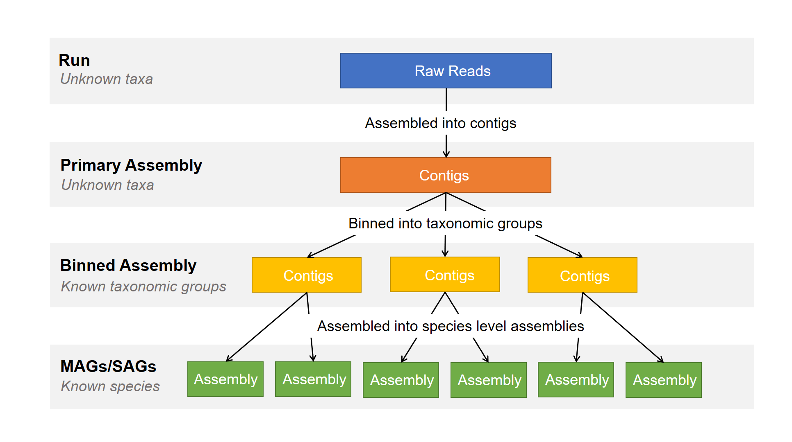

# Submitting Metagenome Assemblies 

## Introduction

Metagenome assemblies can be submitted to the European Nucleotide Archive (ENA) as one of three options.

1. **Primary metagenome** : a metagenome assembly prior to binning from a sampled biome or collection of sampled biomes without attempt to separate taxa.

2. **binned metagenome** : encompasses anything from a set of contigs to a complete genome assembly from a metagenomic source that has been identified as a single-taxon set.

3. **Metagenome-Assembled Genome (MAG)** : a single-taxon assembly based on one or more binned metagenomes that has been asserted to be a close representation to an actual individual genome (that could match an already existing isolate or represent a novel isolate).

This three tiered system was designed to represent the different stages of a metagenome assembly workflow:

To best represent your data, please submit as many of the levels as you can that are applicable to your study.

Please note: MAG submissions should only consist of high quality, unique, single-taxon representative assemblies.

For submission of MAGs, only one assembly for each assembled species within a biome (either the best quality or a de-replicated genome) can also be submitted as a MAG to represent that species.

This prevents any particular species within an environmental sample/biome from being over-represented and keeps data informative and searchable. 

You can submit MAGs as stand-alone if you intend to submit only a small representative set within your study but please follow the specific guidance on how to do this.

## Submitting Derived Assemblies

When it comes to submission of **binned metagenomes** or **Metagenome-Assembled Genomes** you will be asked to register additional 'virtual' samples for each assembly (a **binned** sample or a **MAG** sample).

This is because a binned assembly or MAG is not an assembly of the whole set of raw metagenomic data but in fact an assembly derived from a smaller subset of that data. These virtual sample represents the subset of that data and holds all metadata related to the taxonomy of that subset as well as methods used to derive it.

All derived assemblies from an environmental source require a virtual derived sample so please follow instructions carefully.

## Submission guides

Please submit all metagenome assembly levels that apply to your study.

.. toctree::
   :maxdepth: 1

    metagenome/primary
    metagenome/binned
    metagenome/mag