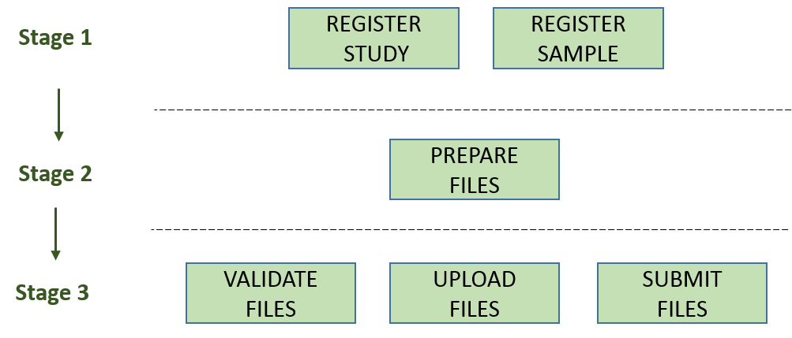

# Module 2: Genome Assembly Submissions 

## Introduction

Genome assemblies including metagenomes can be submitted to the European Nucleotide Archive (ENA) 
using the [Webin command line submission interface](cli_01.md). 

Genome assembly submissions include plasmids, organelles, 
complete virus genomes, viral segments/replicons, bacteriophages, 
prokaryotic or eukaryotic genomes.
 
A genome assembly consists of:
- General assembly information
   - Study accession or unique name (alias)
   - Sample accession or unique name (alias)
   - Assembly program
   - Sequencing platform
   - Minimum gap length
   - Molecule type (genomic DNA, genomic RNA or viral cRNA)
   - Coverage
- Contig sequences (if any)
- Scaffold sequences (if any)
- Chromosome sequences (if any)
- Unlocalised sequences (if any)
- Functional annotation (optional)

Chromosomes include organelles (e.g. mitochondrion and chloroplast), plasmids and viral segments.

The following picture illustrates the stages of the genome assembly submission process:



## Stage 1: Pre-register study and sample

Each submission must be associated with a pre-registered study and a sample. The study and sample 
accessions or unique names (aliases) are provided in an `info` file associated with the submission. 

Genome assemblies except metagenomes are uniquely identified by a study and a sample. When assemblies
are updated they must be re-submitted with the same study and sample as in the original submission.

## Stage 2: Prepare the files

The set of files that are part of the submission are specified using a manifest file.
The manifest file is specified using the `-manifest=<filename>` option.

A genome assembly submission consists of the following files:

- 1 manifest file
- 1 assembly info file
- 0-1 fasta files
- 0-1 AGP files
- 0-1 flat files
- 0-1 chromosome list file
- 0-1 unlocalised list file

### Sequence names

Sequences must have a unique name that is provided in the fasta, AGP or flat files. 
It is essential that the sequence names are unique and used consistently between files. 

For example, the chromosome list file must refer to the chromosome sequences using the unique names. 
Similarly, an AGP file must refer to scaffolds or contigs using the unique names.

### Manifest file

The manifest file has two columns separated by a tab (or any whitespace characters):
- File type (first column): case insensitive file type   
- File path (second column): the path to the file

For example, the following manifest file represents a genome assembly consisting of an info file 
and a fasta file:

```
INFO    genome.info.gz
FASTA   genome.fasta.gz
``` 

The following case-insensitive file types are supported for genome assemblies:

- INFO: assembly info file
- FASTA: sequences in fasta format
- FLATFILE: sequences in EMBL-Bank flat file format
- AGP: Sequences in [AGP](https://www.ncbi.nlm.nih.gov/assembly/agp/AGP_Specification/) format
- CHROMOSOME_LIST: list of chromosomes
- UNLOCALISED_LIST: list of unlocalised sequences

### Assembly info file

The assembly info file is a text file (USASCII7) containing general assembly information.

The file has two columns  separated by a tab (or any whitespace characters):
- Field name (first column)
- Field value (second column)

The following fields must be provided:
- STUDY: Study accession or unique name (alias) 
- SAMPLE: Sample accession or unique name (alias)
- ASSEMBLYNAME: The unique assembly name
- COVERAGE: The assembly coverage
- PROGRAM: The assembly program
- PLATFORM: The sequencing platform

The following fields can be optionally provided:

- MINGAPLENGTH: Minimum length of consecutive Ns to be considered a gap.
- MOLECULETYPE: 'genomic DNA', 'genomic RNA' or 'viral cRNA'.

An example of an assembly info file:

```
STUDY   TODO
SAMPLE   TODO
ASSEMBLYNAME   TODO
COVERAGE   TODO
PROGRAM   TODO
PLATFORM   TODO
MINGAPLENGTH   TODO
MOLECULETYPE   genomic DNA
```

### Fasta file

Unannotated sequences should be submitted as a Fasta file.

The sequence name is extracted from the fasta header. For example the following header 
contains the name 'contig1':

`>contig1`

### AGP file

Scaffolds or chromosomes constructed from contigs or scaffolds, respectively, can be submitted using 
an [AGP](https://www.ncbi.nlm.nih.gov/assembly/agp/AGP_Specification/) file.

### Flat file	

Annotated sequences must be submitted using an EMBL-Bank flat file.

The sequence name is extracted from the AC * line and must be prefixed with a '_'.
For example the following AC * line defines name 'contig1':

`AC * _contig1`

### Chromosome list file

The chromosome list file must be provided when the submission contains assembled chromosomes. 

The file is a tab separated text file (USASCII7) containing the following columns:

- OBJECT_NAME (first column): The unique sequence name.
- CHROMOSOME_NAME (second column): The chromosome name. The value will appear as the /chromosome, /plasmid or /segment qualifiers in the EMBL-Bank flat files.
- CHROMOSOME_TYPE (third column):
    - chromosome
    - plasmid
    - linkage_group
    - monopartite
    - segmented
    - multipartite  
- CHROMOSOME_LOCATION (optional fourth column). By default eukaryotic chromosomes will be assumed to reside in the nucleus 
and procaryotic chromosomes and plasmids in the cytoplasm.
    - Macronuclear
    - Nucleomorph
    - Mitochondrion
    - Kinetoplast
    - Chloroplast
    - Chromoplast
    - Plastid
    - Virion
    - Phage
    - Proviral
    - Prophage
    - Viroid
    - Cyanelle
    - Apicoplast
    - Leucoplast
    - Proplastid
    - Hydrogenosome
    - Chromatophore

An example of a chromosome list file:

```
chr01 I Chromosome
chr02 II Chromosome
chr03 III	Chromosome
chr04	IV	Chromosome
```   
    
### Unlocalised list file

This file should be provided when the submission includes chromosomes with unlocalised sequences.

Unlocalised sequences are contigs or scaffolds that are associated with a specific chromosome but 
their order and orientation is unknown.

The unlocalised list file is a tab separated text file (USASCII7) containing the following columns: 

- OBJECT_NAME (first column): the unique sequence name.
- CHROMOSOME_NAME (second column): the unique chromosome name associated with this sequence.

An example unlocalised list file:

```
cb25.NA_084     III
cb25.NA_093     III
cb25.NA_108     III
```   

## Stage 3: Validate and submit the files

Files are validated, uploaded and submitted using the [Webin command line submission interface](cli_01.md). 
Please refer to the [Webin command line submission interface](cli_01.md) documentation for more information 
about the submission process.

## Validation rules

### Sample and study validation

- Sample and study (BioProject) pair must be unique for an assembly (except metagenomes).
- Sample taxonomic classification must be species level or below (or equivalent) within the NCBI taxonomy.

### Assembly name validation

Assembly names must:
- match the pattern: ^z[A-Za-z0-9 _\-\.#\]*$
- be shorter than 100 characters
    
### Chromosome name validation
    
Chromosome names must:
- match the pattern: ^\[A-Za-z0-9\]\[A-Za-z0-9_\-\.#\]*$
- be shorter than 33 characters
- not contain any of the following as part of their name (case insensitive): 
    - 'chr'
    - 'chrm'
    - 'chrom'
    - 'chromosome'
    - 'linkage group'
    - 'linkage-group'
    - 'linkage_group'
    - 'plasmid'
- be unique within an assembly

### Sequence validation rules

Sequences must:
- have unique names within an assembly
- be at least 20bp long
- not have terminal Ns
- consist of bases: 'a','c','g','t','u','b','d','h','k','m','n','r','s','v','w','y'

### Assembly updates

Assembly updates must:
- use the same sample and study pair as was used in the initial assembly submission
- not remove any chromosomes
