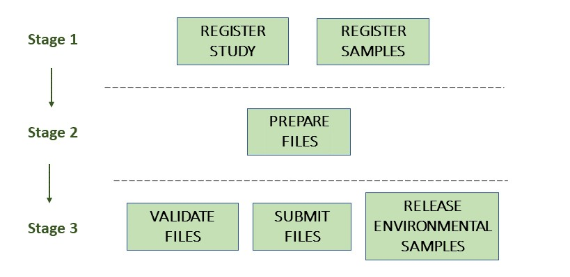

# Module 9: Environmental Single-Cell Amplified Genome Assembly Submission

## Introduction

Environmental SAG assemblies can be submitted to the European Nucleotide Archive (ENA) using the [Webin command line submission interface](cli_01.html) with `-context genome`.

Please contact datasubs@ebi.ac.uk if you intend to submit an assembly assembled from third party data.

A SAG assembly consists of:
- General assembly information
   - Study accession or unique name (alias)
   - **Environmental** Sample accession or unique name (alias)
   - **SAG** Sample accession or unique name (alias)
   - Assembly program
   - Sequencing platform
   - Minimum gap length
   - Molecule type (genomic DNA, genomic RNA or viral cRNA)
   - Coverage
- Contig sequences (if any)
- Scaffold sequences (if any)
- Chromosome sequences (if any)

The following picture illustrates the stages of the Environmental Single-Cell Amplified Genome assembly submission process:



## Stage 1: Pre-register study and samples

Each assembly submission must be associated with a pre-registered study and a **SAG** sample  which  represents  the single cell that was amplified. This then points back to an additional **environmental** sample that represents the sampled source biome.

### Environmental sample registration

Firstly, you should register your **environmental** samples. For each real-life environmental sample that was used in the study, a sample should be registered using the most relevant environmental checklist and environmental taxonomy (e.g. aquatic metagenome (tax id: 1169740)).

For information about biome-level environmental taxonomy please see [here](faq_taxonomy.html#environmental-biome-level-taxonomy).

### SAG sample registration

Once all the **environmental** samples have been registered, you should register your **SAG** samples. For each resulting Single-Cell Amplified Genome assembly, a sample should be registered utilising the **GSC MISAGS** checklist and uncultured taxonomy (e.g. uncultured Bacillus sp. (tax id: 83428)).

For information about organism-level environmental taxonomy please see [here](faq_taxonomy.html#environmental-organism-level-taxonomy).

When registering **SAG** samples, please make sure they correctly reference the **environmental** sample that they were derived from. This can be done from within the checklist using the mandatory “sample derived from” attribute. You should also reference the **environmental** sample in the description as:

“This sample represents a Single-Cell Amplified Genome derived from the environmental sample ERSXXXXX”

If the assembly was derived from multiple samples you can list these with a comma separated list or range. See [here](faq_metagenomes.html#how-do-i-register-samples-for-co-assemblies) for details on how to format these in the "sample derived from" attribute.

The methods for submitting environmental studies and samples follow the same process as any other study/sample submission. Follow the links for more information.

Instructions for interactive submitters:

- [Register a Study](mod_02.html)
- [Register a Sample](mod_03.html)

Instructions for programmatic submitters:

- [Register a Study](prog_02.html)
- [Register a Sample](prog_03.html)

When submitting raw data for a single-cell amplification project, these data should be submitted associated with this **SAG** sample as this is the sample that was sequenced.

## Stage 2: Prepare the files

The set of files that are part of the submission are specified using a manifest file.
The manifest file is specified using the `-manifest <filename>` option.

Environmental Single-Cell Assemblies should be submitted associated with the **SAG** sample, referenced from within the manifest file.

A SAG assembly submission consists of the following files:

- 1 manifest file
- 1 fasta file OR 1 flat file
- 0-1 AGP files
- 0-1 Chromosome list files

This submission requires information on the sequences and annotation (if any).

This submission also allows for the submission of fully assembled genome sequences (including chromosomes, organelles, plasmids, and viral segments) with the use of a 'chromosome list file'. It also allows the submitter to provide an AGP file to give instructions for the assembly of scaffolds or chromosomes if they wish.

If you wish to submit an AGP or chromosome list file, it is important to understand how sequence names are formatted so they can be consistent between files and your assembly can be registered correctly.

### Sequence names

Sequences must each have a unique entry name within the submission that is provided in the fasta, AGP or flat files. It is essential that the sequence names are unique and used consistently between files. 

For example, the chromosome list file must refer to the chromosome sequences using the unique sequence names. Similarly, an AGP file must refer to scaffolds or contigs using the unique sequence names.

### Manifest file

The manifest file has two columns separated by a tab (or any whitespace characters):
- Field name (first column): case insensitive field name   
- Field value (second column): field value

The following metadata fields are supported in the manifest file:

- STUDY: Study accession or unique name (alias) 
- SAMPLE: **SAG** Sample accession or unique name (alias)
- ASSEMBLYNAME: Unique assembly name
- ASSEMBLY_TYPE: 'Environmental Single-Cell Amplified Genome (SAG)'
- COVERAGE: The estimated depth of sequencing coverage
- PROGRAM: The assembly program
- PLATFORM: The sequencing platform
- MINGAPLENGTH: Minimum length of consecutive Ns to be considered a gap (optional)
- MOLECULETYPE: 'genomic DNA', 'genomic RNA' or 'viral cRNA' (optional)
- DESCRIPTION: Free text description of the genome assembly (optional)

Please see further below for validation rules affecting some of these fields.

The following file name fields are supported in the manifest file:

- FASTA: sequences in fasta format
- FLATFILE: sequences in EMBL-Bank flat file format
- AGP: Sequences in [AGP format](https://www.ncbi.nlm.nih.gov/assembly/agp/AGP_Specification/)
- CHROMOSOME_LIST: list of chromosomes

For example, the following manifest file represents an environmental single-cell assembly consisting of contigs provided in one fasta file:

```
STUDY   TODO
SAMPLE   TODO
ASSEMBLYNAME   TODO
ASSEMBLY_TYPE   Environmental Single-Cell Amplified Genome (SAG)
COVERAGE   TODO
PROGRAM   TODO
PLATFORM   TODO
MINGAPLENGTH   TODO
MOLECULETYPE   genomic DNA
FASTA   single-cell_genome.fasta.gz
``` 

## Stage 3: Validate and submit the files and release environmental samples

Files are validated, uploaded and submitted using the [Webin command line submission interface](cli_01.html). 

Please refer to the [Webin command line submission interface](cli_01.html) documentation for more information about the submission process.

### Release environmental samples

As the registered **environmental** samples do not have any data associated with them, they need to be manually released to become available to the public. Assuming you have submitted correctly using the guidelines above, this can be done in advance of your study release without the risk of any data files being prematurely released.

However, if you do not wish to have your sample *metadata* publicly available before your study is released, this option is not suitable and it is recommended to make a note of the Study release date and release these samples during the same time of the study release.

To manually release your environmental samples, first you need to prepare a submission XML file containing all your **environmental** sample accessions in a block of `ACTION` tags.

An example of a submission XML for the release of three environmental samples is below:

```xml
<SUBMISSION>
    <ACTIONS>
         <ACTION>
              <RELEASE target="ERS3334823"/>
         </ACTION>
         <ACTION>
              <RELEASE target="ERS3334824"/>
         </ACTION>
         <ACTION>
              <RELEASE target="ERS3334825"/>
         </ACTION>
    </ACTIONS>
</SUBMISSION>
```

These samples can then be released programmatically through the secure HTTPS protocol using a tool such as curl.

Below is an example of a environmental sample release command:

```
curl -u username:password -F "SUBMISSION=@submission.xml" "https://www.ebi.ac.uk/ena/submit/drop-box/submit/"
```

If your release is successful you should receive a receipt like the one below:

```
<RECEIPT receiptDate="2019-03-25T08:23:45.795Z" submissionFile="submission.xml" success="true">
     <MESSAGES>
          <INFO>sample accession "ERS3334823" is set to public status.</INFO>
          <INFO>sample accession "ERS3334824" is set to public status.</INFO>
          <INFO>sample accession "ERS3334825" is set to public status.</INFO>
          <INFO>Submission has been committed.</INFO>
     </MESSAGES>
     <ACTIONS>RELEASE</ACTIONS>
     <ACTIONS>RELEASE</ACTIONS>
     <ACTIONS>RELEASE</ACTIONS>
</RECEIPT>
```

## Assigned accession numbers

Once the genome assembly has been submitted an analysis (ERZ) accession number is immediately assigned and returned to the submitter by the Webin command line submission interface. 

The purpose of the ERZ accession number is for the submitter to be able to refer to their submission within the Webin submission service, this accession remains private.

For Environmental Single-cell Amplified Genome assemblies, long term stable accession numbers that can be used in publications are:

- Study accession (PRJ) assigned at time of study registration.
- Sample accession (SAM) assigned at time of sample registration.
- Sequence accession(s) assigned once the assembly has been fully processed by ENA.
- Genome assembly accession (GCA) assigned once the assembly has been fully processed by ENA.

Submitters can retrieve the genome and sequence accession numbers from the [Webin submissions portal](prog_11.html) or from the [Webin reports service](prog_10.html). These accession numbers are also sent to the submitters by e-mail.

## Validation rules

### Assembly name validation

Assembly names must:
- match the pattern: ^\[A-Za-z0-9\]\[A-Za-z0-9 _#\-\.]*$
- be shorter than 100 characters
- not include the name of the organism assembled
           
### Chromosome name validation
    
Chromosome names must:
- match the pattern: ^\[A-Za-z0-9\]\[A-Za-z0-9_#\-\.]*$
- be shorter than 33 characters
- not contain any of the following as part of their name (case insensitive): 
    - 'chr'
    - 'chrm'
    - 'chrom'
    - 'chromosome'
    - 'linkage group'
    - 'linkage-group'
    - 'linkage_group'
    - 'plasmid'
- be unique within an assembly

### Sequence validation

Sequences must:
- have unique names within an assembly
- be at least 20bp long
- not have terminal Ns
- consist of bases: 'a','c','g','t','u','b','d','h','k','m','n','r','s','v','w','y'

### Sequence count validation

Typically, assembly submissions consisting of sequences that exceed the standard minimum or maximum number are not permitted. However, in specific cases, ENA may allow the submission of genome assemblies that are giving the following errors:

Since Webin 1.7.0:
- Invalid number of sequences : XXX, Minimum number of sequences for CONTIG is: YYY
- Invalid number of sequences : XXX, Minimum number of sequences for SCAFFOLD is: YYY
- Invalid number of sequences : XXX, Minimum number of sequences for CHROMOSOME is: YYY
- Invalid number of sequences : XXX, Maximum number of sequences for CONTIG is: YYY
- Invalid number of sequences : XXX, Maximum number of sequences for SCAFFOLD is: YYY
- Invalid number of sequences : XXX, Maximum number of sequences for CHROMOSOME is: YYY

This will be done at the discretion of the curation team when provided with valid reasoning, and can be requested with an email to datasubs@ebi.ac.uk.
