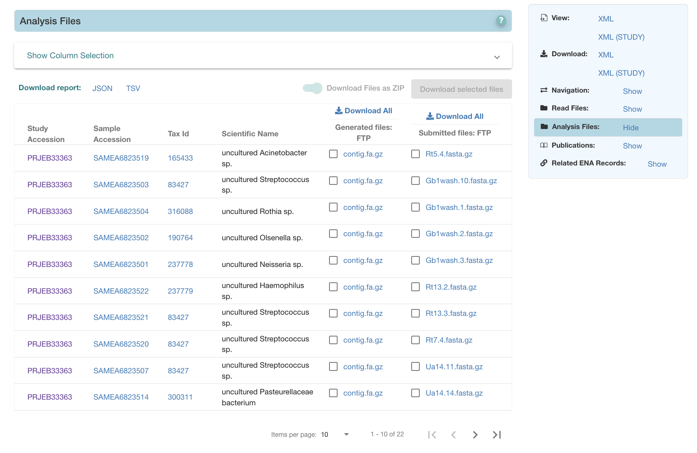

=============================
Archive Generated Analysis Files
=============================

Archive generated analysis files are generated for primary and binned metagenome assemblies. These submissions
will not have a GCA (assembly accession) or sequence accessions but only ERZ accessions.

Whenever possible, ENA provides access to two types of files for each analysis we present: the submitted file(s) and
archive generated file(s). Both are visible in the ENA Browser view under ‘Analysis Files’:

This page serves to briefly discuss the reason for this and the differences between the submitted and archive-generated
files.

Submitted Files
===============

The submitted files for any given analysis are copies of the files originally provided to us by the submitter.
These files always undergo validation appropriate to their format, and are presented as submitted with no automated
curation. Formats are varied, and may be FASTA, but could also be others including BAM, CRAM, VCF, BED etc.

Archive-Generated Files
=======================

Providing archive-generated FASTAs for analyses is a means of bringing some consistency to the data we provide.
By imposing a level of uniformity on these files, we can ensure users know what to expect of them and may incorporate
them into pipelines with minimal friction.

