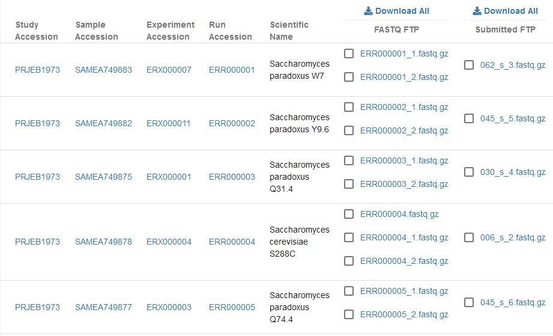

=============================
Archive Generated FASTQ Files
=============================

Whenever possible, ENA provides access to two types of file for each run we
present: the submitted file(s) and archive-generated file(s). Both are visible
in the ENA Browser view for runs:

This page serves to briefly discuss the reason for this and the differences
between the submitted and archive-generated files.

Submitted Files
===============

The submitted files for any given run are copies of the files originally
provided to us by the submitter.
These files always undergo validation appropriate to their format, and are
presented as-submitted with no automated curation.
Formats are varied, and may be FASTQ but could also be others including BAM,
FAST5, HDF5, etc.

Archive-Generated Files
=======================

Providing archive-generated FASTQs for runs is a means of bringing some
consistency to the data we provide.
By imposing a level of uniformity on these files, we can ensure users know
what to expect of them and may incorporate them into pipelines with minimal
friction.

Note that archive-generated FASTQ will not be available in the following
uncommon scenarios:

- BAM/CRAM files containing @PG:longranger
- BAM/CRAM files containing @PG:cellranger
- BAM/CRAM files containing CB:Z,CR:Z,CY:Z,RX:Z,QX:Z tags
- Complete genomics native (data folder) submissions
- PacBio native (HDF5) submissions
- Many ONT native format submissions

Generated FASTQ Files
---------------------

The number of files generated and their content varies depending on the nature
of the submitted files

+---------------+--------------------------------------+-----------------------------------------+
| | Number of   | FASTQ Files                          | Description                             |
| | Application |                                      |                                         |
| | Reads       |                                      |                                         |
+---------------+--------------------------------------+-----------------------------------------+
|               | | <run_accession>.fastq.gz           | | For experiments with single           |
| 1             | | or                                 | | application reads all reads will be   |
|               | | <run_accession>_1.fastq.gz         | | made available in one fastq file.     |
+---------------+--------------------------------------+-----------------------------------------+
|               |                                      | | Paired experiments with two           |
|               |                                      | | application reads will be made        |
|               |                                      | | available in 1-3 FASTQ files. For a   |
|               |                                      | | paired experiment submitted with both |
|               | | <run_accession>_1.fastq.gz         | | application reads the first reads     |
| 2             | | <run_accession>.fastq.gz           | | will be in <run accession>_1.fastq.gz |
|               | | <run_accession>_2.fastq.gz         | | file, the second reads will be in     |
|               |                                      | | <run accession>_2.fastq.gz, and any   |
|               |                                      | | unpaired reads will be in <run        |
|               |                                      | | accession>.fastq.gz file. If files    |
|               |                                      | | from a paired experiment are          |
|               |                                      | | submitted and all reads are unpaired  |
|               |                                      | | then only a single file is created:   |
|               |                                      | | <run accession>.fastq.gz              |
+---------------+--------------------------------------+-----------------------------------------+
|               |                                      | | For experiments with more than two    |
| > 2           | | <run_accession>_N.fastq.gz         | | application reads (e.g. Complete      |
|               |                                      | | Genomics) one fastq file is created   |
|               |                                      | | for each application read, however,   |
|               |                                      | | no empty fastq files are created.     |
+---------------+--------------------------------------+-----------------------------------------+
| N/A           | | <run_accession>_consensus.fastq.gz | ONT or PacBio consensus reads.          |
+---------------+--------------------------------------+-----------------------------------------+
| N/A           | | <run_accession>_subreads.fastq.gz  | PacBio subreads.                        |
+---------------+--------------------------------------+-----------------------------------------+

FASTQ File Format
_________________

::

    @<run accession>.<spot index> [<spot name>][/<read index>]
    <bases>
    +
    <phred qualities, ASCII encoded starting with '!' (33)>

+-----------------+----------------------------------------------------------------------------+
| Field           | Description                                                                |
+-----------------+----------------------------------------------------------------------------+
| <run accession> | | The run accession. A spot is identified uniquely by the combination      |
|                 | | of the run accession and the spot index                                  |
+-----------------+----------------------------------------------------------------------------+
|                 | | A positive integer assigned to the spots in the order in which they      |
| <spot index>    | | appear in the run. A spot is identified uniquely by the combination of   |
|                 | | the Run accession and the spot index.                                    |
+-----------------+----------------------------------------------------------------------------+
| <spot name>     | | The spot name as it was provided by the submitter. In cases where the    |
|                 | | read name is missing or was removed by the archive this field is not     |
|                 | | present.                                                                 |
+-----------------+----------------------------------------------------------------------------+
| <read index>    | | A positive integer assigned to the application reads in the order in     |
|                 | | which they appear in the spot: /1 for first application read and /2 for  |
|                 | | the second application read. In cases where the read name is missing or  |
|                 | | was removed by the archive this field is not present.                    |
+-----------------+----------------------------------------------------------------------------+

Examples
________

Single layout:

::

    @ERR000017.1 IL6_554:7:1:249:322
    AAAAAAAAAAAAAAAAAAAAAAAAAAAAAAAAAAAA
    +
    ??????????????????????????????>>>>>>

Paired (first read):

::

    @ERR005143.1 ID49_20708_20H04AAXX_R1:7:1:41:356/1
    AAAAAAAAAAAAAAAAAAAAAAAAAAAAAAAAAAAA
    +
    hhhhhhhhhhhhhhhhhhhhhhhhhhhhhhhhhhhh

Paired (second read):

::

    @ERR005143.1 ID49_20708_20H04AAXX_R1:7:1:41:356/2
    AAAAAAAAAAAAAAAAAAAAAAAAAAAAAAAAAAAA
    +
    hhhhhhhhhhhhhhhhhhhhhhhhhhhhhhhhhhhh

Single layout without read names:

::

    @ERR000017.1
    AAAAAAAAAAAAAAAAAAAAAAAAAAAAAAAAAAAA
    +
    ??????????????????????????????>>>>>>

Paired without read names (first read):

::

    @ERR005143.1
    AAAAAAAAAAAAAAAAAAAAAAAAAAAAAAAAAAAA
    +
    hhhhhhhhhhhhhhhhhhhhhhhhhhhhhhhhhhhh

Paired without read names (second read):

::

    @ERR005143.1
    AAAAAAAAAAAAAAAAAAAAAAAAAAAAAAAAAAAA
    +
    hhhhhhhhhhhhhhhhhhhhhhhhhhhhhhhhhhhh

