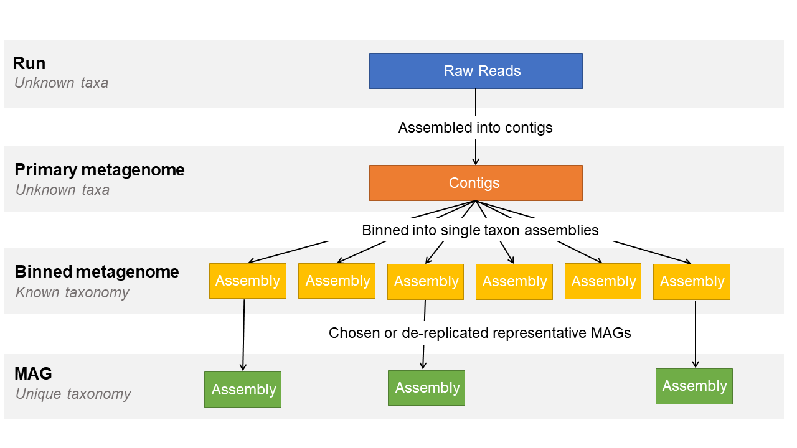

=======================
Assemblies and Analyses
=======================

Which Accessions Will My Submission Receive, And Which Become Public?
---------------------------------------------------------------------

Every analysis submission — genome assembly, MAG, environmental SAG, transcriptome or targeted sequence — receives an
analysis accession (ERZ...) that tracks post-submission processing. **The ERZ accession is not the one to search by**,
and may never be released.

Once processing completes the submission receives its public accessions: **a GCA accession for a genome assembly, and
contig, scaffold or chromosome accessions for the sequences themselves.**
These are what become publicly searchable.

For the full table of which accessions each submission type receives and their final status, see
`Analyses and Accessions <../submit/general-guide/analysis-accessions.html>`_.

What Are Locus Tags And When Do I Need One?
-------------------------------------------

Locus tags are unique identifiers for the genes in an annotated assembly.
You need a registered locus tag prefix only if you are submitting an assembly **with functional annotation**;
unannotated assemblies do not require one.

Prefixes are registered against a study in the Webin Portal.
See `How Do I Register A Locus Tag Prefix?
<../submit/general-guide/locus-tags.html#how-do-i-register-a-locus-tag-prefix>`_ for the registration steps, the
formatting rules the prefix must follow, and how to use the tags in your flat file.

What Can I Submit From A Metagenomics Study?
--------------------------------------------

A metagenomics study assembles sequencing data sampled from an entire biome, down to the individual species living in
that environment.
ENA accepts submissions at each stage of that process, and recognises distinct assembly levels so that the quality of
an assembly and the origin of its data stay clear.

The image below shows the stages of a metagenome assembly study and what is submittable at each level:

See `Metagenome Assembly Submissions <../submit/assembly/metagenome.html>`_ for how to submit each level.

What Is Defined As A MAG Within ENA?
------------------------------------

A MAG is a single-taxon assembly, based on one or more binned metagenomes, asserted to be a close representation of an
actual individual genome — either matching an existing isolate or representing a novel one.

Submit **one MAG per species per biome**.
Where you have several candidates for the same species, use a de-replication step or pick the highest quality
representative genome.

MAGs are registered in the same domain as cultured isolate genome assemblies, which means they are searchable alongside
cultured isolates and feed the same downstream services.
Because an environmental sample can contain many duplicate genomes of the same organism, and because MAGs are more
prone to contamination, ENA requests that only the highest quality unique-taxon assemblies are submitted as MAGs.

How Is The Quality Of A Metagenomic Assembly Defined?
-----------------------------------------------------

By three measures recorded on the sample when a binned or MAG sample is registered, following the data standards of the
Genomic Standards Consortium (GSC) published in `Bowers et al. (2017) <https://www.nature.com/articles/nbt.3893>`_:

1. **Assembly quality** — a written description of the assembly, chosen from three options.
2. **Completeness score** — the ratio of observed single-copy marker genes to total single-copy marker genes in the
   chosen marker gene set (%).
3. **Contamination score** — the ratio of observed single-copy marker genes in two or more copies to total single-copy
   marker genes in the chosen marker gene set (%).

Complete these fields accurately: together they make the overall quality of an assembly searchable in ENA.
The thresholds are as follows.

**Finished assembly**

Any assembly whose assembly quality is described as "Single contiguous sequence without gaps or ambiguities with a
consensus error rate equivalent to Q50 or better".

**High-quality draft**

+---------------------+------------------------------------------------------------------------------------+
| Attribute           | Value                                                                              |
+---------------------+------------------------------------------------------------------------------------+
| assembly quality    | | Multiple fragments where gaps span repetitive regions. Presence of the 23S,      |
|                     | | 16S and 5S rRNA genes and at least 18 tRNAs.                                     |
+---------------------+------------------------------------------------------------------------------------+
| completeness score  | >90%                                                                               |
+---------------------+------------------------------------------------------------------------------------+
| contamination score | <5%                                                                                |
+---------------------+------------------------------------------------------------------------------------+

**Medium-quality draft**

+---------------------+--------------------------------------------------------------------------------------+
| Attribute           | Value                                                                                |
+---------------------+--------------------------------------------------------------------------------------+
| assembly quality    | | Many fragments with little to no review of assembly other than reporting of        |
|                     | | standard assembly statistics.                                                      |
+---------------------+--------------------------------------------------------------------------------------+
| completeness score  | ≥50%                                                                                 |
+---------------------+--------------------------------------------------------------------------------------+
| contamination score | <10%                                                                                 |
+---------------------+--------------------------------------------------------------------------------------+

**Low-quality draft**

+---------------------+--------------------------------------------------------------------------------------+
| Attribute           | Value                                                                                |
+---------------------+--------------------------------------------------------------------------------------+
| assembly quality    | | Many fragments with little to no review of assembly other than reporting of        |
|                     | | standard assembly statistics.                                                      |
+---------------------+--------------------------------------------------------------------------------------+
| completeness score  | <50%                                                                                 |
+---------------------+--------------------------------------------------------------------------------------+
| contamination score | <10%                                                                                 |
+---------------------+--------------------------------------------------------------------------------------+

How Do I Navigate Through A Metagenomics Study?
-----------------------------------------------

Through the ``sample derived from`` attribute, which is why it is important to complete it correctly when registering
metagenomic samples.

It traces your data back through the assembly stages to its environmental biome-level origin, and lets anyone viewing
the data follow the same path, making your methods clear and reproducible.

Note that although every assembly layer is reachable from the study itself, the assemblies do not link to one another.
To find which assembly derives from which, and the metadata that goes with them, look at the samples rather than the
study.

How Do I Register Samples For Co-Assemblies?
--------------------------------------------

Reference all the source samples or reads in the ``sample derived from`` field, in one of two forms.

**A comma-separated list**, with no spaces:

::

    ERSxxxxxx,ERSxxxxxx
    ERRxxxxxx,ERRxxxxxx

**A range**, where the assembly derives from many samples. Separate the first and last accession with a hyphen and no
spaces, keep the accession format consistent across the range, and make sure every accession in the range was used in
that assembly:

::

    ERSxxxxxx-ERSxxxxxx
    ERRxxxxxx-ERRxxxxxx

If you want to submit a primary assembly co-assembled from raw reads, tell the ENA
`helpdesk <https://www.ebi.ac.uk/ena/browser/support>`_ first.

How Do I Submit Uncultured Virus Genomes (UViGs)?
-------------------------------------------------

It depends on how the virus genomes were identified, and in both cases the checklist differs from the standard route.

**Binned from a whole-biome study** — follow the
`metagenome assembly <../submit/assembly/metagenome.html>`_ submission guidelines, but use the
`GSC MIUVIGS <https://www.ebi.ac.uk/ena/browser/view/ERC000049>`_ checklist for each virus assembly instead of
**GSC MIMAGS**.

**Derived by single-cell amplification** — follow the
`environmental single-cell amplified genome assembly <../submit/assembly/environmental-sag.html>`_ submission
guidelines, but again use the `GSC MIUVIGS <https://www.ebi.ac.uk/ena/browser/view/ERC000049>`_ checklist instead of
**GSC MISAGS**.

How Do I Submit Metagenome Assemblies Without Raw Data Or Primary Assemblies To Point To?
------------------------------------------------------------------------------------------

Register the environmental samples anyway, and release them manually.

ENA recommends submitting all levels of metagenomic assembly where possible, but there are cases where you cannot.
For example, bacteria assembled from a metagenome taken from a human host may leave raw data contaminated with human
DNA that you have no permission to make public.

Where raw data or a primary metagenome cannot be provided, the environmental samples still need to be registered.
Because those samples have no data attached, they will not be released automatically and must be released manually.

Sample release can be done ahead of the study release without risking premature release of any data files, since there
are none.
If you do not want the sample *metadata* public before the study is released, note the study release date and release
these samples at the same time instead.

To release them, prepare a submission XML containing each **environmental** sample accession in its own ACTION block:

.. code-block:: xml

    <SUBMISSION>
        <ACTIONS>
             <ACTION>
                  <RELEASE target="ERS3334823"/>
             </ACTION>
             <ACTION>
                  <RELEASE target="ERS3334824"/>
             </ACTION>
             <ACTION>
                  <RELEASE target="ERS3334825"/>
             </ACTION>
        </ACTIONS>
    </SUBMISSION>

Submit it over HTTPS with a tool such as curl:

.. code-block:: bash

    curl -u username:password -F "SUBMISSION=@submission.xml" "https://www.ebi.ac.uk/ena/submit/drop-box/submit/"

A successful release returns a receipt like this:

.. code-block:: xml

    <RECEIPT receiptDate="2019-03-25T08:23:45.795Z" submissionFile="submission.xml" success="true">
         <MESSAGES>
              <INFO>sample accession "ERS3334823" is set to public status.</INFO>
              <INFO>sample accession "ERS3334824" is set to public status.</INFO>
              <INFO>sample accession "ERS3334825" is set to public status.</INFO>
              <INFO>Submission has been committed.</INFO>
         </MESSAGES>
         <ACTIONS>RELEASE</ACTIONS>
         <ACTIONS>RELEASE</ACTIONS>
         <ACTIONS>RELEASE</ACTIONS>
    </RECEIPT>
