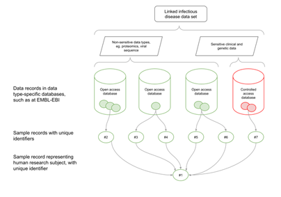

How to Submit Multi-Omic Cohort Datasets
========================================

This guide includes information about how to submit a multi-omic dataset to be displayed as an entry in the `Pathogens
Portal Cohort browser <https://www.pathogensportal.org/cohorts?activeTab=Browser>`_.
If you have a multi-omic dataset you wish to archive, but it is not linked to Pathogens, similar principles will apply,
but the dataset will not be displayed in the Pathogens Portal.

Introduction
````````````
Infectious disease plays out as an intricate set of molecular interactions between the systems of both pathogen and infected host.
In cases of vector-borne disease, such as malaria, or diseases with intermediate hosts, such as tapeworm, interactions with further
species are involved. Studying these interconnected biologies, such as to understand infection mechanisms and patient response,
develop clinical and public health interventions and predict outcomes of the circulation of new pathogen variants, requires the use
of combined data sets which span the two or more organisms involved in the infection.

Regardless of which technical platform is used for their generation, biological data can be organised around the concept of sample.
A biological sample, such as a blood sample from a patient, can be represented as a digital record with an identifier. When the
sample is subjected to different assays, such as genomic sequencing or serology analysis, each of the resultant data sets can
reference the identifier of the sample from which they were derived. In many workflows, samples are divided, such as when a
wastewater sample is size-filtered to yield a bacterial subsample and a viral subsample. Records for each of these new samples
can be created and given their own identifiers, and reference can be made back to the sample from which they were derived by using
its top-level sample identifier.

For example, in this diagram example, the top-level sample (#1) is linked to various child samples which hold information
for data in multiple databases:



Steps
`````
The steps below provide an overview of creating a multi-omic dataset. Before starting a submission, we strongly advise
you to contact us at cohort-dataflow@ebi.ac.uk if you are planning to submit a linked cohort dataset, including some
details about your study, and we can give guidance on your sample structure, and how to complete the data submissions.

1. Create the top-level BioSample
'''''''''''''''''''''''''''''''''

The first step is to create top-level Samples using the `BioSamples Archive <https://www.ebi.ac.uk/biosamples/>`_.
These Samples will represent each case or patient in the study. This is represented by Sample #1 in the diagram.
If this is a human sample, this can contain minimal, non-identifying metadata about the patient (e.g. gender,
organism, disease). See an example `here <https://www.ebi.ac.uk/biosamples/samples/SAMEA12928716>`_.

Top-level Sample records can be created in BioSamples using the `BioSamples uploader tool <https://www.ebi.ac.uk/biosamples/docs/cookbook/upload_files>`_.

.. note ::
    The ENA and the `EGA (European Genome Phenome Archive) <https://ega-archive.org/>`_ are the only archives which integrate
    BioSample records into their :doc:`database structure <submit/general-guide/metadata>`. For data deposited at other
    archives, additional BioSample records may need to be created (in BioSamples) to represent those data.

2. Submit Pathogen Sequence data to the ENA
'''''''''''''''''''''''''''''''''''''''''''

The next step is to submit your nucleotide records (raw reads or assembly data) to the ENA.
The :doc:`Pathogen Submissions Guide <faq/pathogen-subs-guide>` provides a quick introduction to the ENA and tips for
Pathogen data submissions.
Otherwise, please refer to the :doc:`ENA General Submissions Guide <../submit/general-guide>`.


3. Submit other data types to appropriate database resources
''''''''''''''''''''''''''''''''''''''''''''''''''''''''''''

The next step is to create your datasets in the correct database for the data type. The `EBI submissions wizard
<https://www.ebi.ac.uk/submission/>`_ can help direct you to a resource to deposit your data.
We can reccommend the following database resources for common data types:

- For sensitive human nucleotide records and human clinical epidemiological data which requires controlled access, please
  contact the `EGA (European Genome Phenome Archive) <https://ega-archive.org/>`_ to start a submission.
- For expression data, or uncategorsied datasets, please use `ArrayExpress/BioStudies <https://www.ebi.ac.uk/biostudies/arrayexpress>`_

4. Create the child BioSamples for linking
''''''''''''''''''''''''''''''''''''''''''

After the datasets have been submitted in the appropriate databases, the required child Samples for linking can be created.
The child samples will represent their relationship to the top-level Sample. Different samples can be used for different
data types **and** for different time points. Please contact us if you have any doubts about setting up your sample structure.


5. Link together the samples using BioSamples
''''''''''''''''''''''''''''''''''''''''''''''

Link your samples created from other EBI resources to the top-level sample using a
`BioSamples derived from curation <https://www.ebi.ac.uk/biosamples/docs/references/api/submit#_submit_curation_object> `_.

Link your samples created from other EBI resources to the top-level sample using the ‘derived from’ curation on
BioSamples. The derived from relationship is used as follows, where the Source is the child Sample, and the Target is
the top-level Sample:

**Source sample** - *derived from* - **Target sample**

**Child sample accession** - *derived from* - **Parent sample accession**

For example, in the first linked dataset, the `Erasmus Medical Cemter (EMC) study <https://www.infectious-diseases-toolkit.org/showcase/linked-cohort-data>`_,
the BioSamples relationship is as follows:

**[T/B-Cell/Antibody profile/ENA viral sample accession]** - *derived from* - **[Top level patient sample accession]**

A JSON file curation object (see example below) containing the relationship attribute with the source and target sample
can be created and submitted via curl to the `BioSamples API <https://www.ebi.ac.uk/biosamples/docs/references/api/submit#_submit_curation_object>`_)

JSON curation:

.. code-block:: JSON

   {
     "curation" : {
      "relationshipsPre" : [ ],
       "relationshipsPost" : [ {
         "source" : "SAMFAKE123456",
         "type" : "DERIVED_FROM",
         "target" : "SAMFAKE7654321"
       } ],
       "hash" : "09a5a9cddbea9f5bb6302b86b922c408abc92b8b10c78f0662ac7e41fd44e91f"
     },
    "domain" : null,
    "webinSubmissionAccountId" : "WEBIN-12345",
     "created" : "2023-07-17T12:19:33.056356Z",
     "hash" : "d1f611ec2c8caf3d9f58fa40227ea60ebb5fc00eda06338fb81db7d987a6fa63"
   }

..

Please contact ena-path-collabs@ebi.ac.uk for technical support with any questions related to sample
linking using BioSamples.

6. Submit the cohort metadata
'''''''''''''''''''''''''''''

While the BioSamples database is key to capturing the linking of data types on participant level, the
`Cohort Browser <https://www.pathogensportal.org/cohorts>`_ presents a range of study-level information about each cohort.
This metadata is an integral part of the Pathogens Portal, enhancing the findability of a cohort dataset, and this serves
as the primary entry point into the dataset. The included data types in the dataset will be represented by the
'Type of data' column within the cohort browser.

For your cohort to display within a cohort browser, please contact us to check which metadata will be needed for your dataset.
As a guide, the following information will be needed to describe the cohort:

- Cohort acronym/link to webpage
- Cohort title
- Cohort/study description
- Institution
- Number of participants
- Territory/country
- Enrollment period

Please find the form `here <https://docs.google.com/spreadsheets/d/1LuyPhv1J5t2FU7JE2XjW9n__PjGTxeBoA38PXpN8sG8/edit#gid=0>`_
for a more complete version of the suggested metadata. Please get in touch with us using cohort-dataflow@ebi.ac.uk if you
would like to add your cohort metadata to the Pathogens Portal Cohort Browser.
