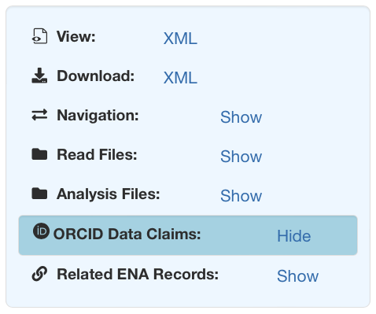
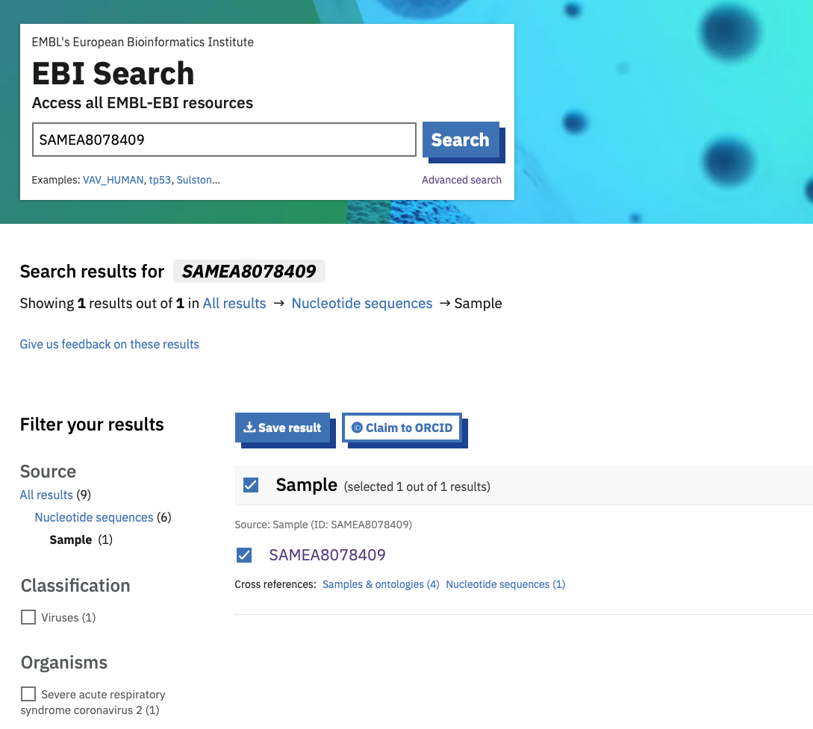
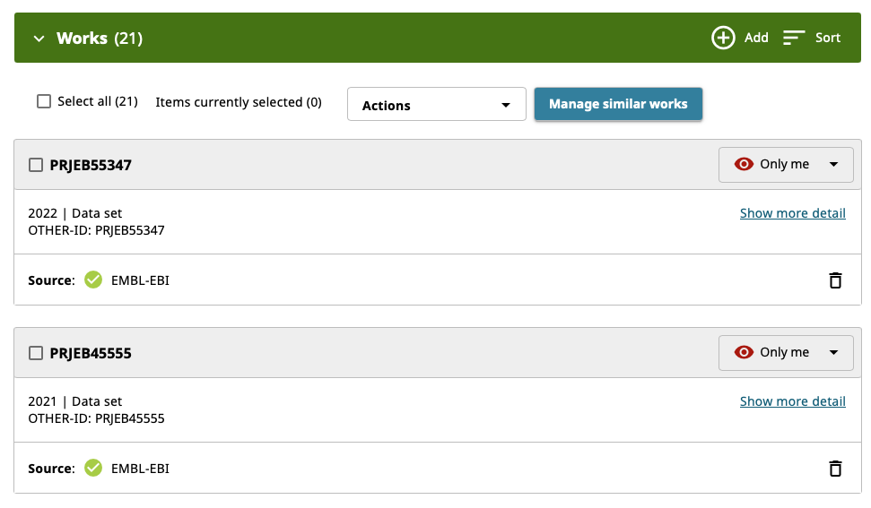

==============================
Claiming ENA records via ORCID
==============================

Often, attribution of credit for the production of sequence data can be patchy. All contributors to the process
should be linked to their work. To that end, many ENA records can now be claimed to your `ORCID iD <https://orcid.org>`_
as 'data set' records.

* projects
* samples
* experiments
* assemblies
* sequences

How to claim a record
---------------------
Upon visiting a claimable record on the ENA browser (`example <https://www.ebi.ac.uk/ena/browser/view/SAMEA8078409>`_),
an 'ORCID Data Claims' item will appear in :ref:`the navigation box <nav box>`.

Clicking 'Show' will reveal the ORCID menu where you can see which ORCID IDs have already claimed the record, along with
a 'Claim to ORCID' button to allow your to claim the record to your own ID. ORCID data claiming on EBI records is managed
centrally by the EBI search service, so clicking the button will direct you to this service with your record pre-selected.

From here, click on the 'Claim to ORCID' button at the top of the search results. This will open a login prompt for
you to authenticate your ORCID account, or if you are already logged in, it will link the record to your ORCID ID.
If you go to `<https://orcid.org/>` and log in, you should see the record listed there as a 'Data set' type record.

.. tip::
    Sorting your list of works by 'Type' ascending will bring 'Data set' records to the top.

