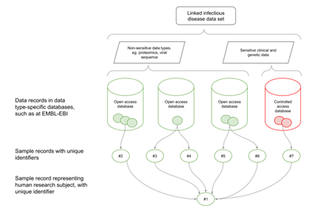

General Pathogens Submissions Guide
==================================

.. image:: images/pathogens_logo_1.png
   :width: 400
   :alt: Pathogens Portal logo
   :align: center


.. contents::
   :local:
   :depth: 3

Introduction
~~~~~~~~~~~~


This guide provides general information and help for submitting pathogen sequence data to the `European Nucleotide Archive (ENA) <https://www.ebi.ac.uk/ena/browser/home>`_.
All public `INSDC <https://www.insdc.org/>`_ pathogen data (except for SARS-Cov-2) will be made available to browse
using the `Pathogens Portal <https://www.ebi.ac.uk/ena/pathogens/v2/>`_.

Please see below for a specific guide for submitting pathogen related data. The guide frequently refers to the
`ENA Training Modules <https://ena-docs.readthedocs.io/en/latest/index.html>`_,
our general ENA submissions guide. If you have any queries or require assistance with your submission please contact
us at ena-path-collabs@ebi.ac.uk.

.. tip::

  **Looking for something else?**

  For pathogen-specific submissions guidance, please refer to these guides:

  - `ENA SARS-CoV-2 submissions guide <https://ena-covid19-docs.readthedocs.io/en/latest/index.html>`_
  - `Monkeypox virus ENA submissions Guidance <https://docs.google.com/viewer?url=https://github.com/enasequence/ena-content-dataflow/raw/master/docs/Monkeypox%20virus%20ENA%20Submission%20Guidance.pdf>`_

  For small-scale SARS-CoV-2 viral data submissions, with no prior knowledge of ENA submission routes, we have developed a
  drag and drop submissions tool. Please complete the `form <https://www.covid19dataportal.org/submit-data/viral-sequence-form>`_
  on the `COVID-19 Data Portal <https://www.covid19dataportal.org/>`_ if you would like to submit COVID-19 data using this route.


Getting Started
~~~~~~~~~~~~~~~
Register a submission account
`````````````````````````````
Before you can submit data to the ENA you must `register a Webin submission account <https://ena-docs.readthedocs.io/en/latest/submit/general-guide/registration.html>`_.

Please navigate to the `Webin Portal <https://www.ebi.ac.uk/ena/submit/webin/login>`_ and click the ‘Register’
button and complete the registration form.


The ENA Metadata Model
``````````````````````
Before submitting data to ENA, it is important to familiarise yourself with the `ENA metadata model <https://ena-docs.readthedocs.io/en/latest/submit/general-guide/metadata.html#the-ena-metadata-model>`_
and what parts of your research project can be represented by which metadata objects. This will determine what you need to submit.


.. raw:: html


    <embed>
        <blockquote class="twitter-tweet"><p lang="en" dir="ltr">1/8<br><br>The ENA would like to introduce you to our very first TWEETORIAL! For this <a href="https://twitter.com/hashtag/tweetorial?src=hash&amp;ref_src=twsrc%5Etfw">#tweetorial</a>, we will be explaining the ENA Metadata Model. When submitting data to the ENA, you need to register additional metadata so your submission is in accordance with FAIR data principles. <a href="https://t.co/m45ENIrlIM">pic.twitter.com/m45ENIrlIM</a></p>&mdash; European Nucleotide Archive (ENA) (@ENASequence) <a href="https://twitter.com/ENASequence/status/1514229572425994245?ref_src=twsrc%5Etfw">April 13, 2022</a></blockquote> <script async src="https://platform.twitter.com/widgets.js" charset="utf-8"></script>
    </embed>


ENA Submission routes
`````````````````````
ENA allows submissions via three routes, each of which is appropriate for a
different set of submission types. You may be required to use more than one in
the process of submitting your data:

- **Interactive Submissions** are completed by filling out web forms directly
  in your browser and downloading template spreadsheets that can be completed
  off-line and uploaded to ENA. This is often the most accessible submission route.
- **Command Line Submissions** use our bespoke Webin-CLI program. This
  validates your submissions entirely before you complete them, allowing you
  maximum control of the process.
- **Programmatic Submissions** are completed by preparing your submissions as
  XML documents and either sending them to ENA using a program such as cURL or using
  the Webin Portal.

The table below outlines what can be submitted through each submission route.

+------------------------+-------------+-----------+--------------+
|                        | Interactive | Webin-CLI | Programmatic |
+------------------------+-------------+-----------+--------------+
| Study                  |    **Y**    |     N     |     **Y**    |
+------------------------+-------------+-----------+--------------+
| Sample                 |    **Y**    |     N     |     **Y**    |
+------------------------+-------------+-----------+--------------+
| Read data              |    **Y**    |   **Y**   |     **Y**    |
+------------------------+-------------+-----------+--------------+
| Genome Assembly        |      N      |   **Y**   |       N      |
+------------------------+-------------+-----------+--------------+
| Transcriptome Assembly |      N      |   **Y**   |       N      |
+------------------------+-------------+-----------+--------------+
| Template Sequence      |      N      |   **Y**   |       N      |
+------------------------+-------------+-----------+--------------+
| Other Analyses         |      N      |     N     |     **Y**    |
+------------------------+-------------+-----------+--------------+

Register Metadata
~~~~~~~~~~~~~~~~~

Register Study
``````````````

Data submissions to the ENA require that you register a study to contextualise and group your data. Details of how to do
this can be found in our `Study Registration Guide <https://ena-docs.readthedocs.io/en/latest/submit/study.html>`_.
Please ensure you describe your study adequately, as well as provide an informative title.

Your  studies can now be claimed using your ORCID ID and/or assigned a DOI. Please see `here <https://ena-browser-docs.readthedocs.io/en/latest/about/citing-ena.html#orcid-data-claiming>`_
and `here <https://ena-browser-docs.readthedocs.io/en/latest/help_and_guides/sars-cov-2-submissions.html#doi-issuing>`_ for more information on these options.

Register Samples
````````````````

Having registered a study, please proceed to register your samples. These are metadata objects that describe the source
biological material of your experiments. Following this, the sequence data can be registered (as described in later sections).

Instructions for sample registration can be found in our `Sample Registration Guide <https://ena-docs.readthedocs.io/en/latest/submit/samples.html>`_.
As part of this process, you must select a sample checklist to describe metadata.
If you require any support regarding sample metadata, please contact ena-path-collabs@ebi.ac.uk.

for **interactive submission**, download the sample checklist template from the Webin Portal and once completed, submit
the checklist in **.tsv** format on the Webin Portal to register your Samples. See `programmatic sample submission <https://ena-docs.readthedocs.io/en/latest/submit/samples/programmatic.html#register-samples-programmatically>`_
if you are submitting samples programmatically.

Sample checklists
'''''''''''''''''
The following Sample checklists contain  **mandatory**, *recommended* and optional metadata fields (``<SAMPLE_ATTRIBUTE>``),
with a description for each field, to help with sample metadata completion.
The checklists were agreed by the Genomic Standards Consortium (GSC). In addition to the core checklist for each life domain,
the GSC also provides checklist `extensions <https://www.gensc.org/pages/standards/extensions.html>`_ which may have the
metadata field you are looking for.

You can use the `Sample checklists portal <https://www.ebi.ac.uk/ena/browser/checklists>`_ to browse all ENA checklists.
The pathogen specific checklists are provided below.

+-----------------------------------------------------------------+---------------------------------------------------------------------------+
| **link**                                                        | **Checklist name**                                                        |
+-----------------------------------------------------------------+---------------------------------------------------------------------------+
| `ERC000028 <https://www.ebi.ac.uk/ena/browser/view/ERC000028>`_ | ENA prokaryotic pathogen minimal sample checklist                         |
+-----------------------------------------------------------------+---------------------------------------------------------------------------+
| `ERC000029 <https://www.ebi.ac.uk/ena/browser/view/ERC000029>`_ | ENA Global Microbial Identifier reporting standard checklist GMI_MDM:1.1  |
+-----------------------------------------------------------------+---------------------------------------------------------------------------+
| `ERC000032 <https://www.ebi.ac.uk/ena/browser/view/ERC000032>`_ | ENA Influenza virus reporting standard checklist                          |
+-----------------------------------------------------------------+---------------------------------------------------------------------------+
| `ERC000033 <https://www.ebi.ac.uk/ena/browser/view/ERC000033>`_ | ENA virus pathogen reporting standard checklist                           |
+-----------------------------------------------------------------+---------------------------------------------------------------------------+
| `ERC000039 <https://www.ebi.ac.uk/ena/browser/view/ERC000039>`_ | ENA parasite sample checklist                                             |
+-----------------------------------------------------------------+---------------------------------------------------------------------------+
| `ERC000041 <https://www.ebi.ac.uk/ena/browser/view/ERC000041>`_ | ENA Global Microbial Identifier Proficiency Test (GMI PT) checklist       |
+-----------------------------------------------------------------+---------------------------------------------------------------------------+

Sample taxonomy
'''''''''''''''

Our `Tips for Sample Taxonomy <https://ena-docs.readthedocs.io/en/latest/faq/taxonomy.html>`_ page provides a helpful guide for choosing
the right taxonomy for your pathogen submission.

You can search for suitable taxon IDs and find more information about a taxon ID using the taxonomy API endpoints:

::

   https://www.ebi.ac.uk/ena/taxonomy/rest/suggest-for-submission/
   https://www.ebi.ac.uk/ena/taxonomy/rest/scientific-name/
   https://www.ebi.ac.uk/ena/taxonomy/rest/any-name/
   https://www.ebi.ac.uk/ena/taxonomy/rest/tax-id/

The strain of a pathogen may be specified using the taxonomy, it may also be specified using the **strain** field
in the checklists. If you specify the strain with both, this will make your strain easier to find.

The `ENA taxonomy API <https://www.ebi.ac.uk/ena/taxonomy/rest/>`_ interface may also be used.


Sample Host
'''''''''''

Every pathogen checklist includes host attribute fields which can be used to describe the host. Here is provided some guidance on filling the host fields.
If you have any questions or concerns about pathogen sample metadata, please
contact the `helpdesk <https://www.ebi.ac.uk/ena/browser/support>`_.

Pathogen checklists host fields:

:host taxid: NCBI taxon id of the host, e.g. 9606

:host health state: health status of the host at the time of sample collection

:host scientific name: Scientific name of the natural (as opposed to laboratory) host to the organism from which sample was obtained.

:lab_host: scientific name of the laboratory host used to propagate the source organism from which the sample was obtained. The EBI `cell line ontology <https://www.ebi.ac.uk/ols4/ontologies/clo>`_ may be used to find the name for the host cell line


Submit Runs
~~~~~~~~~~~

After registering your study and samples, you can submit your read files along with experimental (library-related) metadata.
See our `Read Submission Guide <https://ena-docs.readthedocs.io/en/latest/submit/reads.html>`_ for detailed instructions on submitting reads.

We encourage submissions to include information on specific protocols used for the experiment. This should be provided in
the library description. This can be, for example, the name and/or URL to a specific protocol. View our listing of the available
`full experimental metadata dictionaries <https://ena-docs.readthedocs.io/en/latest/submit/reads/webin-cli.html>`_.

.. note::
   Submitted reads to ENA should not contain human identifiable reads. Please filter out human reads prior to
   submission - if required, `here <https://github.com/alakob/Metagen-FastQC-Docker>`_ is a tool which can be used.


Submit Assembled Sequences
~~~~~~~~~~~~~~~~~~~~~~~~~~

The instructions below provide a quick guide to submitting a completed isolate pathogen genome assembly.
This type of submission is classed as 'clone or isolate' **ASSEMBLY_TYPE** for the ENA submissions services. For submission of
other types of nucleotide assembly data, please see the submission options `here <https://ena-docs.readthedocs.io/en/latest/submit/assembly.html#submission-options>`_.
For submission of targeted sequences, please refer to the `targeted sequence submissions guide <https://ena-docs.readthedocs.io/en/latest/submit/sequence.html#how-to-submit-targeted-sequences>`_.

For genome assembly submission, Webin-CLI (command line interface) needs to be used. The guide for downloading
and using Webin-CLI is `here <https://ena-docs.readthedocs.io/en/latest/submit/general-guide/webin-cli.html#webin-cli-submission>`_.

.. admonition:: A note on assembly levels

   This guide includes chromosome list file examples which are used for a **chromosome** level assembly. Note that
   ‘chromosome’ should here be understood as a general term for a range of complete replicons, including chromosomes of
   eukaryotes, prokaryotes, and viruses, as well as organellar chromosomes and plasmids. All of these may be submitted
   within the same chromosome-level assembly.

   If your assembly is not completed, you can submit a **contig** or **scaffold**
   level assembly. Please refer to the explainer about assembly levels `here <https://ena-docs.readthedocs.io/en/latest/submit/assembly.html#assembly-levels>`_.


Prepare files
`````````````

Assembly file
'''''''''''''

The accepted format for unannotated genome assembly is **fasta** OR for annotated genome assembly, the accepted format is **embl flat file**
Please refer to the `Accepted genome assembly data formats guide <https://ena-docs.readthedocs.io/en/latest/submit/fileprep/assembly.html#accepted-genome-assembly-data-formats>`_
for information about preparing these files.


Manifest file
'''''''''''''

The manifest file is a tab-separated .txt file for Webin-CLI assembly submission. It specifies metadata about the
assembly, including the study and sample it is linked to.
Please refer to the `assembly manifest file guide <https://ena-docs.readthedocs.io/en/latest/submit/assembly/genome.html#manifest-files>`_
for permitted values.

For example, the following manifest file represents a genome assembly consisting of contigs provided in one fasta file:

::

   STUDY   TODO
   SAMPLE   TODO
   ASSEMBLYNAME   TODO
   ASSEMBLY_TYPE clone or isolate
   COVERAGE   TODO
   PROGRAM   TODO
   PLATFORM   TODO
   MINGAPLENGTH   optional
   MOLECULETYPE   genomic DNA
   DESCRIPTION optional
   RUN_REF optional
   FASTA   genome.fasta.gz


Chromosome list file
''''''''''''''''''''

The **chromosome list file** must be provided when the submission contains assembled chromosomes. This is a tab separated
file up to four columns. Each row describes each replicon unit within the assembly. Please refer to the `chromosome list file guide <https://ena-docs.readthedocs.io/en/latest/submit/fileprep/assembly.html#chromosome-list-file>`_
for permitted values. Here are some examples for different organisms:

.. tabs::

   .. tab:: Viruses

      By default the chromosome **TOPOLOGY** will be assumed to be linear, therefore if the topology is circular, it must be specified.

      .. code:: none

         chr01   1 Monopartite

      .. code:: none

         chr01   1 circular-Monopartite viroid

      .. code:: none

         chr01   1 Multipartite
         chr02   2 Multipartite

   .. tab:: Bacteria

      By default prokaryotic chromosomes and plasmids will be assumed to reside in the in the cytoplasm, however, the 'plasmid'
      **CHROMOSOME_LOCATION** may be specified.
      By default the **TOPOLOGY** will be assumed to be linear, so in this example the circular topology was specified.

      .. code:: none

         chr01   1 circular-Chromosome
         chr02   2 circular-Chromosome plasmid
         chr03   3 circular-Chromosome plasmid

   .. tab:: Eukaryota

      By default eukaryotic chromosomes will be assumed to reside in the nucleus. By default the chromosome **TOPOLOGY**
      will be assumed to be linear, but it may also be specified.

      .. code:: none

         chr01   1 Linear-Chromosome
         chr02   2 Linear-Chromosome
         chr03   3 Linear-Chromosome
         chr04   4 Linear-Chromosome
         chrMi   MIT Linear-Chromosome Mitochondrion

If there are sequences that are associated with a specific chromosome, but order and orientation is unknowm, you can also add an
`unlocalised list file <https://ena-docs.readthedocs.io/en/latest/submit/fileprep/assembly.html#unlocalised-list-file>`_ to the
submission. Alternatively, an `AGP file <https://ena-docs.readthedocs.io/en/latest/submit/fileprep/assembly.html#agp-file>`_ may also be
submitted to define unplaced sequences.


Webin-CLI submission
````````````````````

When you have prepared your files, including the assembly, the manifest file and any additional files for higher assemblies,
You can validate and test your submission using the Webin-CLI ``-validate`` flag. When you are ready to submit the assembly,
you can use the ``-submit`` flag.

**Webin-CLI validate command:**

::

   java -jar webin-cli-6.4.0.jar -userName Webin-XXXX -password XXXX -context genome -manifest manifest.txt -validate


Submit Linked Cohort Data
~~~~~~~~~~~~~~~~~~~~~~~~~
Introduction
````````````
Infectious disease plays out as an intricate set of molecular interactions between the systems of both pathogen and infected host.
In cases of vector-borne disease, such as malaria, or diseases with intermediate hosts, such as tapeworm, interactions with further
species are involved. Studying these interconnected biologies, such as to understand infection mechanisms and patient response,
develop clinical and public health interventions and predict outcomes of the circulation of new pathogen variants, requires the use
of combined data sets which span the two or more organisms involved in the infection.

Regardless of which technical platform is used for their generation, biological data can be organised around the concept of sample.
A biological sample, such as a blood sample from a patient, can be represented as a digital record with an identifier. When the
sample is subjected to different assays, such as genomic sequencing or serology analysis, each of the resultant data sets can
reference the identifier of the sample from which they were derived. In many workflows, samples are divided, such as when a
wastewater sample is size-filtered to yield a bacterial subsample and a viral subsample. Records for each of these new samples
can be created and given their own identifiers, and reference can be made back to the sample from which they were derived by using
its top-level sample identifier.



Steps
`````
The steps detailed here provide an overview of how to create a dataset record including multiple linked data types, to appear in the
`Pathogens Portal Cohort Browser <https://www.pathogensportal.org/cohorts>`_.
Before starting a submission, we strongly advise you to contact us at cohort-dataflow@ebi.ac.uk if you are planning to submit a
linked cohort dataset, including some details about your study, and we can provide support with the following steps.

1. Create the top-level sample
''''''''''''''''''''''''''''''

Top-level samples representing each case or patient can be created in the `BioSamples Archive <https://www.ebi.ac.uk/biosamples/>`_.
This is represented by sample H1 in the diagram above. For a human sample, these can contain minimal, non-identifying metadata about
the patient (e.g. gender, organism, disease). See an example `here <https://www.ebi.ac.uk/biosamples/samples/SAMEA12928716>`_.

Top-level Sample records can be created in BioSamples using the `BioSamples uploader tool <https://www.ebi.ac.uk/biosamples/docs/cookbook/upload_files>`_.

2. Create the child samples in EBI data resources
'''''''''''''''''''''''''''''''''''''''''''''''''

Please note you can use different samples for different data types and for different time points. Please also be advised
that EGA and ENA are the only archives which integrate the BioSample records into their metadata models. For data deposited
at other archives, additional BioSample records may need to be created (in BioSamples) to represent those data.

- For pathogen nucleotide records (raw reads or assembly data), please refer to the ENA `Sample Registration Guide <../submit/samples.html>`_.
- For sensitive human nucleotide records and human clinical epidemiological data which requires controlled access, please
  contact the `EGA (European Genome Phenome Archive) <https://ega-archive.org/>`_ to start a submission.
- For expression data, please use `ArrayExpress/Biostudies <https://www.ebi.ac.uk/biostudies/arrayexpress>`_
- For other types of biological data, or if you are not sure which archive to use, please use the `EBI submissions wizard <https://www.ebi.ac.uk/submission/>`_
  which can direct you to a resource to deposit your data.

3. Link together the samples using BioSamples
''''''''''''''''''''''''''''''''''''''''''''''

Link your samples created from other EBI resources to the top-level sample using the ‘derived from’ curation on
BioSamples. The derived from relationship is used as follows:

**Source sample** - *derived from* - **Target sample**

**Child sample accession** - *derived from* - **Parent sample accession**

e.g. for the `EMC study <https://www.ebi.ac.uk/about/news/updates-from-data-resources/pathogens-portal-linked-dataset/>`_:

**[T/B-Cell/Antibody profile/ENA viral sample accession]** - *derived from* - **[Top level patient sample accession]**

A JSON file curation object (see example below) containing the relationship attribute should be created and submitted
via curl to BioSamples (see instructions `here <https://www.ebi.ac.uk/biosamples/docs/references/api/submit#_submit_curation_object>`_)
Please contact ena-path-collabs@ebi.ac.uk (or BioSamples) for technical support with sample linking using BioSamples.


.. code-block:: JSON

   {
     "curation" : {
      "relationshipsPre" : [ ],
       "relationshipsPost" : [ {
         "source" : "SAMFAKE123456",
         "type" : "DERIVED_FROM",
         "target" : "SAMFAKE7654321"
       } ],
       "hash" : "09a5a9cddbea9f5bb6302b86b922c408abc92b8b10c78f0662ac7e41fd44e91f"
     },
    "domain" : null,
    "webinSubmissionAccountId" : "WEBIN-12345",
     "created" : "2023-07-17T12:19:33.056356Z",
     "hash" : "d1f611ec2c8caf3d9f58fa40227ea60ebb5fc00eda06338fb81db7d987a6fa63"
   }

..


4. Submit the cohort metadata
'''''''''''''''''''''''''''''

While the BioSamples database is key to capturing the linking of data types on participant level, the
`Pathogens Portal Cohort Browser <https://www.pathogensportal.org/cohorts>`_ presents a range of study-level information about a cohort.
Similar to a shop window, a cohort browser enhances the findability of the datasets and is an integral part of the Pathogens Portal,
serving as the primary entry point into cohort data. The linked data types included in the cohort will also be indicated under the 'Type of data'
column within the Cohort Browser.

As a general guide, the following information will be needed to describe the cohort.
also includes some additional fields:

- Cohort acronym/link to webpage
- Cohort title
- Cohort/study description
- Institution
- Number of participants
- Territory/country
- Enrollment period

There are additional metadata fields listed in the form `here <https://docs.google.com/spreadsheets/d/1LuyPhv1J5t2FU7JE2XjW9n__PjGTxeBoA38PXpN8sG8/edit#gid=0>`_
Please contact us at cohort-dataflow@ebi.ac.uk in order to check that your cohort metadata will be compatible with our browser.

Data Release and Citing
~~~~~~~~~~~~~~~~~~~~~~~

Once the data is submitted, it will take some time to be processed and archived. If your data is set to public, it will
be made public and accessible from the Pathogens Portal.

For information about data release, please find more information at the following pages:

- `Data Release Policies <https://ena-docs.readthedocs.io/en/latest/faq/release.html>`_

- `Accession Numbers <https://ena-docs.readthedocs.io/en/latest/submit/general-guide/accessions.html>`_

- `Citing and Orcid Data Claiming <https://ena-docs.readthedocs.io/en/latest/submit/general-guide/accessions.html#how-to-cite-your-ena-study>`_

