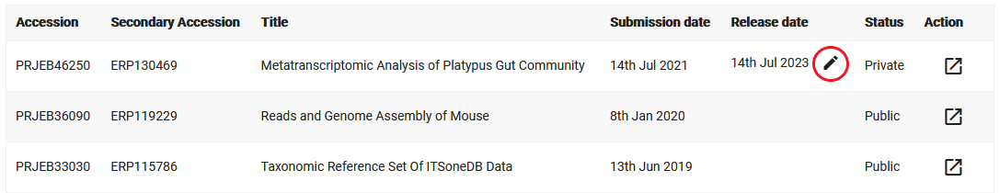

Data Release Policies
=====================

How Is Data Release Managed?
------------------------------

Data release is controlled from the level of study objects.
When a study is made public, all samples, experiments, runs and analyses associated with it are also made public.
For an explanation of these terms and their relationships, please read the
`Metadata Model <https://ena-docs.readthedocs.io/en/latest/submit/general-guide/metadata.html>`_ page.

Can I Advance/Postpone The Release Date?
----------------------------------------

You can edit the release date of a study from within your Webin account, provided it is confidential and has never been
public.

First, log into `Webin Portal <https://www.ebi.ac.uk/ena/submit/webin/>`_.
Click the 'Studies Report' button and find the study you wish to change the release date for.
Use the pencil icon next to the study to bring up a dialog which will allow you to set a new release date.
You can move the date to be sooner or later as required.
When making the date later, the new date cannot be more than 2 years beyond the current date.

When you are ready to release your study, you should do it by changing the release day to the present date.

Once the release date has elapsed, it will no longer be possible for you to affect the publicity of your data.
See further down the page for information on this.

I Released My Study, Why Can't I Find It In The Public Database?
----------------------------------------------------------------

After a study is made public, it can take up to 48 hours for your data to be searchable in the ENA Browser.
It will take four days for it to be visible in GenBank.
Please take this into consideration if you have a strict deadline by which your data must be public.
Note that the processes which are taking place in this time are automated, and we are not able to intervene in order to
expedite the release of your data.
If after 48 hours your data remain confidential, please contact our
`helpdesk <https://www.ebi.ac.uk/ena/browser/support>`_.

Can I Make My Study Partially Available?
----------------------------------------

Whether you wish to make only parts of your submission available, or wish to make your submission available only
to select users, this is unfortunately not a service we provide.
Our policy is that submissions should be available in whole, to all users.
If you need evidence of your submission for reviewers, forward them the email confirming your successful submission.
If there are parts of your study which for some reason you no longer wish to release, please contact our
`helpdesk <https://www.ebi.ac.uk/ena/browser/support>`_.

I Need To Remove My Confidential Study
--------------------------------------

If you have registered objects in the database which you wish to have removed, we can cancel them if they are not yet
public.
Contact our `helpdesk <https://www.ebi.ac.uk/ena/browser/support>`_ with an explanation of the issue and we will handle
the cancellation for you.
Please be very clear about which accessions should be removed, especially if you only want to have a few objects removed
from the study.

I Need To Remove My Public Study
--------------------------------

If your study is public and needs to be removed from public view on a permanent or temporary basis, you must contact our
`helpdesk <https://www.ebi.ac.uk/ena/browser/support>`_ and provide an explanation of the issue, along with the
accession(s) to be suppressed.
A curator will assess the request and carry it out if deemed suitable.
Information about circumstances in which suppression will be considered can be found in our
`Data Availability Policy <release/data-availability-policy.html>`_.
Please note that data that is made public for even a short time may be used by downstream services which we do not
control.

If your suppression will be temporary, please provide a new release date when you contact us.

Data Availability Policy
------------------------

For full details of the INSDC data availability policy including the different levels of controlled access, see
`here <release/data-availability-policy.html>`_.
