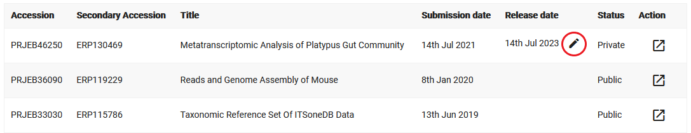

=====================
Data Release Policies
=====================

How Is Data Release Managed?
----------------------------

Data release is controlled from the level of study objects.
When a study is made public, all samples, experiments, runs and analyses associated with it are also made public.
For an explanation of these terms and their relationships, please read the
`Metadata Model <../submit/general-guide/metadata.html#metadata-model>`_ page.

Can I Advance/Postpone The Release Date?
----------------------------------------

Yes. You can edit the release date of a study from within your Webin account, provided it is private and has never been
public.

First, log into `Webin Portal <https://www.ebi.ac.uk/ena/submit/webin/>`_.
Click the 'Studies Report' button and find the study you wish to change the release date for.
Use the pencil icon next to the study to bring up a dialog which will allow you to set a new release date.
You can move the date to be sooner or later as required.
When making the date later, the new date cannot be more than 2 years beyond the current date.

When you are ready to release your study, you should do it by changing the release day to the present date.

Once the release date has elapsed, you can no longer change the visibility of your data yourself.
See `My Data Were Released Earlier Than I Intended — What Can I Do?`_ if this has already happened.

I Released My Study, Why Can't I Find It In The Public Database?
----------------------------------------------------------------

Release is not instantaneous, and the two archives update on different timescales:

- **ENA Browser**: allow up to 48 hours for your data to become searchable.
- **GenBank**: allow four days, as the record must first be exchanged with the INSDC partners.

Please take this into consideration if you have a strict deadline by which your data must be public.
Note that the processes which are taking place in this time are automated, and ENA cannot intervene to
expedite the release of your data.

If after 48 hours your data remain private in the ENA Browser, please contact the ENA
`helpdesk <https://www.ebi.ac.uk/ena/browser/support>`_.

If your data are public in ENA but the corresponding record has still not appeared in GenBank several days later,
contact the ENA helpdesk as well: ENA and GenBank records are exchanged between the archives, and a record which has not appeared
after that point may indicate a validation or transfer problem rather than normal delay.

My Study Is Public, But The Browser Says There Is No Public Data Associated With It
-----------------------------------------------------------------------------------

This message on the study page can be misleading.
Check the study's 'Related Records' section, and for assemblies also check the 'WGS files' section.

The most common cause is searching by the wrong accession.
For each submission, Webin reports an analysis accession (ERZ...) which is used to track post-submission processing.
An ERZ accession may or may not be released with your submission and is not the accession to search by.
Submissions which complete processing receive public accessions, such as GCA... for a genome assembly or contig
accessions for sequences, and these are the accessions which become publicly searchable.
Look for your data using the public accessions.

Allow up to 48 hours after release for all elements to appear while processing and indexing complete.
If your data are still not available by their public accessions 72 hours after release, please contact the ENA
`helpdesk <https://www.ebi.ac.uk/ena/browser/support>`_.
For the accessions issued by each submission type, see
`Analyses And Accessions <../submit/general-guide/analysis-accessions.html>`_.

If My Study Is Already Public, Will New Data I Submit To It Become Public Automatically?
----------------------------------------------------------------------------------------

Yes.
Data submitted to a study which is already public will become publicly visible once submission processing completes.
This applies to the sample records referenced by the new data as well as to the data themselves.
If you need the new data to remain confidential, submit them to a separate private study instead.

Can I Make My Study Partially Available?
----------------------------------------

Unfortunately, ENA does not support making only part of a submission available or restricting access to selected users.

ENA's policy is that submissions must be made available in full and be accessible to all users.

If your study contains data that you no longer wish to release, please contact the ENA `helpdesk <https://www.ebi.ac.uk/ena/browser/support>`_ for assistance.

Can I Remove A Study After Submitting It?
-----------------------------------------

Yes, but what is possible depends on whether the study has been released.

**Not yet public** — the records can be cancelled on request, and this is a routine correction.

**Already public** — ENA's policy is that data released into the public domain should remain public. In limited
circumstances a record can be suppressed, and a curator assesses each request. Note that data which are public for
even a short time may already have been mirrored to the other INSDC partners or picked up by downstream services that
ENA does not control.

Both routes, what to put in your request, and the guidance for individual object types are covered in
`Removing and Suppressing Data <suppression.html>`_.
The circumstances in which suppression is considered are listed under
`What Do The Data Availability Statuses Mean?`_.

My Data Were Released Earlier Than I Intended — What Can I Do?
--------------------------------------------------------------

Release dates cannot be changed once they have elapsed, and data cannot be made private again by editing the study.

Where data were released earlier than intended — for example because a release date was set incorrectly, or was not
extended in time — temporary suppression may be possible.
Contact the ENA `helpdesk <https://www.ebi.ac.uk/ena/browser/support>`_ with the accessions, the reason the data need to be
removed from public access, and the new release date you require.
Once that date is reached the data will be re-released automatically, so contact the ENA helpdesk in good time if the date needs to
change again.

See `Removing and Suppressing Data <suppression.html>`_ for what suppression does and does not achieve.

What Do The Data Availability Statuses Mean?
--------------------------------------------

INSDC records carry one of six availability statuses:

- **Public** — fully available. Either submitted with no confidentiality request, or the release date has been reached.
- **Private** — not available by any route. A release date is recorded, and the data are released automatically on
  that date, or earlier if cited online or in a publication.
- **Permanently suppressed** — found to be incorrect with no prospect of correction. Removed from search but still
  retrievable by accession, and not expected to be re-released.
- **Temporarily suppressed** — released before the submitter intended. Removed from search but still retrievable by
  accession, and re-released on publication or on an agreed date.
- **Replaced** — superseded by new data under new accessions. The original accession usually redirects to the new
  record.
- **Withdrawn** — not available publicly by any means. Reserved for rare cases such as a release date ENA applied
  incorrectly, submission without the rightful owner's permission, non-consented human data, or fraud.

Note that suppression and withdrawal remove data from ENA, but cannot recall copies already distributed to the INSDC
partners or downstream services.

See `Data Availability Policy <../submit/general-guide/data-availability-policy.html>`_ for the full definitions,
including the specific causes recorded against each status.
