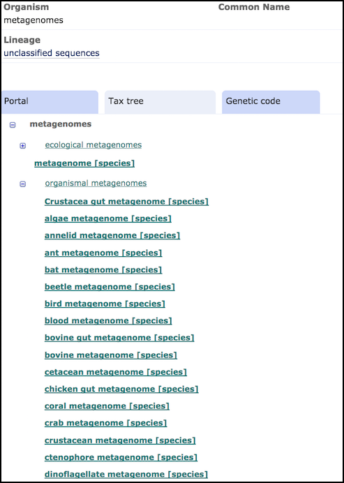

========================
Sample Taxonomy
========================

# TODO: Change the intro to Q&A format

The classification system for source biological organisms for all INSDC records is the NCBI Taxonomy and is available
from the `ENA browser <https://www.ebi.ac.uk/ena/browser/view/Taxon:9606>`_.
The ENA team work alongside taxonomists at NCBI to ensure that all ENA records display the accepted organism name and
classification hierarchy.
NCBI Taxonomy covers the complete tree of life and also includes other types, such as synthetic constructs and
environmental samples.
However, it is an incomplete classification system in that it only considers taxa for data that are represented in INSDC
records.
Users should note that taxa are only displayed if at least one associated ENA record is available.

Which Taxonomy Should I Use For My Samples?
-------------------------------------------

Submitted organism names must be at ‘species’ rank.
This rank type does not automatically mean the name is a published binomen (e.g. *Homo sapiens*): it is simply a rank,
which differentiates the sequenced organism from another.
For example, unidentified strains of the same bacterial genus should be kept as separate species, rather than binned
together under the same genus name.

.. tip::
    A `binomial <taxonomy.html#checking-a-taxon-is-binomial>`_ taxonomy ID should be used in most cases, and is highly recommended.
    A binomial taxonomy ID is **required** when submitting a 'clone or isolate' genome assembly. If your sample has been identified
    to species-level rank, but is not yet a published binomen, a placeholder taxonomy ID may be used.
    A `placeholder <../submit/samples/taxonomy-requests.html#unidentified-novel-organisms>`_ taxon ID is classed as a binomial taxon ID for data submission purposes.

If your sample cannot be identified using a binomial taxon ID, an environmental biome-level or organism-level
taxonomy ID can be used.

When registering your samples using the interactive `Webin Portal <https://www.ebi.ac.uk/ena/submit/webin>`_
you will need to enter a valid species rank taxon in your template spreadsheet.

Programmatic submitters will apply the taxonomic information to the sample object using the sample_name block:

.. code-block:: xml

    <SAMPLE_NAME>
      <TAXON_ID>450267</TAXON_ID>
      <SCIENTIFIC_NAME>Chlamyphorus truncatus</SCIENTIFIC_NAME>
      <COMMON_NAME>Pink fairy armadillo</COMMON_NAME>
    </SAMPLE_NAME>

If you do not know the scientific name or the common name that you would like to use for your submission but you
have an idea, you can use this *suggest* endpoint for the ENA taxonomy service:

.. code-block:: bash

   www.ebi.ac.uk/ena/taxonomy/rest/suggest-for-submission/

For example, using curl or pasting the URL in the browser for "curry" looks as follows:

Link:
  http://www.ebi.ac.uk/ena/taxonomy/rest/suggest-for-submission/curry

.. code-block:: bash

   > curl "http://www.ebi.ac.uk/ena/taxonomy/rest/suggest-for-submission/curry"
   [
     {
       "taxId": "159030",
       "scientificName": "Murraya koenigii",
       "displayName": "curry leaf"
       "binomial" : "true"
     },
     {
       "taxId": "261786",
       "scientificName": "Helichrysum italicum",
       "displayName": "curry plant"
       "binomial" : "true"
     }
   ]

As shown, some species have common names ("displayName") in addition to their scientific name.
This makes it possible to search for such names with common English names like 'dog' or 'human':

Link:
  https://www.ebi.ac.uk/ena/taxonomy/rest/suggest-for-submission/dog

.. code-block:: bash

   > curl "https://www.ebi.ac.uk/ena/taxonomy/rest/suggest-for-submission/dog"
   [
     {
       "taxId" : "9615",
       "scientificName" : "Canis lupus familiaris",
       "commonName" : "dog",
       "displayName" : "dog"
       "binomial" : "true"
     }
   ]

Checking a taxon is submittable
~~~~~~~~~~~~~~~~~~~~~~~~~~~~~~~

If you know the taxon you would like to use, you can check if it is submittable and find any additional information
about it, including if it is **binomial**, by using one of the following urls:

.. code-block:: bash

   www.ebi.ac.uk/ena/taxonomy/rest/scientific-name/

   www.ebi.ac.uk/ena/taxonomy/rest/any-name/

   www.ebi.ac.uk/ena/taxonomy/rest/tax-id/

Checking a taxon is binomial
~~~~~~~~~~~~~~~~~~~~~~~~~~~~

We recommend that you use a binomial taxonomy ID for your sample registration. A binomial sample taxon ID is **required**
if you plan to submit 'clone or isolate' genome assembly data. If a suitable binomial taxonomy ID does not exist, you can
request a `placeholder <../submit/samples/taxonomy-requests.html#unidentified-novel-organisms>`_ taxon ID. For cases where your sample
cannot be identified using a binomial taxonomy ID, an `environmental sample <#what-taxonomy-should-i-use-for-environmental-samples>`_ can be registered.

For example, using curl or pasting the URL into your browser for *Canis lupis familiaris* looks as follows:

Link:
  https://www.ebi.ac.uk/ena/taxonomy/rest/scientific-name/canis%20lupus%20familiaris

.. code-block:: bash

   > curl "https://www.ebi.ac.uk/ena/taxonomy/rest/scientific-name/canis%20lupus%20familiaris"
   [
     {
      "taxId" : "9615",
      "scientificName" : "Canis lupus familiaris",
      "commonName" : "dog",
      "formalName" : "true",
      "rank" : "subspecies",
      "division" : "MAM",
      "lineage" : "Eukaryota; Metazoa; Chordata; Craniata; Vertebrata; Euteleostomi; Mammalia; Eutheria; Laurasiatheria; Carnivora; Caniformia; Canidae; Canis; ",
      "geneticCode" : "1",
      "mitochondrialGeneticCode" : "2",
      "submittable" : "true"
      "binomial" : "true"
     }
   ]

Please see our `guide on exploring taxonomy <../retrieval/programmatic-access/taxon-api.html>`_ for more advice on
exploring our taxonomy services programmatically.

What Taxonomy Should I Use For Environmental Samples?
-----------------------------------------------------

Every sample object in ENA must have a taxonomic classification assigned to it. There are specific taxonomic IDs which
may be used for environmental samples, which may be broadly classified into biome-level taxonomy IDs and organism-level
taxonomy IDs.

Environmental Biome-Level Taxonomy
~~~~~~~~~~~~~~~~~~~~~~~~~~~~~~~~~~

Environmental biome-level samples can not be described with a single organism identifier because they represent an environment
with an unknown variety and number of organisms. For this purpose there are entries in the Tax Database that apply exclusively to
environmental biome-level samples.

Biome-level environmental taxa can be immediately identified as they contain the term "metagenome" as part
of the scientific name. These are searchable within the Tax Database using the same methods described above.

.. code-block:: bash

   curl "https://www.ebi.ac.uk/ena/taxonomy/rest/suggest-for-submission/marsupial%20meta"
   [
     {
       "taxId": "1477400",
       "scientificName": "marsupial metagenome",
       "displayName": "marsupial metagenome"
       "binomial" : "false"
     }

If you are submitting a metagenomic sample (e.g. for metagenomic reads) there are numerous metagenomic taxa. To view all
environmental metagenome taxonomy available please visit the
`"metagenomes" tax node <https://www.ebi.ac.uk/ena/browser/view/408169?show=tax-tree>`_.
Click the arrows to expand lineages:

The metagenomic term that is used to describe the biome is also the scientific name of the chosen taxon and can be used
to find the tax ID in the same methods described above.
For example, you can find the tax ID for *termite fungus garden metagenome* here:

.. code-block:: bash

   www.ebi.ac.uk/ena/taxonomy/rest/scientific-name/termite fungus garden metagenome

Please note that new metagenome taxonomic records are rarely added, particularly those that add granularity.
Please use the closest available choice, even if this is a less granular option.
Only request a new term if you are sure you are unable to use anything in the lists available.

Environmental Organism-Level Taxonomy
~~~~~~~~~~~~~~~~~~~~~~~~~~~~~~~~~~~~~

If you are submitting assembled/annotated sequences which are identified taxonomically from homology alone with no prior
culturing or isolation of the organism, this is considered an *environmental sample*.
As an example, these may have been produced by 16S amplification of a metagenomic sample. These samples should be registered
with a suitable taxonomy to make it clear they were derived from an environmental source.
A typical use-case of this would be the submission of a single fully assembled genome from a mixed DNA sample (i.e.,
from a metagenomic source).

Exceptions to this group include organisms which can be reliably recovered from their diseased host (e.g. endosymbionts,
phyoplasmas) and organisms from samples which are readily identifiable by other means (e.g. cyanobacteria).
Such organisms are not considered in the way described here.

The taxonomy used for environmental organism-level samples should have an identification which is as granular as possible.
A general environmental record should also be registered to describe the biome that was originally sequenced.
This biome-level environmental sample should also be referenced within the organism-level sample using the "sample
derived from" attribute. The metadata structure for metagenomic submissions is described `here <../../assembly/metagenome.html>`_.
If you are unsure whether your sample should be
registered as environmental, contact our `helpdesk <https://www.ebi.ac.uk/ena/browser/support>`_ for assistance.

When registering an environmental organism-level sample, more granular identification is preferred, up to genus level.
A non-binomial genus-level taxonomy with a species epithet can be used, for example:

::

    Escherichia sp.
    Bacillus sp.
    Thermococcus sp.

For fungi, the 'sp.' is dropped:

::

    uncultured <Rank>
    uncultured Glomus
    uncultured Saccharomycetes

If a more granular identification can not be used, a Family or Order level taxon id may also be used, for example:

::

    Neisseriaceae bacterium  (taxid:2014784)
    Spirochaetaceae bacterium  (taxid:1898206)
    Pleosporales sp. enrichment culture  (taxid:1836897)
    Filobasidium mucilaginum  (taxid:2877763)

Do I Need To Request A New Taxon?
---------------------------------

Not if the name is already in the taxonomy database — use the existing taxon ID and continue with your submission.

This also applies where the name you want is recorded as a **synonym** of an existing entry rather than as its primary
name: the existing taxon ID covers it, and no new entry will be created.
Searching for your name in the taxonomy database returns the entry it is a synonym of.

Request a new taxon only where no existing entry covers your organism.
If an entry exists but is wrong, that is a correction rather than a new request.

Note that submitted organism names must be at **species rank**. This does not mean the name has to be a published
binomen: it is a rank, distinguishing the sequenced organism from another. Unidentified strains of the same bacterial
genus should be kept as separate species rather than binned together under the genus name.

My Organism Is Unidentified Or Only Known To Genus Level — What Do I Use?
--------------------------------------------------------------------------

A genome submission requires a submittable name at species rank.
Genus-level names such as ``Genus sp.`` on their own, and uncultured names which are not present in NCBI Taxonomy,
cannot be used for genome submissions.

Where the organism cannot be confidently assigned to an existing species, request a new taxon using an informal name of
the form ``<Genus> sp. <identifier>``, where the identifier is unique to the culture — a strain or voucher ID of at
least three characters, such as ``Bacillus sp. ABC123``.
The informal name can be updated to a formal one once the species is described and published.

Naming rules differ by organism category, and there are separate conventions for prokaryotes, eukaryotes, environmental
samples, cyanobacteria, synthetic sequences, viruses and endosymbionts.
See `Requesting New Taxon IDs <../submit/samples/taxonomy-requests.html>`_.

How Do I Request A New Taxon Name?
------------------------------------

Requests are made through the `Webin Portal <https://www.ebi.ac.uk/ena/submit/webin>`_ using the 'Register taxonomy'
option, not by email to the helpdesk.
Enter names one at a time with the form, or use the spreadsheet option for many names at once.

Submit all your names as a **single** request: multiple separate requests may be rejected.
Once ENA has reviewed the request it goes to the taxonomy service, and after the names are added they are indexed in
the submission tools within two days.

For the full process and the naming rules for each organism category, see
`Requesting New Taxon IDs <../submit/samples/taxonomy-requests.html>`_.

An Existing Taxon Is Wrong — Can It Be Corrected?
-------------------------------------------------

Where an entry already exists but is incorrect, request a correction rather than a new taxon.
This covers a misspelled or outdated scientific name, a synonym which should be recorded against an existing entry,
two entries which describe the same organism and should be merged, and an incorrect lineage placement.

Send the request through the `Webin Portal <https://www.ebi.ac.uk/ena/submit/webin>`_ or our
`helpdesk <https://www.ebi.ac.uk/ena/browser/support>`_, and include:

- the taxon ID and current name of the affected entry;
- the change you are asking for, stated precisely;
- supporting references, where the change follows a published revision.

Corrections are reviewed by ENA staff and passed to the NCBI Taxonomy curators, who maintain the database on behalf of
all INSDC partners.
Because the change is made externally, corrections take longer to complete than the addition of a new name, and the
outcome is decided by the taxonomy curators rather than by ENA.
