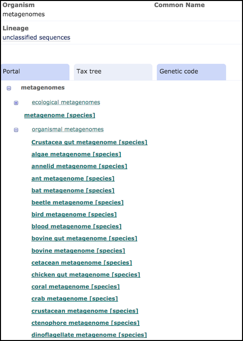

========================
Requesting New Taxon IDs
========================

All submissions to INSDC databases must be classified against the NCBI Taxonomy database.
Entries in the Taxonomy database have integer taxon IDs and are visible in the ENA browser alongside their full lineage
and available data (e.g. human Tax ID is `9606 <https://www.ebi.ac.uk/ena/browser/view/Taxon:9606?show=tax-tree>`_).
This database covers the complete tree of life, as well as viruses, synthetic constructs and metagenomic taxa.
However, it is incomplete in that it only considers taxa which are already represented in INSDC records.
In addition, taxa are only displayed if at least one public INSDC record is available.

Below you will find information on what taxon names are submittable.
Following this is a guide to creating taxon requests, including domain-specific advice on how names for different
species should be formed.

- `Submittable Organism Names`_
- `Creating Taxon Requests`_

Submittable Organism Names
==========================

Submitted organism names must be at 'species' rank, though not every species-rank name is submittable.
This rank type does not automatically mean the name is a published binomen (e.g. *Homo sapiens*): it is simply a rank,
which differentiates the sequenced organism from another.
For example, unidentified strains of the same bacterial genus should be kept as separate species, rather than binned
together under the same genus name.

To check for the availability of a name, please refer to the advice in the `Tips for Sample Taxonomy <taxonomy.html>`_
section.

If the name is not already available, you will need to request its addition, the process for which is described below.

Creating Taxon Requests
=======================

If you wish to request a new taxon name visit the `Webin Submissions Portal (WSP)<https://www.ebi.ac.uk/ena/submit/webin>`_
and choose the 'Register taxonomy' option.

The 'Register using form' option allows you to enter names one-by-one along with a category and description.
The proposed names are automatically checked against the taxonomy database and only those not already present will be
submittable.
Those already present are shown alongside their taxon ID to aid you with submission.

For submissions of many names, the 'Register using spreadsheet' option is recommended.
Download a copy of the template spreadsheet and fill it out in accordance with the guidance provided in the WSP
interface.
Do not alter the spreadsheet headings or add new ones, and use only ASCII characters.
When this spreadsheet is complete, save it and return to the interface to upload and submit your taxon request.

If you have multiple names to request, please do this as a single request: submissions of numerous requests
instead of one multi-name request may be rejected at the discretion of helpdesk staff.
Once your request is received, it will be reviewed and sent to the taxonomy service.
You will be contacted again by ENA staff to let you know the names have been added, or else to request corrections,
changes, or clarifications.
Once this process is complete, the name will be indexed within our submission tools within 2 days and you can then
continue your submission.

Author citations should not be included in scientific names.
Exceptions to this are only made where there are ambiguities between different nomenclature codes, e.g. *Agathis
montana Shest. 1932* and *Agathis montana de Laub. 1969* refer to an insect and a plant, respectively.

Below are further rules specific to different categories of organism which should be adhered to when requesting new
taxon names.

- `Unidentified/Novel Organisms`_
    - `Prokaryotes`_
    - `Eukaryotes`_
- `Environmental Samples`_
- `Cyanobacteria`_
- `Synthetic Sequences`_
- `Viruses`_
- `Endosymbionts`_

Unidentified/Novel Organisms
----------------------------

An informal name is used when the organism being submitted has not been identified to a specific name, or when a novel
species name has not been published.
The informal name can later be updated to a formal name, when the species is identified and appears in the literature.
Creating an informal name is simple enough, and is often done in the format of <Submitter Initials>-<Year>, e.g.
SH-2020.
Below is further advice specific to prokaryotes/eukaryotes.
Taxonomy is not simple and can be subject to many caveats and exclusions, and NCBI Taxonomy may make changes or provide
feedback on a name.

Prokaryotes
___________

If the genus is known but the species is novel or unidentified, please use the following format, where *identifier* is
something unique to the culture, such as a strain/voucher ID, and is at least 3 characters long:

::

    <Genus> sp. <identifier>
    Bacillus sp. ABC123
    Thermococcus sp. DEF456

If the genus is new, please include its full lineage so it can be placed appropriately.

If the genus is unknown, please use the name of the highest known taxonomic rank, followed by the relevant descriptor
(*bacterium* or *archaeon*), followed by the identifier:

::

    <Rank> <bacterium or archaeon> <identifier>
    Bacillaceae bacterium ABC123
    Thermococcales archaeon DEF456

Note that if you are publishing a novel species, each strain of the proposed species should be given a unique informal
name.
Only after publication will the individual records be merged and renamed as the formal name.

Cyanobacteria should always be submitted with the strain appended, even when the species epithet is provided.

NCBI Taxonomy no longer adds prokaryotic binoma with the strain appended, in the form:

::

    <Genus> <species> <strain>

If you wish to classify your submission this way, add the strain as a separate piece of sample metadata when submitting
to us.

Eukaryotes
__________

Higher organisms are treated similarly to prokaryotes, but the term 'sp.' is applied no matter which taxonomic rank is
being used.
If multiple strains/isolates/samples are identified to be from teh same unidentified or novel species, they should be
grouped as a single taxonomic name.
For example, if three strains of *Candida* (ABC, DEF, and GHI) are identified as being from the same species, they
should be given a single informal name to act as a placeholder.
It is recommended that this be a number, followed by an author's initials and the year.

+-------------------+--------------------------------------------------------------------------------------------------+
| Informal Name     | Informal Groupings                                                                               |
+===================+==================================================================================================+
| Candida sp. ABC   |                                                                                                  |
+-------------------+                                                                                                  |
| Candida sp. DEF   |     Candida sp. 1 SH-2020                                                                        |
+-------------------+                                                                                                  |
| Candida sp. GHI   |                                                                                                  |
+-------------------+--------------------------------------------------------------------------------------------------+
| Candida sp. JKL   |                                                                                                  |
+-------------------+     Candida sp. 2 SH-2020                                                                        |
| Candida sp. MNO   |                                                                                                  |
+-------------------+--------------------------------------------------------------------------------------------------+
| Candida sp. PQR   |                                                                                                  |
+-------------------+                                                                                                  |
| Candida sp. STU   |     Candida sp. 3 SH-2020                                                                        |
+-------------------+                                                                                                  |
| Candida sp. VWX   |                                                                                                  |
+-------------------+--------------------------------------------------------------------------------------------------+

If you are requesting a binomen which is already mentioned in published literature but has not been added to the
database, then simply submitting this name with a paper reference will be sufficient.

Environmental Samples
---------------------

If you are submitting a metagenomic sample (e.g. for metagenomic reads) there are numerous metagenomic taxa.
You should use one of these for this purpose: visit the `"metagenomes" tax node
<https://www.ebi.ac.uk/ena/browser/view/Taxon:408169?show=tax-tree>`_, and use the arrow icons to expand the categories.

Use most appropriate environmental name for your metagenome.
New names under this node are added only rarely and you should use the closest available choice.
Only request a new name of this type if you are unable to use anything listed.

If you are submitting assembled/annotated sequences which are identified from homology alone with no prior culturing or
isolation of the organism, this is considered an *environmental sample*.
As an example, these may have been produced by 16S amplification of a metagenomic sample.
Exceptions to this group include organisms which can be reliably recovered from their diseased host (e.g. endosymbionts,
phyoplasmas) and organisms from samples which are readily identifiable by other means (e.g. cyanobacteria).
Such organisms are not considered in the way described here.

Environmental samples are usually prefixed with the term *uncultured* and are not allowed to have a species epithet.
Some examples of basic organism names that can be used include:

::

    uncultured bacterium  (taxid:77133)
    uncultured archaeon  (taxid:115547)
    uncultured cyanobacterium  (taxid:1211)
    uncultured prokaryote  (taxid:198431)
    uncultured fungus  (taxid:175245)
    uncultured eukaryote  (taxid:100272)

More granular identification is preferred, up to genus level.
For prokaryotes the format is:

::

    uncultured <Rank> sp.
    uncultured Bacillus sp.
    uncultured Thermococcus sp.

For fungi, the 'sp.' is dropped:

::

    uncultured <Rank>
    uncultured Glomus
    uncultured Saccharomycetes

Cyanobacteria
-------------

Cyanobacteria taxonomy is very complex and so the strain or culture collection identifier is always captured as part of
the organism name, whether or not it is identified at species level.

::

    Nostoc punctiforme PCC 73102
    Chroococcidiopsis sp. SAG 2025

Synthetic Sequences
-------------------

Synthetic sequences, such as cloning and expression vectors, can use one of the relevant taxa:

::

    synthetic construct (taxid:32630) [uses translation table 11]
    eukaryotic synthetic construct (taxid:111789) [uses translation table 1]
    synthetic construct (code 6) [uses translation table 6]

Alternatively, a unique name can be requested.
In such cases, a name is formed from the type of construct and a unique identifier.
Some real examples of this:

::

    Cloning vector pNICO
    Expression vector pTEV5
    Site-specific excision vector pFLPe4

Viruses
-------

Viruses do not fit well into biological classification systems and do not follow the format of binomial nomenclature.
Instead, descriptive names are formed, usually referencing the host or disease.

NCBI Taxonomy will accept isolate names for well characterized isolates, isolates with commercial interests, or
those with biological and medical implications.
Certain viruses, specifically those involved in human health, should be named in accordance to known standards where
metadata such as strain, host and serotype, are included in the taxon name.
Some examples:

::

    HIV-1 CRF02_AG:08GQ032
    Norovirus 13-BH-1/2013/GII.17
    Norovirus 16-G0188/Ger/2016
    Norovirus groundwater/GII.17/61/2010/KOR
    Sapovirus Sewage/Toyama/Fu-Feb/2010/JP
    Sapovirus Hu/Toyama/Jan3519/2013/JP

However, note that this explicitly excludes Influenza: NCBI Taxonomy will no longer add new isolates for Influenza.
A paper was published to explain this decision and is available at https://doi.org/10.7287/peerj.preprints.3428v1

Endosymbionts
-------------

Endosymbionts live within the cells of their host organisms and cannot usually be cultured outside the host.
Although technically uncultured according to our terminology, they are exempt from the treatment of other environmental
samples.
Naming is usually in the format: "<type> endosymbiont of <host>".
Some real examples:

::

    endosymbiont of Acharax sp. [taxid:568145]
    bacterium endosymbiont of Donacia thallassina [taxid:742888]
    Wolbachia endosymbiont of Drosophila recens [taxid:214475]
    Rickettsia endosymbiont of Camponotus sayi [taxid:359403]