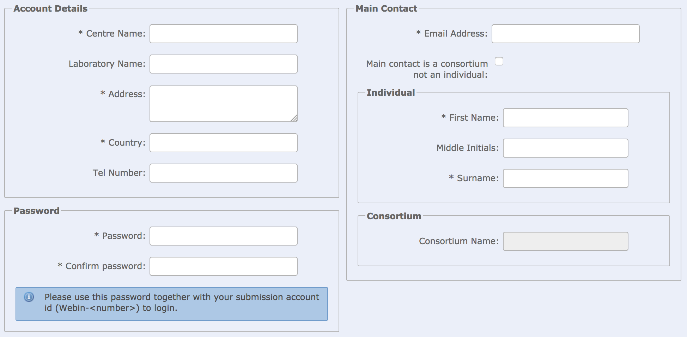
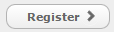
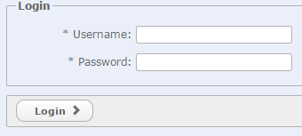

# Register a Submission Account

Before you can submit data to ENA, you need to register for a Webin submission account.
If you already have an account and have difficulties logging in please contact datasubs@ebi.ac.uk.

1. Navigate to the [Interactive Webin](https://www.ebi.ac.uk/ena/submit/sra/#home) submission service page.

2. Click the  button.
..
3. Fill in the required details. Other contacts can be added after your account has been created.

4. Click the register button to register your account.

5. After registration you can log into Webin with your username and password. Please note that after registration you will be logged in automatically.

6. You can add more contacts by expanding My account details on the Home page.

