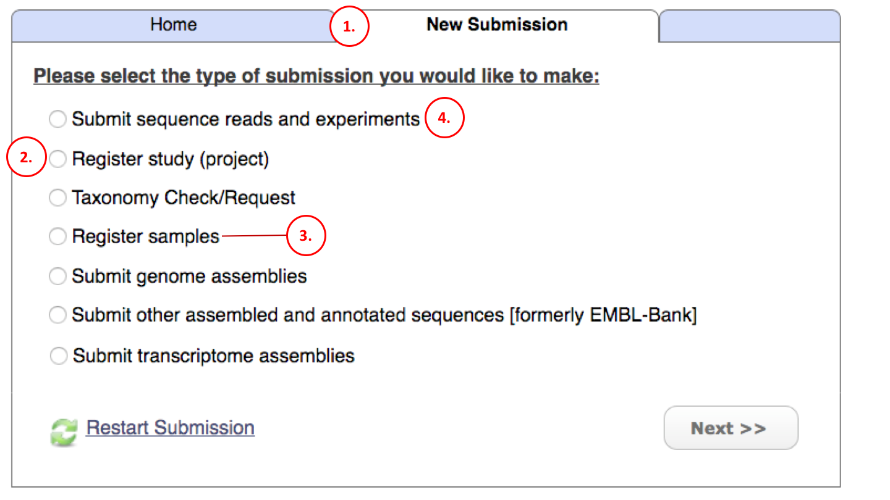

Module 1: Interactive Submission Options
****************************************

Introduction
============

| This guide will introduce you to submitting data interactively through your browser.
| Please refer to the `contents page <index.rst>`_ for guidance on submitting programmatically or via command line

Production and test services
============================

There are two interactive Webin submission services. One for test submissions
and another for production submissions:

- Test service URL: https://wwwdev.ebi.ac.uk/ena/submit/sra
- Production service URL: https://www.ebi.ac.uk/ena/submit/sra

The test service is recreated from the full content of the production service every day at
03.00 GMT/BST. Therefore, any submissions made to the test service will be removed
by the following day.

It is advisable to first test your submissions using the Webin test service before
using the production service.

Registration
============

If you have not submitted to Webin before please `register a submission account <reg_01.html>`_.

Submitting
==========

You can use one of the following submission options:

The circled numbers in the image correspond to the numbered items below that provide further details for each submission option.

1. Log in using your webin submission account credentials and go to the **New Submission** tab.
2. Use the **Register study (project)** option to register new studies used to group submitted information together.
   Module 2_ describes this step in more detail.
3. Use the **Register samples** option to register new samples used to describe the sequenced source material.
   Module 3_ describes this step in more detail.
4. Use the **Submit sequence reads and experiments** option to submit sequence reads with associated experimental information.
   You can register a study and samples as part of this workflow but we recommended that you pre-register your study and samples.
   Note that you must first upload your sequence read data files into your private Webin upload area (see `Data Upload <upload_01.html>`_)
   before the files can be submitted here. Module 4_ describes this step in more detail.
5. Use the **Submit genome assemblies** option to submit assembled genomes. You can register a study and samples as part of this workflow
   but we recommend that you pre-register your study and samples.  Note that you must first upload your genome assembly data files
   into your private Webin upload area (see `Data Upload <upload_01.html>`_) before the files can be submitted here.
   Module 6_ describes this step in more detail.
7. Use the **Submit other assembled and annotated sequences** option to submit coding genes, rRNA sequences and other
   annotated sequences. More information about this step is available `here <https://www.ebi.ac.uk/ena/submit/sequence-submission>`_.
8. Use the **Taxonomy Check/Request** option to check that your samples have recognized taxonomic classifications
   or to register new ones. You must provide a taxonomic classification for each submitted sample.
   For more information about taxonomy there is a section in the FAQ_ that may be useful.

.. _2: mod_02.html
.. _3: mod_03.html
.. _4: mod_04.html
.. _6: mod_06.html
.. _FAQ: tax.html

Metadata model
=================

The full metadata model is described in `Metadata model <meta_01.html>`_.
