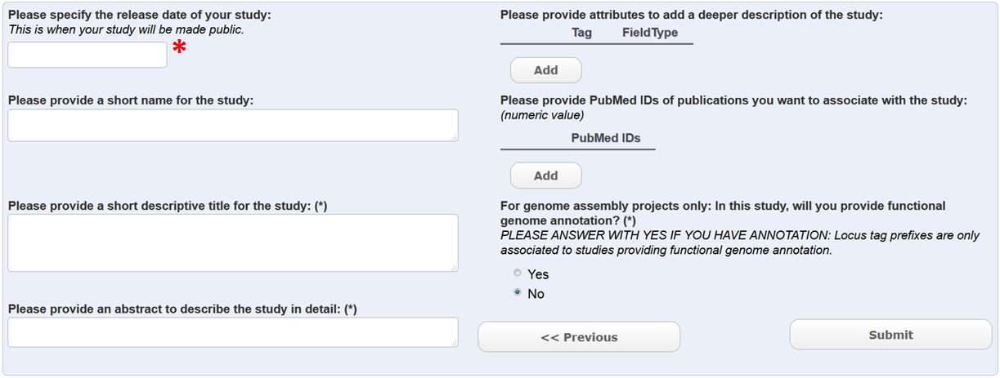

Module 2: Create a Project
**************************

This form is used to create a study object (see module 1_ to access this form). It is possible to create a study before any other data is added. Webin will report an accession id for the study that will look like this: PRJEB00000. This type of accession is typically used in journal publications. Data can be added to the study at any time – the location of the study in the ENA browser will stay the same. The study will not be visible in the ENA browser until the release date has expired (*). This means that the data linked to the study will not be visible until the study itself is visible.
Have a look at an `example <http://www.ebi.ac.uk/ena/data/view/PRJEB1234>`_ of a study in the ENA browser. 

.. _1: mod_01.html
