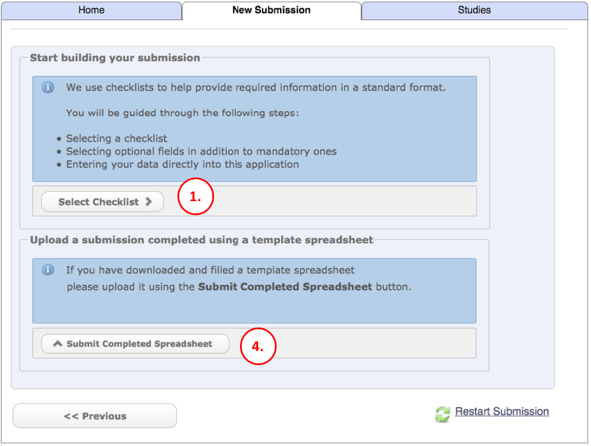
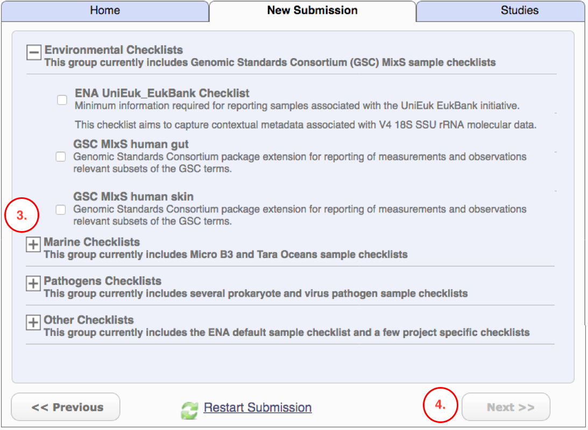
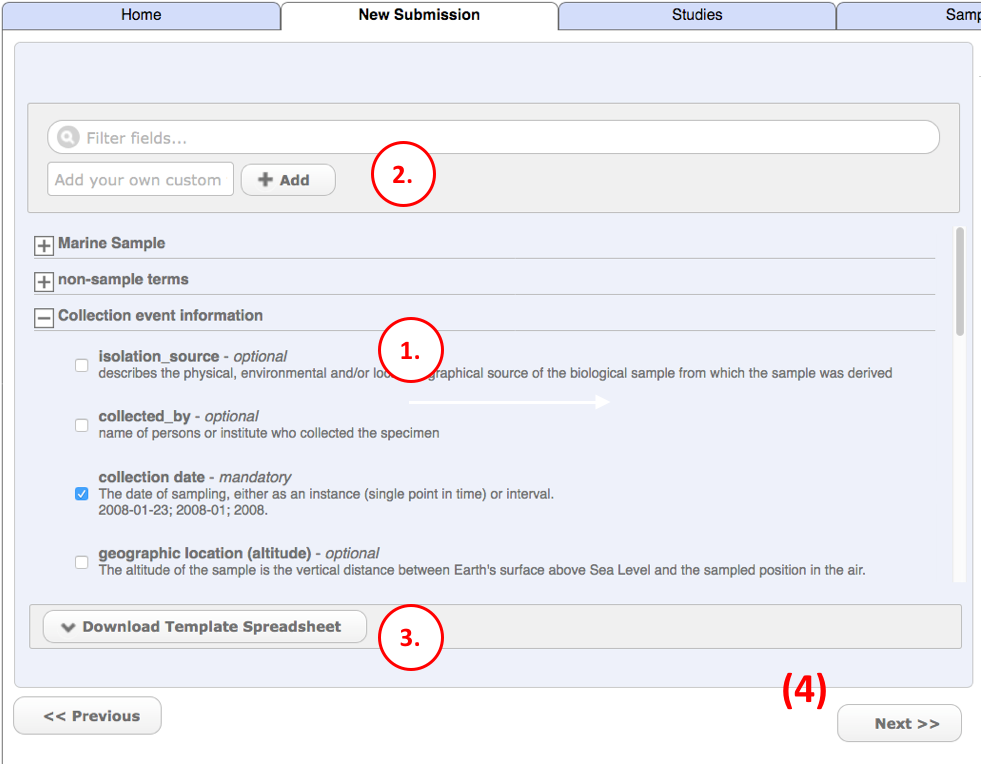
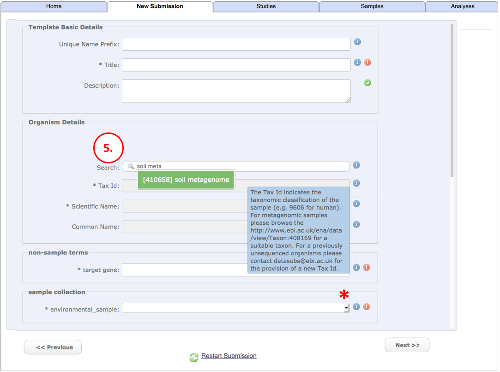

Module 3: Register a Sample
***************************

Samples represent the source material that a sequencing library was produced from. A sample may be connected to reads,
assemblies and various types of interpreted data. Samples add context to the data associated with them, and good sample
annotation makes your data more searchable.

There are three steps to registering your sample(s).

.. _Step 1:

Step 1: Select the sample checklist
===================================

Please see :ref:`Interactive Submission Options` for how to access this form.

ENA provides sample checklists which define a set of mandatory and recommended attributes for different types of samples.
By declaring that you would like to register your samples using a specific checklist you are enabling the samples to be
validated for correctness at submission time and are making it easier for other services to find and access the sample
attribute information.

1. Click 'Select Checklist' to move on to the next page and select a checklist.
2. If you have created your sample submission in a spreadsheet, click here to submit it, then go to `Step 3`_. Otherwise,
   ignore this.

3. Find a checklist that suits your type of sample.
4. Move on to `Step 2`_ to create the sample template.

.. _Interactive Submission Options: mod_01.html
.. _Step 2:

Step 2: Select the checklist fields
===================================

1. Here, you can view the attributes in your chosen checklist. You can see which are optional and which are mandatory.
2. You can add more attributes if there are important details not already covered by the checklist.
3. The checklist can be downloaded in a format which you can edit as a spreadsheet. We recommend this since it allows
   you to more easily register multiple samples in a single submission and is more durable than a web form.
   See `Step 1`_ to submit your spreadsheet.
4. Click next when you have finished customising your checklist.

5. In this form, enter any details which will be the same for all your Samples. They can be edited individually later.
   Click next when you have finished.

.. _Step 3:

Step 3: Edit and submit samples
===============================

.. image:: images/mod_03_p03.png

This screen allows you to edit samples individually. It is also where you will be directed if you submit via spreadsheet.

1. You can add more samples here to your submission here. They must use the same checklist.
2. All your samples are listed here. The unique name is shown, along with an icon to indicate whether it is valid or not.
   Click the red cross to delete a sample entirely.
3. Use these buttons to move between samples.
4. Provide descriptive names here. The Unique name cannot be changed after submission.
5. A green tick indicates that the field's content is valid, while a red cross indicates it requires your attention. Hover
   over the exclamation mark to see what should be entered.
6. Click here to download all the data you have submitted so far. This is useful if you have to stop halfway through your
   submission.
7. When all samples are complete, click here to submit. Webin will deliver accessions.

The samples you have just registered are not yet associated with a study. When you submit data, you will refer it to a
study and sample, thus indirectly linking the sample with a study. See our `Metadata Model <http://ena-docs.readthedocs.io/en/latest/meta.html>`_ for more information.
