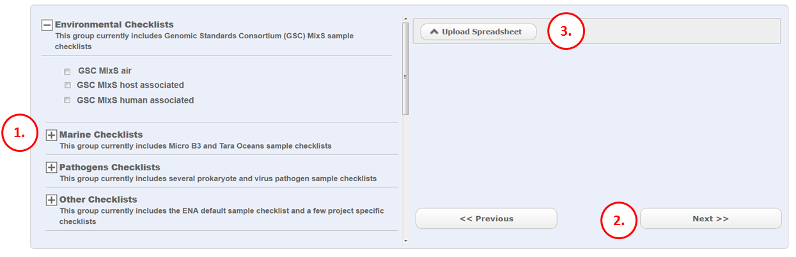
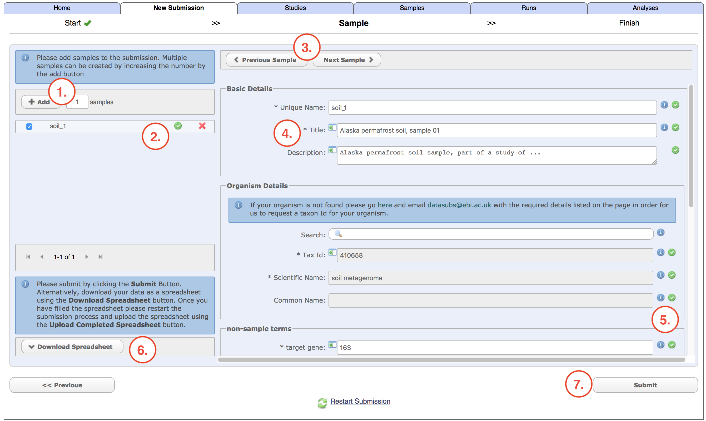

Module 3: Register Source Samples
*********************************

Part 1
======

This is the first (of 3) sample registration forms. See module 1_ if you do not know where to access this form.

1. Find a checklist that suits your type of sample. A checklist comprises of a list of attributes that are required to annotate your samples. A well annotated sample is more searchable in the ENA browser and your data will get more exposure.
2. Move on to the next sample step
3. Use this option if you have created your samples as a spreadsheet file from a previous session. This spreadsheet is a very specific format. You can obtain one in the next sample step …

.. _1: mod_01.html

Part 2
======

.. image:: images/mod_03_p02.png

This is the second (of 3) sample registration forms.

1. Take a look at the list of attributes on the left. Some will be mandatory, others are recommended. Every checked item in the list appears as a field on the right side of the form. Please select or deselect as appropriate. Remember that the more fields you can provide the more you are enabling your users to make accurate interpretations of your study.
2. You can create additional attributes that do not exist in the checklist. However in most cases you should find what you need among the default checklist fields.
3. The right side of the web form represents all samples as a template. Because this form represents all samples it is only worth entering fields that are consistent with all the samples. Also use the web form to look up taxonomic classifications which you will use later. Start typing your organism name to see the suggestions. Note that environmental taxonomic classifications can look like “soil metagenome” as opposed to a specific organism scientific name. You can also use the ‘i’ symbols to read definitions for each field, as well as checking the drop down options for the fields that have a controlled vocabulary (*).
4. The download template button will download a tab separated file which you can open using a spreadsheet program. It is highly recommended to use this to register your samples. Each row represents an individual sample. Please do not edit or remove the lines marked with hash ‘#’ and do not change the order of the columns as this will impede the re upload of the spreadsheet into the web form. Begin the first sample on the first row available
5. Step 5 is in parenthesis because in most cases you fill in the spreadsheet offline and log in again after you have completed it. The completed spreadsheet is loaded to the previous sample registration form (`Part 1`_ step 3) and this has the same effect as the ‘next’ button, to take you to the third and final sample registration form.

Part 3
======

This is the final (of 3) sample registration forms.  This form appears after uploading a spreadsheet into the form in `Part 1`_ step 3, or directly from the form in `Part 2`_ if you have not used a the spreadsheet file and intend to type directly into the webform

1. If you have uploaded a spreadsheet file, the number of rows correspond to the number of samples (you can skip this step). If you have not used a spreadsheet you can specify how many samples to create using the template you created in the second form
2. Add some basic sample group details. A sample group has limited functionality. It is a collection of samples that are created in the same submission event. The samples can be edited as part of the same group if necessary later on. It is not possible to move samples in or out of a group. The study object is used to group samples and other objects together in the public domain. 
3. The samples are loaded into the webform below these 2 buttons. You can check each one in the list by using these buttons to navigate one sample at a time.
4. Check if any fields are not accepted by the webform (where you see a red exclamation mark). Your values may not be valid because some fields are controlled.
5. This table is a summary of all samples. It can be large but you can move through the pages using the arrows (red asterisk in image). If all fields in a sample are accepted by the webform you will see a green tick under the ‘Valid’ column. If there are any red crosses, navigate to the sample in question (or click on that row in the table) and go back to step 4 to correct the invalid fields. If it is easier to correct the samples in your offline spreadsheet, do so and use the ‘previous’ button (red $ in image) two times to go back to the first form where you will see a red cross symbol next to the file name. Click on the cross and you will be able to re load the spreadsheet file.
6. Click submit if all samples in the table are validate (previous step). Webin will deliver accessions for each sample unless there is some problem/error. If there is an error you can go back to step 5 to correct the errors and then try again. If accessions are delivered, the samples are now in the ENA database. They will not be affiliated with any data or other objects. That happens in subsequent rounds of submissions. For the moment they are ‘free’.

