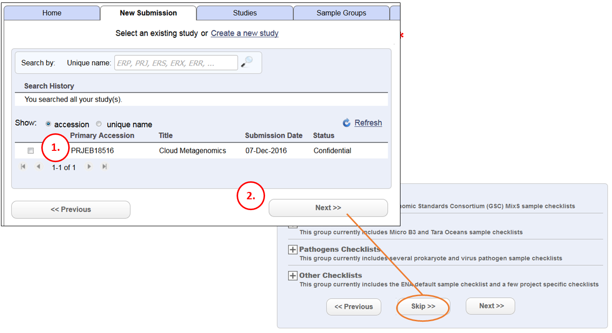
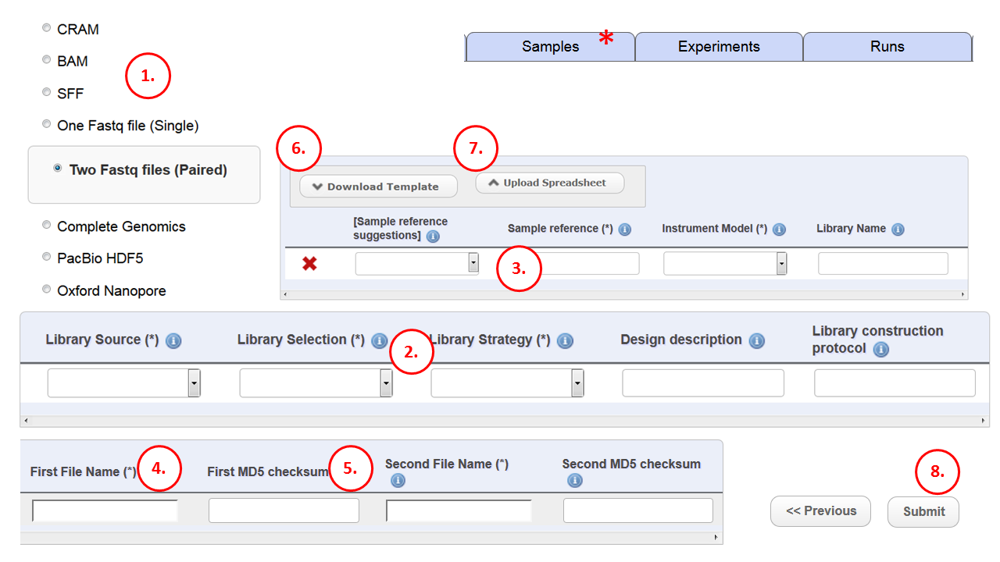

Module 4: Add Read files
************************

Part 1
======

This is the first page that you will come to when submitting runs and experiments (see module 1_). A run object is used to register a demultiplexed NGS read file (or pair of files) that you have uploaded (for example, Fastq, BAM, SFF, CRAM) to your ENA ftp directory. Without run objects the files can not be registered and archived. An experiment object represents a library solution used on the NGS machine. The experiment object will also link the run to the sample, and to the study.
 
1. Select the study that you will be adding the runs and experiments to. If the study that you want to submit to does not exist yet you can create one now (red asterisk). However it is best to split your submission up and create the study as part of an earlier session (see module 1_)
2. Click next to move to the next stage. The next stage is the sample generation stage. In most cases the samples will have already been generated (it is best to submit the samples in a separate submission so that the work is more divided). Find the ‘skip’ option to skip this step. If the samples do not exist, do not use the skip option, you can create some samples during this step (see module 1_ and module 3_)

.. _1: mod_01.html
.. _3: mod_03.html

.. _mod_04_part_02:

Part 2
======

This is the step for registering the files that you have uploaded to your personal ENA ftp directory. We need to wrap each file or pair of files into a run object, point that run to an experiment object, and point that experiment object to the correct sample.

.. image:: images/mod_01_p02.png
   :scale: 45
   :align: center

1. Choose the type of file that you are submitting. Note that in the case of paired runs there is a 2 x fastq file option. 
2. Any information you type into the webform will be lost if you log out before submitting. So you are highly recommended to download a tab separated spreadsheet file (step 6) and fill it in offline. First, note that some fields have drop down lists. Check the options in these so that you can apply them correctly into the spreadsheet when offline. 
3. Every row in the table represents one run and one experiment object and they need a source sample. The drop down for the sample column does not work in most cases so you should know how you have named them, or you can check by way of the sample tab (*). It is possible to give multiple runs the same source by repeating the sample id in multiple rows (for instance, in the case of a deep coverage experiment where multiple lanes have been used)
4. The file names correspond to the files that you have uploaded to your Webin ftp directory. Each run object gets matched with files which are separately uploaded. `Here <http://www.ebi.ac.uk/ena/about/sra_data_upload>`_ is a list of ways you can upload your files. File names should be written exactly as they appear in the ftp directory. For instance, FastQ files must be compressed and so will carry the extension “.gz” or similar. The extension should be included when referencing the files in this column.
5. The checksum is a fingerprint for the file. If the file is not 100% transferred we will only have a corrupted or truncated version which is of no use so we need to check that this has not happened. If the file checksum is different after the transfer we know there has been a problem, so you need to supply the checksum for the file before it is uploaded so that we can do this check. We will calculate the checksum of the uploaded file and then compare it with the one that you have provided. You can paste the checksum directly into this column. It will be a 32 character string. You can also put the 32 character string into its own file and upload this checksum file with the original file. The checksum file has to be named in a way that it can be recognised. It needs to have the same name as the original file PLUS the extension “.md5” (so for file XXX the md5 checksum should be in file XXX.md5). If you have uploaded a checksum file for each read file then you can leave this column blank. Do not write the checksum file name (file XXX.md5) into the field – Webin will report an error, that it is expecting a 32 character string. The Webin uploader tool automatically deposits an checksum file to your ftp directory for every file that upload so if you have used this tool leave the column blank. The Webin uploader tool uses Java applet technology which is generally being reduced or discontinued in browsers due to security risks so the uploader tool may not be an option depending on your environment. So how do you create your own checksum file? On a Linux machine it is easy, simply type (without the quotes, at the command line) “md5sum <file name>” and it will display a line formatted like this: <32 character md5sum><2 spaces><file name>. This is exactly the format our system will recognise if you create a checksum file so simply redirect (using ‘>’ symbol) the output to a checksum file: “md5sum file_name > file_name.md5”. Then upload this file along with the original one before you reach step 8. Apple Mac operating systems also have a similar checksum generator that you can use. It is also possible on a Windows operating system but you may have to download 3rd party software to do it. More info :ref:`here <newmd5>`
6. Any information that you type into the webform will be lost if you log out before submitting. Therefore you should download a template tab delimited spreadsheet file which you can open in a spreadsheet program like MS Excel. Once you have filled it in offline, log back in, return to this submission page and upload it (step 7). The other advantage of having an offline copy of your experiments and runs is that if there is a problem submitting the data you can send the spreadsheet file to ENA helpdesk and they can troubleshoot it for you.
7. Upload the completed spreadsheet file that you created in step 6. The web form should fill up with the data in your spreadsheet. You can do a preliminary check to see if some fields are not recognised (check the controlled drop down lists and that file names appear as expected). 
8. This is the final step. If errors are reported you can remove the loaded table (use the cross that has appeared in step 7), then make your edits tot eh tsv spreadsheet and try again (from step 7). If you need to send the tsv spreadsheet to ENA help desk for troubleshooting (as mentioned in step 6), ensure that the project and samples are already submitted (module 2_ and 3_) so that the ENA officer can focus only on the step that is failing.

.. _2: mod_02.html
