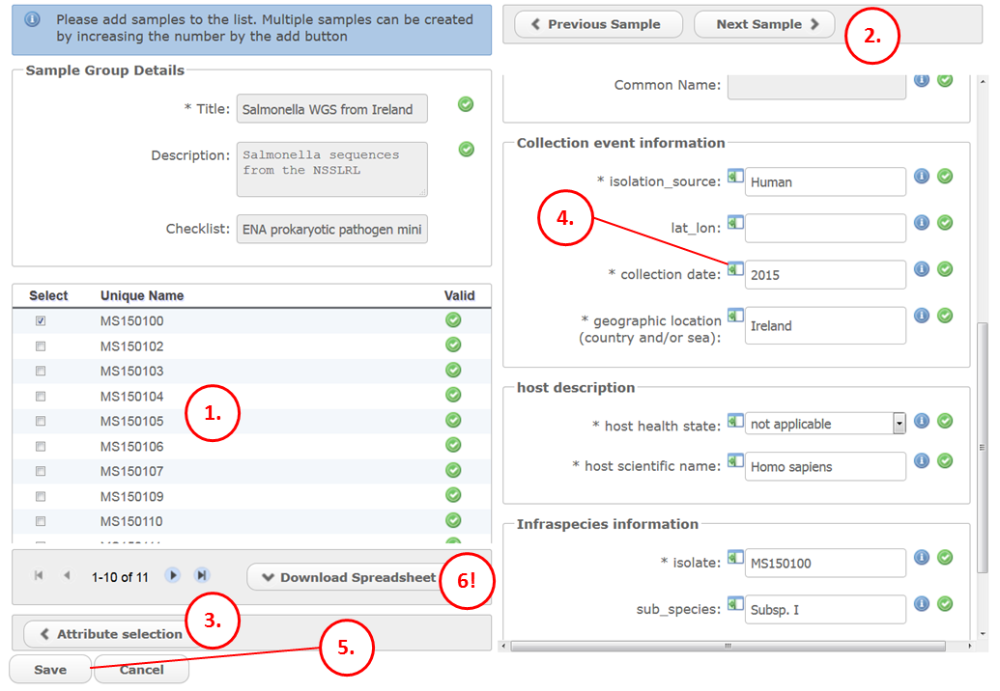

Module 5: Updates (Samples and Projects)
****************************************

The interactive submission interface supports some editing of your submitted objects.
Access these existing objects by clicking the relevant tab after logging in to `Webin <https://www.ebi.ac.uk/ena/submit/sra/#home>`_.

.. image:: images/mod_05_p01.png

Sample Edit
===========

To edit a sample, find it in the list (note the search box) and click the 'Edit' button next to it.

Your sample will be shown as an XML document which you can edit directly.
Make changes as required and click the 'Save' button; your changes will not be saved if they invalidate the file.
General XML errors and specific errors defined by us are prevented in this way.
Note that not all fields can be edited: the sample alias and accession are immutable, and if you remove an attribute which is required by the specified checklist, this will not be allowed.

.. image:: images/mod_05_p02_b.png

This method is useful for one-off edits but it is not feasible for editing many samples at once. For this you can use the `programmatic method <prog_07.html>`_.

Study Edit
==========

Some parts of the study object can be edited.
These include the release date, title, description and publication references.

.. image:: images/mod_05_p03.png

1. Login to `Webin <https://www.ebi.ac.uk/ena/submit/sra/#home>`_ and find the studies tab.
2. Find the study in the list, or search for it by its accession.
3. If your study is confidential you can change the release date by clicking on the pencil icon and navigating to the required date in the calendar.
   To release the study simply select the current date/present day and set the following processes in motion:

	- Moving relevant sequence data files to a public archive.
	- Indexing and rendering the study and its objects so that they can be linked-to and visualised in the ENA browser.
	- Mirroring to INSDC databases, who will then make the data available through their services.

   Please allow up to 48 hours for newly released data to appear in the public database.
   Read more about this in our `Data Release Policies FAQ <release.html>`_

4. For edits besides changing the release date, click the 'Edit' button.

.. image:: images/mod_05_p04.png

5. The short name for the study will be visible in search outputs and overview pages whereas the descriptive title and abstract will be presented in the study's public page.
6. You can add the PMID of any papers related to your date.
   There will then be a link to the paper from your study's public page.
7. Study attributes are optional tag-value pairs you can specify to add extra information or to make your study more searchable.
   For example, you could add a 'DOI' tag with your paper's DOI as the value.
8. Save your changes when you are satisfied with your updates, or click 'Cancel' to abandon them.
