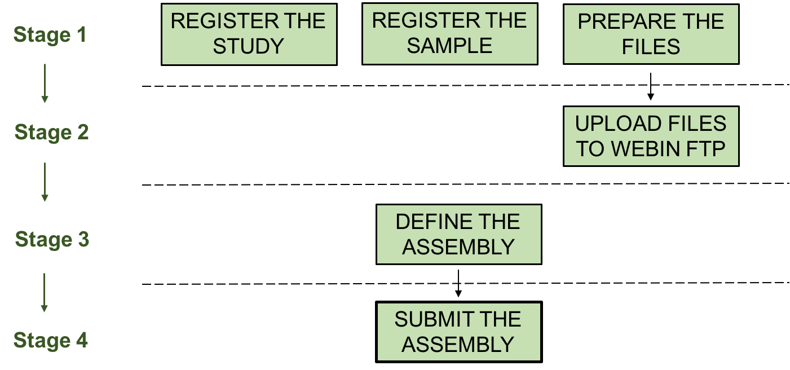
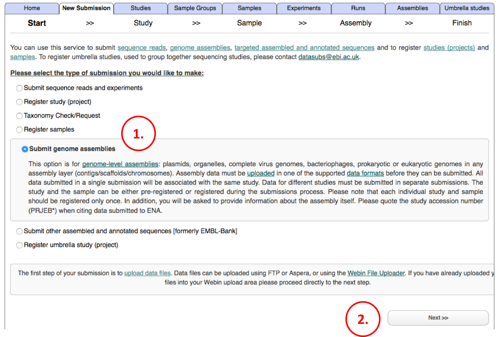
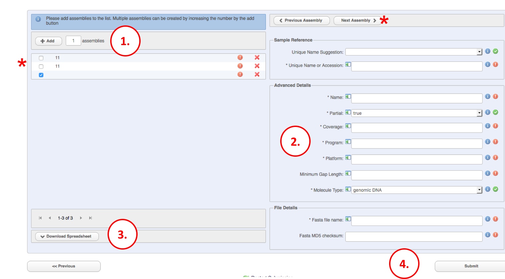

=====================================
Module 6: Genome Assembly Submissions
=====================================

Assembled sequences can be submitted to the European Nucleotide Archive (ENA) through the interactive Webin service.
This is not limited to just genome assemblies: various types of assembled molecules can be submitted by following the guidance below.
Assemblies accepted by this service include:

- Genomes: prokaryotic, eukaryotic, viral, at the level of contigs, scaffolds or chromosomes
- Plasmids
- Organelles
- Viral segments/replicons

Introduction
============

The workflow of a genome assembly submission is as follows:

-----------------------------------------------------------------------------------------------------------

-----------------------------------------------------------------------------------------------------------

**Register the Study.**
A study object in the database provides information on your work such as an abstract and PubMed ID.
It also allows you to group together different objects, such as your submitted reads and assemblies.
To do this, please view the `study registration <mod_02.html>`_ guide.

**Register the Sample.**
You must register a sample with us.
This provides a description of the organism/material you acquired the sequenced nucleic acids from.
To register your sample(s) please visit the `sample registration <mod_03.html>`_ guide.

**Prepare the files.**
You must prepare your files in a specific format in order for them to be processed by the genome assembly pipeline.
Please see `Genome Assembly Data Formats <format_02.html>`_ for the file formats used for genome assembly submissions.
Note that all the files must be gz compressed.

**Upload files.**
You must upload your files into your Webin upload area before you can submit them.
Once the files have been submitted they will be moved from the Webin upload
area into the archive.
Please see `Data Upload <upload_01.html>`_ for full details on how to upload data files.

**Define the Assembly.**
During the submission process, the interface will automatically indicate the files to be uploaded based on your answers to a series of questions.

**Submit the Assembly.**
Once you successfully submit your assembly, you will receive confirmation in your browser and via email, including a unique identifier for each submitted assembly (ERZXXXXXX).
Accession numbers to be used for publication purposes are described `here <http://www.ebi.ac.uk/ena/about/citing-ena-data>`_.

Submitting a Genome Assembly Using the ENA Interactive Webin Service
====================================================================

New submitters are required to register a `Webin submission account <http://www.ebi.ac.uk/ena/submit/register-submission-account>`_.
Once you have an ENA Webin account, please log in to the `submission service <https://www.ebi.ac.uk/ena/submit/sra/#home>`_ and follow the below instructions to submit a genome assembly.

Step 1: Begin a New Submission
~~~~~~~~~~~~~~~~~~~~~~~~~~~~~~

1. After logging in, go to the New Submission tab and select the 'Submit genome assemblies' option.
2. Click 'Next' to continue.

Part 2: Study and Sample
~~~~~~~~~~~~~~~~~~~~~~~~

.. image:: images/AS_part2.png

1. Select the study that you will be adding the genome assembly to.
   If the study that you want to submit to does not yet exist you can create one now by clicking the 'Create a new study' link.
2. Click 'Next' to go to the sample registration page.
   If you registered your samples in advance, click 'Skip'.
   Otherwise, proceed with the `sample registration process <mod_03.html>`_.

Part 3: Define Your Assembly
~~~~~~~~~~~~~~~~~~~~~~~~~~~~

.. image:: images/AS_part3.png

1. Answer the three questions to identify what files your submission will require.

  QUESTION 1: *Are the sequences assembled into chromosomes or replicons?* The chromosomes do not need to be fully sequenced, there can be assembly gaps. If you have assembled plasmids, organelles, bacteriophage genomes or viral segments, please submit them as 'chromosomes' by answering YES to this question.

  QUESTION 2: *Does the assembly contain scaffolds or chromosomes described using an AGP file?* If you have an AGP file mapping either scaffolds from contigs (scaffold AGP) or chromosomes from scaffolds (chromosome AGP), you should submit them as such and we will build the corresponding sequence(s).

  QUESTION 3: *Are the sequences functionally annotated?* This will determine if a Fasta file or a EMBL flat file should be submitted.

2. If your assembly contains assembled chromosomes, there will be an additional question about whether you plan to submit unlocalised sequences.
   Unlocalised sequences are contigs or scaffolds that are associated with a specific chromosome but their order and orientation is unknown.

3. You must provide here the accession number (ERSXXXXXX) of the sample to be associated with this assembly.
   You can also provide the unique name (or alias) of the sample.

4. You must fill out the assembly information.

5. Based on your answers in section 1, these fields will indicate the files to be submitted.
   The default submission (all answers NO) allows the submission of contigs/scaffolds in fasta format.
   You must provide the file names (files must be already uploaded) and the MD5 checksum for each file.
   All files must be gz compressed.
   If they are not, please upload them again before continuing.
   Note that you will be able to submit only one file of each type:

  - One Fasta or EMBL flat file containing the sequence(s)
  - One AGP file
  - One chromosome list file
  - One unlocalised list file

  Therefore, if you wish to submit both scaffolds and chromosomes without AGP file, please submit all the sequences in the same file (either Fasta or EMBL flat file depending if there is functional annotation or not); you will be requested to submit as well a chromosome list file that will identify the chromosome sequences.
  Likewise, if you wish to submit contig sequences plus an AGP file to build scaffolds and an AGP file to build chromosomes, you must merge both AGP and submit them as one AGP file only.

6. You can also provide the above information in a spreadsheet file. You can download/upload the template in this section.

7. Once all the above information is provided, please proceed to the next step.

Part 4: Add More Assemblies
~~~~~~~~~~~~~~~~~~~~~~~~~~~

On this page you will be able to add more assemblies with similar information.

1. Select here how many assemblies you wish to submit (from 1 to 199) and click '+Add'.

2. Provide specific information on each assembly.
   Every assembly must have a unique sample so you must change at least the sample accession number, the file names and checksum for each assembly.
   Once you fill up the information in a given field, a green button will indicate that is completed (not necessarily validated).

3. You can also download the provided information in a spreadsheet file template by clicking the button 'Download Spreadsheet'.

4. Once all fields are complete and labelled with green ticks, you will be able to submit the assembly/assemblies by clicking the 'Submit' button.
   The system will validate the information provided at this stage and display an error message if there are errors to be corrected.

Part 5: Finishing Up
~~~~~~~~~~~~~~~~~~~~

.. image:: images/AS_part5.png

Once your assembly has been submitted, you will be shown a confirmation page similar to the one above.
A confirmation email will be also sent to all of your account's named contacts.

After they are received, your files must still undergo processing before they are ready for release.
It is possible that errors will be detected at this stage, so please allow plenty of time for your submission if you have a publication deadline to keep.
Even if there are no errors, the duration of processing will vary with the volume of assembly submissions.
Once your assembly has finished processing, you can release it by following the instructions in our `Data Release FAQ <release.html>`_.
