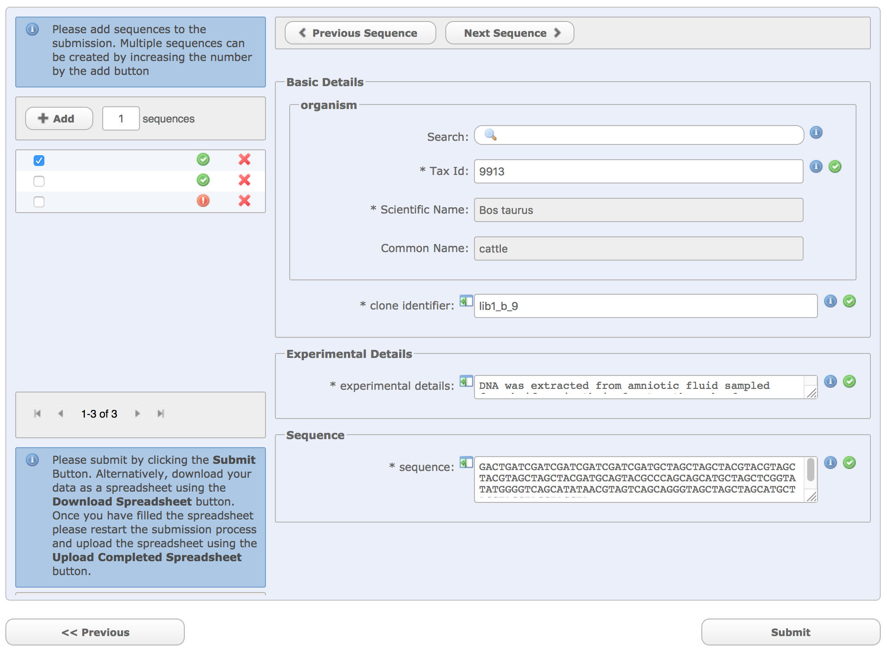

=======================================================
Module 8: Interactive Submission of Annotated Sequences
=======================================================

| Submitting a new annotated sequence entry can be done interactively through Webin.
  Ensure you `register a study <mod_02.html>`_ before you begin if you have not already done so.
| Interactive submission of annotated sequences requires you to select a checklist and fill out a spreadsheet of information about your sequence.
  Please view the available `Annotation Checklists <https://www.ebi.ac.uk/ena/submit/annotation-checklists>`_ and pick out a suitable one in advance.
  If there is no appropriate checklist available, you will need to create a flatfile and `submit programmatically via REST <http://ena-docs.readthedocs.io/en/latest/prog_12.html>`_.
|
| Two methods are described here: spreadsheet based and non-spreadsheet based.
  Submitting via spreadsheet is recommended, especially if you have many sequences to submit.

Submitting Via Spreadsheet
==========================

| To begin, `log in to your Webin account <https://www.ebi.ac.uk/ena/submit/sra/#home>`_, navigate to the 'New Submission' tab and select 'Submit other assembled and annotated sequences'.
| On the next screen, select the study you wish to submit to (or use the 'Create a new study' link).

.. image:: images/mod_08_p01.png

| On the following screen, note the 'Submit Completed Spreadsheet' button.
  You will return here to submit your spreadsheet once it is completed.
| For now, use the 'Select Checklist' button, then browse the list of available checklists and their descriptions.

.. image:: images/mod_08_02.png

| Next, you can select extra fields to add to your spreadsheet.
  Doing this will give more context to your data and help other users to understand it.
| The field selection screen also describes each field in detail: if at any point you are not sure what you should enter into a field, return to this screen and find its description.
|
| Once you are satisfied, use the 'Download Template Spreadsheet' button to get your checklist as a TSV file.
  Open the file in a spreadsheet management program and fill out a row for each sequence you wish to submit.
| When you have completed your spreadsheet, return to the page shown above to upload it.
  If there are errors with your spreadsheet, you will be informed: correct them and redo the submission.
| Once the submission is accepted, you will be shown a confirmation screen and will later receive an email with your accession numbers.

Non-Spreadsheet Submission
==========================

| Submitting without a spreadsheet can be convenient if you have a small number (>3) to submit.

Step 1: Select and Customise a Checklist
----------------------------------------

| To begin, `log in to your Webin account <https://www.ebi.ac.uk/ena/submit/sra/#home>`_, navigate to the 'New Submission' tab and select 'Submit other assembled and annotated sequences'.
| On the next screen, select the study you wish to submit to (or use the 'Create a new study' link).
| Next, you can start building your submission by clicking 'Select Checklist'.
| Browse the list of available checklists.
  A description is available for each one.

.. image:: images/mod_08_p02.png

| You can select extra fields to add to your spreadsheet at this point.
  These extra fields give your data more context and help other users understand it.

.. image:: images/mod_08_p03.png

Step 2: Fill Out Shared Details
----------------------------------------

| In this next screen, you should fill out details which are shared by all of your sequences.
  This information will be used to populate the form for each sequence you add to this submission.
| None of these fields are mandatory at this stage, and you will be able to edit their content on an individual basis later.

.. image:: images/mod_08_p04.png

Step 3: Fill Out Individual Details
-----------------------------------

In this final step, you should fill out the details for each sequence individually.
Depending on how you completed the previous step, some fields will be filled already.

Use the '+Add' button to increase the amount of sequences, using the adjacent field to specify how many sequences to add.
In the box below, you can move between different sequences using the checks on the left.
On the right, a green tick indicates a sequence with all mandatory fields completed, while a red exclamation mark indicates errors to be resolved.
The red 'X' can be used to remove an entry completely.

Next to each field, you can mouse over the blue 'i' to learn more about what should be entered.

Step 4: Submit Your Sequences
-----------------------------

When you have entered all the information you wish to and all of the sequences show green ticks indicating that they are correctly filled out, click 'Submit' to have your submission validated.
If your sequences fail validation, you will be informed of this here.
Otherwise, if your submission is successful, a confirmation page will appear and you will later receive an email with your accession numbers.
