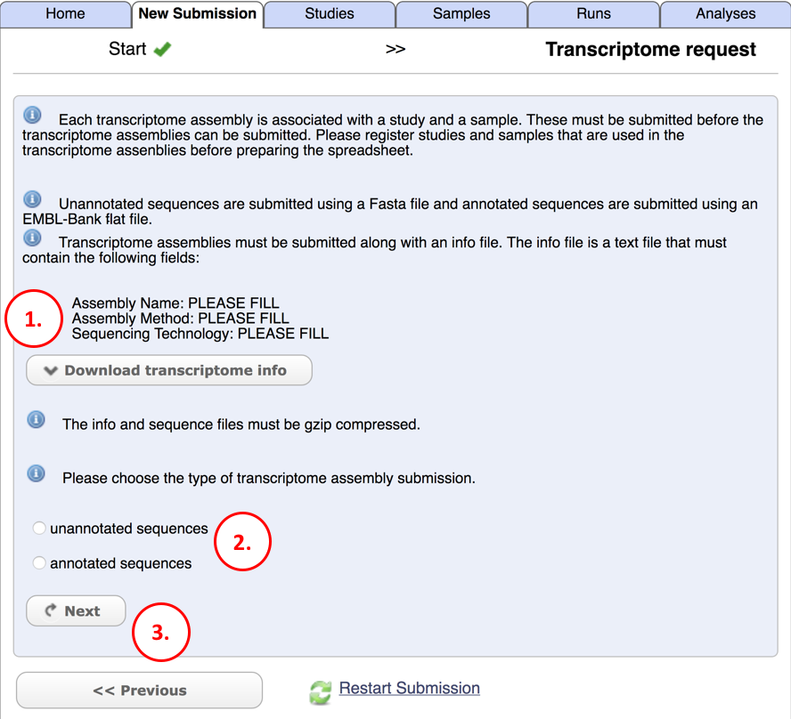
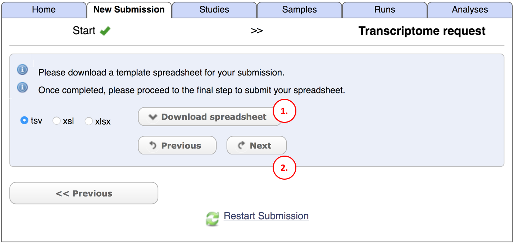
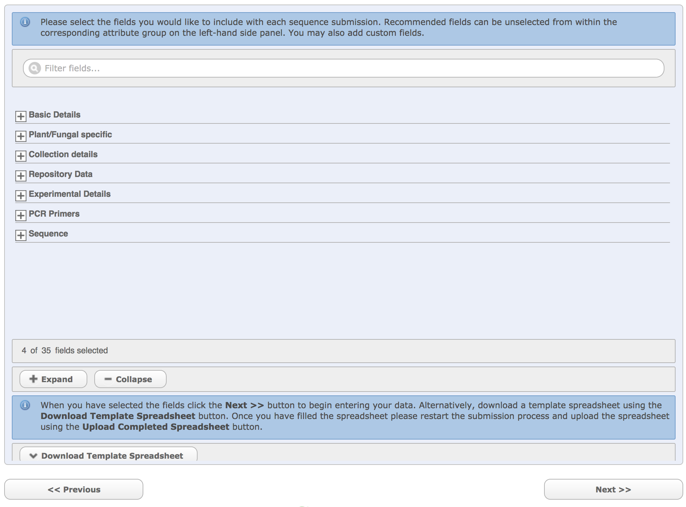
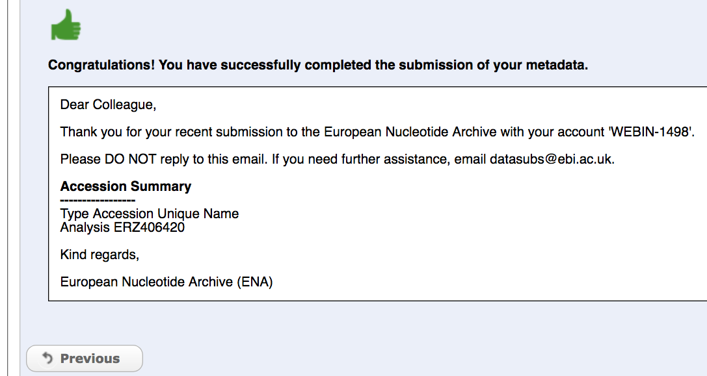

Module 10: Transcriptome Assembly Submission
********************************************

Part 1: Data Files needed For TSA
=================================

|

|

The Basic info File
-------------------

This is the first screen that you come to when you choose_ to submit a TSA in the Webin submission system. The first step involves downloading an information file. This is quite a simple file which contains some basic information that will be used to create your TSA entry. Here is an example of :download:`one <doc/hickmania_info.txt>` (`or <https://www.ebi.ac.uk/sites/ebi.ac.uk/files/groups/ena/documents/hickmania_info.txt>`_). Make sure to use the one downloaded from Webin for your submission in case there have been any updates since writing this module and also make sure to add the correct details that reflect your transcriptome submission and remove the example values.

.. _choose: mod_01.html

The EMBL format File
--------------------

Step 2 in the image above asks if you are submitting annotated or unannotated sequences. Annotated sequences means that you have identified the coding feature (that codes for protein) and that you know its start and stop position relative to the length of each contig. In this case you should compile an EMBL format file which has the necessary specifications to be able to provide the sequence and the coordinates of the CDS feature. A fasta file of the contigs can not pass on information about the protein coding feature. Here is a `primer <https://www.ebi.ac.uk/ena/submit/flat-file>`_ on producing an EMBL flat file. In this version a lot of the header has been removed and this is ok because it will be injected back in after the submission. If you are using software such as Artemis to produce the EMBL file then you will have fuller headers and a more complete file but both varieties are fine because this EMBL format file is used mainly to get information about the sequence annotation features and a complete version will be created automatically after submission. :download:`Here <doc/embl_file_hickmania.txt>` (`or <https://www.ebi.ac.uk/sites/ebi.ac.uk/files/groups/ena/documents/embl_file_hickmania.txt>`_) is an example of 3 contigs with annotated CDS features which make up a (very small) TSA set (also linked below). More information about creating EMBL format files can be found `here <https://www.ebi.ac.uk/ena/submit/genome-assembly-file-formats>`_ and `here <https://www.ebi.ac.uk/ena/submit/entry-upload-templates>`_.

Select 'annotated sequences' for step 2 if you wish to submit an EMBL format file.

FASTA File
----------

Step 2 in the image above asks if you are submitting annotated or unannotated. Unannotated sequences can be submitted as FASTA files because there is no additional information to provide relating to sequence features. Each contig sequence will have a header (as is standard for FASTA format) and that header will contain the name of the sequence. :download:`Here <doc/hickmania_fasta.txt>` (`or <https://www.ebi.ac.uk/sites/ebi.ac.uk/files/groups/ena/documents/hickmania_fasta.txt>`_) is an example of 3 contigs in FASTA format.

Select 'unannotated sequences' for step 2 if you wish to submit a FASTA file.

Uploading the Files
-------------------

Before continuing (step 3 in the image above) you should prepare `The Basic info File`_ and either `The EMBL format File`_ **or** a `FASTA File`_. These files should be compressed_ and uploaded_. You should also ensure that you have created a Study_ to hold general information about the TSA and other data that is related to it. Every TSA also requires a source sample_. To that source sample you should attach the NGS read data (as runs_) that was assembled into the TSA, and then you are ready to add the TSA itself to that same source sample.

.. _Study: mod_02.html
.. _runs: mod_04.html
.. _uploaded: file_prep.html#step-3-uploading-the-file
.. _compressed: file_prep.html#step-1-compress-the-file-using-gzip-or-bzip2
.. _sample: mod_03.html

Part 2: The TSV Submission File
===============================

This is the next screen that you will come to in the TSA submission process. Step 1 involves downloading a tsv (or xls or xlsx) file which you will use to register the `The Basic info File`_ that is is in your ftp directory and `The EMBL format File`_ or `FASTA File`_ (also in your ftp directory). Also in this metadata file goes the study id that contig set should be added to (looks like `PRJEBXXXX`) and the accession of the source sample for the contig set (looks like `SAMEAXXXXXX`). For each of the files in the ftp directory you may also need to provide an MD5 checksum_. Here is an example of a metadata :download:`tsv <doc/transcriptome_annotated.txt>` (`or <https://www.ebi.ac.uk/sites/ebi.ac.uk/files/groups/ena/documents/transcriptome_annotated.txt>`_). Make sure to get your template from Webin in case there have been any updates since writing this module. Also make sure to add your own values to reflect your own submission and remove all example values. You can submit many TSAs at the same time by adding each one on a new row in this TSV spreadsheet.

Step 2 in the image above is for the next stage, after you have completed the TSV annotation file.

.. _checksum: file_prep.html#step-2-calculate-the-md5-checksum-for-the-file

Part 3: Upload and Submit
=========================

The final stage is to upload the completed TSV annotation file. First find it on your local machine (step 1) and then click the button (step 2). If there are errors that you can correct you can edit the file and then repeat step 1 and step 2. The screen will not change but the latest version of the file will get validated. If all is well you will see a confirmation message like the one below. The analysis id (looks like `ERZXXXXXX`) is not an EMBL accession for the contigs. The true EMBL accessions will only be administered after the TSA is processed. This will take a few days (depending on queues, backlogs and maintenance work) but you will receive an email with the EMBL accessions after it is complete. If there is a problem you will receive an automatic email about it or you will be contacted by an ENA curator who can work with you to fix the submission.

