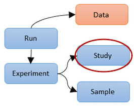
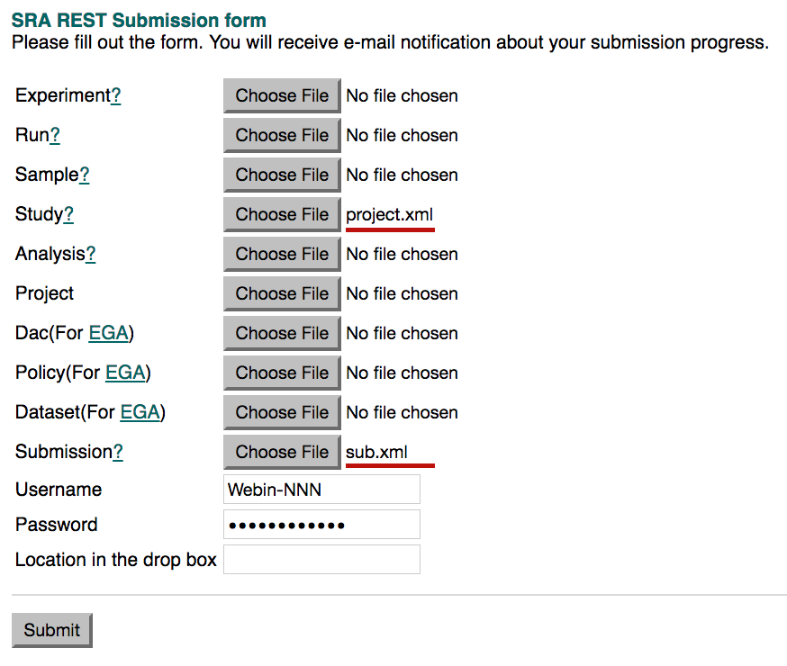

# Module 1: Create a Study

## The Study Object

Objects such as a study or a sample, are stored in the ENA in XML form like this:

```xml
<?xml version = '1.0' encoding = 'UTF-8'?><PROJECT_SET>
   <PROJECT alias="iranensis_wgs" center_name="HKI JENA" accession="PRJEB5932">
      <NAME>WGS Streptomyces iranensis</NAME>
      <TITLE>Whole-genome sequencing of Streptomyces iranensis</TITLE>
      <DESCRIPTION>The genome sequence of Streptomyces iranensis (DSM41954) was obtained using Illumina HiSeq2000. The genome was assembled using a hybrid assembly approach based on Velvet and Newbler. The resulting genome has been annotated with a specific focus on secondary metabolite gene clusters.</DESCRIPTION>
      <SUBMISSION_PROJECT>
         <SEQUENCING_PROJECT>
            <LOCUS_TAG_PREFIX>SIRAN</LOCUS_TAG_PREFIX>
         </SEQUENCING_PROJECT>
         <ORGANISM>
            <TAXON_ID>576784</TAXON_ID>
            <SCIENTIFIC_NAME>Streptomyces iranensis</SCIENTIFIC_NAME>
            <CULTIVAR>DSM41954</CULTIVAR>
         </ORGANISM>
      </SUBMISSION_PROJECT>
      <PROJECT_LINKS>
         <PROJECT_LINK>
            <XREF_LINK>
               <DB>PUBMED</DB>
               <ID>25035323</ID>
            </XREF_LINK>
         </PROJECT_LINK>
      </PROJECT_LINKS>
   </PROJECT>
</PROJECT_SET>
```

Creating objects in XML format is not always necessary. The Webin submission tool can create a project from a <a href="./mod_02.html">webform</a>. It will convert the form data into XML and load it into the ENA database. However, you will find that in some cases there is more flexibility in creating submittable XML objects yourself and by-passing the interactive submission tool. Do consider using the interactive Webin submission tool to create a study and then adding the other objects programmatically instead. It is fine to mix and match submission routes and you may find that programmatic submission is better suited to repetitive submission tasks, of which project creation is not normally one of.

<!-- [webform](/mod_02.html) does not work -->

A study (sometimes referred to as a project) in the ENA is used to group other objects together, so we will look into creating a project/study as a first step towards learning to submit ENA objects programmatically.

 <!-- {:height="100px" width="100px"}  does not work. if no need to resize it's fine. had to explicitly resize image-->
<!--  problem: size adjustment works but sphinx does not copy over new image when it is not called using markdown syntax. also align="middle" does not work -->

## Create the XML

Below is a template. Do not use any default values - enter your own information and save it as a file, for example, you may call it "project.xml"

```xml
<?xml version = '1.0' encoding = 'UTF-8'?>
<PROJECT_SET>
   <PROJECT alias="cheddar_cheese" center_name="">
      <TITLE>Characterisation of Microbial Diversity and Chemical Properties of Cheddar Cheese Prepared from Heat-treated Milk</TITLE>
      <DESCRIPTION>This study aimed to characterise the interaction of microbial diversity and chemical properties of Cheddar cheese after three different heat treatments of milk</DESCRIPTION>
      <SUBMISSION_PROJECT>
         <SEQUENCING_PROJECT/>
      </SUBMISSION_PROJECT>
   </PROJECT>
</PROJECT_SET>
```

In your file "project.xml" paste the above XML but change the alias="" and give it a unique name. You may need this unique name to refer to your project when adding other objects to it. It can be a short acronym but it should be meaningful/memorable in some way (instead of just a number).
Also provide a center name `center_name=""`.
The center name is specific to your Webin account. You chose it when you set up the account. [Log in](https://wwwdev.ebi.ac.uk/ena/submit/sra/#submissions) to confirm your centre name. Within the `<DESCRIPTION></DESCRIPTION>` block add an abstract detailing the project including any information that may be useful for someone to interpret your project correctly. Within the `<TITLE></TITLE>` block add a descriptive title. 


## Create a Submission XML

To register the submission of a project or any other object(s), you need an accompanying submission xml in a separate file. Let's call the file "sub.xml" for this purpose. 

```xml
<?xml version="1.0" encoding="UTF-8"?>
<SUBMISSION alias="cheese" center_name="">
   <ACTIONS>
      <ACTION>
         <ADD source="project.xml" schema="project"/>
      </ACTION>
   </ACTIONS>
</SUBMISSION>
```

This file simply registers an 'action' on the ENA servers. In this case the action is to `<ADD/>` a project object(s) using the XML file "project.xml". Make sure the project.xml and the sub.xml are in the same directory on a linux file system (or Mac/Unix should work too). If you do not want to use the command line or if you are using a Windows operating system it is also possible to register the submission via a web form on any internet browser (more details to come). Add an alias to the submission XML to mark the submission event, and add your centre name as before.

## Send the XML files to ENA

CURL is a Linux/Unix command line program which you can use to send the XMLs to the ENA server along with authentication.

```bash
curl -k -F "SUBMISSION=@sub.xml" -F "PROJECT=@project.xml" "https://www-test.ebi.ac.uk/ena/submit/drop-box/submit/?auth=ENA%20Webin-NNN%20PASSWORD"
```

From the same directory containing files sub.xml snd project.xml run CURL as above. You must exchange `Webin-NNN` with your Webin account id and `PASSWORD` for your account password. The `%20` is URL encoding for a space character. Leave these in place. After running the command above a receipt in XML format is returned. It will look like the one below (it won't be line wrapped but you can copy and paste it or redirect the CURL output to a separate file.


```xml
<?xml version="1.0" encoding="UTF-8"?>
<?xml-stylesheet type="text/xsl" href="receipt.xsl"?>
<RECEIPT receiptDate="2017-05-09T16:58:08.634+01:00" submissionFile="sub.xml" success="true">
   <PROJECT accession="PRJEB20767" alias="cheddar_cheese" status="PRIVATE" />
   <Submission accession="ERA912529" alias="cheese" />
   <MESSAGES>
      <INFO>This submission is a TEST submission and will be discarded within 24 hours</INFO>
   </MESSAGES>
   <ACTIONS>ADD</ACTIONS>
</RECEIPT>
```

It is possible to use a browser to register the XML files instead of using cURL at the command line. See [here](https://www-test.ebi.ac.uk/ena/submit/restsubmit.html).
 
 

Simply use the study row and the submission row to browse and navigate to the project.xml file and the sub.xml file respectively and then add your Webin account and password in the Username and password fields before clicking submit. You should receive the receipt in the browser window.

## The Receipt XML

Note the info message in the receipt
```xml
<INFO>This submission is a TEST submission and will be discarded within 24 hours</INFO>
```
It is advisable to run your submissions through the ENA test server where changes are not permanent and are erased every 24 hours. If you are happy with the result of the submission you can run the CURL command again, but this time on the production server. Simply change the part in the URL from `/www-test.ebi.ac.uk` to `/www.ebi.ac.uk` and remove the **-k** flag:

```bash
curl -F "SUBMISSION=@sub.xml" -F "PROJECT=@project.xml" "https://www.ebi.ac.uk/ena/submit/drop-box/submit/?auth=ENA%20Webin-NNN%20PASSWORD"
```

To know if the submission was successful look in the first line of the `<RECEIPT>` block. The attribute **success** will have value **true** or value **false**. If the attribute is false then the submission did not succeed. If this is the case check the rest of the receipt for error messages and after making corrections, try the submission again. If the success attribute is true then the submission was successful. The receipt will contain the accession numbers of the objects that you have submitted. In the case of an ENA study/project this is likely to be the accession that you will be including in a publication.

```xml
   <PROJECT accession="PRJEB20767" alias="cheddar_cheese" status="PRIVATE" />
```
 
