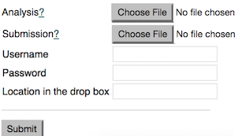

# Module 2: Submit an Annotated Sequence

Annotated sequences can be any number of sequences that are assembled from shorter reads or sequenced using Sanger capillary sequencing. They can be annotated with features such as coding domains, introns, exons, non coding RNA etc. Typical sequences submitted to the ENA are rRNA genes, single CDS genomic DNA sequences, MHC genes, mRNA and many more. Most submitters will use the [interactive WebIn Submission system](https://www.ebi.ac.uk/ena/submit/sra/#submissions) to submit these types of sequences:


#### The analysis object 

This is a guide for programmatic submission of annotated sequences. This submission route is useful for automating your submissions if you expect to be submitting large numbers of sequences at regular intervals. For one off or small scale submissions you are encouraged to use [Webin](https://www.ebi.ac.uk/ena/submit/sra/#submissions) instead. The ENA metadata model uses various objects to hold information and group other objects together. Annotated sequences are wrapped in an analysis object. The other objects are frequently used in read data submission and whole genome submissions. The analysis object can point to a study and samples. It is not necessary to register a sample object for an annotated sequence submission, but you should have a study available before you submit the analysis/annotated sequence. Studys are used to group other objects together. You may well use the study again in the future to submit additional data types including read data and whole genomes. A study can package together all elements of a typical publication.


#### A word about Accession Numbers

Annotated sequences are submitted as TSV spreadsheet files. One analysis object wraps one TSV file, but a TSV file may contain many sequences (each row = 1 annotated sequence). Templates with predefined columns are available. A TSV template is specific to a type of sequence so each tsv/analysis can have multiple sequences but they will all be the same type. For example if you have 10 rRNA genes and 20 single protein coding genes as part of the same study then you will use 2 different TSV templates, which will be submitted as 2 separate analysis objects, 1 with 10 rows and the other with 20 rows. All 30 rows will be converted into EMBL sequence files and each sequence file will be accessioned. The analysis objects will be accessioned too but this is for internal ENA tracking. Do not quote an analysis (ERZxxxxxx) accession when referring to an annotated sequence. Only quote the sequence accessions (as a range for example, if there are many). You can also quote the study accession (PRJEBxxxx), especially if you have a collection of data to report. The analysis object is used to submit other file types as well and in some cases it is appropriate to reference an analysis accession. 

At submission time you will not receive any sequence accessions. These will come later by email (multiple email accounts can be registered per Webin account). After submission the TSV file is moved to a staging area and each row is converted into an EMBL sequence flatfile. The flatfiles are then validated and accessioned. After this the accessions are emailed and the sequences are moved to the confidential or public archive depending on the status of the encompassing study (a public study will make the sequences public too).

#### Step 1: Create a study

If you already have a study you can add your annotated sequence entries to it. If you do not you need to create one first. Use either the <a href="./mod_02.html">interactive submission route</a> or the <a href="./prog_01.html">programmatic submission route</a> to do this.

#### Step 2: Get hold of the TSV template

Sequences are submitted as tsv spreadsheets. You can use [Webin](https://www.ebi.ac.uk/ena/submit/sra/#submissions) submission option "Submit other assembled and annotated sequences [formerly EMBL-Bank]" to get hold of the template that you will be using. You will only need to do this once for each type of sequence that you are submitting. After you have the template(s) you can submit without logging in to Webin.


For this example I chose sequence type *rRNA gene* and then navigated to the page where there was an option to download the template:


The downloaded file is called something like "Sequence-ERT000002-5697110325950293078.tsv". Take note of the ERT number which in this example is `ERT000002`. It represents the sequence type (rRNA gene in this case). This is required later - the system needs to know the sequence type so that it can create the right EMBL file from the TSV. To fill in the TSV you can use a spreadsheet editor. Each row in the tsv is a separate sequence record. The last column is for the sequence and the others are for annotation fields. It is a bit like a FASTA except that the header and sequence are on one line instead of two and the fields are tab separated.

### Step 3: Upload the TSV file to your FTP directory

After submission, the TSV file will be accessed from your Webin FTP directory (all accounts have some space on the ENA FTP server for this purpose) for processing. So before going any further you need to compress the TSV file and upload it to your Webin ftp directory. A full set of instructions can be found [here](http://www.ebi.ac.uk/ena/about/sra_data_up). You also need to register the MD5 checksum for the TSV file. This can be done in the next step (by adding it to the analysis xml object) or you can do it now by uploading a supplementary checksum file in addition to the TSV file. So if your tsv is called ethylomonas.tsv.gz the file with the checksum in it is called ethylomonas.tsv.gz.md5. See <a href="./file_prep.html">here</a> for guidelines on preparing files for a submission.


### Step 4: Prepare the Analysis XML file

The TSV file, now sitting in your Webin FTP directory, is registered/submitted using the ENA XML REST API. Create an analysis object as an XML file. Note that this analysis object references a study (see step 1 above) and the compressed tsv file. It also includes the MD5 checksum for the compressed TSV file (so we can check that the transfer is 100% completed). You can omit the checksum attribute in the XML if you have already uploaded a checksum file to your Webin ftp directory along with the compressed TSV file. See <a href="./file_prep.html">here</a> for guidelines on preparing files for a submission.

The analysis object also references the ERT number (corresponding to the rRNA sequence type in this case). In this example I changed the name of the TSV file that was accessed in step 2 above. But you do not have to. 

```xml
<?xml version = '1.0' encoding = 'UTF-8'?>
<ANALYSIS_SET>
   <ANALYSIS alias="ethylomonas" center_name="EBI">
      <TITLE>16S of Methylomonas sp.</TITLE>
      <DESCRIPTION>16S Methylomonas sp.</DESCRIPTION>
      <STUDY_REF accession="PRJEBxxxx">
      </STUDY_REF>
      <ANALYSIS_TYPE>
         <SEQUENCE_FLATFILE/>
      </ANALYSIS_TYPE>
      <FILES>
         <FILE checklist="ERT000002" checksum="5831463bb16a4c14374a0962d5a353cc" checksum_method="MD5" filename="ethylomonas.tsv.gz" filetype="tab"/>
      </FILES>
   </ANALYSIS>
</ANALYSIS_SET>
```

Create a file, it can have any name but in this example we will call it analysis.xml
You can use the above XML as a template but be sure to change all the fields because this is an example only.
Remember to:
1. Provide your own alias. This is a unique id for the analysis object and you may need it to identify your submission later
2. Apply your own center name. When you created your Webin account you provided a center name acronym. You can check it by [logging in](https://www.ebi.ac.uk/ena/submit/sra/#home) and looking at the account details section.
3. Add a similar title to the one in the example. It mentions the sequence type and the organism.
4. Use the same or a similar title in the <DESCRIPTION> block. Title and description are not used in the final EMBL flatfiles so these fields do not have to be very detailed.
5. Apply the correct study id (PRJEBxxxx)
6. Apply the correct checklist id (ERTxxxxxx)
7. If registering the MD5 checksum, apply it.
8. Apply the correct file name to refer to the compressed TSV. Use the full path if you have uploaded it to a subdirectory within your Webin FTP directory.
9. filetype and checksum_method should stay the same as the example

### Step 5: Prepare a Submission XML file

There is also a submission object which represents the submission event itself. An XML file with a submission object needs to accompany the analysis object when it gets sent to ENA REST API server so that the system knows what to do with the analysis object.

```xml
<?xml version="1.0" encoding="UTF-8"?>
<SUBMISSION alias="ethylomonas_submission" center_name="EBI">
   <ACTIONS>
      <ACTION>
         <ADD source="analysis.xml" schema="analysis"/>
      </ACTION>
   </ACTIONS>
</SUBMISSION>

```

The submission XML file can have any name. In this example it is called submission.xml.
Change the example template above

1. Provide your own alias. This is a unique id for the submission event. 
2. Apply your own center name. When you created your Webin account you provided a center name acronym. You can check it by [logging in](https://www.ebi.ac.uk/ena/submit/sra/#home) and looking at the account details section.
3. Change the source attribute so that it has the name of the XML file containing the analysis object from step 5 above.
4. You can change the 'ADD' block to a 'VALIDATE' block if you just want to test and see what messages are returned. `<VALIDATE source="analysis.xml" schema="analysis"/>` When you validate the object will not be committed to the ENA database and no accession number will be assigned. We recommend testing all your submissions like this, before using the ADD action.

### Step 6: Send the XMLs to ENA through the REST API

This step is the same as other REST API submissions. Please go to <a href="./prog_01.html#send-the-xml-files-to-ena">this section</a> which is based on submitting a project XML. Submitting an analysis XML is very similar.

Please note the following.

  * Your cURL command will look something like this

```bash
curl -u username:password -F "SUBMISSION=@submission.xml" -F "ANALYSIS=@analysis.xml" "https://www-test.ebi.ac.uk/ena/submit/drop-box/submit/"
```

  * If you are using the webform instead of cURL in Linux or Mac operating systems, use the analysis row and the submission row to browse and navigate to the analysis.xml file and the submission.xml file respectively

    

 * The receipt will look like this. Look out for the `success="true"` in the receipt.

```xml
<?xml version="1.0" encoding="UTF-8"?>
<?xml-stylesheet type="text/xsl" href="receipt.xsl"?>
<RECEIPT receiptDate="2017-05-05T15:28:38.557+01:00" submissionFile="sub.xml" success="true">
   <ANALYSIS accession="ERZ407913" alias="ethylomonas" status="PRIVATE" />
   <SUBMISSION accession="ERA907974" alias="ethylomonas" />
   <MESSAGES>
      <INFO>This submission is a TEST submission and will be discarded within 24 hours</INFO>
   </MESSAGES>
   <ACTIONS>ADD</ACTIONS>
</RECEIPT>
```

  * The URL in the cURL command above belongs to the test server `https://www-test.ebi.ac.uk/...` so the accessions delivered are not genuine. If you are happy with the submission in TEST, change to the production server `https://www.ebi.ac.uk/...` and remove the -k flag. Also remember if you are using 'VALIDATE' action in the submission XML then despite a `success="true"` the submission was not committed! 

