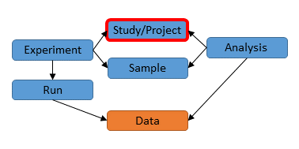

# Module 2: Register a Study

## The Study Object

A study (also referred to as a project) object is submitted in XML format like this:

```xml
<PROJECT_SET>
   <PROJECT alias="iranensis_wgs">
      <NAME>WGS Streptomyces iranensis</NAME>
      <TITLE>Whole-genome sequencing of Streptomyces iranensis</TITLE>
      <DESCRIPTION>The genome sequence of Streptomyces iranensis (DSM41954) was obtained using Illumina HiSeq2000. The genome was assembled using a hybrid assembly approach based on Velvet and Newbler. The resulting genome has been annotated with a specific focus on secondary metabolite gene clusters.</DESCRIPTION>
      <SUBMISSION_PROJECT>
         <SEQUENCING_PROJECT/>
      </SUBMISSION_PROJECT>
      <PROJECT_LINKS>
         <PROJECT_LINK>
            <XREF_LINK>
               <DB>PUBMED</DB>
               <ID>25035323</ID>
            </XREF_LINK>
         </PROJECT_LINK>
      </PROJECT_LINKS>
   </PROJECT>
</PROJECT_SET>
```

You can register one or more studies at the same time by using one `<PROJECT></PROJECT>` block for each study.

The study XML format is defined by the [ENA.project.xsd](ftp://ftp.sra.ebi.ac.uk/meta/xsd/sra_1_5/ENA.project.xsd) XML schema.
Studies can also be submitted using the [SRA.study.xsd](ftp://ftp.sra.ebi.ac.uk/meta/xsd/sra_1_5/SRA.study.xsd) XML schema.

Studies can also be registered using the [Interactive Webin submission service](mod_02.html). However, you may find that 
in some cases there is more flexibility in creating submittable XML objects yourself. 

A study is used to group other objects together, so we will look into creating a study
as a first step towards learning to submit ENA objects.

 

## Create the Study XML

Below is an example XML for submitting a study. Change the XML by entering your own information and save it as a file, for example `project.xml`.

```xml
<PROJECT_SET>
   <PROJECT alias="cheddar_cheese">
      <TITLE>Characterisation of Microbial Diversity and Chemical Properties of Cheddar Cheese Prepared from Heat-treated Milk</TITLE>
      <DESCRIPTION>This study aimed to characterise the interaction of microbial diversity and chemical properties of Cheddar cheese after three different heat treatments of milk</DESCRIPTION>
      <SUBMISSION_PROJECT>
         <SEQUENCING_PROJECT/>
      </SUBMISSION_PROJECT>
   </PROJECT>
</PROJECT_SET>
```

In your file `project.xml` change the value of `alias` to be a unique name. 
You may need this unique name to refer to your study when adding other objects to it. 
It can be a short acronym but it should be meaningful and memorable in some way.

Within the `<DESCRIPTION></DESCRIPTION>` block add an abstract detailing the project including any information that may be 
useful for someone to interpret your project correctly. Within the `<TITLE></TITLE>` block add a descriptive title. 

## Create the Submission XML

To submit a study or any other object(s), you need an accompanying submission XML in a separate file. 
Let's call this file `submission.xml`. 

```xml
<SUBMISSION>
   <ACTIONS>
      <ACTION>
         <ADD/>
      </ACTION>
   </ACTIONS>
</SUBMISSION>
```

The submission XML declares one or more Webin submission service actions. 
In this case the action is `<ADD/>` which is used to submit new objects. 

The XMLs can be submitted programmatically, using CURL on command line or 
using the [Webin XML and reports portal](prog_11.html).

## Submit the XMLs using CURL 

CURL is a Linux/Unix command line program which you can use to send the `project.xml` and `submission.xml`
to the Webin submission service.

```bash
curl -u username:password -F "SUBMISSION=@submission.xml" -F "PROJECT=@project.xml" "https://wwwdev.ebi.ac.uk/ena/submit/drop-box/submit/"
```

Please provide your Webin submission account credentials using the `username` and `password`.

After running the command above a receipt XML is returned. It will look like the one below:

```xml
<?xml version="1.0" encoding="UTF-8"?>
<?xml-stylesheet type="text/xsl" href="receipt.xsl"?>
<RECEIPT receiptDate="2017-05-09T16:58:08.634+01:00" submissionFile="submission.xml" success="true">
   <PROJECT accession="PRJEB20767" alias="cheddar_cheese" status="PRIVATE" />
   <SUBMISSION accession="ERA912529" alias="cheese" />
   <MESSAGES>
      <INFO>This submission is a TEST submission and will be discarded within 24 hours</INFO>
   </MESSAGES>
   <ACTIONS>ADD</ACTIONS>
</RECEIPT>
```

## Submit the XMLs using Webin XML and reports portal

XMLs can also be submitted interactively using the [Webin XML and reports portal](prog_11.html).
Please refer to the [Webin XML and reports portal](prog_11.html) document for an example how
to submit a study using XML. Other types of XMLs can be submitted using the same approach. 

## The Receipt XML

To know if the submission was successful look in the first line of the `<RECEIPT>` block. 

The attribute `success` will have value `true` or `false`. If the value 
is false then the submission did not succeed. In this case check the rest of 
the receipt for error messages and after making corrections, try the submission again. 

If the success attribute is true then the submission was successful. The receipt will 
contain the accession numbers of the objects that you have submitted. In the case of 
an ENA study this is likely to be the accession that you will be including in a 
publication.

### Accession numbers in the Receipt XML

Webin will report an accession number for the study that starts with PRJEB.
 
```xml
   <PROJECT accession="PRJEB20767" alias="cheddar_cheese" status="PRIVATE" />
```
 
This accession number is called the BioProject accession and is typically used in journal publications. The study will
also be assigned an alternative accession number that starts with ERP. This accession number is called the SRA 
(Sequence Read Archive) study accession.

## Test and production services

Note the message in the receipt:
```xml
<INFO>This submission is a TEST submission and will be discarded within 24 hours</INFO>
```

It is advisable to first test your submissions using the Webin test service where changes are not permanent 
and are erased every 24 hours. 

Once you are happy with the result of the submission you can use the CURL command again 
but this time using the production service. Simply change the part in the URL from `wwwdev.ebi.ac.uk` to 
`www.ebi.ac.uk`:

```bash
curl -u username:password -F "SUBMISSION=@submission.xml" -F "PROJECT=@project.xml" "https://www.ebi.ac.uk/ena/submit/drop-box/submit/"
```

Similarly, if you are using the [Webin XML and reports portal](prog_11.html) change the URL from 
`wwwdev.ebi.ac.uk` to `www.ebi.ac.uk`.
