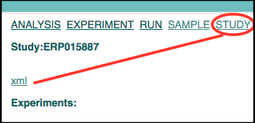
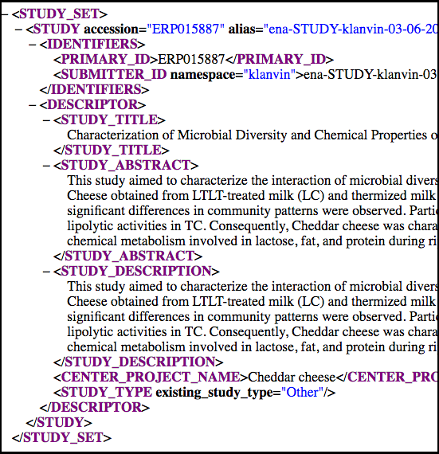

# Module 5: Update a Study

Updating study XMLs is an almost identical process to submitting a new one. 
The first step is to obtain the original study in XML format. This step
alone can be tricky if you did not submit the project using the REST API to begin with. Note that [Webin](https://www.ebi.ac.uk/ena/submit/sra/#submissions) has good study editing functionality already:


However, learning to use the REST API with a simple project object can pave the way for submitting and updating more complicated objects such as samples, experiments and runs. Also for making edits in bulk (to many projects) the ENA REST API is more feasible than Webin.

## Step 1: Get hold of the study in XML format

If you used REST API to submit the study in the first place you can use the XML files that you used previously.

If you don't have an XML file containing the study you can copy the public version by using __&display=xml__ at the end of the study page. For example, `http://www.ebi.ac.uk/ena/data/view/PRJEB5932&display=xml`. Note that the web version has additional blocks that are not part of the original XML as well as parts that have been added automatically and can be cleaned up for the purpose of updating (besides, they will be added again automatically). For example the below web version XML can be cleaned up so that it looks like submitted version that follows it.

### Web Version

```xml
<?xml version="1.0" encoding="UTF-8"?>
<ROOT request="PRJEB14252&amp;display=xml">
<PROJECT alias="ena-STUDY-klanvin-03-06-2016-07:54:42:301-120" center_name="klanvin" accession="PRJEB14252" first_public="2016-08-02+01:00">
     <IDENTIFIERS>
          <PRIMARY_ID>PRJEB14252</PRIMARY_ID>
          <SECONDARY_ID>ERP015887</SECONDARY_ID>
          <SUBMITTER_ID namespace="klanvin">ena-STUDY-klanvin-03-06-2016-07:54:42:301-120</SUBMITTER_ID>
     </IDENTIFIERS>
     <NAME>Cheddar cheese</NAME>
     <TITLE>Characterization of Microbial Diversity and Chemical Properties of Cheddar Cheese Prepared from Heat-treated Milk</TITLE>
     <DESCRIPTION>This study aimed to characterize the interaction of microbial diversity and chemical properties of Cheddar cheese after three different heat treatments of milk; low temperature/long time (LTLT), thermization, and high temperature/short time (HTST). Cheese obtained from LTLT-treated milk (LC) and thermized milk (TC) .... </DESCRIPTION>
     <SUBMISSION_PROJECT>
          <SEQUENCING_PROJECT>
               <LOCUS_TAG_PREFIX>BN8055</LOCUS_TAG_PREFIX>
          </SEQUENCING_PROJECT>
     </SUBMISSION_PROJECT>
     <PROJECT_LINKS>
          <PROJECT_LINK>
               <XREF_LINK>
                    <DB>ENA-SUBMISSION</DB>
                    <ID>ERA645775</ID>
               </XREF_LINK>
          </PROJECT_LINK>
          <PROJECT_LINK>
               <XREF_LINK>
                    <DB>ENA-FASTQ-FILES</DB>
                    <ID><![CDATA[http://www.ebi.ac.uk/ena/data/warehouse/filereport?accession=PRJEB14252&result=read_run&fields=run_accession,fastq_ftp,fastq_md5,fastq_bytes]]></ID>
               </XREF_LINK>
          </PROJECT_LINK>
          <PROJECT_LINK>
               <XREF_LINK>
                    <DB>ENA-SUBMITTED-FILES</DB>
                    <ID><![CDATA[http://www.ebi.ac.uk/ena/data/warehouse/filereport?accession=PRJEB14252&result=read_run&fields=run_accession,submitted_ftp,submitted_md5,submitted_bytes,submitted_format]]></ID>
               </XREF_LINK>
          </PROJECT_LINK>
     </PROJECT_LINKS>
     <PROJECT_ATTRIBUTES>
          <PROJECT_ATTRIBUTE>
               <TAG>ENA-FIRST-PUBLIC</TAG>
               <VALUE>2016-08-02</VALUE>
          </PROJECT_ATTRIBUTE>
          <PROJECT_ATTRIBUTE>
               <TAG>ENA-LAST-UPDATE</TAG>
               <VALUE>2016-06-03</VALUE>
          </PROJECT_ATTRIBUTE>
     </PROJECT_ATTRIBUTES>
</PROJECT>
</ROOT>
```

### Submitted version
```xml
<?xml version="1.0" encoding="US-ASCII"?>
<PROJECT_SET>
  <PROJECT center_name="klanvin" accession="PRJEB14252">
    <NAME>Cheddar cheese</NAME>
    <TITLE>Characterization of Microbial Diversity and Chemical Properties of Cheddar Cheese Prepared from Heat-treated Milk</TITLE>
    <DESCRIPTION>This study aimed to characterize the interaction of microbial diversity and chemical properties of Cheddar cheese after three different heat treatments of milk; low temperature/long time (LTLT), thermization, and high temperature/short time (HTST). Cheese obtained from LTLT-treated milk (LC) and thermized milk (TC) .... </DESCRIPTION>
    <SUBMISSION_PROJECT>
      <SEQUENCING_PROJECT>
	<LOCUS_TAG_PREFIX>BN8055</LOCUS_TAG_PREFIX>
      </SEQUENCING_PROJECT>
    </SUBMISSION_PROJECT>
  </PROJECT>
</PROJECT_SET>
```

The submitted version is much shorter and I even removed the unique alias because now that the object has an accession number the server will not need both alias and accession number to realise the identity of the object that is being overwritten.

### ERP version

If your study is not public yet and you do not have it in XML format you can try using the submit/drop-box/ REST [endpoint](https://www.ebi.ac.uk/ena/submit/drop-box). Log in to here with your Webin id and password and click on 'STUDY'. You will see a list of studies submitted from your account and you can view the XML for each by selecting the study and then clicking 'xml'
 




Studies obtained from this resource are actually different (you may have noticed). Previously a study in the read domain had an accession like this *ERP000001* whereas a project object (used for registering genome assemblies among other things) would have an accession like this *PRJEB0001*. We no longer distinguish between the 2 objects officially and we expose the PRJEB type more while the ERP type is kept for legacy reasons. You can edit either the PRJEB type or the ERP type and most attributes will be carried over to the other one. Similarly when you create a PRJEB type project then an ERP project is created automatically (and vice versa). 

## Step 2: Create the submission XML

To update the study, you need an accompanying submission XML in a separate file. Let's call this file `submission.xml`.

```xml 
 <?xml version="1.0" encoding="UTF-8"?>
<SUBMISSION>
   <ACTIONS>
      <ACTION>
         <MODIFY/>
      </ACTION>
   </ACTIONS>
</SUBMISSION>
```
 
The submission XML declares one or more Webin submission service actions. In this case 
the action is `<MODIFY/>` which is used to update existing objects. 
The XMLs can be submitted programmatically, using CURL on command line or using the 
[Webin XML and reports portal](prog_11.html). 

## Step 3: Submit the XMLs

The final step is identical to submitting a study for the first time. The only difference is in the 
contents of the `project.xml` and `submission.xml` files. 

Please refer to [Register a Study](prog_1.html) for further XML submission instructions. 
Note that the returned Receipt XML will contain the `MODIFY` action rather that the `ADD` action:
 
 ```
    ...
    <ACTIONS>MODIFY</ACTIONS>
    ...
```
