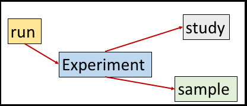
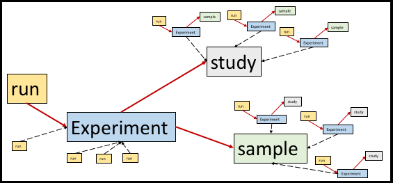

# Module 7: Submitting Experiment and Run objects

<!-- http://www.ebi.ac.uk/ena/data/view/SRX314869 -->

## A word about pointers

The interactive [Webin](https://www.ebi.ac.uk/ena/submit/sra/#home) submission system has an option for creating run and experiment objects ("submit reads and experiments": <a href="mod_01.html">mod 1</a> and <a href="mod_04.html">mod 4</a>) This interactive GUI provides a single spreadsheet template for both run and experiment objects: 1 row = 1 run, which points to 1 experiment object. This is the first time we are submitting objects in the programmatic modules that have pointers to other objects (because so far, an ENA study object does not have a pointer and neither does an ENA sample object).



Both the run and experiment objects have pointers. The run object has one pointer, to the experiment that it is using and the experiment object has two pointers, one to the source sample object it is using, and one to the study object that it belongs to. By this means, even though the study and sample objects do not have pointers, they are connected via a common experiment object. For this reason, when you create sample objects in the ENA they are not actually affiliated with any study until they are connected to an experiment object (or analysis object), which in turn does not usually come about until a run object is needed and there is a read file(s) to submit. It is acceptable to register your source samples with the ENA ahead of submitting raw data but do not assume they belong to a study if you have not added raw data, an assembled genome, or an analysis object!

Just as a sample object in the ENA can be likened to representing the source physical material that is being sequenced, then an experiment object represents the library solution that is created from the source sample and set up to run on a sequencing technology platform. Thus the experiment object contains details about sequencing platform and library protocols. A run object wraps raw read files so it can be likened to representing a lane on an NGS machine, or if the original lane is pooled then a run object represents the demultiplexed file for one source sample.

## Many to one object to object relationships

In real life you can create many libraries from a single source sample. The experiment points to the sample rather than the other way around so that multiple experiments can be added to one sample (not necessarily at the same time) without increasing the size of sample object or ever needing to update it (because the sample object does not need to store a list of experiments). The same is true for the relationship between run and experiment objects. You can run a single library (experiment) on multiple lanes (runs) (for instance, to obtain deeper coverage or to create technical replicates) so the run object points to the experiment object. The object that points/carries the pointer information is the object that can exist in multiples. Using the [Webin](https://www.ebi.ac.uk/ena/submit/sra/#home) GUI, it is not possible to submit many runs on a single experiment because a single spreadsheet table is used for creating the run **and** the experiment objects which means that there must always be a one to one relationship. This is acceptable and it makes the process simpler but it can sometimes be harder to represent your sequencing experiment accurately. Using the REST API to create run objects and experiment objects as separate XML files allows a higher degree of flexibility to represent your sequencing study as you designed it and this can also aid its interpretation by third party users of your data. Using the REST API you can also point new objects to objects that exist in deifferent accounts. For example for collaborations where sequencing, sample collecting and data analysis are divided between groups, the study can be built progressively accross individual accounts.



From the image above note how the metadata object model allows:

1. multiple runs to one experiment
2. multiple experiments to one study (by this rule, multiple runs and samples also occur per study)
3. multiple experiments to one sample (by this rule, one sample can exist in multiple studies)
4. objects submitted under different accounts can still be connected so that collaborators can contribute different parts of a project without a centralised submission effort.


## Some things to note

The main guide for submitting objects using the REST API is <a href="prog_01.html">here</a> in module 1. Module 1 describes submitting a study object but the same principle can be applied to <a href="prog_05.html">submitting sample objects</a> and now, submitting experiment and run objects.

### Order of submission

Previously we have submitted objects sets one at a time. One project, one set of samples. Here we will submit an experiment set and a run set at the same time so that they will obtain the same submission event id. This is not necessary- it is fine to submit the experiment set first and then later on a run set. However, if you submit a run set first it will not work because the system will not find the experiments that the runs are pointing to! There is no limitation on how many different sets you can submit at the same time. For each one you will be using a separate `<ACTION>` block containing 1 x `<ADD>` in the submission XML. The order is more important as mentioned. For example if you submit an experiment set that points to samples and/or study that you have yet to submit then the system will not accept the submission. 

```xml
<?xml version="1.0" encoding="UTF-8"?>
<SUBMISSION alias="mantis_religiosa_sub" center_name="">
   <ACTIONS>
      <ACTION>
         <ADD source="exp.xml" schema="experiment"/>
      </ACTION>
      <ACTION>
         <ADD source="run.xml" schema="run"/>
      </ACTION>
   </ACTIONS>
</SUBMISSION>
```

### Submitting in bulk

You will likely be submitting many experiments and many runs. As with <a href="prog_05.html#submitting-many-samples-simultaneously">samples</a>, you will have several `<RUN>` blocks inside a single <RUN_SET> block in one file (for example, called run.xml), and several `<EXPERIMENT>` blocks inside one <EXPERIMENT_SET> block in another file (for example, exp.xml).

```xml
<?xml version="1.0" encoding="US-ASCII"?>
<RUN_SET>
  <RUN alias="run_01" center_name="">
    <EXPERIMENT_REF refname="exp_01"/>
      <DATA_BLOCK>
      ...
      ...
      </DATA_BLOCK>
  </RUN>
  <RUN alias="run_02" center_name="">
    <EXPERIMENT_REF refname="exp_01"/>
      <DATA_BLOCK>
      ...
      ...
      </DATA_BLOCK>
  </RUN>
  <RUN alias="run_03" center_name="">
    <EXPERIMENT_REF refname="exp_02"/>
      <DATA_BLOCK>
      ...
      ...
      </DATA_BLOCK>
  </RUN>
  <RUN alias="run_04" center_name="">
    <EXPERIMENT_REF refname="exp_02"/>
      <DATA_BLOCK>
      ...
      ...
      </DATA_BLOCK>
  </RUN>
</RUN_SET>
```

```xml
<?xml version="1.0" encoding="US-ASCII"?>
<EXPERIMENT_SET>
  <EXPERIMENT alias="exp_01" center_name="">
  ...
  ...
  </EXPERIMENT>
  <EXPERIMENT alias="exp_02" center_name="">
  ...
  ...
  </EXPERIMENT>
</EXPERIMENT_SET>
```

In the above scenario there are 4 runs and 2 experiments. The first 2 runs are pointing to the first experiment and the second 2 to the second experiment. All other lines have been omitted for clarity.

### The pointers

The run points to the experiment. The pointer looks like this

`<EXPERIMENT_REF accession="ERX123456" refname="exp_mantis_religiosa"/>`

The *accession* and *refname* attributes are redundant. You do not need both of them and you should delete the one you are not using. The *refname* refers to the alias of the experiment (as you can see later). If the experiment is included in the same submission as the run (see <a href="#order-of-submission">*order of submission*</a> section) then using *refname* is fine (the experiment of course does not have an accession number anyway because it is not submitted yet). If the experiment has been submitted some time earlier then you can still use *refname* if you are using the same account, but you can also use accession instead. If your experiments are submitted via another account (for example, a collaborators account) then the refname/alias method of identifying objects is too ambiguous - many other objects in the ENA could have the same name as yours. In these cases you must always use *accession* attribute in the pointer.

The experiment points to the study and the sample. The pointers look like this

`<STUDY_REF accession="ERP123456" refname="insects_evolution"/>`

`<SAMPLE_DESCRIPTOR accession="ERS123456" refname="mantis_religiosa"/>`

Similar to the experiment pointer in the run objects, you should delete the attribute that you are not using, either *refname* or *accession* and remember you can only use the *accession* attribute if the object exists in the ENA (or it will not have an accession) and particularly if the object is not in the same account that you are using. 

If you are using the *accession* attribute instead of *refname* you can use ERP style study accessions as well as PRJEB style study accessions, and you can use the ERS style of sample accessions as well as the SAMEA style of accessions. Study accessions are discussed in <a href="prog_04.html#erp-version">module 4</a>. 

### The read files

A run object is a wrapper for the read files. Note the `<FILES>` block in the run XML. This references the files that are being submitted. In this example, a paired experiment is being pointed to and so the run can have 2 read files. This is typical for FastQ files where the forward and the reverse reads can occupy separate files. More information on files and their formatting can be found <a href="http://www.ebi.ac.uk/ena/submit/read-file-formats">here</a>. The files referenced in the run must exist in your account directory on the ENA ftp server. When you submit the run objects the files will be moved from the ftp server into a staging area for processing. You can upload the file to the root of your account directory on the ftp server or you can create directories. In this example the files exist in a directory called 'insect'. If the files are uploaded to the root then simply use the file names without any prefix. Your access to the ENA ftp server is linked to your account. See <a href="http://www.ebi.ac.uk/ena/about/sra_data_upload">here</a> for more information.

```xml
            <FILES>
                <FILE filename="insect/mantis_religiosa_R1.fastq.gz" filetype="fastq" checksum_method="MD5" checksum="9b8932f85caa54e687eba62fca3edce2">
                </FILE>
                <FILE filename="insect/antis_religiosa_R2.fastq.gz" filetype="fastq" checksum_method="MD5" checksum="183d6a24e0c3704e993bebe75bbbd989">
                </FILE>
            </FILES>

```

We need to check the integrity of the file transfer so you must also include md5 checksums for each file. However you can add these as individual checksum files to your ftp directory in which case you can omit the *checksum* attribute from the FILE element. See <a href="file_prep.html">here</a> for more about how to prepare read files before run submission.

### Library information

The experiment object contains a `<LIBRARY_DESCRIPTOR>` block in order to provide some basic annotation to the library which can assist users of your data to analyse, build and interpret. The elements: LIBRARY_STRATEGY, LIBRARY_SOURCE and LIBRARY_SELECTION must be used in your experiment objects and the values must be from the registered XML schema <a href="ftp://ftp.sra.ebi.ac.uk/meta/xsd/sra_1_5/SRA.experiment.xsd">here</a>

```xml
           <LIBRARY_DESCRIPTOR>
                <LIBRARY_NAME/>
                <LIBRARY_STRATEGY>RNA-Seq</LIBRARY_STRATEGY>
                <LIBRARY_SOURCE>TRANSCRIPTOMIC</LIBRARY_SOURCE>
                <LIBRARY_SELECTION>cDNA</LIBRARY_SELECTION>
                <LIBRARY_LAYOUT>
                    <PAIRED NOMINAL_LENGTH="250"  NOMINAL_SDEV="30"/>
                </LIBRARY_LAYOUT>
                <LIBRARY_CONSTRUCTION_PROTOCOL>Messenger RNA (mRNA) was isolated using the Dynabeads mRNA Purification Kit (Invitrogen, Carlsbad Ca. USA) and then sheared using divalent cations at 72*C. These cleaved RNA fragments were transcribed into first-strand cDNA using SuperScript?II Reverse Transcriptase (Invitrogen, Carlsbad Ca. USA) and N6 primer (IDT). The second-strand cDNA was subsequently synthesized using RNase H (Invitrogen, Carlsbad Ca. USA) and DNA polymerase I (Invitrogen, Shanghai China). The double-stranded cDNA then underwent end-repair, a single `A? base addition, adapter ligati
                    on, and size selection on anagarose gel (250 * 20 bp). At last, the product was indexed and PCR amplified to finalize the library prepration for the paired-end cDNA.</LIBRARY_CONSTRUCTION_PROTOCOL>
            </LIBRARY_DESCRIPTOR>
```

The above example is a paired experiment. If you are submitting a single ended experiment then you can replace `<PAIRED NOMINAL_LENGTH="250"  NOMINAL_SDEV="30"/>` with `<SINGLE`.
The attribute *PAIRED NOMINAL_LENGTH* is the average insert size. It is not the length of the reads (we will count the read lengths from the files). The insert size is the average size of the fragments that are being sequenced. The attribute *NOMINAL_SDEV* is the standard deviation of the fragment lengths about the mean (insert size). The attribute *NOMINAL_SDEV* is not mandatory so you can omit it if you do not have this detail.

### The spot descriptor

This block is not present in the experiment that we are submitting in this module because it is not needed. 

```xml
            <SPOT_DESCRIPTOR>
                <SPOT_DECODE_SPEC>
                    <SPOT_LENGTH>300</SPOT_LENGTH>
                    <READ_SPEC>
                        <READ_INDEX>0</READ_INDEX>
                        <READ_CLASS>Application Read</READ_CLASS>
                        <READ_TYPE>Forward</READ_TYPE>
                        <BASE_COORD>1</BASE_COORD>
                    </READ_SPEC>
                    <READ_SPEC>
                        <READ_INDEX>1</READ_INDEX>
                        <READ_CLASS>Application Read</READ_CLASS>
                        <READ_TYPE>Reverse</READ_TYPE>
                        <BASE_COORD>151</BASE_COORD>
                    </READ_SPEC>
                </SPOT_DECODE_SPEC>
            </SPOT_DESCRIPTOR>
```

The spot descriptor describes how the reads are laid out. For example, going in the 5' to 3' direction there may be a ligand adapter, barcode, primer and then the biological read in the forward direction followed by the biological in the reverse direction. Once submitted, all originally submitted files are converted into a standardised fastq product which should contain only biological reads. The spot descriptor is used to remove the technical reads. Spot descriptors can be the source of confusion and mistakes so we ask that reads (particularly those in fastq files) are stripped of all technical elements. This means that you do not need to provide a spot descriptor. The ENA system will add a simple spot descriptor to the experiment object automatically after it is submitted. It can work this out from the file. The one above is the sort of spot descriptor that gets added. It describes a read file without technical elements. The total length is 300 bp and the forward read is half that (ending at base coordinate 150 and the reverse read continues from base coordinate 151. It is possible to create a simple spot descriptor from the read files because the <a href="http://www.ebi.ac.uk/ena/submit/read-file-formats#fastq_format">specifications</a> dictate that forward and reverse reads are separated. 

Certain file types are not so easy to edit out the technical reads. Or you may have decided that the technical elements are an important part of the experiment. In these cases you can create a spot descriptor to explain how the reads in your read files are laid out. The spot descriptor language is described in the official <a href="ftp://ftp.sra.ebi.ac.uk/meta/xsd/sra_1_5/SRA.experiment.xsd">experiment schema</a>.

### Experiment and Run attributes

Attribute blocks exist for all ENA objects including study, sample, experiment, run and analysis. They typically look like this, where you replace the `%%%%%` depending on what kind of object you are annotating. 

```
<%%%%%%_ATTRIBUTE>
   <TAG>library preparation date</TAG>
   <VALUE>2010-08</VALUE>
</%%%%%%_ATTRIBUTE>
```

You can see the sample in <a href="prog_05.html#what-does-the-xml-file-look-like">module 5</a> has many attributes helping to provide more context for analysis of the data that is attached to it, particulary for comparison with other samples. Annotations using attribute blocks should fit the type of object. For sample objects you would expect annotations related to the source physical material and its collection. For an experiment object you would expect annotations related to the library solution and for a run object you would expect annotations related to the NGS machine run. 

ENA will add attributes to your objects after you have submitted them. For example, after the files are processed their statistics (for example file size in bytes and read count) will go into the run object as run attributes. While the ENA provides lists of <a href="http://www.ebi.ac.uk/ena/submit/checklists">recommended attributes</a> for many types of samples, experiments and runs are less tightly controlled. But you can provide your own annotations to experiment and run objects by using these attribute blocks. For some larger collaborations you may find that we will recommend a specific set of annotations/attributes but otherwise you are free to create your own.

## The XMLs

So this is what our experiment and its run looks like before submission. The run is pointing to the experiment using its alias. It is pointing to an existing sample using the sample's accession and an existing study using its accession. If you want to reference the study and/or sample by their alias instead of their accession you can use `refname="alias_of_object_in_question"` instead but then the study and sample being references must be in the same account scope. You may be submitting a study and a sample at the same time as this experiment and run in which case you would be referecning everything by its alias because of course no accessions have been administered yet!


```xml
<?xml version="1.0" encoding="US-ASCII"?>
<EXPERIMENT_SET xmlns:xsi="http://www.w3.org/2001/XMLSchema-instance"
    xsi:noNamespaceSchemaLocation="ftp://ftp.sra.ebi.ac.uk/meta/xsd/sra_1_5/SRA.experiment.xsd">
    <EXPERIMENT alias="exp_mantis_religiosa" center_name="">
        <TITLE>The 1KITE project: evolution of insects</TITLE>
        <STUDY_REF accession="SRP017801"/>
        <DESIGN>
            <DESIGN_DESCRIPTION/>
            <SAMPLE_DESCRIPTOR accession="SRS462875"/>
            <LIBRARY_DESCRIPTOR>
                <LIBRARY_NAME/>
                <LIBRARY_STRATEGY>RNA-Seq</LIBRARY_STRATEGY>
                <LIBRARY_SOURCE>TRANSCRIPTOMIC</LIBRARY_SOURCE>
                <LIBRARY_SELECTION>cDNA</LIBRARY_SELECTION>
                <LIBRARY_LAYOUT>
                    <PAIRED NOMINAL_LENGTH="250" NOMINAL_SDEV="30"/>
                </LIBRARY_LAYOUT>
                <LIBRARY_CONSTRUCTION_PROTOCOL>Messenger RNA (mRNA) was isolated using the Dynabeads
                    mRNA Purification Kit (Invitrogen, Carlsbad Ca. USA) and then sheared using
                    divalent cations at 72*C. These cleaved RNA fragments were transcribed into
                    first-strand cDNA using SuperScript?II Reverse Transcriptase (Invitrogen,
                    Carlsbad Ca. USA) and N6 primer (IDT). The second-strand cDNA was subsequently
                    synthesized using RNase H (Invitrogen, Carlsbad Ca. USA) and DNA polymerase I
                    (Invitrogen, Shanghai China). The double-stranded cDNA then underwent
                    end-repair, a single `A? base addition, adapter ligati on, and size selection on
                    anagarose gel (250 * 20 bp). At last, the product was indexed and PCR amplified
                    to finalize the library prepration for the paired-end
                    cDNA.</LIBRARY_CONSTRUCTION_PROTOCOL>
            </LIBRARY_DESCRIPTOR>
        </DESIGN>
        <PLATFORM>
            <ILLUMINA>
                <INSTRUMENT_MODEL>Illumina HiSeq 2000</INSTRUMENT_MODEL>
            </ILLUMINA>
        </PLATFORM>
        <EXPERIMENT_ATTRIBUTES>
            <EXPERIMENT_ATTRIBUTE>
                <TAG>library preparation date</TAG>
                <VALUE>2010-08</VALUE>
            </EXPERIMENT_ATTRIBUTE>
        </EXPERIMENT_ATTRIBUTES>
    </EXPERIMENT>
</EXPERIMENT_SET>
```

```xml
<?xml version="1.0" encoding="US-ASCII"?>
<RUN_SET xmlns:xsi="http://www.w3.org/2001/XMLSchema-instance"
 xsi:noNamespaceSchemaLocation="ftp://ftp.sra.ebi.ac.uk/meta/xsd/sra_1_5/SRA.run.xsd">
    <RUN alias="run_mantis_religiosa" center_name="">
        <EXPERIMENT_REF refname="exp_run_mantis_religiosa"/>
        <DATA_BLOCK>
            <FILES>
                <FILE filename="mantis_religiosa_R1.fastq.gz" filetype="fastq"
                    checksum_method="MD5" checksum="9b8932f85caa54e687eba62fca3edce2"/>
                <FILE filename="antis_religiosa_R2.fastq.gz" filetype="fastq"
                    checksum_method="MD5" checksum="183d6a24e0c3704e993bebe75bbbd989"/>
            </FILES>
        </DATA_BLOCK>
    </RUN>
</RUN_SET>
```

Use the <a href="ftp://ftp.sra.ebi.ac.uk/meta/xsd/sra_1_5/SRA.experiment.xsd">official schema for experiment</a> to format the `<PLATFORM>` block and apply the `<INSTRUMENT_MODEL>` element from a controlled vocabulary. The schema also provides controlled vocabularies for elements in the `<LIBRARY_DESCRIPTOR>` block. Ideally you will using an XML editor which can check your XML files against the schema as you type. The schema for the run is <a href="ftp://ftp.sra.ebi.ac.uk/meta/xsd/sra_1_5/SRA.run.xsd">here</a>.

## The submission and the receipt

As mentioned, review the original study submission module to know the submission process using the REST API. In this case, the submission XML looks like this, assuming the above experiment is in a file called exp.xml and the above run is saved in a file called run.xml.

```xml
<?xml version="1.0" encoding="UTF-8"?>
<SUBMISSION alias="mantis_religiosa_submission" center_name="">
   <ACTIONS>
      <ACTION>
         <ADD source="exp.xml" schema="experiment"/>
      </ACTION>
      <ACTION>
         <ADD source="run.xml" schema="run"/>
      </ACTION>
   </ACTIONS>
</SUBMISSION>
```

A cURL command would look something like this
```bash
curl -u username:password -F "SUBMISSION=@sub.xml" -F "EXPERIMENT=@exp.xml" -F "RUN=@run.xml" "https://www-test.ebi.ac.uk/ena/submit/drop-box/submit/"
```

And the receipt should look something like this

```xml
<?xml version="1.0" encoding="UTF-8"?>
<?xml-stylesheet type="text/xsl" href="receipt.xsl"?>
<RECEIPT receiptDate="2017-08-11T15:07:36.746+01:00" submissionFile="sub.xml" success="true">
    <EXPERIMENT accession="ERX2151578" alias="exp_mantis_religiosa" status="PRIVATE"/>
    <RUN accession="ERR2094164" alias="run_mantis_religiosa" status="PRIVATE"/>
    <SUBMISSION accession="ERA986371" alias="mantis_religiosa_submission"/>
    <MESSAGES>
        <INFO>This submission is a TEST submission and will be discarded within 24 hours</INFO>
    </MESSAGES>
    <ACTIONS>ADD</ACTIONS>
    <ACTIONS>ADD</ACTIONS>
</RECEIPT>
```

Remember that anything submitted to the test server at www-test.ebi.ac.uk will not persist and you can use the production server at www.ebi.ac.uk when you are happy with the results.

