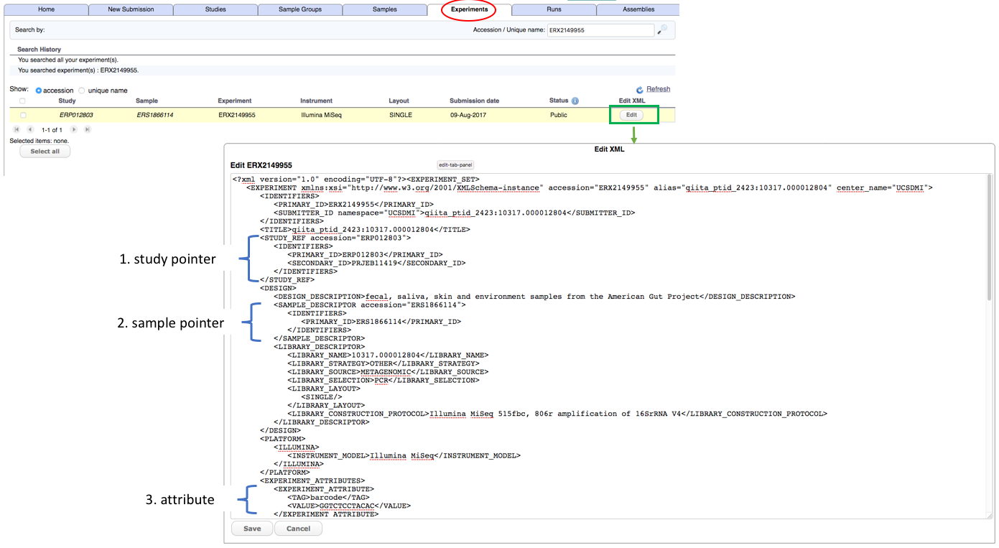
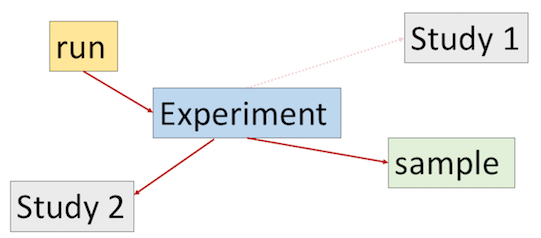
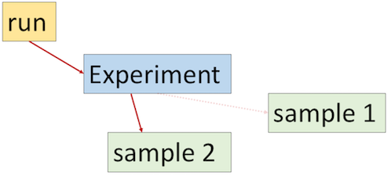
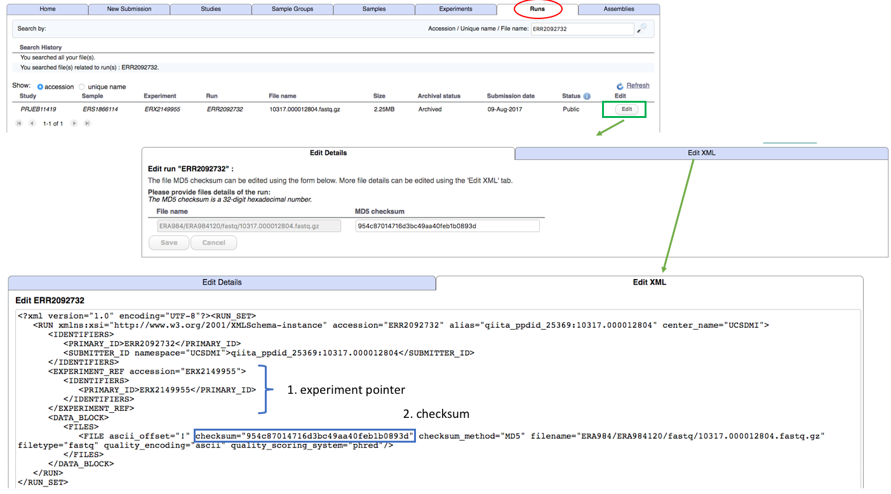

# Module 8: Update sequence read metadata

<!-- ERX2149955 ERR2092732  -->

Editing existing experiments in the ENA using the REST API is an almost identical process to submitting new experiment objects by XML REST API. This is outlined in <a href="prog_07.html">module 7</a> of this section and it is necessary to review module 7 before following this tutorial which is shortened to avoid repeating the same information. There are also similarities to updating other ENA objects such as samples and study so where necessary, previous examples will be referred to. 

## What needs changing?

It is possible to update experiment and runs in their XML format using <a href="https://www.ebi.ac.uk/ena/submit/sra/#home">Webin</a> but because you can only enter each object one at a time you can not use this interface for editing in bulk or for building an update pipeline. For a few one off changes however, this route is recommended. But what are you most likely to need to change?




Experiment objects can be updated to include more information about the library protocol or to change one of the existing library descriptors (library selection, library strategy or library source). They can also be edited to change the architecture of a study because of their 2 pointers: the study pointer (located at number 1 in image above), and the sample pointer (located at number 2 in image above). By changing the study pointer to point to a different existing study, all runs that are using that experiment will subsequently be associated to a different study as will the sample that the experiment is pointing to. Similarly, if you change the sample pointer then the run that is pointing to the experiment will subsequently be linked to a different existing sample. Run objects do not point to sample objects directly so to change the affiliation between read files and source samples, you should change the experiment pointer. The final part of an experiment that you might edit is one or more of the attributes (located at number 3 in the image above). You can also add and remove attributes but do not change any attributes that have been added by ENA since the experiment submission. Only edit your own attributes.



Move a run and an experiment to a different study by changing the experiment's study pointer.



Move a run to a different sample by changing the experiment's sample pointer.

A run object is a wrapper for a read file or pair of read files. It is mainly locked from making any changes because it represents the read file itself - which does not change. If you do need to change a read file it is problematic due to the way it is archived with the ENA and other mirrored archives. It is usually easier to create a new run to wrap the modified read file and submit that. The new run can be pointed to the original source library/experiment so that searches on the source sample or source experiment will still return the correct runs and any replacement runs will become part of the study in the same way that the previous runs did. The previous run, now redundant because it is replaced with another, should be cancelled. More on this in the future but for now you can contact the ENA to have a run object cancelled.

There are still some elements in a run object that can be changed. The run points to an experiment object and via this experiment object it is affiliated to a source sample. You can change this pointer (located at position 1 in the picture below) to a different existing experiment object. You can also change the registered checksum for the read file. If you try to make your edits using <a href="https://www.ebi.ac.uk/ena/submit/sra/#home">Webin</a> you will see that a web form is available to change the registered checksum (after you have selected the run in the run tab). However, from there you can also access the XML to make your changes directly if preferred (see below image).



## Step 1: Get hold of XML files

To update a set of experiments (or any other object) you need to have them altogether in one file. That is, one file per object set: all runs in one file, all experiments in another file, all samples in a separate file etc ...). If you submitted your experiments using XML REST API then you can re use the experiment XML file that you have from the original submission. If not, there are a few ways that you can get hold of your experiments (and runs) in XML format. These options are the same as obtaining <a href="prog_06.html#step-1-get-hold-of-the-samples-in-xml-format">sample xmls</a> and so do not need to be repeated in this module.

### Identifiers

The first part of an experiment looks like this

```
    <EXPERIMENT alias="saliva_lib_01" center_name="EBI" accession="ERX123456">
        <IDENTIFIERS>
            <PRIMARY_ID>ERX123456</PRIMARY_ID>
            <SUBMITTER_ID namespace="EBI">saliva_lib_01</SUBMITTER_ID>
        </IDENTIFIERS>
```

Note how attributes `alias`, `center_name` and `accession` are repeated in the `<IDENTIFIERS>` block. The `<IDENTIFIERS>` block is automatically added after submission time so if you are using original pre submission XMLs you will not see it. You won't see the accession if you are using pre-submission XMLs either. The accession is not necessary because the experiment that needs editing is identifiable by the alias (within your account scope) but if you want to change the alias itself you will need the accession so that the correct object can be identified. Having two of everything can be cumbersome when editing because you must remember to change the first line *AND* the value in the identifiers block. It is highly recommended to remove the identifiers block so that only one of each attribute exists. The attributes block will get added back after the submission/update. 

A general rule when editing (apart from the `<IDENTIFIERS>` block) is to only edit features that you added at submission time. If extra things have been added by the ENA you are best to leave these alone. The other exception to this rule is if you are using a live browser version of the experiment. In this case you should strip the browser specific blocks, as explained in the <a href="prog_06.html#grab-a-live-version-of-your-samples">sample update module</a>.

The pointers have `<IDENTIFIERS>` blocks too. It is especially important to remove them when changing the pointers because you risk pointing to a new sample (for example) *AND* the original sample at the same time.

```xml
            <SAMPLE_DESCRIPTOR accession="ERS123456">
                <IDENTIFIERS>
                    <PRIMARY_ID>ERS123456</PRIMARY_ID>
                </IDENTIFIERS>
            </SAMPLE_DESCRIPTOR>
```

The above pointer can simply be changed to 

`<SAMPLE_DESCRIPTOR accession="ERS123456"/>`

or

`<SAMPLE_DESCRIPTOR refname="sample_name"/>`

Where *sample_name* is the alias of the sample object.

## Step 2: Create the submission XML

To update the experiment or run, you need an accompanying submission XML in a separate file. Let's call this file `submission.xml`.

```xml 
 <?xml version="1.0" encoding="UTF-8"?>
<SUBMISSION>
   <ACTIONS>
      <ACTION>
         <MODIFY/>
      </ACTION>
   </ACTIONS>
</SUBMISSION>
```
 
The submission XML declares one or more Webin submission service actions. In this case 
the action is `<MODIFY/>` which is used to update existing objects. 
The XMLs can be submitted programmatically, using CURL on command line or using the 
[Webin XML and reports portal](prog_11.html). 

## Step 3: Submit the XMLs

The final step is identical to submitting an experiment or run for the first time. 
The only difference is in the contents of the `experiment.xml`, `run.xml` and `submission.xml` files. 

Please refer to [Submit sequence reads](prog_07.html) for further XML submission instructions. 
Note that the returned Receipt XML will contain the `MODIFY` action rather that the `ADD` action:
 
 ```
    ...
    <ACTIONS>MODIFY</ACTIONS>
    ...
```
