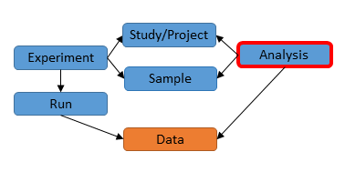

# Module 9: Submit Analysis Data

## Introduction

Previously we have discussed different metadata objects from studies and samples to runs and
experiments, and explained how experiments and runs are used to include sequence read data 
into the archive.

Similarly, the `analysis` object is associated with studies and samples and can be
used to include data of various other types into the archive, for example, 
genome and transcriptome assemblies.

The analysis XML format is defined by [SRA.analysis.xsd](ftp://ftp.sra.ebi.ac.uk/meta/xsd/sra_1_5/SRA.analysis.xsd)
XML Schema. 

## Object relationships

Analysis object is associated with other objects.



Most analyses are part of a study. Studies are used to group together analyses to
allow them to be cited together in a publication.

Many analyses are assocated with a sample. Analyses point to samples to
allow sharing of sample information between multiple experiments.

To summarise main object relationships:

2. One or more analyses may be part of a study.
3. One or more analyses may be associated with a sample.

Additionally, analyses may refer to experiments and runs.

## Analysis XML: part of study

An analysis points to the study it is part of using the `<STUDY_REF>` element.
This can be done either by using an accession:

```
<STUDY_REF accession="ERP123456"/>
```

or a name within the submitter's account:

```
<STUDY_REF refname="mantis_religiosa"/>
```

## Analysis XML: associated with sample

An analysis can be associated with one or more samples using the `<SAMPLE_REF>` element
either using an accession or alias to refer to the sample.

## Analysis XML: associated with experiment and run

An analysis can be associated with any number of experiments or runs using the `<EXPERIMENT_REF>` 
and `<RUN_REF>` elements. Again, either an accession or alias can be used in the reference.

This makes it possible to analyse reads available in the ENA, submit the 
results as a new analysis XML, and link the analysis XML back to the sequence reads used 
for the analysis.

## Analysis XML: the `<FILES>` block

Like the run object, the analysis object has a `<FILES>` block. The analysis and the run XML both serve the same 
main purpose which is to submit data files into the archive. However, while a run always represents sequence reads, 
an analysis can be used to archive many different types of data.

For example, a genome assembly (`SEQUENCE_ASSEMBLY`) analysis type allows contigs to be submitted as a `fasta` file:

```
<FILES>
    <FILE filename="contigs.fasta.gz" filetype="fasta"
        checksum_method="MD5" checksum="89285db287f188d59d494475d75664a4"/>
</FILES>
```

Note that the XML schema restricts the file types which can be provided in the `filetype` attribute. 

The Webin submission service further limits the use of these file types for specific analysis
purposes.

## Analysis XML: analysis types

The most distinguishing part of an analysis object is contained in the `<ANALYSIS_TYPE>` block. 
The content of this block determines the type of data the analysis should contain and 
how it will be validated by ENA after it has been submitted.

## Analysis XML: attributes

Additional annotation can be provided for analyses using `ANALYSIS_ATTRIBUTE` elements in
the XML:

    <ANALYSIS_ATTRIBUTE>
       <TAG>library preparation date</TAG>
       <VALUE>2010-08</VALUE>
    </ANALYSIS_ATTRIBUTE>
         
## Upload data files

Please see [Data Uploads](http://www.ebi.ac.uk/ena/about/sra_data_upload).

You must have uploaded data files into your Webin upload area before you can
submit them using an analysis XML. Once the analysis has been submitted the data files
will be moved from the Webin upload area into the archive.

You can upload your data files to the root directory of your upload area or you can
create subdirectories and upload your files there.

If the files are uploaded to the root directory
then simply enter the file name in the Analysis XML when referring to it:

```
<FILE filename="a.bam" ... />
```

If the files are uploaded into a subdirectory (e.g. `mantis_religiosa`) then prefix the file name
with the name of the subdirectory:

```
<FILE filename="mantis_religiosa/a.bam" ... />
```

## Create Analysis XML

You can find below specific instructions for creating analysis XMLs for different
types of analyses.

### Genome Assembly

Analysis type `<SEQUENCE_ASSEMBLY>` is for submitting genome assemblies to ENA.

Genome assemblies must be associated with a study and sample. Except for metagenomes, 
the study and sample should be uniquely associated with a genome assembly. Updated
versions of the a genome should use the same study and sample as the initial assembly.

Which data files are required is dependent on the level of assembly (see
[Genome Assembly Data Formats](format_02.html)).

In the example below there are four files which make up the genome assembly submission: 
cryptosporidium.embl.gz, crypto.agp.gz, chromosome.txt.gz and unassigned_list.txt.gz: 

```xml
<ANALYSIS_SET>
    <ANALYSIS alias="wgs_C_hominis">
        <TITLE>Whole genome shotgun sequencing of a human-derived isolate of C. hominis</TITLE>
        <DESCRIPTION>Whole genome shotgun sequencing of a human-derived isolate of C.
            hominis</DESCRIPTION>
        <STUDY_REF accession="PRJEAXXXX"/>
        <SAMPLE_REF accession="ERSXXXXXX"/>
        <ANALYSIS_TYPE>
            <SEQUENCE_ASSEMBLY>
                <NAME>C.hominis.v1</NAME>
                <COVERAGE>68</COVERAGE>
                <PROGRAM>Newbler</PROGRAM>
                <PLATFORM>454FLX+, Illumina Miseq</PLATFORM>
            </SEQUENCE_ASSEMBLY>
        </ANALYSIS_TYPE>
        <FILES>
            <FILE filename="c_hominis/cryptosporidium.embl.gz" filetype="chromosome_flatfile"
                checksum_method="MD5" checksum="c0278da790b41f7efa43d7ea67c1ae1e"/>
            <FILE filename="c_hominis/crypto.agp.gz" filetype="chromosome_agp" checksum_method="MD5"
                checksum="5d65f8d8cf5b0f603df0d9db9c1ff003"/>
            <FILE filename="c_hominis/chromosome.txt.gz" filetype="chromosome_list"
                checksum_method="MD5" checksum="ee0d12a4d1afbf0e1fb731be595cef72"/>
            <FILE filename="c_hominis/unassigned_list.txt.gz" filetype="unlocalised_contig_list"
                checksum_method="MD5" checksum="89285db287f188d59d494475d75664a4"/>
        </FILES>
    </ANALYSIS>
</ANALYSIS_SET>
```

Remember that the above analysis XML is an example. You must provide your own details
in the analysis XML. 

### Sequence Variation

Analysis type `<SEQUENCE_VARIATION>` is for submitting variation files into the archive by EVA.

Sequence variation analyses must be associated with a study and can be assocated with
one or more samples. The analyses may also point to sequencing experiments or runs
as in the following example:

```xml
<ANALYSIS_SET>
   <ANALYSIS alias="vcf_sub">
      <TITLE>HipSci WGS GATK HC callset (sample HPSI0614pf-miaj)</TITLE>
      <DESCRIPTION>HipSci whole-genome-sequence GVCF calls generated by GATK haplotype caller</DESCRIPTION>
      <STUDY_REF accession="PRJEB15299"/>
      <SAMPLE_REF accession="ERS1461604"/>
      <RUN_REF accession="ERR1560532"/>
      <RUN_REF accession="ERR1860029"/>
      <ANALYSIS_TYPE>
         <SEQUENCE_VARIATION>
            <ASSEMBLY>
               <STANDARD accession="GCA_000001405.1" refname="GRCh37"/>
            </ASSEMBLY>
            <SEQUENCE accession="CM000663.1" label="1"/>
            <SEQUENCE accession="CM000686.1" label="Y"/>
            <EXPERIMENT_TYPE>Whole genome sequencing</EXPERIMENT_TYPE>
         </SEQUENCE_VARIATION>
      </ANALYSIS_TYPE>
      <FILES>
         <FILE checksum="59d4ba85660c29d9a52a1ad6765ca75f" checksum_method="MD5" filename="HPSI0614pf-miaj.wgs.gatk.haplotype_caller.20161201.genotypes.vcf.gz.tbi" filetype="tabix"/>
         <FILE checksum="4b9e4c631aeb3efb49f6350f42f31c01" checksum_method="MD5" filename="HPSI0614pf-miaj.wgs.gatk.haplotype_caller.20161201.genotypes.vcf.gz" filetype="vcf"/>
      </FILES>
   </ANALYSIS>
</ANALYSIS_SET>

```

Notice that the VCF is using reads from several sequencing runs.
The VCF file maps variant calls according to there position in a reference.  The
`<ASSEMBLY>` and `<SEQUENCE>` blocks allow the VCF file identifiers to be associated with ENA accessions.
 For example, the VCF file in the example has this in the header:

```
##contig=<ID=1,length=249250621>
##contig=<ID=Y,length=59373566>
```

The header refers to a contig called '1' and the analysis XML is used to associate the contig '1' with 
the ENA sequence 'CM000663'.  

In the same way, samples can be associated with ENA accessions using the `label` attribute in `<SAMPLE_REF>`:

```xml
<SAMPLE_REF accession="ERS1461604" label="19933_4#3"/>
```

The '19933_4#3' is the name for the sample used in the VCF file.

### Read Alignments

Analysis type `<REFERENCE_ALIGNMENT>` is for submitting read alignments.

Please note that the reads used in the alignment should already have been submitted following 
instructions in [Submit Read Data](prog_07.html).

Read alignment analyses must be associated with a study and can be assocated with
one or more samples. The analyses may also point to sequencing experiments or runs
as in the following example:

```xml
<?xml version="1.0" encoding="US-ASCII"?>
<ANALYSIS_SET>
    <ANALYSIS alias="AD0370_C_alignment">
        <TITLE>The Anopheles gambiae 1000 Genomes Project - Phase 1 - Alignment - Crosses</TITLE>
        <DESCRIPTION>Sequence alignments from the AR3 data release from the Anopheles 1000 genomes
            project. Aligments are in bam format and are presented for each of the 80 A. gambiae
            specimens comprising parents and progeny of four crosses.</DESCRIPTION>
        <STUDY_REF accession="ERP020641"/>
        <SAMPLE_REF accession="ERS150992" label="AD0370-C""/>
        <RUN_REF accession="ERR178314" label="8149_4_48"/>
        <RUN_REF accession="ERR178374" label="8177_1_48"/>
        <RUN_REF accession="ERR178386" label="8177_2_48"/>
        <ANALYSIS_TYPE>
            <REFERENCE_ALIGNMENT>
                <ASSEMBLY>
                    <STANDARD accession="GCA_000005575.1" label="AgamP3"/>
                </ASSEMBLY>
                <SEQUENCE accession="CM000356.1" label="2L"/>
            </REFERENCE_ALIGNMENT>
        </ANALYSIS_TYPE>
        <FILES>
            <FILE checksum="bafe0ed9be5c0f8515cdc4ac514d24af" checksum_method="MD5"
                filename="AD0370_C.bam" filetype="bam"/>
        </FILES>      
    </ANALYSIS>
</ANALYSIS_SET>
```

The BAM file aligns reads from three sequencing runs to the reference genome 'GCA_000005575'
and has three read group tags defined in its header that each represent one run:

```
@RG	ID:8149_4_48	PL:ILLUMINA	PU:8149_4_48	LB:AD0370_C_5557918	DS:AGPED1	SM:AD0370-C	CN:SC
@RG	ID:8177_1_48	PL:ILLUMINA	PU:8177_1_48	LB:AD0370_C_5557918	DS:AGPED1	SM:AD0370-C	CN:SC
@RG	ID:8177_2_48	PL:ILLUMINA	PU:8177_2_48	LB:AD0370_C_5557918	DS:AGPED1	SM:AD0370-C	CN:SC
```

The alignments are associated with the original sequence reads using `label` and `accession`
attributes in `RUN_REF` element:

```
<RUN_REF accession="ERR178314" label="8149_4_48"/>
<RUN_REF accession="ERR178374" label="8177_1_48"/>
<RUN_REF accession="ERR178386" label="8177_2_48"/>
```

All three read groups are derived from the same sample which is associated to the `SAMPLE_REF` 
using the `label` attribute:

```
<SAMPLE_REF accession="ERS150992" label="AD0370-C""/>
```

The BAM header contains a single assembly and a reference sequence:

```
@HD	VN:1.4	GO:none	SO:coordinate
@SQ	SN:2L	LN:49364325	UR:http://www.vectorbase.org/content/anopheles-gamb
iae-pestchromosomesagamp3fagz	AS:AgamP3	M5:a4da4bafa82830c0a418c5a42138377b
	SP:Anopheles gambiae
```

The analysis XML associates the assembly and the reference sequence with ENA accessions 
using the `label` and `accession` attributes: 

```
<ANALYSIS_TYPE>
    <REFERENCE_ALIGNMENT>
        <ASSEMBLY>
            <STANDARD accession="GCA_000005575.1" label="AgamP3"/>
        </ASSEMBLY>
        <SEQUENCE accession="CM000356.1" label="2L"/>
    </REFERENCE_ALIGNMENT>
</ANALYSIS_TYPE>
```

### BioNano maps 

Analysis type `<GENOME_MAP>` is for submitting BioNano optical map data to ENA.

Optical maps must be associated with a study and a sample.

Here is an example of an analysis XML:

```xml
<ANALYSIS_SET>
    <ANALYSIS alias="es_omd">
        <TITLE>Euclidium syriacum BioNano Optical Mapping data</TITLE>
        <DESCRIPTION>Euclidium syriacum Optical Mapping data produced by BioNano Genomics Irys System</DESCRIPTION>
        <STUDY_REF accession="ERP018601"/>        
        <SAMPLE_REF accession="ERS1436420"/>      
        <ANALYSIS_TYPE>
            <GENOME_MAP>
                <PROGRAM>IrysView</PROGRAM>
                <PLATFORM>BioNano</PLATFORM>
            </GENOME_MAP>
        </ANALYSIS_TYPE>
        <FILES>
            <FILE filename="Euclidium_syriacum.Run-01.bnx.gz" filetype="BioNano_native" checksum_method="MD5" checksum="ff9dd3a61d88092cb74ff8227ed725aa"/>
        </FILES>
    </ANALYSIS>
</ANALYSIS_SET>
```

Note that the `filetype` must be `"BioNano_native"` and must refer to one of the following files:

- CMAP: The BioNano Genomics Irys .cmap file is a raw data view reporting a label site position within a genome map.
- XMAP: The BioNano Genomics Irys .xmap file is a cross-comparison derived from the alignment between an anchor .cmap file and a query .cmap file.
- SMAP: The BioNano Genomics Irys .smap file is a description of structural variations (SV) derived from the alignment between an anchor .cmap file and a query .cmap file.
- BNX: The BioNano Genomics Irys .bnx file is a raw data view of molecule and label information and quality scores per channel.
- COORD: The .coord file relates the coordinates of scaffolds in a hybrid assembly to a corresponding sequences.

For full details of the BioNano data files please refer to [Bionano Solve](https://bionanogenomics.com/support-page/bionano-solve/) documentation.

### Sequence Annotation

Analysis type `<SEQUENCE_ANNOTATION>` is for submitting sequence annotation files. 
These are usually tab files. Examples include gene count and OTU tables from metagenomic studies.

Sequence annotation analyses must be associated with a study and at most one sample.

Here is an example of an analysis XML:

```xml
<ANALYSIS_SET>
    <ANALYSIS alias="YF3059">
        <TITLE>Y chromosome sequence STR analysis using lobSTR</TITLE>
        <DESCRIPTION>Y chromosome sequence STR analysis using lobSTR</DESCRIPTION>
        <STUDY_REF accession="ERP011288"/>
        <SAMPLE_REF accession="ERS1023190"/>
        <RUN_REF accession="ERR1198112"/>
        <ANALYSIS_TYPE>
            <SEQUENCE_ANNOTATION/>
        </ANALYSIS_TYPE>
        <FILES>
            <FILE filename="STR_for_YF03059_20151228.tab.gz" filetype="tab" checksum_method="MD5"
                checksum="9f2976d079c10b111669b32590d1eb3e"/>
        </FILES>
    </ANALYSIS>
</ANALYSIS_SET>
```

### PacBio Methylation Data

Analysis type `<SEQUENCE_ANNOTATION>` can also be used to submit PacBio methylation data.

PacBio methylation data usually consisting of a set of three files: modifications.csv, motif_summary.csv and motifs.gff.

Here is an example of an analysis XML:

```xml
<ANALYSIS_SET>
    <ANALYSIS alias="08-1736">
        <TITLE>Epigenomic analysis of Salmonella enterica 08-1736 from PacBio RS base-incorporation
            kinetic data</TITLE>
        <DESCRIPTION>Single-molecule read technologies allow for detection of epigenomic base
            modifications during routine sequencing by analysis of kinetic data during the reaction,
            including the duration between base incorporations at the elongation site (the
            "inter-pulse duration.") Methylome data associated with a closed de- novo bacterial
            genome of Salmonella enterica subsp. enterica serovar 4,5,12, i- str. 08-1736 was
            produced and submitted to the Gene Expression Omnibus.</DESCRIPTION>
        <STUDY_REF accession="SRP026480"/>
        <SAMPLE_REF accession="SRS454371"/>
        <ANALYSIS_TYPE>
            <SEQUENCE_ANNOTATION/>
        </ANALYSIS_TYPE>
        <FILES>
            <FILE filename="data-motifs.gff.gz" filetype="gff" checksum_method="MD5"
                checksum="7fd0cf4f550fd836758bfc242894a8fe"/>
            <FILE filename="data-motif_summary.csv.gz" filetype="tab" checksum_method="MD5"
                checksum="28e36d2792991de13aee0f377b774523"/>
            <FILE filename="data-modifications.csv.gz" filetype="tab" checksum_method="MD5"
                checksum="cebce127ade5bc04b0846b205151cbc9"/>
        </FILES>
    </ANALYSIS>
</ANALYSIS_SET>
```

## Create the Submission XML

To submit analyses, you need an accompanying submission XML in a separate file.
Let's call this file `submission.xml`. 

```
<SUBMISSION>
   <ACTIONS>
      <ACTION>
         <ADD/>
      </ACTION>
   </ACTIONS>
</SUBMISSION>
```

The submission XML declares one or more Webin submission service actions. 
In this case the action is `<ADD/>` which is used to submit new objects. 

The XMLs can be submitted programmatically, using CURL on command line or 
using the `Webin XML and reports portal <prog_11.html>`_.

## Submit the XMLs using CURL

CURL is a Linux/Unix command line program which you can use to send the `analysis.xml` and `submission.xml`
to the Webin submission service.

```
curl -u username:password -F "SUBMISSION=@submission.xml" -F "ANALYSIS=@analysis.xml" "https://wwwdev.ebi.ac.uk/ena/submit/drop-box/submit/"
```

Please provide your Webin submission account credentials using the `username` and `password`.

After running the command above a receipt XML is returned. It will look like the one below:

```
<?xml version="1.0" encoding="UTF-8"?>
<RECEIPT receiptDate="2017-08-11T15:07:36.746+01:00" submissionFile="sub.xml" success="true">
   <ANALYSIS accession="ERZ0151578" alias="08-1736" status="PRIVATE"/>
   <SUBMISSION accession="ERA986371" alias="08-1736"/>
   <MESSAGES>
       <INFO>This submission is a TEST submission and will be discarded within 24 hours</INFO>
   </MESSAGES>
   <ACTIONS>ADD</ACTIONS>
   <ACTIONS>ADD</ACTIONS>
</RECEIPT>
```

## Submit the XMLs using Webin XML and reports portal

XMLs can also be submitted interactively using the [Webin XML and reports portal](prog_11.html).
Please refer to the [Webin XML and reports portal](prog_11.html) document for an example how
to submit a study using XML. Other types of XMLs can be submitted using the same approach. 

## The Receipt XML

To know if the submission was successful look in the first line of the `<RECEIPT>` block. 

The attribute `success` will have value `true` or `false`. If the value 
is false then the submission did not succeed. In this case check the rest of 
the receipt for error messages and after making corrections, try the submission again. 

If the success attribute is true then the submission was successful. The receipt will 
contain the accession numbers of the objects that you have submitted.

## Test and production services

Note the message in the receipt:

```
<INFO>This submission is a TEST submission and will be discarded within 24 hours</INFO>
```

It is advisable to first test your submissions using the Webin test service where changes are not permanent 
and are erased every 24 hours. 

Once you are happy with the result of the submission you can use the CURL command again 
but this time using the production service. Simply change the part in the URL from `wwwdev.ebi.ac.uk` to 
`www.ebi.ac.uk`:

```
curl -u username:password -F "SUBMISSION=@submission.xml" -F "ANALYSIS=@analysis.xml" "https://www.ebi.ac.uk/ena/submit/drop-box/submit/"
```

Similarly, if you are using the [Webin XML and reports portal](prog_11.html) change the URL from
`wwwdev.ebi.ac.uk` to `www.ebi.ac.uk`.
