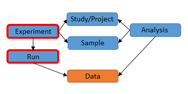

# Module 9: Submit Analysis Data

## Introduction

Previously we have discussed different metadata objects from studies and samples to runs and
experiments, and explained how experiments and runs are used to include sequence read data 
into the archive.

Similarly, the `analysis` object is associated with studies and samples and can be
used to include data files resulting from various analyses of the sequence read data into
the archive. These analyses are categorised into different types, for example, 
genome and transcriptome assemblies.

The analysis XML format is defined by [SRA.analysis.xsd](ftp://ftp.sra.ebi.ac.uk/meta/xsd/sra_1_5/SRA.analysis.xsd)
XML Schema. 

## Object relationships

Analysis object is associated with other objects.



Most analyses are part of a study. Studies are used to group together analyses to
allow them to be cited together in a publication.

Many analyses are assocated with a sample. Analyses point to samples to
allow sharing of sample information between multiple experiments.

To summarise main object relationships:

2. One or more analyses may be part of a study.
3. One or more analyses may be associated with a sample.

Additionally, analyses may refer to experiments and runs.

## Analysis XML: part of study

An analysis points to the study it is part of using the `<STUDY_REF>` element.
This can be done either by using an accession:

```
<STUDY_REF accession="ERP123456"/>
```

or a name within the submitter's account:

```
<STUDY_REF refname="mantis_religiosa"/>
```

## Analysis XML: associated with sample

An analysis can be associated with one or more samples using the `<SAMPLE_REF>` element
either using an accession or alias to refer to the sample.

## Analysis XML: associated with experiment and run

An analysis can also be associated with any number of experiments or runs using the `<EXPERIMENT_REF>` 
and `<RUN_REF>` elements. Again, either an accession or alias can be used in the reference.

See how it is possible to analyze data that is available in the ENA, archive the results 
and link back to the sequence reads used in the analysis. This is already being done by many
groups. Some are aligning and assembling raw reads and others are for instance, create taxonomy
clusters and gene counts for environmental samples.

## Analysis XML: the `<FILES>` block

Like the run object, the analysis object has a `<FILES>` block. The analysis and the run XML both serve the same 
main purpose which is to submit data files into the archive. However, while a run always represents sequence reads, 
an analysis can be used to archive many different types of data.

For example, a `SEQUENCE_ASSEMBLY` (genome assembly) analysis type allows contig sequences to be submitted as a `fasta` file:

```
<FILES>
    <FILE filename="contigs.fasta.gz" filetype="fasta"
        checksum_method="MD5" checksum="89285db287f188d59d494475d75664a4"/>
</FILES>
```

The XML Schema restricts the file types which can be provided in the `filetype` attribute. The Webin
submission service further restricts the use of these file types for specific analysis types.

## Analysis XML: analysis types

The most distinguishing part of an analysis obect is contained in the `<ANALYSIS_TYPE>` block. 
Whatever element this block contains dictates the type of data the analysis should contain and 
how it will be validated by ENA after it is submitted.

Examples of commonly used analysis types are `SEQUENCE_ASSEMBLY` used for genome assemblies 
and `SEQUENCE_VARIATION` used by European Variation Archive (EVA) for VCF variations.

## Analysis XML: attributes

Additional annotation can be provided for analyses using `ANALYSIS_ATTRIBUTE` elements in
the XML:

    <ANALYSIS_ATTRIBUTE>
       <TAG>library preparation date</TAG>
       <VALUE>2010-08</VALUE>
    </ANALYSIS_ATTRIBUTE>

## Genome Submission 

This is for genome submission by REST API using an analysis object as a wrapper for the files that are required in a typical genome submission. This enables bulk programmatic submissions and automatic submission pipeline developments by more frequent submitters and brokers. If you are submitting less frequently you can use the Webin GUI for submitting genomes. Instructions are <a href="mod_06.html">here</a>. You need to be familiar with these instructions before attempting a REST API submission so that you understand what is required from a complete and successful genome submission.

The first step is to deposit the files in your ftp directory and to create a source sample and also to make sure that you have generated a project to connect the genome submission to. What files are required is dependent on the level of assembly. In this example there are 4 files
(unassigned_list.txt.gz, crypto.agp.gz, cryptosporidium.embl.gz, chromosome.txt.gz) which make up the genome assembly submission. To understand what files are required please review the <a href="mod_06.html">main module on genome assembly</a>.

The analysis XML for this example looks like this:

```xml
<?xml version="1.0" encoding="US-ASCII"?>
<ANALYSIS_SET>
    <ANALYSIS alias="wgs_C_hominis" center_name="EBI">
        <TITLE>Whole genome shotgun sequencing of a human-derived isolate of C. hominis</TITLE>
        <DESCRIPTION>Whole genome shotgun sequencing of a human-derived isolate of C.
            hominis</DESCRIPTION>
        <STUDY_REF accession="PRJEAXXXX"> </STUDY_REF>
        <SAMPLE_REF accession="ERSXXXXXX"> </SAMPLE_REF>
        <ANALYSIS_TYPE>
            <SEQUENCE_ASSEMBLY>
                <NAME>C.hominis.v1</NAME>
                <PARTIAL>false</PARTIAL>
                <COVERAGE>68</COVERAGE>
                <PROGRAM>Newbler</PROGRAM>
                <PLATFORM>454FLX+, Illumina Miseq</PLATFORM>
            </SEQUENCE_ASSEMBLY>
        </ANALYSIS_TYPE>
        <FILES>
            <FILE filename="c_hominis/unassigned_list.txt.gz" filetype="unlocalised_contig_list"
                checksum_method="MD5" checksum="89285db287f188d59d494475d75664a4"/>
            <FILE filename="c_hominis/crypto.agp.gz" filetype="chromosome_agp" checksum_method="MD5"
                checksum="5d65f8d8cf5b0f603df0d9db9c1ff003"/>
            <FILE filename="c_hominis/cryptosporidium.embl.gz" filetype="chromosome_flatfile"
                checksum_method="MD5" checksum="c0278da790b41f7efa43d7ea67c1ae1e"/>
            <FILE filename="c_hominis/chromosome.txt.gz" filetype="chromosome_list"
                checksum_method="MD5" checksum="ee0d12a4d1afbf0e1fb731be595cef72"/>
        </FILES>
    </ANALYSIS>
</ANALYSIS_SET>
```

Remember that the above analysis XML is an example. You must provide your own alias, center name, title, description, study reference (you can use the accession type ERPXXXX or accession type PRJEBXXX), sample reference (you can use accession type ERSXXXXX or accession type SAMEAXXXXXX). Also provide values for the `SEQUENCE_ASSEMBLY` block (name of assembly, partial or not, coverage, software and sequencing platform). 

Every file that is required for the single genome gets its own `FILE` block. Notice how the type of file is declared using the attribute "**filetype**". For example: `<FILE filename="c_hominis/cryptosporidium.embl.gz" filetype="chromosome_flatfile"`. You can find the list of accepted file types <a href="#file-types-available">above</a>. This list may not be up to date so you can also check with the official <a href="ftp://ftp.sra.ebi.ac.uk/meta/xsd/sra_1_5/SRA.analysis.xsd">analysis schema document</a>.

Subsequent genomes can be submitted at the same time but they must each be constructed as a separate `ANALYSIS` block. The `<FILES>` block should only contain the files required for a single genome. <a name=bulk_anal></a>
 
```xml
<ANALYSIS_SET>
    <ANALYSIS>
    ...
    ...
    </ANALYSIS>
    <ANALYSIS>
    ...
    ...
    </ANALYSIS>
    <ANALYSIS>
    ...
    ...
    </ANALYSIS>
</ANALYSIS_SET>
```

Make sure to accompany the analysis XML with a submission XML like the one <a href="#example-submission-xml-for-analysis">above</a> and create a cURL command like the one below. For more details on cURL commands and submission XMLs see the <a href="prog_02.html">first module</a>, which takes you through the submission of a simple study object.

```bash
curl -F "SUBMISSION=@sub_anal.xml" -F "ANALYSIS=@anal.xml" "https://www-test.ebi.ac.uk/ena/submit/drop-box/submit/?auth=ENA%20Webin-XXXX%20PASSWORD"
```
Remember to exchange the string 'Webin-XXXX' with your Webin account id and the string 'PASSWORD' with the correct password for that account.

You can also use the `-u username:password` convention:

```bash
curl -u username:password -F "SUBMISSION=@sub_anal.xml" -F "ANALYSIS=@anal.xml" "https://www-test.ebi.ac.uk/ena/submit/drop-box/submit/"
```

Where the username is the Webin account ID (Webin-NNNN) and password is the Webin account password.

If successful you will receive a receipt in XML format that looks like the below.

```xml
<?xml version="1.0" encoding="UTF-8"?>
<?xml-stylesheet type="text/xsl" href="receipt.xsl"?>
<RECEIPT receiptDate="2017-12-05T16:49:48.640Z" submissionFile="sub_anal.xml" success="true">
     <ANALYSIS accession="ERZ273648" alias="wgs_C_hominis" status="PRIVATE"/>
     <SUBMISSION accession="ERA849202" alias="wgs_C_hominis"/>
     <MESSAGES>
          <INFO>This submission is a TEST submission and will be discarded within 24 hours</INFO>
     </MESSAGES>
     <ACTIONS>ADD</ACTIONS>
</RECEIPT>
```

The ERZ accession in the receipt above (`<ANALYSIS accession="ERZ273648" alias="wgs_C_hominis" status="PRIVATE"/>`) should not be used in any publication. Unlike other analysis accessions in this tutorial, a genome analysis is used to deliver a genome submission using the REST API instead of the Webin GUI. After the submission is done the same steps will take place whether the submission is via the REST API or the Webin GUI. These steps involved validating and processing and generating genome-specific accessions. Please wait to receive an automatic email (to the email address registered with the Webin account used for the submission) which will detail the accessions that have been assigned or in the absence of accessions, what errors were flagged which prevented further processing.

## Sequence Variation file

<!-- ERZ448238  -->

Analysis type `<SEQUENCE_VARIATION>` is for submitting variation files such as VCF files. You may have performed variant calling on your existing ENA run or even from ENA runs submitted by other parties. The analysis object should point to its source run (or sample) and if you own the original project (containing the source run) then you can add the analysis to it, or you can create a new project to house interpreted files (in this example, a VCF file). The analysis can point to multiple runs/samples/experiments but can only belong to a single study.

```xml
<?xml version = '1.0' encoding = 'UTF-8'?><ANALYSIS_SET>
   <ANALYSIS alias="vcf_sub" analysis_center="" analysis_date="2017-05-26T10:10:10.0Z" center_name="">
      <TITLE>HipSci WGS GATK HC callset (sample HPSI0614pf-miaj)</TITLE>
      <DESCRIPTION>HipSci whole-genome-sequence GVCF calls generated by GATK haplotype caller</DESCRIPTION>
      <STUDY_REF accession="PRJEB15299"/>
      <SAMPLE_REF accession="ERS1461604"/>
      <RUN_REF accession="ERR1560532"/>
      <RUN_REF accession="ERR1560614"/>
      <RUN_REF accession="ERR1560630"/>
      <RUN_REF accession="ERR1860413"/>
      <RUN_REF accession="ERR1860509"/>
      <RUN_REF accession="ERR1860605"/>
      <RUN_REF accession="ERR1860701"/>
      <RUN_REF accession="ERR1860797"/>
      <RUN_REF accession="ERR1860893"/>
      <RUN_REF accession="ERR1860989"/>
      <RUN_REF accession="ERR1861085"/>
      <RUN_REF accession="ERR1861181"/>
      <RUN_REF accession="ERR1861277"/>
      <RUN_REF accession="ERR1859933"/>
      <RUN_REF accession="ERR1860029"/>
      <ANALYSIS_TYPE>
         <SEQUENCE_VARIATION>
            <ASSEMBLY>
               <STANDARD accession="GCA_000001405.1" refname="GRCh37"/>
            </ASSEMBLY>
            <SEQUENCE accession="CM000663.1" label="1"/>
            <SEQUENCE accession="CM000672.1" label="10"/>
            <SEQUENCE accession="CM000673.1" label="11"/>
            <SEQUENCE accession="CM000674.1" label="12"/>
            <SEQUENCE accession="CM000675.1" label="13"/>
            <SEQUENCE accession="CM000676.1" label="14"/>
            <SEQUENCE accession="CM000677.1" label="15"/>
            <SEQUENCE accession="CM000678.1" label="16"/>
            <SEQUENCE accession="CM000679.1" label="17"/>
            <SEQUENCE accession="CM000680.1" label="18"/>
            <SEQUENCE accession="CM000681.1" label="19"/>
            <SEQUENCE accession="CM000664.1" label="2"/>
            <SEQUENCE accession="CM000682.1" label="20"/>
            <SEQUENCE accession="CM000683.1" label="21"/>
            <SEQUENCE accession="CM000684.1" label="22"/>
            <SEQUENCE accession="CM000665.1" label="3"/>
            <SEQUENCE accession="CM000666.1" label="4"/>
            <SEQUENCE accession="CM000667.1" label="5"/>
            <SEQUENCE accession="CM000668.1" label="6"/>
            <SEQUENCE accession="CM000669.1" label="7"/>
            <SEQUENCE accession="CM000670.1" label="8"/>
            <SEQUENCE accession="CM000671.1" label="9"/>
            <SEQUENCE accession="J01415.2" label="MT"/>
            <SEQUENCE accession="CM000685.1" label="X"/>
            <SEQUENCE accession="CM000686.1" label="Y"/>
            <EXPERIMENT_TYPE>Whole genome sequencing</EXPERIMENT_TYPE>
         </SEQUENCE_VARIATION>
      </ANALYSIS_TYPE>
      <FILES>
         <FILE checksum="59d4ba85660c29d9a52a1ad6765ca75f" checksum_method="MD5" filename="HPSI0614pf-miaj.wgs.gatk.haplotype_caller.20161201.genotypes.vcf.gz.tbi" filetype="tabix"/>
         <FILE checksum="4b9e4c631aeb3efb49f6350f42f31c01" checksum_method="MD5" filename="HPSI0614pf-miaj.wgs.gatk.haplotype_caller.20161201.genotypes.vcf.gz" filetype="vcf"/>
      </FILES>
   </ANALYSIS>
</ANALYSIS_SET>

```

Above is an example of an analysis submission of a VCF file and a tabix file (these should be <a href="file_prep.html">uploaded</a> to your ftp directory ahead of the submission). See <a href="#file-types-available">here</a> for recognised file types. Apply your own title, description, alias, center name etc ....

Notice that the VCF is using reads from 15 different ENA runs (they are all from the same ENA sample though). The VCF file maps variant calls according to there position in a reference (as any VCF file does) The `<ASSEMBLY>` and `<SEQUENCE>` blocks allow the ids in the VCF file to be mapped to actual ENA accessions. For example, the VCF file in the example has this in the header:

```
##contig=<ID=1,length=249250621>
##contig=<ID=2,length=243199373>
##contig=<ID=3,length=198022430>
##contig=<ID=4,length=191154276>
##contig=<ID=5,length=180915260>
##contig=<ID=6,length=171115067>
##contig=<ID=7,length=159138663>
##contig=<ID=8,length=146364022>
##contig=<ID=9,length=141213431>
##contig=<ID=10,length=135534747>
##contig=<ID=11,length=135006516>
##contig=<ID=12,length=133851895>
##contig=<ID=13,length=115169878>
##contig=<ID=14,length=107349540>
##contig=<ID=15,length=102531392>
##contig=<ID=16,length=90354753>
##contig=<ID=17,length=81195210>
##contig=<ID=18,length=78077248>
##contig=<ID=19,length=59128983>
##contig=<ID=20,length=63025520>
##contig=<ID=21,length=48129895>
##contig=<ID=22,length=51304566>
##contig=<ID=X,length=155270560>
##contig=<ID=Y,length=59373566>
##contig=<ID=MT,length=16569>
```

This is in the interest of reproducibility and traceability. The VCF file refers to a contig called "1" and the analysis XML states that contig "1" is actually ENA entry 'CM000663'. Should the interpreted file (VCF) want to reference the source of each read using some id, this can be recorded too, because the `<RUN>` and `<SAMPLE>` blocks can also carry a 'label' attribute. For instance:

```xml
<RUN_REF accession="ERR1560630" label="19933_4#3"/>
```

This means that when the id '19933_4#3' is used in the interpreted file (in the header and/or the rows) it can be mapped to ENA run ERR1560630.

The submission XML will look similar to the one <a href="#example-submission-xml-for-analysis">above</a>. The cURL command used and the receipt returned are below (apply your own account id and password and file names).

```bash
curl -u username:password -F "SUBMISSION=@sub.xml" -F "ANALYSIS=@anal.xml" "https://www-test.ebi.ac.uk/ena/submit/drop-box/submit/"
```

```xml
<?xml version="1.0" encoding="UTF-8"?>
<?xml-stylesheet type="text/xsl" href="receipt.xsl"?>
<RECEIPT receiptDate="2017-12-07T13:51:50.050Z" submissionFile="sub.xml" success="true">
    <ANALYSIS accession="ERZ481388" alias="vcf_sub" status="PRIVATE"/>
    <SUBMISSION accession="ERA1152129" alias="analysis_sub_071217"/>
    <MESSAGES>
        <INFO>All objects in this submission are set to private status (HOLD).</INFO>
        <INFO>Submission has been committed.</INFO>
        <INFO>This submission is a TEST submission and will be discarded within 24 hours</INFO>
    </MESSAGES>
    <ACTIONS>ADD</ACTIONS>
    <ACTIONS>HOLD</ACTIONS>
</RECEIPT>
```

## Reference Alignment File

<!-- ERZ407246 -->

Analysis type `<REFERENCE_ALIGNMENT>` is for submitting a BAM alignment file. BAM files can be submitted as ENA run objects but in that case they should be demultiplexed, raw and may or may not make use of the alignment capacity of the BAM format. Where as this analysis type is for taking existing ENA runs that you may or may not own and aligning them to a reference sequence (which is usually in the ENA already). Genome building services internal and external to EBI often align the raw data found in the ENA to reference genomes so that they can improve their representation of the genomes and genes in question. They can submit the alignment file back to the ENA for added value.

Here is an example analysis XML for submitting an alignment file

```xml
<?xml version="1.0" encoding="US-ASCII"?>
<ANALYSIS_SET>
    <ANALYSIS alias="AD0370_C_alignment" analysis_center=""
        analysis_date="2014-10-22T00:00:00.0Z" center_name="">
        <TITLE>The Anopheles gambiae 1000 Genomes Project - Phase 1 - Alignment - Crosses</TITLE>
        <DESCRIPTION>Sequence alignments from the AR3 data release from the Anopheles 1000 genomes
            project. Aligments are in bam format and are presented for each of the 80 A. gambiae
            specimens comprising parents and progeny of four crosses.</DESCRIPTION>
        <STUDY_REF accession="ERP020641"/>
        <SAMPLE_REF accession="ERS150992" label="AD0370-C"/>
        <RUN_REF accession="ERR178314" label="8149_4_48"/>
        <RUN_REF accession="ERR178374" label="8177_1_48"/>
        <RUN_REF accession="ERR178386" label="8177_2_48"/>
        <ANALYSIS_TYPE>
            <REFERENCE_ALIGNMENT>
                <ASSEMBLY>
                    <STANDARD accession="GCA_000005575.1"/>
                </ASSEMBLY>
            </REFERENCE_ALIGNMENT>
        </ANALYSIS_TYPE>
        <FILES>
            <FILE checksum="bafe0ed9be5c0f8515cdc4ac514d24af" checksum_method="MD5"
                filename="AD0370_C.bam" filetype="bam"/>
        </FILES>
        <ANALYSIS_ATTRIBUTES>
            <ANALYSIS_ATTRIBUTE>
                <TAG>Aligner</TAG>
                <VALUE>bwa v0.6.2-r126</VALUE>
            </ANALYSIS_ATTRIBUTE>
        </ANALYSIS_ATTRIBUTES>
    </ANALYSIS>
</ANALYSIS_SET>
```

Make sure to add your own alias, centre name, title, description, sample and run pointers. The file should be <a href="file_prep.html">uploaded</a> to your ftp directory ahead of the submission. In the example above the BAM file aligns reads from 3 ENA runs to the reference genome GCA_000005575. The BAM file has 3 read group tags defined in its header that represent each ENA run

```
@RG	ID:8149_4_48	PL:ILLUMINA	PU:8149_4_48	LB:AD0370_C_5557918	DS:
AGPED1	SM:AD0370-C	CN:SC
@RG	ID:8177_1_48	PL:ILLUMINA	PU:8177_1_48	LB:AD0370_C_5557918	DS:
AGPED1	SM:AD0370-C	CN:SC
@RG	ID:8177_2_48	PL:ILLUMINA	PU:8177_2_48	LB:AD0370_C_5557918	DS:
AGPED1	SM:AD0370-C	CN:SC
```

The source runs are therefore traceable because read group tag id '8149_4_48' refers to ENA run ERR178314 because of this line in the XML.

```xml
<RUN_REF acession="ERR178314" label="8149_4_48"/>
```

All 3 runs are mapped to their read group ids. There is also a sample id in the BAM file 'AD0370-C'. All 3 read groups are derived from the same source sample and this is also reflected in the ENA under sample 'ERS150992'. The analysis points to a study/project too. This is mandatory and if you own the study where the source runs are stored you can add the analysis to that study but if you are aligning runs from some other project you should create your own study to house your analysis objects. 

There is a single reference sequence declared in the BAM file header

```
@HD	VN:1.4	GO:none	SO:coordinate
@SQ	SN:2L	LN:49364325	UR:http://www.vectorbase.org/content/anopheles-gamb
iae-pestchromosomesagamp3fagz	AS:AgamP3	M5:a4da4bafa82830c0a418c5a42138377b
	SP:Anopheles gambiae
```

The BAM file has called the reference sequence "AgamP3". All coordinates in the file relate to this sequence. This too has been mapped to an ENA accession in the interest of reproducibility and traceability. 

```xml
<ASSEMBLY>
    <STANDARD accession="GCA_000005575.1"/>
</ASSEMBLY>
```

There is no label attribute to specify that GCA_000005575 corresponds to "AgamP3" but there is no other reference sequence mentioned in the BAM file so it is not ambiguous. The `<ASSEMBLY>` block is used to reference a whole assembly. A whole assembly often consists of independent sequences such as chromosomes, scaffolds, or simply a set of contigs. The BAM file in the example uses coordinates against the assembly as a whole but if your BAM file has multiple @SQ lines relating to lower level sequences you can map these using sequence blocks:

```
<SEQUENCE accession="!contig accession goes here!" label="!name of that contig as it appears in BAM file!"/>
```

See how the <a href="#sequence-variation-file">variation analysis</a> has made use of `<SEQUENCE>` blocks. You can use `<SEQUENCE>` blocks in the same way when submitting an alignment analysis object.

The submission XML will look similar to the one <a href="#example-submission-xml-for-analysis">above</a>. The cURL command used and the receipt returned are below (apply your own account id and password and file names).

```bash
curl -u username:password -F "SUBMISSION=@sub.xml" -F "ANALYSIS=@anal.xml" "https://www-test.ebi.ac.uk/ena/submit/drop-box/submit/"
```

```xml
<?xml version="1.0" encoding="UTF-8"?>
<?xml-stylesheet type="text/xsl" href="receipt.xsl"?>
<RECEIPT receiptDate="2017-12-07T15:48:17.814Z" submissionFile="sub.xml" success="true">
     <ANALYSIS accession="ERZ481487" alias="AD0370_C_alignment" status="PRIVATE"/>
     <SUBMISSION accession="ERA1152287" alias="analysis_sub_071217_b"/>
     <MESSAGES>
          <INFO>All objects in this submission are set to private status (HOLD).</INFO>
          <INFO>Submission has been committed.</INFO>
          <INFO>This submission is a TEST submission and will be discarded within 24 hours</INFO>
     </MESSAGES>
     <ACTIONS>ADD</ACTIONS>
     <ACTIONS>HOLD</ACTIONS>
</RECEIPT>
```

## Optical Mapping Data

<!-- ERZ370270 -->

Analysis type `<GENOME_MAP>` is for submitting optical mapping data from the BioNano platform (for example). While the 'bnx' files are a raw form of output from the optical mapping machines we use the analysis object to capture these because ENA run objects are exclusively for sequence runs. 

Here is an example analysis XML for submitting an optical mapping file

```xml
<?xml version="1.0" encoding="US-ASCII"?>
<ANALYSIS_SET>
    <ANALYSIS alias="es_omd" center_name="">
        <TITLE>Euclidium syriacum BioNano Optical Mapping data</TITLE>
        <DESCRIPTION>Euclidium syriacum Optical Mapping data produced by BioNano Genomics Irys System</DESCRIPTION>
        <STUDY_REF accession="ERP018601"/>        
        <SAMPLE_REF accession="ERS1436420"/>      
        <ANALYSIS_TYPE>
            <GENOME_MAP>
                <PROGRAM>IrysView</PROGRAM>
                <PLATFORM>BioNano</PLATFORM>
            </GENOME_MAP>
        </ANALYSIS_TYPE>
        <FILES>
            <FILE filename="Euclidium_syriacum.Run-01.bnx.gz" filetype="BioNano_native" checksum_method="MD5" checksum="ff9dd3a61d88092cb74ff8227ed725aa"/>
        </FILES>
        <ANALYSIS_ATTRIBUTES/>
    </ANALYSIS>
</ANALYSIS_SET>
```

Make sure to add your own alias, centre name, title, description, and sample pointer. The file should be <a href="file_prep.html">uploaded</a> to your ftp directory ahead of the submission. The file can be compressed but it is not mandatory. ENA will accept these file suffixes for `filetype="BioNano_native"`: .bnx,.cmap,.xmap,.smap,.coord 

You should create a sample object in the ENA ahead of time to represent each source material so that you can point your optical mapping data to it now. If the source sample already exists (may be you have applied read data to it or a genome to it) then use the existing sample. For every additional source sample that you have mapping data for a separate analysis object should be submitted. So all your analysis objects can appear in the same XML file at submission time but each should point to a single sample and have a single `<FILE>` block (as described <a href="#bulk_anal">here</a>).


You also need a study to add this analysis too. Use an appropriate existing study (if you own one) or create one beforehand. 

The submission XML will look similar to the one <a href="#example-submission-xml-for-analysis">above</a>. The cURL command used and the receipt returned are below (apply your own account id and password and file names).

```bash
curl -u username:password -F "SUBMISSION=@sub.xml" -F "ANALYSIS=@anal.xml" "https://www-test.ebi.ac.uk/ena/submit/drop-box/submit/"
```

```xml
<?xml version="1.0" encoding="UTF-8"?>
<?xml-stylesheet type="text/xsl" href="receipt.xsl"?>
<RECEIPT receiptDate="2017-12-08T14:18:38.479Z" submissionFile="sub.xml" success="true">
    <ANALYSIS accession="ERZ481413" alias="es_omd" status="PRIVATE"/>
    <SUBMISSION accession="ERA1153105" alias="analysis_sub_071217"/>
    <MESSAGES>
        <INFO>All objects in this submission are set to private status (HOLD).</INFO>
        <INFO>Submission has been committed.</INFO>
        <INFO>This submission is a TEST submission and will be discarded within 24 hours</INFO>
    </MESSAGES>
    <ACTIONS>ADD</ACTIONS>
    <ACTIONS>HOLD</ACTIONS>
</RECEIPT>
```

## Annotation Submission

<!-- ERZ251144 -->

Analysis type `<SEQUENCE_ANNOTATION>` is for submitting annotation files. These are usually tab files (comma or tab delimited spreadsheet tables) but can some times take other <a href="#file-types-available">forms</a>. Examples include gene count and OTU tables from metagenomic studies.

Here is an example analysis XML for submitting a tab file

```xml
<?xml version="1.0" encoding="US-ASCII"?>
<ANALYSIS_SET>
    <ANALYSIS alias="YF3059" center_name="" analysis_center=""
        analysis_date="2015-12-28T00:00:00">
        <TITLE>Y chromosome sequence STR analysis using lobSTR</TITLE>
        <DESCRIPTION>Y chromosome sequence STR analysis using lobSTR</DESCRIPTION>
        <STUDY_REF accession="ERP011288"/>
        <SAMPLE_REF accession="ERS1023190"/>
        <RUN_REF accession="ERR1198112"/>
        <ANALYSIS_TYPE>
            <SEQUENCE_ANNOTATION/>
        </ANALYSIS_TYPE>
        <FILES>
            <FILE filename="STR_for_YF03059_20151228.tab.gz" filetype="tab" checksum_method="MD5"
                checksum="9f2976d079c10b111669b32590d1eb3e"/>
        </FILES>
    </ANALYSIS>
</ANALYSIS_SET>
```

Make sure to add your own alias, centre name, title, description, sample and run pointers. The file should be <a href="file_prep.html">uploaded</a> to your ftp directory ahead of the submission. In this example the source run and sample for the interpretted file are added so that the file is potentially reproducible. The analysis points to a study/project too. This is mandatory and if you own the study where the source runs are stored you can add the analysis to that study but if you are analysing runs from some other project you should create your own study to house your analysis objects.

The submission XML will look similar to the one <a href="#example-submission-xml-for-analysis">above</a>. The cURL command used and the receipt returned are below (apply your own account id and password and file names).

```bash
curl -u username:password -F "SUBMISSION=@sub.xml" -F "ANALYSIS=@anal.xml" "https://www-test.ebi.ac.uk/ena/submit/drop-box/submit/"
```

```xml
<?xml version="1.0" encoding="UTF-8"?>
<?xml-stylesheet type="text/xsl" href="receipt.xsl"?>
<RECEIPT receiptDate="2017-12-08T16:35:06.765Z" submissionFile="sub.xml" success="true">
    <ANALYSIS accession="ERZ481415" alias="YF3059" status="PRIVATE"/>
    <SUBMISSION accession="ERA1153108" alias="analysis_sub_071217_b"/>
    <MESSAGES>
        <INFO>All objects in this submission are set to private status (HOLD).</INFO>
        <INFO>Submission has been committed.</INFO>
        <INFO>This submission is a TEST submission and will be discarded within 24 hours</INFO>
    </MESSAGES>
    <ACTIONS>ADD</ACTIONS>
    <ACTIONS>HOLD</ACTIONS>
</RECEIPT>
```

### Pac Bio Methylation Files

<!-- https://trace.ncbi.nlm.nih.gov/Traces/sra/sra.cgi?analysis=SRZ049716 -->

Analysis type `<SEQUENCE_ANNOTATION>` is more flexible than some of the other analysis types and can be used for submission of different data types before or instead of adding a new analysis type to the central schema. Pac Bio sequencing machines produce sequence data as hdf5 files which are normally submitted as a set of files (1 x bas.h5, 3 x bax.h5, 1 x metadata.xml) per run. Pac bio machines can also produce methylation data, usually consisting of a set of 3 files per run: modifications.csv, motif_summary.csv and motifs.gff. While the hdf5 files should be submitted as run objects, the methylation files can be submitted as a `<SEQUENCE_ANNOTATION>` analysis because there is no specific analysis type for methylation data.

Here is an example analysis XML for submitting a methylation files

```xml
<?xml version="1.0" encoding="US-ASCII"?>
<ANALYSIS_SET>
    <ANALYSIS alias="08-1736" center_name="" analysis_center=""
        analysis_date="2014-10-15T00:00:00">
        <TITLE>Epigenomic analysis of Salmonella enterica 08-1736 from PacBio RS base-incorporation
            kinetic data</TITLE>
        <DESCRIPTION>Single-molecule read technologies allow for detection of epigenomic base
            modifications during routine sequencing by analysis of kinetic data during the reaction,
            including the duration between base incorporations at the elongation site (the
            "inter-pulse duration.") Methylome data associated with a closed de- novo bacterial
            genome of Salmonella enterica subsp. enterica serovar 4,5,12, i- str. 08-1736 was
            produced and submitted to the Gene Expression Omnibus.</DESCRIPTION>
        <STUDY_REF accession="SRP026480"/>
        <SAMPLE_REF accession="SRS454371"/>
        <ANALYSIS_TYPE>
            <SEQUENCE_ANNOTATION/>
        </ANALYSIS_TYPE>
        <FILES>
            <FILE filename="data-motifs.gff.gz" filetype="gff" checksum_method="MD5"
                checksum="7fd0cf4f550fd836758bfc242894a8fe"/>
            <FILE filename="data-motif_summary.csv.gz" filetype="tab" checksum_method="MD5"
                checksum="28e36d2792991de13aee0f377b774523"/>
            <FILE filename="data-modifications.csv.gz" filetype="tab" checksum_method="MD5"
                checksum="cebce127ade5bc04b0846b205151cbc9"/>
        </FILES>
    </ANALYSIS>
</ANALYSIS_SET>
```

Make sure to add your own alias, centre name, title, description, sample and run pointers. The 3 files should be <a href="file_prep.html">uploaded</a> to your ftp directory ahead of the submission. Note how there are 3 `<FILE>` blocks, one for each of the files that make up methylation submission (2 x TAB and 1 x GFF). As with previous analysis objects you should add the analysis to a study (it can be the same one as the raw sequence data if you own it) and you should reference a source sample. Every additional set of 3 x files (if you have done methylation measurements multiple times or for additional samples) should each be archived in their <a href="#bulk_anal">own</a> analysis object.

The submission XML will look similar to the one <a href="#example-submission-xml-for-analysis">above</a>. The cURL command used and the receipt returned are below (apply your own account id and password and file names).

```bash
curl -u username:password -F "SUBMISSION=@sub.xml" -F "ANALYSIS=@anal.xml" "https://www-test.ebi.ac.uk/ena/submit/drop-box/submit/"
```

```xml
<?xml version="1.0" encoding="UTF-8"?>
<?xml-stylesheet type="text/xsl" href="receipt.xsl"?>
<RECEIPT receiptDate="2017-12-08T16:35:06.765Z" submissionFile="sub.xml" success="true">
    <ANALYSIS accession="ERZ481431" alias="08-1736" status="PRIVATE"/>
    <SUBMISSION accession="ERA1153200" alias="analysis_sub_111217"/>
    <MESSAGES>
        <INFO>All objects in this submission are set to private status (HOLD).</INFO>
        <INFO>Submission has been committed.</INFO>
        <INFO>This submission is a TEST submission and will be discarded within 24 hours</INFO>
    </MESSAGES>
    <ACTIONS>ADD</ACTIONS>
    <ACTIONS>HOLD</ACTIONS>
</RECEIPT>
```
