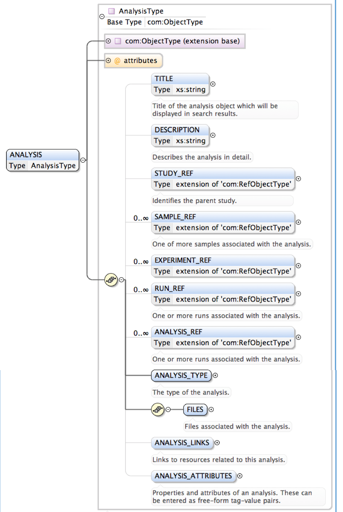
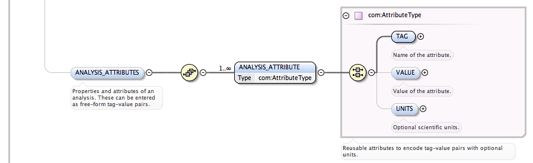
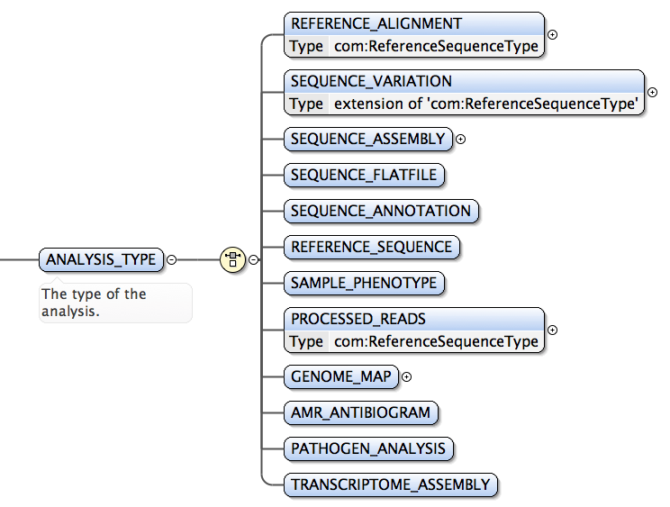

# Module 9: Adding interpreted data

***under construction***

The ENA is primarily an archive for raw and experimental sequence data but in addition to that it is possible to add interpreted data that you have derived from the raw data. While we have discussed different metadata objects from studies and samples to runs and experiments, the *analysis* object is available for archiving supplementary and interpreted data files within a study. The analysis object can be used to provide extra value and reproducibility to your study. Moreover, the analysis object has been extended recently to also represent traditional EMBL sequence files and genomes. This has enabled a more flexible and unified submission system that was initially limited to the submission of next generation raw read sequence data. <a href="prog_02.html#the-analysis-object">Submitting EMBL sequences as analysis objects</a> is mostly done behind the scenes when using the <a href="https://www.ebi.ac.uk/ena/submit/sra/#home">interactive submission system</a> but you can take advantage of this submission route more directly if you need to create a submission pipeline or if you need to automate a part of your ENA submission that you do often enough. 

## Characteristics of the analysis object

The structure of the analysis object is laid out in this <a href="ftp://ftp.sra.ebi.ac.uk/meta/xsd/sra_1_5/SRA.analysis.xsd">schema document</a>. Note that XML schema documents benefit from using a dedicated XML editor if you have access to one.  

### 1: The analysis object has a `<FILES>` block

Like the run object, the analysis object has a `<FILES>` block. The analysis and the run both serve the same purpose which is to wrap a file for archiving. A run typically represents a next generation sequencing read file [pair] where as an analysis can be used to archive any other kind of file. Many different file types are recorded in the schema and limitations on maximum and minimum occurrences of different elements (such as `<FILE>`) are not restricted like they are for other schemas. This is because of the variety of ways an analysis object can be used- it is the most flexible of all the metadata objects. Instead, most validation will happen outside of the schema. To apply validation to your analysis (or any other object) you can use the `VALIDATE` action in your submission xml.

```xml
<?xml version="1.0" encoding="UTF-8"?>
<SUBMISSION_SET xmlns:xsi="http://www.w3.org/2001/XMLSchema-instance"
    xsi:noNamespaceSchemaLocation="ftp://ftp.sra.ebi.ac.uk/meta/xsd/sra_1_5/SRA.submission.xsd">
    <SUBMISSION alias="analysis_submission" center_name="">
        <ACTIONS>
            <ACTION>
                <VALIDATE source="analysis.xml" schema="analysis"/>
            </ACTION>
        </ACTIONS>
    </SUBMISSION>
</SUBMISSION_SET>
```

Also embedded into the schema is the file types that are allowed. This is a complete list but post submission validation restricts the list further according to the `<ANALYSIS_TYPE>` that is used (see point <a href="#the-analysis-has-types">4</a> below).

<div style="height:300px;width:300px;border:1px solid;overflow:auto;">
value="tab"<br />
value="bam"<br />
value="bai"<br />
value="cram"<br />
value="crai"<br />
value="vcf"<br />
value="vcf_aggregate"<br />
value="bcf"<br />
value="tabix"<br />
value="wig"<br />
value="bed"<br />
value="gff"<br />
value="fasta"<br />
value="fastq"<br />
value="flatfile"<br />
value="contig_fasta"<br />
value="contig_flatfile"<br />
value="scaffold_fasta"<br />
value="scaffold_flatfile"<br />
value="scaffold_agp"<br />
value="chromosome_fasta"<br />
value="chromosome_flatfile"<br />
value="chromosome_agp"<br />
value="chromosome_list"<br />
value="unlocalised_contig_list"<br />
value="unlocalised_scaffold_list"<br />
value="sample_list"<br />
value="readme_file"<br />
value="phenotype_file"<br />
value="BioNano_native"<br />
value="Kallisto_native"<br />
value="info"<br />
value="other"<br />
</div>


### 2: The analysis object has pointers

Separating metadata into 'objects' enables you to build a study that reflects the biology of the study more closely. For instance a run object (which can be likened to the output of an NGS lane) must have a single library source, so it has a pointer, to an experiment object. The experiment/library object must have a single source sample (as in a real biological sequencing study) so it has a pointer for that. The experiment also has a study pointer which means that it, and any runs pointing to it, and the sample it is pointing to, can all be affiliated with the same study. There is more discussion on pointers in previous <a href="prog_07.html#a-word-about-pointers">module 7</a>. The analysis object is more flexible and according to the current schema it can have a study pointer (`<STUDY_REF>`), sample pointer (`<SAMPLE_REF>`), experiment pointer (`<EXPERIMENT_REF>`), run pointer (`<RUN_REF>`), and even a pointer to another analysis (`<ANALYSIS_REF>`).



Apart from the study pointer, there are no limitations on maximum and minimum occurrences for any of the other pointer elements. But there are extra validation rules applied outside of the technical schema. For instance you will find that an assembled genome submission can and should have 1 source sample but an alignment BAM file, which may take reads from many sources (and align them to a reference), can have multiple sample pointers, experiment pointers, and/or run pointers. Every analysis should point to a single study (STUDY_REF) and it will belong to that study. For all the other pointer options you should take care to use them so that the source of the analysis can be traced. This is essential towards making your study and its analysis files reproducible. 

See how it is possible to do some analysis on raw data that is available in the ENA and then archive the results back with the ENA with pointers to the source material. This 'adding value' step is already being done by many groups outside of the ENA. Some groups are aligning and assembling raw reads and others are for instance, creating and archiving taxonomy clusters and gene counts for environmental samples.

### 3: The analysis has attributes

Like all other objects discussed in this section the analysis should carry a unique alias attribute and its title and description elements should be used to provide as much context as possible. Then the `<ANALYSIS_ATTRIBUTES>` block, which is the final block in a complete `<ANALYSIS>` element, can be used for more specific annotation including the use of standardised terms if you are submitting on behalf of a collaborating body that has agreed to annotate to certain specifications. To see attributes block in use, see the <a href="prog_05.html#what-does-the-xml-file-look-like">sample module</a>. 



### 4: The analysis has types

The most distinguishing part of an analysis obect is contained in the `<ANALYSIS_TYPE>` block. Whatever element this block contains dictates what the rest of the analysis should look like and how it will be validated by ENA after it is submitted. 



Some of these analysis types were created for the latest interactive submission system to make use of a common submission portal across the entire spectrum ENA data types. This is useful because using the REST API you can automate submissions that would, in older submission systems, require a dedicated purpose built pipeline or would have to be submitted manually using a GUI web application.


