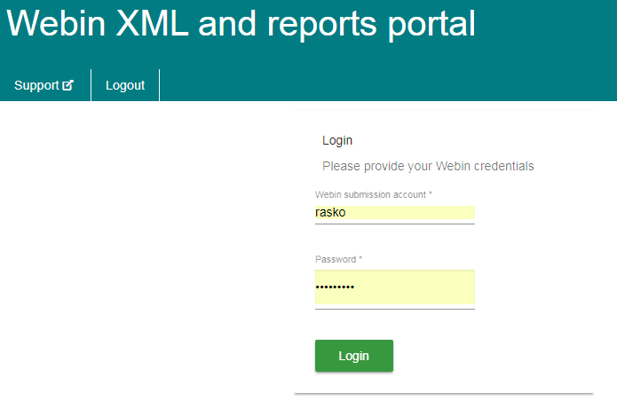
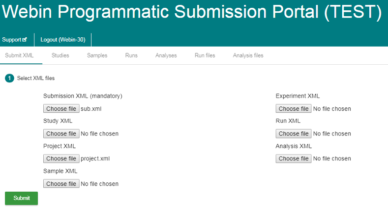
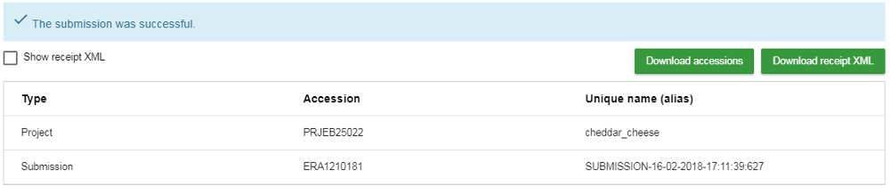
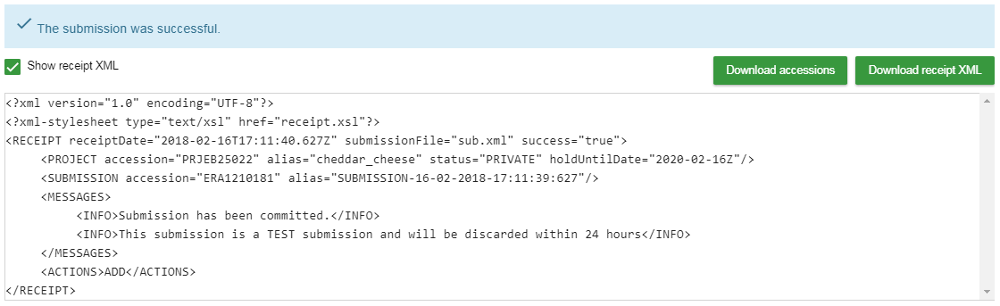
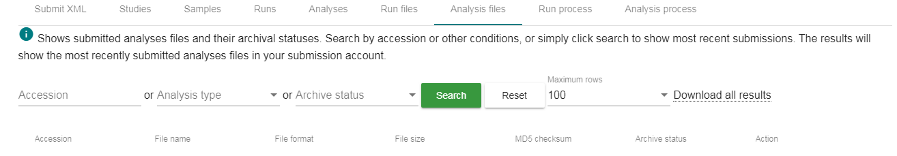

# Module 11: Webin XML and reports portal

Webin XML and reports portal is a simple interactive web interface which supports:

* Submission of XML metadata objects
* Update of XML metadata objects
* Reports from the [Webin reports service](prog_10.html)

## Service URL

Production service URL:

<https://www.ebi.ac.uk/ena/submit/webin/>

Test service URL:

<https://wwwdev.ebi.ac.uk/ena/submit/webin/>

## Authentication

Please use your Webin submission account credentials to login into the service.

 

## Submit XMLs

Once you have logged in you can use the default page to submit XMLs to Webin.

In the example below, one or more studies are being submitted using a project XML (`project.xml`) and a 
submission XML (`sub.xml`). The project XML contains the study details while the submission XML 
defines the submission actions. 
 
 

To submit, simply browse to the `project.xml` and `sub.xml` files and click submit. 

You can see the receipt in the browser window either in a tabular format:

or you can look at the receipt XML:

## Reports

## Run files

The `Run files` reports lists all run files submitted through your
submission account.

The `Archive status` column value becomes `File archived`
once the file has been incorporated into the archive. Any pre-archival 
file validation errors are also shown in this column. 

## Analysis files

The `Analysis files` reports lists all analysis files submitted through your
submission account.

The `Archive status` column value becomes `File archived`
once the file has been incorporated into the archive. Any pre-archival 
file validation errors are also shown in this column. 

### Unsubmitted files

Uploading a file to the Webin file upload area is not sufficient for inclusion into the archive. 
The file must also be submitted through the Webin submission service either as a run or analysis.

The Webin file upload area is a temporary transit area. Any unsubmitted files are subject 
to be removed according to [ENA fair use policy](upload_01.html) after some time.

The unsubmitted file report shows uploaded files scheduled to be removed unless
submitted by the expiration date.

