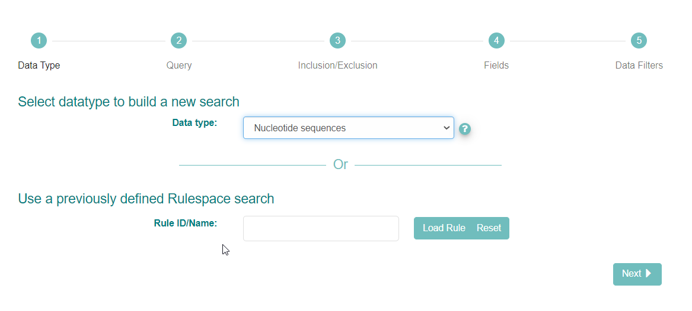
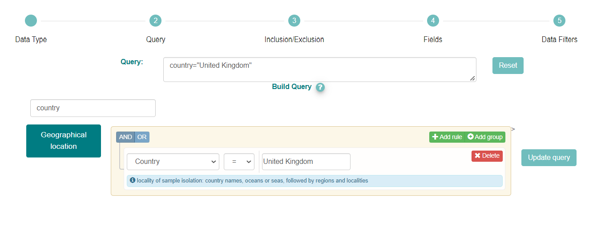
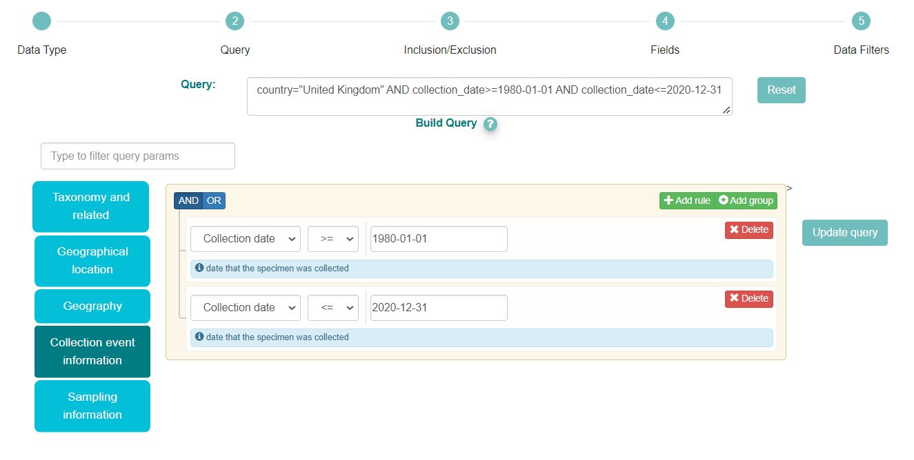
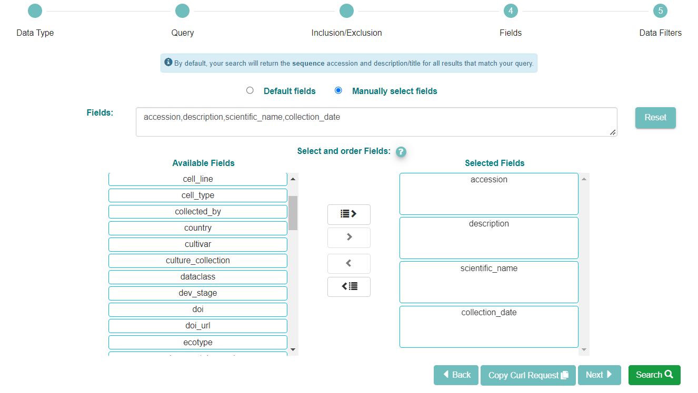
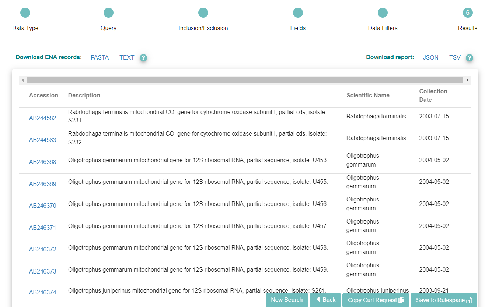
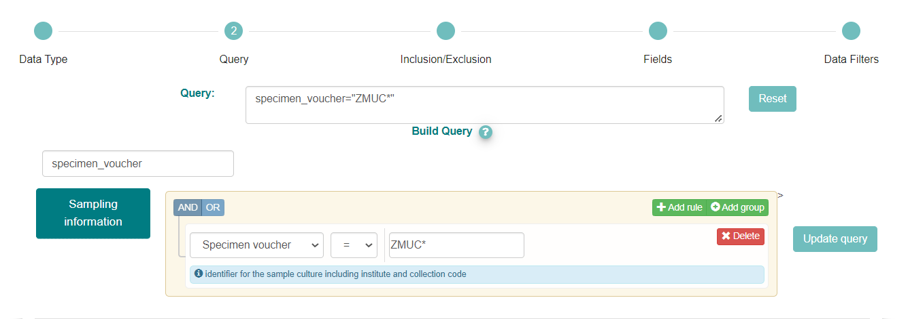
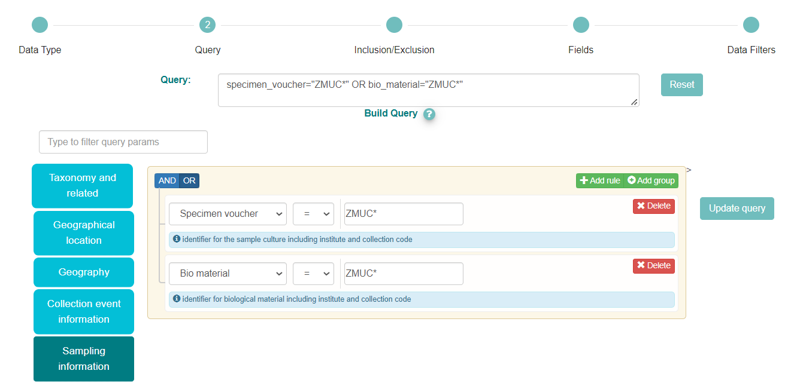
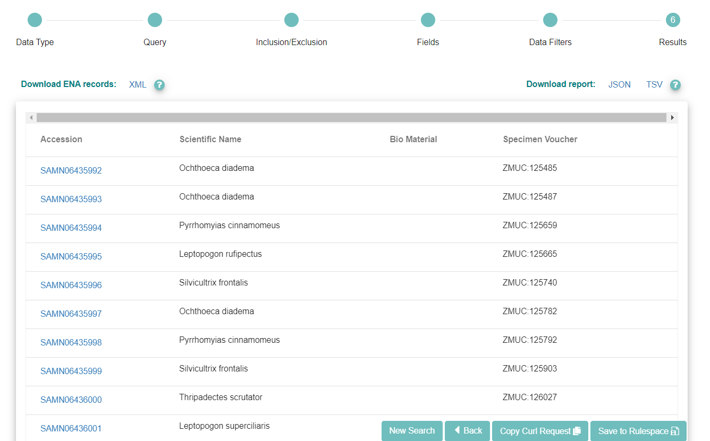

=================================
How To Perform An Advanced Search
=================================

The `ENA Advanced Search interface <https://www.ebi.ac.uk/ena/browser/advanced-search>`_
interface is a powerful way to search the archive for datasets which meet
criteria of interest to you as a user. The below guide will walk you through
the interface using examples. Use this to familiarise yourself with the
interface before conducting your own searches.

Example Uses
============

Below are two example cases you can follow to better understand the advanced
search interface:

- `Find Neanderthal Read Data`_
- `Find Samples Based On Checklists`_
- 'Find all sequences from the United Kindom between 1980 and 2020'_
- 'Find all samples vouchered in the Zoological Museum, University of Copenhagen collections'_

Find Neanderthal Read Data
--------------------------

Locate all read data submitted for Neanderthals

1. Navigate to the advanced search browser:
   https://www.ebi.ac.uk/ena/browser/advanced-search

.. image:: images/advanced-search-1.png

2. The interface first asks you to select the datatype you want to search for.
   Use the '?' icon next to the drop-down box to learn more about the options.
   We are searching for read data, so select 'Raw Reads':

3. Click 'Next'

.. image:: images/advanced-search-2.png

4. You now have opportunity to apply filters which will limit the set of reads
   which are provided

5. Use the blue buttons on the left to select different filter categories, or
   use the 'Type to filter query params' box to search for a specific parameter

6. In the above box, we have selected the 'Taxonomy and related' category, and
   chosen 'NCBI Taxonomy' from the dropdown

7. All submissions to ENA must use a valid species-level taxon from the NCBI
   taxonomy database. Begin typing and suggestions appear. We have put
   'Neanderthal'. Notice multiple suggestions are given; in this case, they
   are synonyms, as indicated by their matching taxon IDs (63221)

8. We have entered all the parameters we want, so click 'Next' twice to get
   to the Fields selection box

.. image:: images/advanced-search-3.png

9. Now click the 'Manually select fields' box.

10. For reads, there are three pre-defined field sets you can use: FASTQ Files
    gives you the `archive-generated standardised FASTQ format`_, SRA Files
    gives file versions suitable for use with NCBI's SRA Toolkit, while
    Submitted Files gives you copies of the files originally submitted by the
    user

11. You can use the 'Available Fields' box to choose any fields you wish to see
    included in the table of results. Not all of these will always be relevant.
    For this serach, we have selected the FASTQ Files preset, but if you skip
    this step you will still be shown a list of accessions with descriptions,
    by default

12. When you are satisfied with the fields you have chosen, click 'Search' to
    see the results of your query

.. image:: images/advanced-search-4.png

.. _`archive-generated standardised FASTQ format`: ../faq/archive-generated-files.html

Find Samples Based On Checklists
--------------------------------

ENA sample objects represented physical samples used in sequencing experiments.
Users must conform to a checklist of values when submitting samples.
We can leverage this in searches to find samples belonging to a checklist
which describes materials of interest to us.

Follow the below guide to find samples registered using the checklist named
'GSC MIxS human gut', which describes human gut microbiome samples

1. Navigate to the advanced search browser:
   https://www.ebi.ac.uk/ena/browser/advanced-search

.. image:: images/advanced-search-5.png

2. The interface first asks you to select the datatype you want to search for.
   Use the '?' icon next to the drop-down box to learn more about the options.
   Select the option simply named 'Samples'

3. Click 'Next'

.. image:: images/advanced-search-6.png

4. Categories of search parameters are found by clicking the blue boxes to the
   left of the page. Select the 'Database record' category now

5. In the beige box, use the dropdown box to select the 'Checklist' option

6. A new dropdown box will appear: use this to select the checklist you are
   interested in - 'GSC MIxS human gut' in this case

7. Notice the accession number of the checklist, 'ERC000015', is added to the
   'Query' box

8. Now click 'Next' twice to get to the Fields selection box

9. You can use the 'Available Fields' box to choose any fields you wish to see
   included in the table of results. Not all of these will always be relevant

10. When you are satisfied with the fields you have chosen, click 'Search' to
    see the results of your query

Find all sequences from the United Kindom between 1980 and 2020
---------------------------------------------------------------

Get a list of sequence accessions that derive from samples collected within the
United Kingdom between 1980 and 2020.

1. Navigate to the advanced search browser:
   https://www.ebi.ac.uk/ena/browser/advanced-search

2. The interface first asks you to select the datatype you want to search for.
   Use the '?' icon next to the drop-down box to learn more about the options.
   Select the option named 'Nucleotide Sequences' for assembled and targeted sequences.

3. Click 'Next'

4. Categories of search parameters are found by clicking the blue boxes to the
   left of the page or you can simply filter using the 'Type to filter query params' option.
   In this case, we have filtered for 'country' and then selected the Country option from the
   drop down.

5. Then enter 'United Kingdom' to search for sequences originating from samples collected in the UK.

7. Notice the filter country="United Kingdom" has been added to the Query box.

8. As we also wish to filter by collection date, we need to add this option to the search query.
   This field can be found in the 'Collection event information' category.

9. Then we have selected ‘Collection date’ from the dropdown menu. To add a range of dates, we'll need to
   provide 2 date filters, one limiting before a certain date and one limiting after a certain date.

10. First select the ‘<=’ operator and type ‘1980-01-01’ in the box.

11. Then to add an upper limit, we click on the button '+Add rule', select again ‘Collection date’
    from the dropdown menu, select the ‘>=’ operator and type the date (‘2020-12-31’) in the box.
    We kept the ‘AND’ button on the right selected as we wish to display only samples that match
    both these criteria.

12. Check the Query box and we can see that we have entered all the parameters we want,
    so click ‘Next’ twice to get to the Fields selection step.

13. Now click the ‘Manually select fields’ box.

14. You can use the ‘Available Fields’ box to choose any fields you wish to see included in the table
    of results. Not all of the fields will be relevant. In this search, we wish to have a list of all
    the sequence accessions within a specific date, so we selected the accession, description and the
    collections date. We have also selected the scientific name as this may be relevant information.
    If you skip this step you will still be shown a list of accessions with descriptions, by default.

15. When you are satisfied with the fields you have chosen, click ‘Search’ to see the results of your
    query.

16. If you want to run the query programmatically, you can use the 'Copy Curl Request' button.

Find all samples vouchered in the Zoological Museum, University of Copenhagen collections
-----------------------------------------------------------------------------------------

Get a list of all sample accessions, with taxonomic information, that derive from specimens vouchered
in the Zoological Museum, University of Copenhagen collections.

1. Navigate to the advanced search browser:
   https://www.ebi.ac.uk/ena/browser/advanced-search

.. image:: images/advanced-search-5.png

2. The interface first asks you to select the datatype you want to search for.
   Use the '?' icon next to the drop-down box to learn more about the options.
   Select the option simply named 'Samples'

3. Click 'Next'

4. Categories of search parameters are found by clicking the blue boxes to the
   left of the page or you can simply filter using the 'Type to filter query params' option.

5. To query for samples associated with a specific institution/collection we need to apply
   filters to the fields where the voucher information is provided. Those correspond to three
   different fields in sample metadata that represent the different types of material that is
   vouchered: ‘specimen voucher’, ‘culture collection’ and ‘bio material’.

7. These fields are in the ‘Sampling information’ category, so you can click on the blue button
   on the left, or use the ‘Type to filter query params’ box to search for those specific parameters

8. In the above box we have selected the ‘Sampling information’ category and then chosen ‘Specimen
   voucher’ from the dropdown menu

9. The voucher related information is provided in a Darwin Core structure with 3 components:
   ‘Institution code:Collection code:material_id’. So, to search for samples from a specific
   institution we need to input the correct institution code. To find the institution code you can
   use the ENA Source Attribute Helper. We have typed ‘ZMUC\*’ in the box as ‘ZMUC’ is the
   institution code for the Zoological Museum, University of Copenhagen collections and ‘\*’
   is the wild card that allows to search for any collection and specimen id within that institution

9. As the Zoological Museum also holds ‘Bio material’ we need to add this option to the search query.
   We have clicked on the button ‘+Add rule’ on the right, which displays another query box

10. We have then selected ‘Bio material’ from the dropdown menu and typed also ‘ZMUC\*’ in the box

11. As we want all samples from the Zoological Museum, either specimens vouchered or other material
    (e.g. DNA), we need to click on the ‘OR’ button on the left side. Our complete query appears on
    the box on the top left of the query builder options. Notice how the Query itself is updated to:
    specimen_voucher="ZMUC\*" OR bio_material="ZMUC\*"

12. We have entered all the parameters we want, so click ‘Next’ twice to get to the Fields selection box

.. image:: images/advanced-search-14.png

13. Now click the ‘Manually select fields’ box.

14. You can use the ‘Available Fields’ box to choose any fields you wish to see included in the table
    of results. Not all of the fields will be relevant. In this search, we wish to have a list of all
    the samples with taxonomic information, so we selected the accession, the scientific name and also
    the search fields, bio material and specimen voucher. If you skip this step you will still be shown
    a list of accessions with descriptions, by default

15. When you are satisfied with the fields you have chosen, click ‘Search’ to see the results of your
    query.

16. If you want to run the query programmatically, you can use the 'Copy Curl Request' button.

Rulespace
=========

Rulespace is a tool which allows you save your searches, give them names, rerun
them and share them with other people. Learn more about it in the `Rulespace
Guide <advanced-search/rulespace.html>`_.
