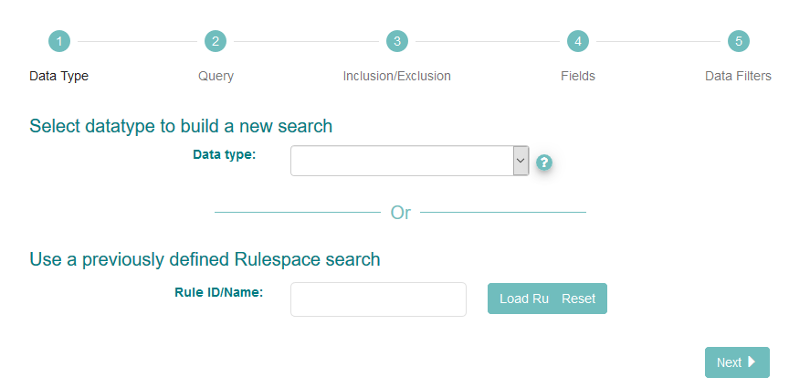
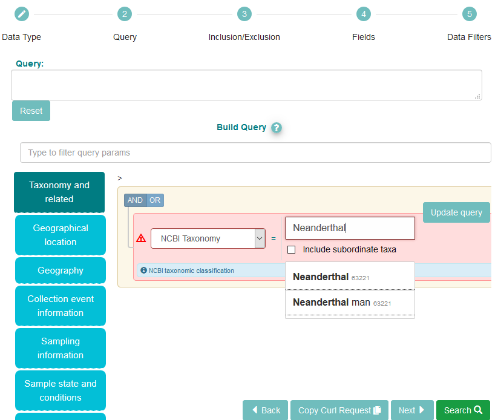
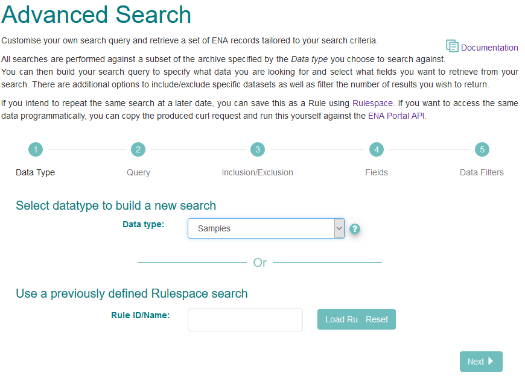
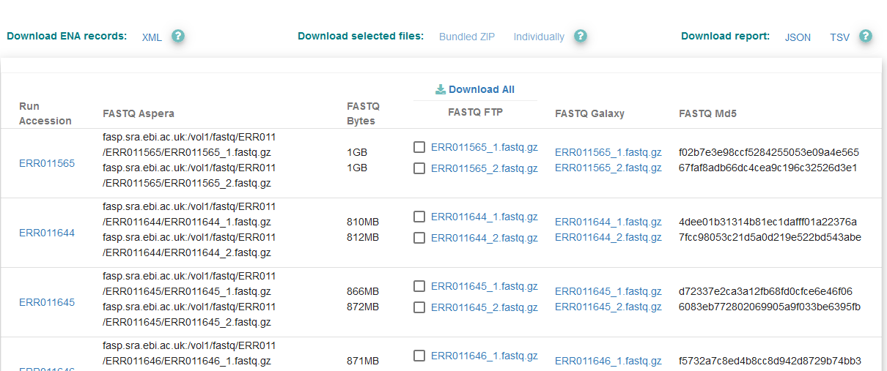

=================================
How To Perform An Advanced Search
=================================

The `ENA Advanced Search interface <https://www.ebi.ac.uk/ena/browser/advanced-search>`_
interface is a powerful way to search the archive for datasets which meet
criteria of interest to you as a user. The below guide will walk you through
the interface using examples. Use this to familiarise yourself with the
interface before conducting your own searches.

Example Uses
============

Below are two example cases you can follow to better understand the advanced
search interface

Neanderthal Read Data
---------------------

Locate all read data submitted for Neanderthals

1. Navigate to the advanced search browser:
   https://www.ebi.ac.uk/ena/browser/advanced-search

2. The interface first asks you to select the datatype you want to search for.
   Use the '?' icon next to the drop-down box to learn more about the options.
   We are searching for read data, so select 'Raw Reads':

3. Click 'Next'

4. You now have opportunity to apply filters which will limit the set of reads
   which are provided.

5. Use the blue buttons on the left to select different filter categories, or
   use the 'Type to filter query params' box to search for a specific parameter

6. In the above box, we have selected the 'Taxonomy and related' category, and
   chosen 'NCBI Taxonomy' from the dropdown.

7. All submissions to ENA must use a valid species-level taxon from the NCBI
   taxonomy database. Begin typing and suggestions appear. We have put
   'Neanderthal'. Notice multiple suggestions are given; in this case, they
   are synonyms, as indicated by their matching taxon IDs (63221).

8. We have entered all the parameters we want, so click 'Search' at the bottom
   right. After a moment, you will be presented with a list of run objects.

Find Samples From Female Sheep
------------------------------

Search for sheep samples registered as female

1. Navigate to the advanced search browser:
   https://www.ebi.ac.uk/ena/browser/advanced-search

2. The interface first asks you to select the datatype you want to search for.
   Use the '?' icon next to the drop-down box to learn more about the options.
   Select the option simply named 'Samples'

3. Click 'Next'

4. Click the 'Taxonomy and related' box, the select 'NCBI Taxonomy' from the
   drop-down. The search box which appears will suggested valid taxa from the
   NCBI taxonomy database as you type. You can enter 'sheep' or the Latin name,
   'Ovis aries', as they are synonyms for the same Taxonomic ID, '9940'

5. Click the name and you will see 'tax_eq(9940)' appear in the query box

6. You can check the 'Include subordinate taxa' box to include subspecies

7. Now select the blue 'Sample state and conditions' box

8. Choose 'sex' from the dropdown, then select 'female'

9. Notice this is added to the 'Query' box

10. Now click 'Search' to see sample objects for female sheep

Rulespace
=========

Rulespace is a tool which allows you save your searches, give them names, rerun
them and share them with other people. Learn more about it in the `Rulespace
Guide <advanced-search/rulespace.html>`_.
