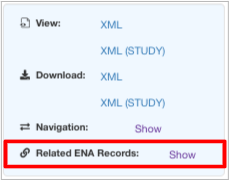
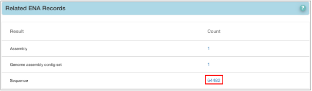
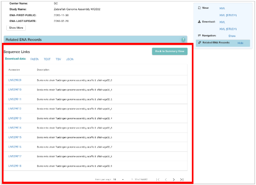
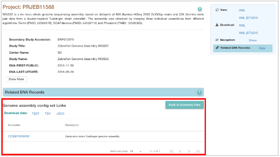
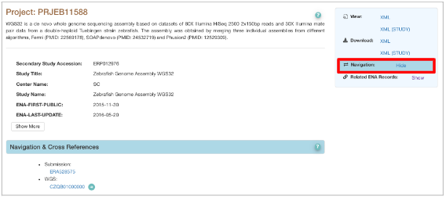
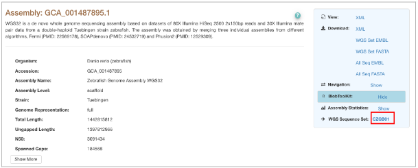
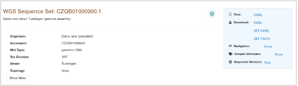
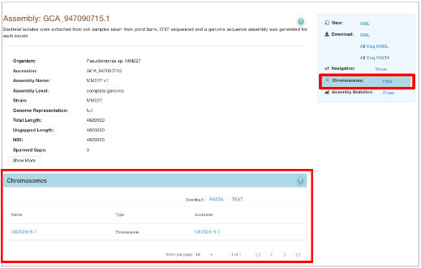
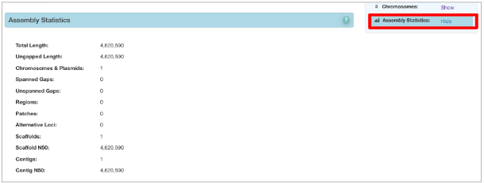

==================================
How to Explore Analysis Accessions
==================================

All analyses (assemblies, targeted sequences, other analyses etc) will be displayed in the ENA browser in various
locations as different accession numbers depending on the type of submission made. This section describes how to
explore these accessions, different ways to navigate, what remains confidential and what does not.

Related ENA Records
===================

This section covers navigating submissions with post-processed sequence or assembly accessions e.g. `genome assemblies
<https://ena-docs.readthedocs.io/en/latest/submit/assembly/genome.html>`_, `MAGs <https://ena-docs.readthedocs.io/en/
latest/submit/assembly/metagenome/mag.html>`_, `Environmental SAGs <https://ena-docs.readthedocs.io/en/latest/submit/
assembly/environmental-sag.html>`_, `metatranscriptome <https://ena-docs.readthedocs.io/en/latest/submit/assembly/
metatranscriptome.html>`_ and `transcriptome assemblies <https://ena-docs.readthedocs.io/en/latest/submit/assembly/
transcriptome.html>`_ and `targeted sequences <https://ena-docs.readthedocs.io/en/latest/submit/sequence.html>`_.
All assemblies and sequences will be accessible through ‘Related ENA Records’ shown in the navigation box below.
This box will be displayed on the right hand side when a project page is accessed.

‘Related ENA Records’ list all the records associated with the project being accessed. For example, in the image below,
project PRJEB11588 has 1 assembly, 1 contig set and 64482 sequences associated with it.

.. image:: images/RER-display.png
   :align: center

These records can be accessed by clicking on the count shown next to the records. If you click on ‘64482’, you will be
able to view all the 64482 sequences associated with the project as shown in the image below:

Similarly, the contig set and the assembly (GCA accession) can be accessed through ‘Related ENA Records’ as displayed
in the image below:

The ‘Navigation’ option in the navigation box also displays the associated records and allows you to directly access
them.

How to explore assembly accessions
==================================

When you view an assembly page (as shown below), you can access various components associated with that assembly. This
section shows how to navigate through assemblies.

As shown in the assembly page, the associated contig set can be viewed through ‘WGS Sequence Set’ shown in the box on
the right hand side of the page as well. The resulting page is shown below:

If there are chromosomes in the assembly, they can be viewed through the assembly page in ‘Chromosomes’ (shown below).

The ‘Assembly Statistics’ shows all details of the assembly being viewed.

View and Download Files
-----------------------

This section explains how to view and download assembly and sequence files from the ENA browser. This only applies to
publicly available data. The ‘View’ option displays and the ‘Download’ option downloads the files that are being
accessed. For example, the options shown in the navigation box below have the following functions:

- **XML** - Displays/downloads the file containing all the assembly attributes displayed in XML format.
- **WGS Set EMBL** - If an assembly contains contigs, downloads the assembly’s WGS contig set in embl (flat file)
  format.
- **WGS Set FASTA** - If an assembly contains contigs, downloads the assembly’s WGS contig set in fasta format.
- **All Seq EMBL** - Downloads all sequences in the assembly including all contigs, scaffolds and chromosomes as
  applicable in embl (flat file) format.
- **All Seq FASTA** - Downloads all sequences in the assembly including all contigs, scaffolds and chromosomes as
  applicable in fasta format.
