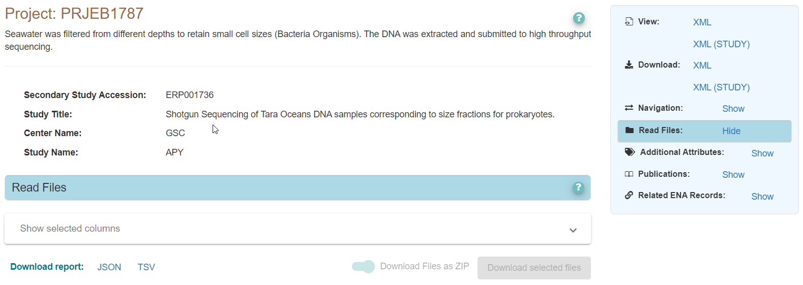
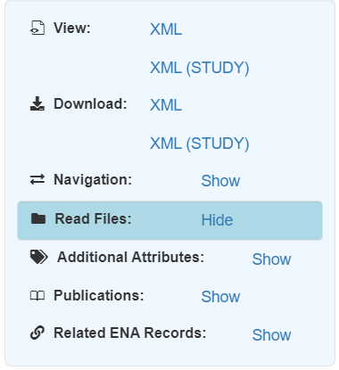
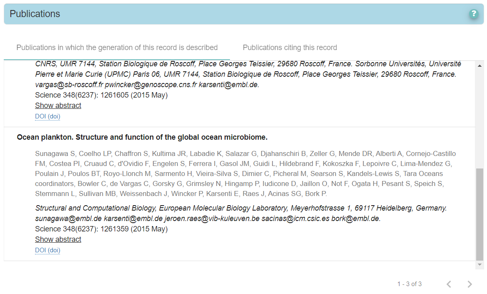
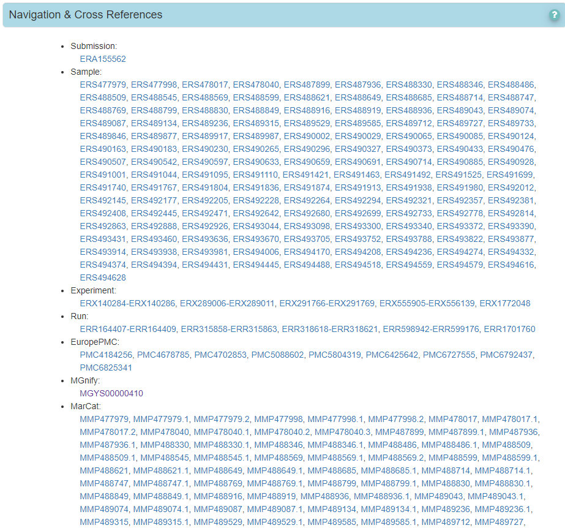
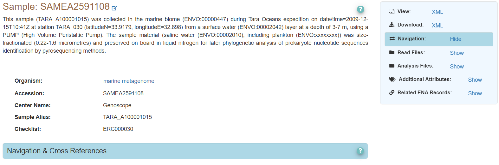
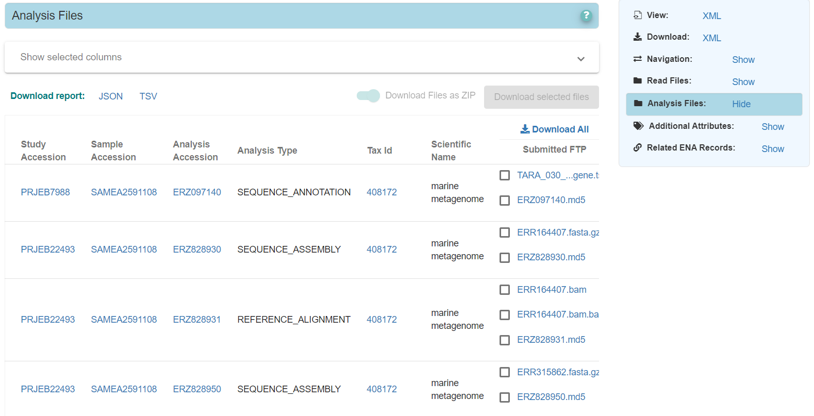
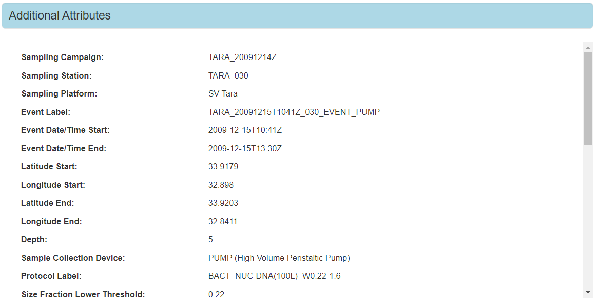

=============================
How to Explore an ENA Project
=============================

A Project registered with the European Nucleotide Archive represents a real-life research project and is a way
to share the data generated as part of that research openly and publicly with the rest of the research community.

In this guide we are going to use the example project `PRJEB1787 <https://www.ebi.ac.uk/ena/browser/view/PRJEB1787>`_
and explore the motivations, contents and related records with this project. Different projects will contain
different types of records: raw reads, assemblies or different analyses specific to that research. This guide is not
comprehensive of all types of ENA research project but should give a basis of how to perform the exploration
yourself in order to get the most out of the ENA research project.

Viewing the Project in The Browser
==================================

Firstly - navigate to the ENA project. This can be done by typing the accession **PRJEB1787** into the box where it says
'Enter accession' on the top right of the ENA browser homepage - this will take you directly to the ENA record.
Alternatively, you can add the accession to the ENA Browser url below:

https://www.ebi.ac.uk/ena/browser/view/<accession>

e.g.:

https://www.ebi.ac.uk/ena/browser/view/PRJEB1787

Once the page has fully loaded, the project should look like this:

The Navigation Box
==================

The main way to navigate through an ENA project is using the navigation box in the top right corner. This will
allow you to show/hide different types of information about that project. The contents of the navigation box will
vary depending on the contents of the project. For example, some projects will have Read Files, others may have
Analysis Files. Some projects have a large number of different components, so be patient if it takes a while to load.

This is the navigation box for project **PRJEB1787**:

This navigation box allows you to:

Navigate directly through the components of the project in the 'Navigation' tab. This also allows you to explore any
cross-references related to this project (links to this record or a related record in other resources).

There is also the option to explore the uploaded 'Read Files' generated as part of that research project.

You can also  explore any 'Additional attributes' that describe this project, links to any associated 'Publications'
as well as a summary of all 'Related ENA Records' with the project.

Umbrella Projects
-----------------

You may also come across umbrella projects. Navigate now to the
`Tara Oceans <https://www.ebi.ac.uk/ena/browser/view/PRJEB402>`_ umbrella project **PRJEB402**.

In some cases, such as this one, you will see an umbrella icon in the navigation box.
This indicates that this project is an **umbrella project**. Instead of holding data, this project provides an umbrella
to group together multiple projects that are part of the same research motivation or collaboration.
You can see a list of all the projects within an umbrella project when viewing the 'Component Projects' tab.

Click on the 'Component Projects' tab and have a look at the contents here. You should see project **PRJEB1787**
listed as one of the components. Don't navigate back to project **PRJEB1787** yet. We'll look first at the research
motivations of the Tara Oceans project.

Exploring Associated Publications
=================================

A good place to start when looking into any ENA project, is to see if the project has any associated publications.
Associated publications can help you understand the research motivations and conclusions that led to the data
generation within that project. For example, as part of the Tara Oceans umbrella project we are looking at, you can
read more about the Tara-Oceans scientific expedition (2009-2012) in the 'Publications' tab.

Publications are available in a table display with links to the article's DOI or Europe PMC.

There are links to 'Publications in which the generation of this record is described' which can
be useful when looking into the methods used for this piece of research. There are also links to 'Publications citing
this record' which can give insight into the influence these data have had on further research.

Once you have finished exploring the associated literature, navigate back to **PRJEB1787** so we can explore the data
that was generated as part of this particular Tara Oceans component project further.

What Does the Project Contain?
==============================

The next questions to ask yourself is - what are the contents of this ENA Project?

To explore the full contents of a project, you can see overviews of all records within the 'Navigation' and
'Related ENA Records' tabs. For example, click on the 'Navigation' tab:

Here we can see a list of all the records that are part of the ENA Project. You can click the *Help* button on the far
right of the tab for more information on the organisation of an ENA project and what is included here. In this
example, you can see that the project holds a number of Samples, Experiments and Runs (if you are not familiar
with the different types of ENA records, have a look at the table in the `general guide <general-guide.html>`_). This
means this project holds raw read data files.

We can also see 'Europe PMC' records, 'MGnify' and 'MarCat' links. These are **cross-references** - records which
are linked to the ENA record in other resources. Let's click on the MGnify (EMBL-EBI metagenomics service) cross
reference `MGYS00000410 <https://www.ebi.ac.uk/metagenomics/studies/MGYS00000410>`_ as an example. You'll see that this
takes you to a MGnify study which allows you to explore the analyses performed by MGnify which were done using the
reads in project **PRJEB1787**.

If you would like to learn more about exploring cross-references in ENA, please see
`our guide on exploring cross-references <ena-project/cross-references.html>`_ for further information.

Feel free to explore the other cross-references available for this project or look into the MGnify analyses then
navigate back to the Navigation tab in `PRJEB1787 <https://www.ebi.ac.uk/ena/browser/view/PRJEB1787>`_.

We know that project **PRJEB1787** contains Samples, Experiments and Runs, which we know means that this project
contains Read Files. So have a look into the Read Files tab to see a table of all the data generated as part of
this project.

Have a look at what additional metadata you can view in the table using the 'Show selected columns' drop down.
Also, have a look at what files you can download as part of this project.

Looking into Sample Records
===========================

If you want to know any specific details about the samples that were collected (and sequenced) during the research
project, you can look into the Sample records that are within the Project.

Sample records contain the most extensive metadata. These explain how the data was collected and can be used to
understand and better interpret the contents of any related data files. For example, navigate to sample
`SAMEA2591108 (ERS478017) <https://www.ebi.ac.uk/ena/browser/view/SAMEA2591108>`_ either in the Read Files table or
through the Navigation tab.

From within this sample record, you can still see the read files that were part of the original project. But from here
you can also see other uses of the data associated with this sample. In particular, you'll notice that you can now
see an Analysis Files tab:

When you click on the Analysis Files tab, you can see a number of analyses of the raw read data. Within this table you
can also see that these are linked to different ENA Projects:

By looking into the sample record you are able to further explore re-uses of that sample or the raw data associated
with it.

"Additional Attributes"
=======================

The 'Additional Attributes' tab is one of the most important tabs. This tab holds all the metadata associated with that
record. It is invaluable for details on sample records.

Navigate to the Additional Attributes tab:

Here you can see all the details of the sample collection event - when it was collected, where it was collected, at
what depth etc. This information can be incredibly useful to provide context to the associated data files. It is also
the metadata used to help search across records.

Sample Checklists
-----------------

If you look at the main descriptions of the sample at the top of the page you will see there is a **Checklist** record
listed (`ERC000030 <https://www.ebi.ac.uk/ena/browser/view/ERC000030>`_). A sample checklist is a list of mandatory,
recommended or optional metadata that was required during registration of that sample. Checklists help standardise the
metadata of samples to make it easier to interpret and search across them.

These checklists are developed with the help of research communities themselves to encourage submitters to provide at
least the minimum information for their samples to be findable and reusable for further research.
You can see the full list of checklists `here <https://www.ebi.ac.uk/ena/browser/checklists>`_.

If you want to search for a particular type of sample (e.g. a soil sample), you can search across the archive by
the checklist (e.g. searching for samples that used the
`GSC MIxS soil <https://www.ebi.ac.uk/ena/browser/view/ERC000022>`_ checklist). See our guide on performing an
`advanced search <advanced-search.html>`_ for details on how to do this.

Keep an Eye Out For Help
========================

The best way to get the most of an ENA project is to explore - see what data and metadata are available and delve into
any other research linked to these.

The ENA browser has several pop up **Help** icons which can aid you in navigating the site. Keep an eye out for
any help that can assist you in exploring or interpreting records in ENA.
