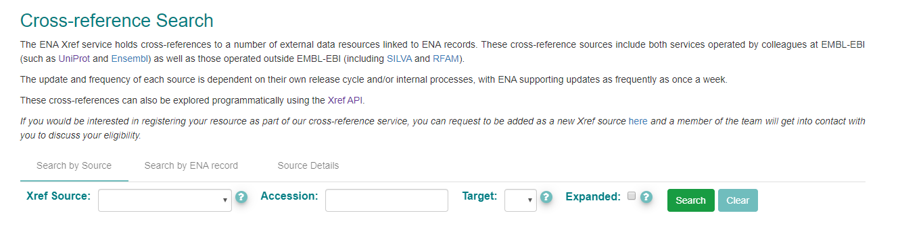
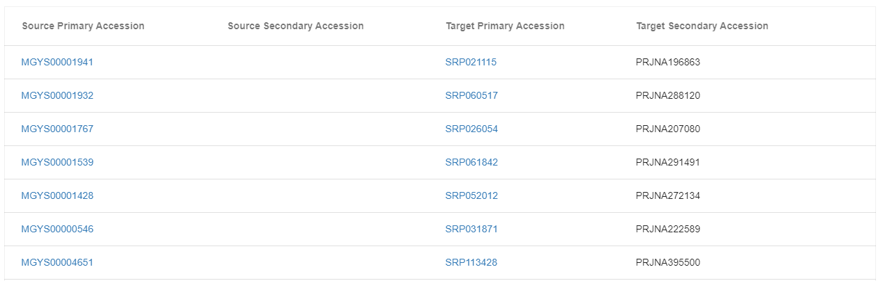
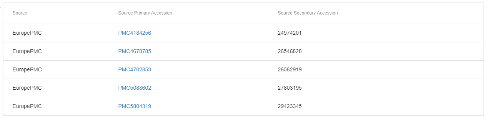

==================================================
How to Explore Cross-References in the ENA Browser
==================================================

The ENA Xref service holds cross-references to a number of external data resources linked to ENA records.
These cross-reference sources include both services operated by colleagues at EMBL-EBI (such as UniProt and Ensembl)
as well as those operated outside EMBL-EBI (including SILVA and RFAM).

These can be searched across and explored using the cross-reference search. You can navigate to the cross-reference
search here:

https://www.ebi.ac.uk/ena/browser/xref

This is what the cross-reference search looks like:

There are three functionalities of the cross-reference search:

- Source Details
- Search by Source
- Search by ENA record

These are described in detail below.

Source Details
==============

You can use the Source Details tab to explore the different services that are registered as part of the ENA cross-reference
service. You can also see when these were last updated. The update and frequency of each source is dependent on
their own release cycle and/or internal processes. ENA supports updates once a week at most.

You can use the filter box to look for a particular source service.

Search by Source
================

To search by source you must specify the Xref Source. This is the service that you would like to search against. This
search will provide all records loaded by that source which can be further filtered by the target ENA record type or ENA
record accession.

For example, if you choose `MGnify <https://www.ebi.ac.uk/metagenomics/>`_ as the Xref source, you'll see that the two
'target' options are 'sample' and 'study'. This means the MGnify service has registered cross references on sample
and study records in ENA. If you choose the 'study' target then click search you'll see an output table of accessions:

Cross references are made up of up to two 'source' accessions from the source service mapped to up to two 'target' ENA
accessions. Here we can see the equivalent MGnify metagenomic analysis projects to raw read projects registered with
ENA.

Optionally, some cross-references also provide additional metadata. You can click the 'Expanded' tick box to include these
addition metadata in your results. An example for this is the COMPARE-RefGenome source which provides taxonomic information
as well as the completeness of the genome for each of the reference genomes registered with the
`COMPARE <https://www.compare-europe.eu/>`_ project.

Search by ENA Record
====================

You can also search using an ENA record to explore all the cross-references linked to this.

For example, when searching for INSDC project 'PRJEB1787', this returns a table of cross-reference links to this project.
You can see that the first records listed are links to publications. Then there are links to the MGnify resource, and
further links to MarCat.

