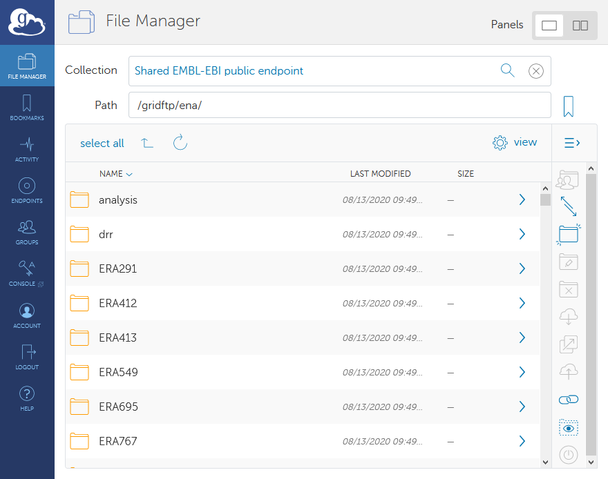

==========================
How to Download Data Files
==========================

Providing users with the ability to download submitted data for further
analysis purposes is a key part of ENA's mission.
Files are therefore made available through a public FTP server.
Here you can learn how this server is structured, and how to download read and
analysis files.

FTP Structure
=============

The root address of the FTP server containing all read and analysis data is:

::

    ftp://ftp.sra.ebi.ac.uk/vol1/

Meanwhile, assembled and annotated sequence data can be found at:

::

    ftp://ftp.ebi.ac.uk/pub/databases/ena/

Any file you download from ENA will come from one of these two FTP servers.
Their content and structures are described in detail at the below pages:

.. toctree::
   :maxdepth: 1

   file-download/sra-ftp-structure
   file-download/ena-ftp-structure

Downloading Files
=================

ENA provides numerous ways to access the data it hosts, suiting a range of
use-cases and computational ability levels.
These are described below, ranked from low to high, based on how much
computational ability might be required:

- `Using ENA Browser`_
- `Using ENA File Downloader Command Line Tool`_
- `Using ENA FTP Downloader GUI tool`_
- `Using Globus`_
- `Using enaBrowserTools`_
- `Using wget`_
- `Using FTP Client`_
- `Using Aspera`_
- `Common Issues`_

.. note::

    Most directories contain a '.md5' file. You can calculate the MD5 value for
    a file you have downloaded and compare it with the relevant .md5 file to
    confirm it has been transferred in full.

Using ENA Browser
-----------------

The ENA Browser is our website, from which you can get information about ENA,
as well as accessing all the data we have public.
Visit us here:

https://www.ebi.ac.uk/ena/browser/home

You can go to any accession by entering it into the 'Enter accession' box at
the link above.
If, for example, you see an ENA accession referenced in a paper, you can see
the data for yourself in this way.
Once there, you can download any associated files by clicking the relevant
links.
For more information on how to explore a record in ENA, please visit our guide
on `How to Explore an ENA Project <./ena-project.html>`_

Using ENA File Downloader Command Line Tool
---------------------------------------------
The ENA File Downloader is a new Java based command line application that you can download
from `GitHub <https://github.com/enasequence/ena-ftp-downloader/tree/master/command-line-downloader>`_.
You can submit one or more comma separated accessions, or a file with accessions that you
want to download data for. This tool allows downloading of read and analysis files,
using FTP or Aspera. It has an easy to use interactive interface and can also create
a script which can be run programatically or integrated with pipelines.

Download the latest version from
`ENA Tools <http://ftp.ebi.ac.uk/pub/databases/ena/tools/ena-file-downloader.zip>`_.

Using ENA FTP Downloader GUI Tool
---------------------------------

The ENA FTP Downloader is a Java GUI application you can download from
`GitHub <https://github.com/enasequence/ena-ftp-downloader/releases>`_.
Given an accession, this program will present a list of associated read or analysis files you
can download.
Alternatively, you can provide a file report generated from our Advanced Search API (ENA Portal
API) to perform a bulk download of all files for a given set of criteria.
Learn more about these APIs from our guide on `How to Access ENA
Programmatically <./programmatic-access.html>`_.

Using Globus
------------

Globus provides a more user-friendly, feature-rich directory interface for
interacting with the FTP server.
Files can be downloaded through `Globus`_ 'EMBL-EBI Public Data'
endpoint from the '/vol1' subfolder:

.. _`Globus`: https://app.globus.org/file-manager?origin_id=fd9c190c-b824-11e9-98d7-0a63aa6b37da&origin_path=%2Fgridftp%2Fena%2F

Globus also provides a command line interface (CLI) which can be used without access to a graphical user interface
environment. See `here <https://docs.globus.org/cli/>`_ for details.

To infer the Globus path for a file from the ftp path, do the following:

e.g. ftp.sra.ebi.ac.uk/vol1/fastq/ERR164/ERR164407/ERR164407.fastq.gz

Remove the ftp url from above

i.e. the above becomes:

/vol1/fastq/ERR164/ERR164407/ERR164407.fastq.gz

Note : The below globus endpoints have been retired :

- EMBL-EBI Private endpoint
- EMBL-EBI Private endpoint 2
- EMBL-EBI Public endpoint
- Shared EMBL-EBI public endpoint

Using enaBrowserTools
---------------------

enaBrowserTools is a set of Python-based utilities which can be found `here
<https://github.com/enasequence/enaBrowserTools/releases>`_.
These are simple-to-run scripts which allow  accession-based data download
commands with the option to create more complex commands.
Read more about this page in the `enaBrowserTools Guide
<./programmatic-access/browser-tools.html>`_.

Using wget
----------

*wget* is a simple command line tool, ubiquitously available in Linux and Mac
releases.
A file can be downloaded with wget simply by specifying its location:

::

    $ wget ftp://ftp.sra.ebi.ac.uk/vol1/fastq/ERR164/ERR164407/ERR164407.fastq.gz

Using curl
----------

curl -o ERR164407.fastq.gz 'ftp://ftp.sra.ebi.ac.uk/vol1/fastq/ERR164/ERR164407/ERR164407.fastq.gz'

Downloading Private Files
^^^^^^^^^^^^^^^^^^^^^^^^^

If you want to use curl to download a non-public data file using datahub (dcc) authentication,
provide the dcc username and password.

e.g.
curl -u dcc_metagenome:password  -o ERR9463971_2.fastq.gz 'ftp://ftp.dcc-private.ebi.ac.uk/vol1/fastq/ERR946/001/ERR9463971/ERR9463971_2.fastq.gz'

Using FTP Client
----------------

Command-line FTP clients allow you to interactively explore the FTP server and
download data to your local computer.
When asked for a username, use 'anonymous'. When asked for a password, press
the enter key to skip this.

::

    ftp ftp.sra.ebi.ac.uk
    Name: anonymous
    Password:
    ftp> cd vol1/fastq/ERR164/ERR164407
    ftp> get ERR164407.fastq.gz

In the above example, the 'cd' command is used to 'change directory' to the
required directory.
Then, the 'get' command is used to specify the file of interest.
At any time, you can use 'ls' to view the content of the current directory.
The command 'pwd' can be used to identify what the current directory is.

Using Aspera
--------------

The IBM Aspera 'ascp' command line client is distributed as part of various free IBM Aspera clients:

- The `Aspera Command Line <https://github.com/IBM/aspera-cli>`_ Interface
- The `IBM Aspera Connect Client <https://www.ibm.com/aspera/connect/>`_
- The `IBM Aspera Desktop Client <https://www.ibm.com/products/aspera/downloads>`_

Public data download requires a private key authentication file.
This used to be provided together with Aspera command line client as the `etc/aspera_tokenauth_id_dsa` or
the 'etc/asperaweb_id_dsa.openssh' file. In the examples below this is referred to as <auth_file_path>.

Following are some examples of how Aspera may be used to download ENA data:
Your local download destination path is referred to as <dest_path> in the examples below.

Note: Please add '-L-' to your aspera command to print logs to the terminal.
If you face any issues, please provide the logs with your helpdesk ticket.

e.g.
ascp -T -l 300m -P 33001 -L- -i path/to/a...

Unix/Linux/Mac
^^^^^^^^^^^^^^

::

    ascp -T -l 300m -P 33001 -i <auth_file_path> era-fasp@fasp.sra.ebi.ac.uk:vol1/fastq/ERR164/ERR164407/ERR164407.fastq.gz <dest_path>

    or

    ascp -T -i <auth_file_path> -l 300m --mode=recv --host=fasp.sra.ebi.ac.uk -P 33001 --user=era-fasp vol1/fastq/ERR164/ERR164407/ERR164407.fastq.gz <dest_path>

Windows
^^^^^^^

::

    "<path_to_aspera_installation>\bin\ascp" -T -l 300m -P 33001 -i "<auth_file_path>" era-fasp@fasp.sra.ebi.ac.uk:vol1/fastq/ERR164/ERR164407/ERR164407.fastq.gz <dest_path>

     or

    "<path_to_aspera_installation>\bin\ascp" -T --mode=recv --host=fasp.sra.ebi.ac.uk -P 33001 --user=era-fasp vol1/fastq/ERR164/ERR164407/ERR164407.fastq.gz <dest_path>

Downloading Private Files
^^^^^^^^^^^^^^^^^^^^^^^^^

e.g. If you want to use aspera to download a non-public data file using datahub (dcc) authentication,
provide the ENA datahub username (dcc_*) instead of era-fasp and you will be prompted for the password.
(or use environment variable `ASPERA_SCP_PASS`)

::

    ascp -T -l 300m -P 33001 dcc_name@fasp.sra.ebi.ac.uk:/vol1/fastq/ERR327/009/ERR3278169/ERR3278169_1.fastq.gz <dest_path>

    or

    ascp -T -l 300m --mode=recv --host=fasp.sra.ebi.ac.uk -P 33001 --user=dcc_name vol1/fastq/ERR327/009/ERR3278169/ERR3278169_1.fastq.gz <dest_path>

Downloading Assembled and Annotated Sequence Data
^^^^^^^^^^^^^^^^^^^^^^^^^^^^^^^^^^^^^^^^^^^^^^^^^

Files in public FTP folders can also be downloaded using Aspera.

e.g. a WGS sequence set like ftp://ftp.ebi.ac.uk/pub/databases/ena/wgs/public/wya/WYAA01.dat.gz

::

    ascp -T -l 300m -P 33001 -i <auth_file_path> fasp-ebi@fasp.ebi.ac.uk:databases/ena/wgs/public/wya/WYAA01.dat.gz <dest_path>

    or

    ascp -i <auth_file_path> -l 300m --mode=recv --host=fasp.ebi.ac.uk -P 33001 --user=fasp-ebi databases/ena/wgs/public/wya/WYAA01.dat.gz <dest_path>

Using Aspera `ascli`
--------------------

A higher level command line tool can also be used: `ascli`

Installation instructions `here <https://github.com/IBM/aspera-cli>`_.

The easiest way to use it is to pre-configure the access through a configuration "preset":

::

    ascli conf preset update era --url=ssh://fasp.sra.ebi.ac.uk:33001 --username=era-fasp --ssh-keys=@ruby:Fasp::Installation.instance.bypass_keys.first --ts=@json:'{"target_rate_kbps":300000}'

Then recall the configuration using parameter: '-Pera', or optionally, set it as default using: 'ascli conf preset set default server era'.

Then transfer files easily with:

::

    ascli -Pera server download vol1/fastq/ERR164/ERR164407/ERR164407.fastq.gz --to-folder=<dest_path>

All the command line arguments can also be used at once without configuration file.

For private files, configure like this (and then use '-Pmypriv'):

::

    ascli conf preset update mypriv --url=ssh://fasp.sra.ebi.ac.uk:33001 --username=dcc_name --password=dcc_pass --ts=@json:'{"target_rate_kbps":300000}'
Common Issues
-------------
Downloading a large number of records
^^^^^^^^^^^^^^^^^^^^^^^^^^^^^^^^^^^^^

If your search criteria is returning a large number of records (e.g.millions) then please consider using a non-browser client (like wget or curl).
NOTE: You need to include the additional parameter "*limit=0*" to obtain ALL matching records, as the default limit is 100,000.

Slow FTP downloads
^^^^^^^^^^^^^^^^^^^

Sometimes you may experience slowness or incomplete files when downloading from our FTP servers due to high load or ongoing maintenance. If the issue persists, please report it at `here <https://www.ebi.ac.uk/ena/browser/support>`.
You could also use other download methods such as Aspera or Globus, which might provide better performance than FTP.

Deprecation of FTP support in web browsers
^^^^^^^^^^^^^^^^^^^^^^^^^^^^^^^^^^^^^^^^^^

Most modern web browsers no longer support the FTP protocol. For this reason, on the ENA Browser links to files hosted on FTP are internally converted to http when clicked for enabling downloads. You can copy the download links from ENA Browser and use them with non-browser clients (like wget or curl). If you still want to download using a web browser then please replace ftp:// with http:// in the URL.
e.g. ftp://ftp.sra.ebi.ac.uk/vol1/fastq/ERR609/001/ERR6090701/ERR6090701_1.fastq.gz -> http://ftp.sra.ebi.ac.uk/vol1/fastq/ERR609/001/ERR6090701/ERR6090701_1.fastq.gz
