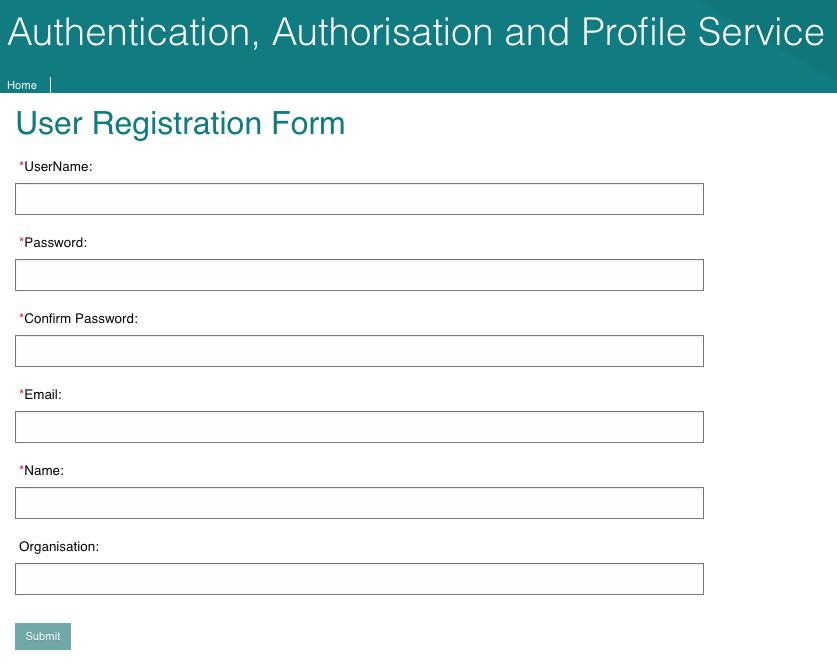
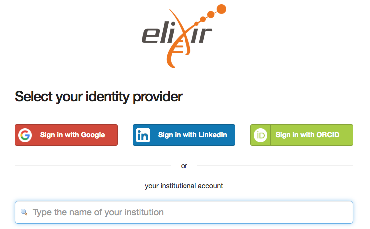
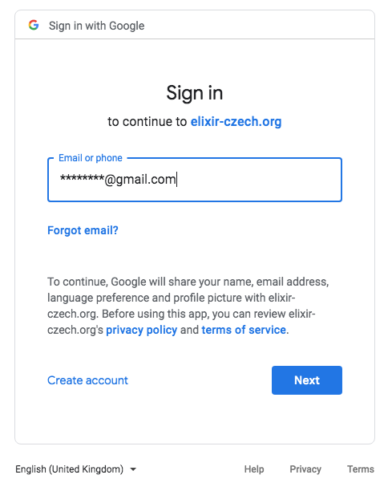
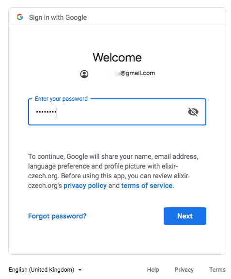

=========
Rulespace
=========

Introduction
============

The Rulespace service supports the creation & management of user-controlled rules &
metadata relating to these rules that are used to define shareable searches on services such as the ENA Discovery API.
Rules can specify metadata filters, expressed in a structured query language, and lists of accessions
for inclusion/exclusion. The results matching the search parameters can be further customised by which fields are
returned and the number of rows etc.

Rulespace components
====================

1. **A RESTful read/write API**
    Allows the creation and editing of Rules programmatically, and the retrieval of existing Rules by Id or unique name

2. **A Graphical User Interface**
    This component in the ENA Browser allows users to create, view and edit rules with assistance. This fully integrates with the Advanced Search interface for easily capturing Rules from searches.

The Rulespace system can be accessed and managed using 2 authentication options.

Authentication using AAP Account
================================

The Authentication, Authorisation and Profile service (AAP) provides a central identity and role management function for different services at EMBL-EBI and can be used by other services and organisations as required. The service allows the management of permissions and attributes through domains (or groups) to be coordinated in a single point across a range of services.

How Do I Register with AAP ?
----------------------------
Create an AAP account by registering at |AAP| and fill out the user form.

.. |AAP| raw:: html

    <a href="https://aai.ebi.ac.uk/registerUser" target="_blank">AAP</a>

Authentication using Elixir Account
===================================

The ELIXIR Authentication and Authorisation Infrastructure (AAI) enables researchers to use their home organisation credentials or community or commercial identities (e.g. ORCID, LinkedIn) to sign in and access data and services they need.
    
How Do I Create an Elixir Account ?
-----------------------------------
Create an ELIXIR ID that you can use to access services across ELIXIR. You can register with an account you already use, like your institution account, ORCID or Google account.

Steps to register with Elixir

1.  Visit |ELIXIR| register page.

.. |ELIXIR| raw:: html

    <a href="https://elixir-europe.org/register" target="_blank">ELIXIR</a>

2.  Select your preferred identity providers.

3.  Sign-in to your selected identity provider e.g. using your Google account

4.  Enter your username.

4.  Enter your password and grant permissions.

5.  You are now registered with Elixir.
