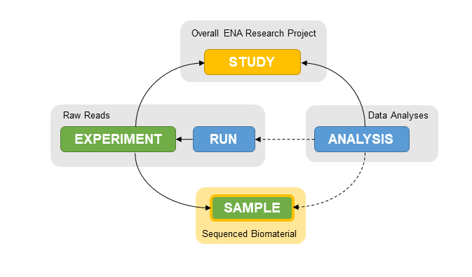

=======================
How to Register Samples
=======================

Introduction
============

In order to submit sequencing or analysis data, it is important to first register your 
biological samples with ENA. Each sample in ENA represents biomaterial that a sequencing 
library was produced from.

A different sample should be registered for each sample used in the real-life sequencing 
project. These samples give context to your data so it is important to ensure the metadata 
associated with them is as extensive and accurate as possible.

It is also important to make sure the most appropriate taxonomy is used for your samples. 
Read more about ENA's taxonomy services `here <../faq/taxonomy.html>`_.

Accessions
==========

Once the samples are registered, Webin will report two accession numbers for each sample. 
The first starts with SAMEA and is called the BioSample accession. The samples will also be 
assigned an alternative accession number that starts with ERS. This accession number is called 
the ENA sample accession.

Always make a note of any accessions you receive as these are the unique identifiers for each 
of your submissions to ENA.

Submission Options
==================

Samples can be submitted one of two ways, using the Webin Interactive web interface 
or programmatically.  For an overview of these, please 
see the `General Guide on Submitting to ENA <general-guide.html>`_.

.. toctree::
   :maxdepth: 1

   samples/interactive
   samples/programmatic
