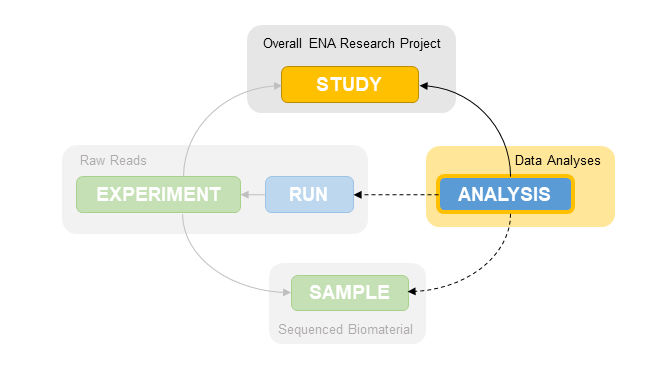

============================
How to Submit Other Analyses
============================

Introduction
============

Any secondary analyses you wish to submit to ENA that are not `Assemblies <assembly.html>`_ 
or `Annotated Sequences <sequence.html>`_ need to be submitted programmatically.

All submissions to ENA must be part of an ENA Study. This gives context to the data being 
submitted and controls the release date of the associated data.

Other submission objects may also need submitting before you can submit your secondary analyses 
depending on the analysis type. E.g. read alignments require a raw read submission as well as 
a Study.

The analysis XML format is defined by `SRA.analysis.xsd <ftp://ftp.ebi.ac.uk/pub/databases/ena/doc/xsd/sra_1_5/SRA.analysis.xsd>`_
XML Schema.

Please note some analysis types require certain object relations so please read the individual submission guides 
for more detail on what needs submitting for each analysis type and please register all 
required objects before beginning your analysis submission.

How to register/submit other datasets to ENA:

- `Register a study <study.html>`_ 
- `Register samples <sample.html>`_
- `Submit raw reads <reads.html>`_

Submission Options
==================

All analyses require programmatic submission.

For an overview of how to submit programmatically, please 
see the documentation on `Programmatic Submissions <general-guide/programmatic.html>`_.

.. toctree::
   :maxdepth: 1

   analyses/read-alignments
   analyses/sequence-annotation
   analyses/pacbio-methylation
   analyses/bionano-maps
   analyses/taxonomic-reference-set

Analysis File Groups
====================

For each analysis type, only specified pre-defined groups of files are allowed in a submission.
The allowed file group(s) for each analysis type are enumerated in the below table.
There may be multiple allowed groups for each analysis type, and the amount of files may be a range rather than a
single integer.

**Using This Table:** Having identified the analysis type you wish to submit, find it in the table and consider all
file groups available for it.
A single file group will occupy multiple lines if it includes multiple types of file.
Not all file types will be mandatory for a file group, which will be indicated by the 'Allowed Quantity' column
showing that 0 is an acceptable quantity of files for a given type.

+-------------------------+-------------------------+-----------------+------------------+
| Analysis Type           | File Group Name         | File Format     | Allowed Quantity |
+=========================+=========================+=================+==================+
| Genome Map              | Bionano Native          | BIONANO_NATIVE  | 1+               |
+-------------------------+-------------------------+-----------------+------------------+
| Reference Alignment     | Single BAM              | BAM             | 1                |
|                         +-------------------------+-----------------+------------------+
|                         | Single CRAM             | CRAM            | 1                |
+-------------------------+-------------------------+-----------------+------------------+
| PacBio Methylation      | Sequence Methylation    | GFF             | 1                |
+-------------------------+-------------------------+-----------------+------------------+
| Sequence Annotation     | Sequence Methylation    | TAB             | 0-2              |
|                         +-------------------------+-----------------+------------------+
|                         | Single TAB              | TAB             | 1                |
|                         +-------------------------+-----------------+------------------+
|                         | Single FASTA            | FASTA           | 1                |
|                         +-------------------------+-----------------+------------------+
|                         | Single BED              | BED             | 1                |
|                         +-------------------------+-----------------+------------------+
|                         | Single GFF              | GFF             | 1                |
+-------------------------+-------------------------+-----------------+------------------+
| Taxonomic Reference Set | Taxonomic Reference Set | FASTA           | 1                |
|                         +-------------------------+-----------------+------------------+
|                         | Taxonomic Reference Set | TAB             | 1                |
+-------------------------+-------------------------+-----------------+------------------+

..  Raw version of above in ERAPRO:
..
..  select afg.analysis_type, fgf.file_group_id, fgf.file_format, concat(concat(fgf.min_file_cnt, '-'), fgf.max_file_cnt) from cv_file_group_format fgf
..  join cv_analysis_file_group afg
..  on fgf.file_group_id = afg.file_group_id
..  order by afg.analysis_type;
