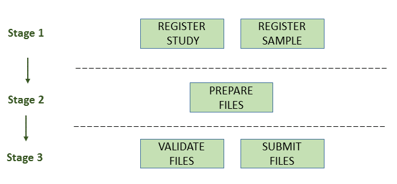

====================================
Submitting Isolate Genome Assemblies
====================================

- `Introduction`_
- `Stage 1: Pre-Register Study And Sample`_
- `Stage 2: Prepare The Files`_
- `Stage 3: Validate And Submit The Files`_
- `Assigned Accession Numbers`_
- `Validation Rules`_
- `Assembly Updates`_
- `Automatic Fixes`_
- `Appendix: Definition Of Terms`_

Introduction
============

Genome assemblies can be submitted to the European Nucleotide Archive (ENA)
using the `Webin command line submission interface <../general-guide/webin-cli.html>`_ with ``-context genome`` option.

Please contact our `helpdesk <https://www.ebi.ac.uk/ena/browser/support>`_ if you intend to submit an assembly
assembled from third party data.

Genome assembly submissions include plasmids, organelles, complete virus genomes, viral segments/replicons,
bacteriophages, prokaryotic and eukaryotic genomes.

A genome assembly submission includes:

- General assembly information

   - Study accession
   - Sample accession
   - Assembly name
   - Assembly type
   - Assembly program
   - Sequencing platform
   - Minimum gap length
   - Molecule type (genomic DNA, genomic RNA or viral cRNA)
   - Coverage
   - Free text description of the genome assembly (optional)

- Contig sequences (if any)
- Scaffold sequences (if any)
- Chromosome sequences (if any)
- Unlocalised sequences (if any)
- Functional annotation (optional)

For assembly submission purposes, the term 'chromosome' should be understood to include organelles
(e.g. mitochondria and chloroplasts), plasmids and viral segments.

The below image provides an outline of the workflow for submitting assemblies:

Stage 1: Pre-Register Study And Sample
======================================

Each submission must be associated with a pre-registered study and a sample.

Genome assemblies except metagenomes are uniquely associated with a study and a sample.
When assemblies are updated they must be re-submitted with the same study and sample as in the original submission.

- `Register a Study <../study.html>`_
- `Register a Sample <../samples.html>`_

It is also strongly recommended to submit the reads from which the assembly was assembled.
In order to reference the reads which were used to generate the assembly, please see the ``RUN_REF`` tag included in
the manifest file below.

- `Submit raw reads <../reads.html>`_

Register locus tag prefixes
---------------------------

This is only required if you are submitting an annotated assembly. Otherwise, please proceed to Stage 2.

Locus tag prefixes should be registered with your study.
See `here <../../faq/locus_tags.html>`_ for information on locus tags.
Briefly, locus tag prefixes must:

- Start with a letter
- Be at least 3 characters long
- Be upper case
- Contain only alpha-numeric characters and no symbols such as -_*

You will need to wait 24 hours before proceeding further in the submission process to ensure these prefixes have been
registered.

Stage 2: Prepare The Files
==========================

The set of files that are part of the submission are specified using a manifest file.
The manifest file is identified in the Webin-CLI command using the ``-manifest <filename>`` option.

Please note that the types of file which may be involved in an assembly submission are more comprehensively documented
in our page `Accepted Genome Assembly Data Formats <../fileprep/assembly.html>`_.

The set of files required for submission of a genome assembly depends on the assembly level:

- `Contig Assembly`_
- `Scaffold Assembly`_
- `Chromosome Assembly`_

Contig Assembly
---------------

Consists of the following files:

- 1 manifest file
- 1 FASTA file OR 1 flat file

This assembly level only requires information on the sequences and annotation (if any).
You will receive an error if less than 2 or more than 1,000,000 sequences are submitted.
If you have less than 2 sequences, then you  will need to submit at a higher assembly level or as `template sequences
<../sequence/webin-cli-flatfile.html)>`_.

Scaffold Assembly
-----------------

Consists of the following files:

- 1 manifest file
- 1 FASTA file OR 1 flat file
- 1 AGP file

This assembly level requires information on the sequences and annotation (if any).
It also allows the submitter to provide an AGP file to give instructions for the assembly of the scaffolds
from the contigs.

Chromosome Assembly
-------------------

Consists of the following files:

- 1 manifest file
- 1 FASTA file OR 1 flat file
- 1 chromosome list file
- 0-1 unlocalised list files
- 0-1 AGP files

This assembly level allows the submission of fully assembled chromosomes including organelles, plasmids, and viral
segments. This requires information on the sequences and annotation (if any) and submission of a chromosome list file
to indicate which sequences represent which ‘chromosomes’.

If these chromosomes contain unlocalised sequences (where the chromosome of the sequence is known but not the exact
location) you can submit an additional unlocalised list file. However, please note, if you wish to submit unplaced
contigs, you will have to submit at a lower level and use an AGP file to indicate which scaffolds/contigs are
assembled to form each chromosome. Any sequences that are not used to assemble chromosomes are considered unplaced.

For this assembly level in particular, it is important to understand how sequence names are formatted so they can be
consistent between files, otherwise the system will just register your submission at contig level.

Sequence Names
--------------

Sequences must have a unique name within the submission that is provided in the fasta, AGP or flat files.
It is essential that the sequence names are unique and used consistently between files.

For example, the chromosome list file must refer to the chromosome sequences using the unique sequence names.
Similarly, an AGP file must refer to scaffolds or contigs using the unique sequence names.

Manifest Files
--------------

The manifest file describes your assembly, including metadata and file names.
It is a plain text file with two columns separated by a tab (or any whitespace characters):

- Field name (first column): case insensitive field name
- Field value (second column): field value

The following metadata fields are supported in the manifest file for genome context:

- STUDY: Study accession
- SAMPLE: Sample accession
- ASSEMBLYNAME: Unique assembly name
- ASSEMBLY_TYPE: 'clone or isolate'
- COVERAGE: The estimated depth of sequencing coverage
- PROGRAM: The assembly program
- PLATFORM: The sequencing platform, or comma-separated list of platforms
- MINGAPLENGTH: Minimum length of consecutive Ns to be considered a gap (optional)
- MOLECULETYPE: 'genomic DNA', 'genomic RNA' or 'viral cRNA' (optional)
- DESCRIPTION: Free text description of the genome assembly (optional)
- RUN_REF: Comma separated list of run accession(s) (optional)

Please see further below for validation rules affecting some of these fields.

The following file name fields are supported in the manifest file:

- FASTA: sequences in fasta format
- FLATFILE: sequences in EMBL-Bank flat file format
- AGP: Sequences in `AGP format <https://www.ncbi.nlm.nih.gov/assembly/agp/AGP_Specification/>`_
- CHROMOSOME_LIST: list of chromosomes
- UNLOCALISED_LIST: list of unlocalised sequences

For example, the following manifest file represents a genome assembly consisting of contigs provided in one fasta file:

::

    STUDY   TODO
    SAMPLE   TODO
    ASSEMBLYNAME   TODO
    ASSEMBLY_TYPE clone or isolate
    COVERAGE   TODO
    PROGRAM   TODO
    PLATFORM   TODO
    MINGAPLENGTH   TODO
    MOLECULETYPE   genomic DNA
    FASTA   genome.fasta.gz

Other Files
-----------

Other genome assembly data files are described in `Genome Assembly Data Formats <../fileprep/assembly.html>`_.

Stage 3: Validate And Submit The Files
======================================

Files are validated, uploaded and submitted using the `Webin command line submission interface
<../general-guide/webin-cli.html>`_ (Webin-CLI).
Please refer to the `Webin command line submission interface <../general-guide/webin-cli.html>`_ documentation for more
information about the submission process.

Assigned Accession Numbers
==========================

Once the genome assembly has been submitted an analysis (ERZxxxxxx) accession number is immediately assigned and returned to
the submitter by the Webin command line submission interface (Webin-CLI).

ERZ accessions **should not** be used to reference the assembly in publications.
The purpose of the ERZ accession number is for the submitter to be able to refer to their submission within the Webin
submission service. For example, the submitter can retrieve the assigned genome assembly and sequence accessions from
the `Webin submissions portal <../general-guide/submissions-portal.html>`_ or from the `Webin reports service
<../general-guide/reports-service.html>`_ using the ERZ accession number.
This accession should be used to refer to the assembly in any conversations with helpdesk staff.

For genome assemblies, long term stable accession numbers that can be used in publications are:

- Study accession (PRJEBxxxxxx) assigned at time of study registration
- Sample accession (SAMEAxxxxxx) assigned at time of study registration
- Genome assembly accession (GCA_xxxxxx) assigned once the genome assembly has been fully processed by ENA and
  stable between versions
- Sequence accession(s) assigned once the genome assembly submission has been fully processed by ENA

Submitters can retrieve the genome and sequence accession numbers from the `Webin submissions portal
<../general-guide/submissions-portal.html>`_ or from the `Webin reports service
<../general-guide/reports-service.html>`_.
These accession numbers are also sent to the submitters by e-mail.

Validation Rules
================

Assembly submissions are subject to a great deal of validation before submission is allowed. Some key points
are described here.

Sample And Study Validation
---------------------------

- Sample and study (BioProject) pair must be unique for an assembly (except metagenomes)
- Sample taxonomic classification must be species level or below (or equivalent) within NCBI taxonomy.

Assembly Name Validation
------------------------

Assembly names must:

- match the pattern: ^[A-Za-z0-9][A-Za-z0-9 _#\-\.]*$
- not be longer than 50 characters
- not include the name of the organism assembled

Chromosome Name Validation
--------------------------

Chromosome names must:

- match the pattern: ^\[A-Za-z0-9\]\[A-Za-z0-9_#\-\.]*$
- be shorter than 33 characters
- be unique within an assembly
- not contain any of the following as part of their name (case insensitive):

    - 'chr'
    - 'chrm'
    - 'chrom'
    - 'chromosome'
    - 'linkage group'
    - 'linkage-group'
    - 'linkage_group'
    - 'plasmid'

Sequence Validation
-------------------

Sequences must:

- have unique names within an assembly
- be at least 20bp long
- not have terminal Ns
- consist of bases: 'a','c','g','t','u','b','d','h','k','m','n','r','s','v','w','y'

Sequence Count Validation
-------------------------

Assembly submissions will typically not be allowed if the amount of sequences doesn't fall within a required range.
For example, contig-level assemblies must include more than 1 but less than 1,000,000 sequences.
In specific cases, ENA may allow the submission of genome assemblies that are giving the following errors:

Since Webin 1.7.0:

- Invalid number of sequences : XXX, Minimum number of sequences for CONTIG is: YYY
- Invalid number of sequences : XXX, Minimum number of sequences for SCAFFOLD is: YYY
- Invalid number of sequences : XXX, Minimum number of sequences for CHROMOSOME is: YYY
- Invalid number of sequences : XXX, Maximum number of sequences for CONTIG is: YYY
- Invalid number of sequences : XXX, Maximum number of sequences for SCAFFOLD is: YYY
- Invalid number of sequences : XXX, Maximum number of sequences for CHROMOSOME is: YYY

This will be done at the discretion of the curation team when provided with valid reasoning,
and can be requested through our `helpdesk <https://www.ebi.ac.uk/ena/browser/support>`_.

Assembly Updates
================

Assembly updates must:
- use the same sample and study pair as was used in the initial assembly submission
- not remove any chromosomes
- use a unique 'ASSEMBLY_NAME' value in the manifest file

Automatic Fixes
===============

Some fixes may be applied automatically, which users should be aware of. A few of these are documented below.

CDS Feature
-----------

- Feature location is made 5' partial if the /codon_start is 2 or 3.
- Feature location is made 5' partial if the /translation does not start with a start codon.
- Feature location is made 3' partial if the /translation does not end with a stop codon.
- Feature location is made 3' and 5' partial if the location span is not a multiple of three.
- Feature location has 3' partiality removed if the /translation ends with a stop codon.
- Feature is made /pseudo and the /translation is removed if the /translation contains internal stop codons.

Appendix: Definition Of Terms
=============================

+-----------------------+----------------------------------------------------------------------------------------------+
| Term                  | Definition                                                                                   |
+=======================+==============================================================================================+
| Chromosome            | | An assembled pseudomolecule that represents a biological chromosome.                       |
|                       | | Most of the chromosome is expected to be represented by sequenced bases,                   |
|                       | | although some gaps may still be present.                                                   |
+-----------------------+----------------------------------------------------------------------------------------------+
| Placed sequence       | | A sequence that has a known chromosomal location and orientation.                          |
+-----------------------+----------------------------------------------------------------------------------------------+
| Unlocalised sequence  | | A sequence that is associated with a specific chromosome without                           |
|                       | | being ordered or oriented on that chromosome.                                              |
+-----------------------+----------------------------------------------------------------------------------------------+
| Unplaced sequence     | | A sequence that is not associated with any specific chromosome.                            |
+-----------------------+----------------------------------------------------------------------------------------------+
| Genomic region        | | A named part of the primary assembly for which alternate loci or                           |
|                       | | patches are available.                                                                     |
+-----------------------+----------------------------------------------------------------------------------------------+
| Alternate locus       | | A sequence that provides an alternate representation of a locus.                           |
|                       | | Alternate locus are collected into additional assembly units (i.e.                         |
|                       | | not in the primary assembly).                                                              |
+-----------------------+----------------------------------------------------------------------------------------------+
| Patch                 | | A sequence that provides a fix and/or novel sequence to the genome                         |
|                       | | assembly.                                                                                  |
+-----------------------+----------------------------------------------------------------------------------------------+
| Fix patch             | | Sequence corrections or assembly gap reductions for the primary                            |
|                       | | assembly introduced in a minor release. Fix patches are expected to be                     |
|                       | | incorporated into the primary or alternate loci assembly units in the                      |
|                       | | next major release.                                                                        |
+-----------------------+----------------------------------------------------------------------------------------------+
| Novel patch           | | Novel sequences for the primary assembly introduced in a minor release.                    |
|                       | | Novel patches are expected to be incorporated into the primary assembly                    |
|                       | | unit in the next major release.                                                            |
+-----------------------+----------------------------------------------------------------------------------------------+
| Assembly              | | A set of chromosome assemblies, unlocalized and unplaced sequences,                        |
|                       | | alternate loci and patches that represent a genome.                                        |
+-----------------------+----------------------------------------------------------------------------------------------+
| Assembly unit         | | An assembly is organized into assembly units.                                              |
+-----------------------+----------------------------------------------------------------------------------------------+
| Primary assembly unit | | Assembly unit that contains the set of assembled chromosomes,                              |
|                       | | unlocalized and unplaced sequences that represent a non-redundant                          |
|                       | | genome. Alternative loci and patches are not included in the primary                       |
|                       | | assembly unit.                                                                             |
+-----------------------+----------------------------------------------------------------------------------------------+
| Major release         | | A release of a genome assembly that contains a primary assembly and                        |
|                       | | alternate loci, e.g. GRCh37.                                                               |
+-----------------------+----------------------------------------------------------------------------------------------+
| Minor release         | | A release of a genome assembly that adds patches to the major release,                     |
|                       | | e.g. GRCh37.p5.                                                                            |
+-----------------------+----------------------------------------------------------------------------------------------+
| Assembly chain        | | The major and minor releases form an assembly chain. For example, the                      |
|                       | | assembly accession for GRCh37 major release is GCA_000001405.1. The                        |
|                       | | assembly accession consists of two parts: the assembly chain accession                     |
|                       | | (GCA_000001405) and the assembly version (1). The assembly version is                      |
|                       | | incremented for each minor release while the assembly chain accession                      |
|                       | | remains unchanged.                                                                         |
+-----------------------+----------------------------------------------------------------------------------------------+
