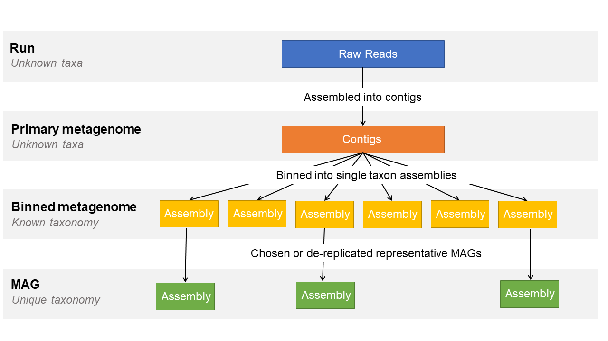

================================
Submitting Metagenome Assemblies
================================

Metagenome assemblies can be submitted to the European Nucleotide Archive (ENA) as one of three options.

- **Primary Metagenome** : a metagenome assembly prior to binning from a sampled biome or collection of sampled biomes
  without attempt to separate taxa.

- **Binned Metagenome** : encompasses anything from a set of contigs to a complete genome assembly from a metagenomic
  source that has been identified as a single-taxon set.

- **Metagenome-Assembled Genome (MAG)** : a single-taxon assembly based on one or more binned metagenomes that has been
  asserted to be a close representation to an actual individual genome (that could match an already existing isolate or
  represent a novel isolate).

This three tiered system is designed to represent the different stages of a metagenome assembly workflow:

To best represent your data, please submit as many of the levels as you can that are applicable to your study.

.. toctree::
   :caption: Submission Guides
   :maxdepth: 1

   metagenome/primary
   metagenome/binned
   metagenome/mag

.. note::
   Submissions of binned metagenomes or Metagenome-Assembled Genomes differ from regular assemblies as they are
   considered derived assemblies.

When it comes to submission of derived assemblies you will be asked to register additional samples for each
assembly (a **binned** sample or a **MAG** sample).

.. image:: ../images/metadata_model_derivedanalysis.png
   :align: center

This is because a binned assembly or MAG is not an assembly of all the data from the collected sample so linking to
the environmental sample is misleading and causes incorrect taxonomy assignment. As a result, an additional
sample needs registering to represent the subset of those data that were assembled. This sample will also hold all
metadata related to the taxonomy of that subset as well as methods used to derive it.

All derived assemblies from an environmental source require an additional virtual derived sample so please follow
instructions carefully.
