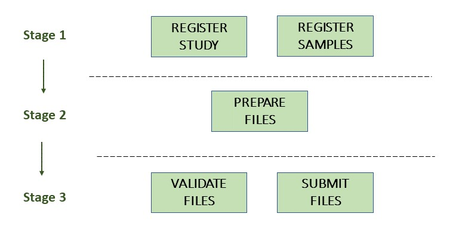

# Submitting A Metagenome-Assembled Genome (MAG)

## What is considered a MAG in ENA?

A **Metagenome-Assembled Genome (MAG)** is a single-taxon assembly based on one or more binned metagenomes that has been asserted to be a close representation to an actual individual genome (that could match an already existing isolate or represent a novel isolate).

MAG submissions are submitted at the same level as isolate genomes and are distributed within INSDC in the same way. As an environmental sample can contain many duplicate genomes of the same organism and as MAG assemblies are more prone to contamination, we request only the highest quality unique-taxon submissions are submitted as MAGs.

There should only be **one MAG** submitted for each species within a biome. This can be determined using a de-replication step or by choosing the highest quality representative genome for each predicted species.

It is recommended that for all MAG submissions, all lower level assemblies are submitted first. This means a MAG submission can be used to highlight the best and most representative derived assemblies from a binned metagenome set and ensures the methods used to derive your MAG are reproducible.

- [Submitting A Primary Metagenome Assembly](primary.html)
- [Submitting Binned Metagenome Assemblies](binned.html)

If your study is small-scale and you only intend to submit a very small number of **stand-alone MAGs**, lower level metagenome assembly submissions may not be necessary, though are still recommended where possible. Please contact our [helpdesk](https://www.ebi.ac.uk/ena/browser/support) if you have any questions.

## Introduction

Metagenome assemblies can be submitted to the European Nucleotide Archive (ENA) using the [Webin command line submission interface](../../general-guide/webin-cli.html) with `-context genome`.

Please contact our [helpdesk](https://www.ebi.ac.uk/ena/browser/support) if you intend to submit an assembly assembled from third party data.

A Metagenome-Assembled Genome consists of:
- General assembly information
   - Study accession or unique name (alias)
   - **Binned** Sample accession or unique name (alias) or **Environmental** Sample accession or unique name (alias)
   - **MAG** Sample accession or unique name (alias)
   - Assembly program
   - Sequencing platform
   - Minimum gap length
   - Molecule type (genomic DNA, genomic RNA or viral cRNA)
   - Coverage
- Contig sequences (if any)
- Scaffold sequences (if any)
- Chromosome sequences (if any)

The following picture illustrates the stages of the MAG submission process:



## Stage 1: Pre-register study, samples and lower level assemblies

If you have not done so already, please register a study.

- [Register a Study](../../study.html)

It is recommended to submit all lower level metagenomic assemblies and raw reads before submitting MAGs to help record your methods and make your data reproducible.

- [Submitting Raw Reads](../../reads.html)
- [Submitting A Primary Metagenome Assembly](primary.html)
- [Submitting Binned Metagenome Assemblies](binned.html)

### Stand-alone MAG submission

If you intend to submit only a small number of stand-alone MAGs, submitting lower level assemblies is not necessary. In this case, please make sure you have registered an **environmental** sample. This will represents the original sequenced biomaterial that your MAG was derived from.

Your **environmental** samples are the same samples used for raw read submission. If you have not yet registered an environmental sample, please make sure the appropriate environmental checklist is chosen for this and an [environmental taxon](../../../faq/taxonomy.html#environmental-biome-level-taxonomy) is used (e.g. aquatic metagenome (tax id: 1169740)).

- [Register a Sample](../../samples.html)

If you do not intend to submit [raw reads](../../reads.html) as part of your stand-alone MAG submission, please see [here](../../../faq/metagenomes.html#how-do-i-submit-metagenome-assemblies-without-raw-data-or-primary-assemblies-to-point-to) for details on how to release your **environmental** samples. If no data is associated with a sample, it needs to be released manually in order to be available to the public.

### Registering MAG samples

Each **MAG** assembly submission must be associated with a **MAG** sample.

This **MAG** sample virtually represents the taxon that was assembled from the metagenome and refers to another sample that the MAG was derived from (either a **binned** metagenome sample or an **environmental** source sample).

It should be as [specific in taxonomy](../../../faq/taxonomy.html#environmental-organism-level-taxonomy) as it can be and use the specific **GSC MIMAGS** checklist.

Please make sure these **MAG** samples correctly reference either the **binned** sample (or **environmental** sample in the case of stand-alone MAGs) that the MAG was derived from. This can be done from within the checklist using the mandatory “sample derived from” attribute. If the assembly was derived from multiple samples or runs you can list these with a comma separated list or range.

You should also reference the source sample in the description:

“This sample represents a MAG derived from the metagenomic sample ERSXXXXX”

- [Register a Sample](../../samples.html)

## Stage 2: Prepare the files

The set of files that are part of the submission are specified using a manifest file.
The manifest file is specified using the `-manifest <filename>` option.

The files required for submission of a genome assembly depends on the assembly level:

- Contig
- Scaffold
- Chromosome

### Contig assembly

Consists of the following files:

- 1 manifest file
- 1 fasta file OR 1 flat file

This assembly level only requires information on the sequences and annotation (if any).

You will receive an error if less than 2 sequences are submitted. If you have less than 2 sequences, then you  will need to submit at a higher assembly level or as [template sequences](../../sequence/webin-cli-flatfile.html).

### Scaffold assembly

Consists of the following files:

- 1 manifest file
- 1 fasta file OR 1 flat file
- 1 AGP file

This assembly level requires information on the sequences and annotation (if any).

It also allows the submitter to provide an AGP file to give instructions for the assembly of the scaffolds from the contigs.

### Chromosome assembly

Consists of the following files:

- 1 manifest file
- 1 fasta file OR 1 flat file
- 1 chromosome list file
- 0-1 unlocalised list files
- 0-1 AGP files

This assembly level allows the submission of fully assembled chromosomes (including organelles, plasmids, and viral segments). This requires information on the sequences and annotation (if any) and submission of a chromosome list file to indicate which sequences represent which ‘chromosomes’.

If these chromosomes contain unlocalised sequences (where the chromosome of the sequence is known but not the exact location) you can submit an additional unlocalised list file. However, please note, if you wish to submit unplaced contigs, you will have to submit at a lower level and use an AGP file to indicate which scaffolds/contigs are
assembled to form each chromosome. Any sequences that are not used to assemble chromosomes
are considered unplaced.

For this assembly level in particular, it is important to understand how sequence names are formatted so they can be consistent between files otherwise the system will just register your submission at contig level.

### Sequence names

Sequences must have a unique name within the submission that is provided in the fasta, AGP or flat files. It is essential that the sequence names are unique and used consistently between files.

For example, the chromosome list file must refer to the chromosome sequences using the unique sequence names. Similarly, an AGP file must refer to scaffolds or contigs using the unique sequence names.

### Manifest file

The manifest file has two columns separated by a tab (or any whitespace characters):
- Field name (first column): case insensitive field name
- Field value (second column): field value

The following metadata fields are supported in the manifest file:

- STUDY: Study accession or unique name (alias)
- SAMPLE: MAG sample accession or unique name (alias)
- ASSEMBLYNAME: Unique assembly name
- ASSEMBLY_TYPE: 'Metagenome-Assembled Genome (MAG)'
- COVERAGE: The estimated depth of sequencing coverage
- PROGRAM: The assembly program
- PLATFORM: The sequencing platform, or comma-separated list of platforms
- MINGAPLENGTH: Minimum length of consecutive Ns to be considered a gap (optional)
- MOLECULETYPE: 'genomic DNA', 'genomic RNA' or 'viral cRNA' (optional)
- DESCRIPTION: Free text description of the genome assembly (optional)
- RUN_REF: Comma separated list of run accession(s) (optional)

Please see further below for validation rules affecting some of these fields.

The following file name fields are supported in the manifest file:

- FASTA: sequences in fasta format
- FLATFILE: sequences in EMBL-Bank flat file format
- AGP: Sequences in [AGP format](https://www.ncbi.nlm.nih.gov/assembly/agp/AGP_Specification/)
- CHROMOSOME_LIST: list of chromosomes

For example, the following manifest file represents a MAG consisting of contigs provided in one fasta file:

```
STUDY   TODO
SAMPLE   TODO
ASSEMBLYNAME   TODO
ASSEMBLY_TYPE   TODO
COVERAGE   TODO
PROGRAM   TODO
PLATFORM   TODO
MINGAPLENGTH   TODO
MOLECULETYPE   genomic DNA
FASTA   metagenome_assembled_genome.fasta.gz
```

## Stage 3: Validate and submit the files

Files are validated, uploaded and submitted using the [Webin command line submission interface](../../general-guide/webin-cli.html).

Please refer to the [Webin command line submission interface](../../general-guide/webin-cli.html) documentation for more information about the submission process.

## Assigned accession numbers

Once the genome assembly has been submitted an analysis (ERZ) accession number is immediately assigned and returned to the submitter by the Webin command line submission interface.

The purpose of the ERZ accession number is for the submitter to be able to refer to their submission within the Webin submission service.

For metagenome assemblies, long term stable accession numbers that can be used in publications are:

- Study accession (PRJ) assigned at time of study registration.
- Sample accession (SAM) assigned at time of sample registration.
- Sequence accession(s) assigned once the assembly has been fully processed by ENA.
- Genome assembly accession (GCA) assigned once the assembly has been fully processed by ENA.

Submitters can retrieve the genome and sequence accession numbers from the [Webin submissions portal](../../general-guide/submissions-portal.html) or from the [Webin reports service](../../general-guide/reports-service.html). These accession numbers are also sent to the submitters by e-mail.

## Validation rules

### Assembly name validation

Assembly names must:
- match the pattern: ^\[A-Za-z0-9\]\[A-Za-z0-9 _#\-\.]*$
- be shorter than 100 characters
- not include the name of the organism assembled

### Chromosome name validation

Chromosome names must:
- match the pattern: ^\[A-Za-z0-9\]\[A-Za-z0-9_#\-\.]*$
- be shorter than 33 characters
- not contain any of the following as part of their name (case insensitive):
    - 'chr'
    - 'chrm'
    - 'chrom'
    - 'chromosome'
    - 'linkage group'
    - 'linkage-group'
    - 'linkage_group'
    - 'plasmid'
- be unique within an assembly

### Sequence validation

Sequences must:
- have unique names within an assembly
- be at least 20bp long
- not have terminal Ns
- consist of bases: 'a','c','g','t','u','b','d','h','k','m','n','r','s','v','w','y'
