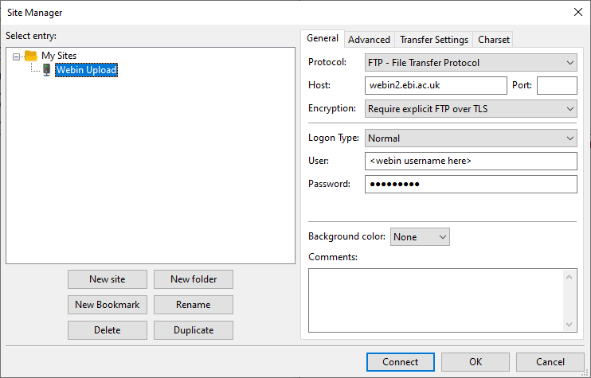
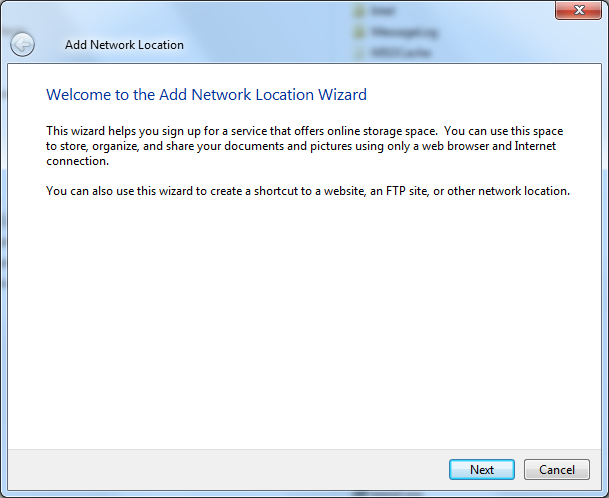
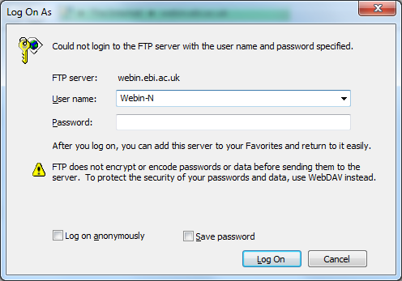

======================
Uploading Files To ENA
======================

Introduction
============

You must upload data files into your private Webin file upload area at EMBL-EBI
before you can submit the files through the Webin submission service.
The most user-friendly approach is `Using Webin File Uploader`_.

Please note that this is not necessary if you are using Webin-CLI, as it
handles the upload process for you.

All upload methods described below will require you to have registered a
Webin account, the ID for which resembles 'Webin-XXXXX'. Always enter this with
an upper-case 'W'. Register an account or reset your password at the `Webin
login page <https://www.ebi.ac.uk/ena/submit/sra/#home>`_.

Keep Local Copies
-----------------

Always keep a local copy of the uploaded files until the files have been
successfully submitted and archived. The Webin file upload area is a temporary
transit area which is not backed up. Any files on the area are subject to
our fair use policy (see below).

File Upload Options
===================

You will upload files to your private Webin file upload area using either FTP
or Aspera protocol through the ``webin.ebi.ac.uk`` service. The authentication
is done using your Webin submission account name and password.

Your username resembles 'Webin-XXXXX'. Register an account or reset your
password at the `Webin login page
<https://www.ebi.ac.uk/ena/submit/sra/#home>`_.

There are a number of ways to accomplish the upload, detailed below:

- `Using Webin File Uploader`_
- `Uploading Files Using Command Line FTP Client`_
- `Using FileZilla On Windows`_
- `Using Aspera ascp Command Line Program`_
- `Using Windows File Explorer`_

If you have problems with using these services, you may find help in the appendix:

- `Appendix: Configuring Your Firewall For ENA Upload`_

Using Webin File Uploader
-------------------------

Files can be uploaded using the Webin File Uploader, a Java web start application downloadable from
`Webin Submissions Portal <https://www.ebi.ac.uk/ena/submit/webin/>`_ or the below link.
To use this program, follow the below instructions in video or text format:

.. raw:: html

    

        <iframe src="https://www.youtube.com/embed/LjYmhWWGnhM" frameborder="0" allowfullscreen style="position: absolute; top: 0; left: 0; width: 100%; height: 100%;"></iframe>
    

|

1.  `Download the Webin File Uploader
    <http://www.ebi.ac.uk/ena/upload/WebinUploader.jnlp>`_
2.  Launch the application (Mac users please see further instructions below),
3.  Enter your Webin username in the ``Username`` field, ensuring the 'W' is
    upper-case.
4.  Enter your Webin password in the ``Password`` field.
5.  Browse into the local ``Upload Directory`` containing the data files you
    wish to upload using the ``...`` button.
6.  Click 'okay' to see the list of all the files contained in the selected
    directory displayed in the Webin File Uploader window
7.  Choose ``Overwrite`` option if you wish to replace any existing files which
    have been previously uploaded.
8.  Choose ``Upload Tree`` option if you wish to preserve the directory
    structure when uploading files to the Webin upload area. By default, the
    files will be uploaded into the root directory of your Webin upload area.
9.  Select the files to upload. You can use the ``Select All`` button to select
    all the files for upload.
10. Click on the ``Upload`` button.

Additional Instructions For Mac Users
~~~~~~~~~~~~~~~~~~~~~~~~~~~~~~~~~~~~~

When downloading the application the following dialog box will be displayed:

.. image:: ../images/webin_file_upload_02.png
    :scale: 50 %
    :align: center

Select the ``Save File`` option to save the WebinUploader.jnlp file to your
local download directory.

If you selected the ``Open with`` option instead of the ``Save File`` option
then the following dialog box will be displayed:

.. image:: ../images/webin_file_upload_03.png
    :scale: 50 %
    :align: center

In this case please select ``OK``. This will save the WebinUploader.jnlp file
to your default local download directory.

In order to run the File Uploader application, open your file explorer and go
to the directory where the ``WebinUploader.jnlp`` file has been saved.

While pressing the ``ctrl`` button, select the ``WebinUploader.jnlp`` file then
select the ``open`` option.

The following dialog will now be displayed:

.. image:: ../images/webin_file_upload_04.png
    :scale: 50 %
    :align: center

Now select the ``Open`` button. This will launch the the Webin File Uploader
application.

Uploading Files Using Command Line FTP Client
---------------------------------------------

This section explains how to upload files to us using a command line FTP
client in Linux or Mac.
The built in FTP tool for Windows command line does not support FTPS so Windows
users are recommended to use an alternative:

- `Using Webin File Uploader`_
- `Using FileZilla On Windows`_

The below instructions describe how you may upload your files to us through
a command line FTP client in Linux or Mac.

1. Open a terminal and type ``lftp webin2.ebi.ac.uk -u Webin-xxxxx``, filling in your Webin username
2. Enter your password when prompted
3. Type ``ls`` command to check the content of your drop box.
4. Use ``mput <filename>`` command to upload files.
5. Use ``bye`` command to exit the ftp client.

Note that in your Webin username, the 'W' should be upper case.

Using FileZilla On Windows
--------------------------

FileZilla allows you to transfer files via FTP through a user-friendly
graphical interface.

1. Download and install `FileZilla <https://filezilla-project.org/>`_.
   If you are not administrator of your computer then download the portable
   version of FileZilla.
2. Use the binary mode: ``Transfer menu -> Transfer Type -> Binary``.
3. Open the 'Site Manager' menu with the button at the top-left
4. Use the 'New Site' option
5. Enter details to match those in the screenshot, adding your own Webin
   username and password:

6. Click 'Connect'
7. Search for the file(s) you want to upload using the tree on the left panel.
8. Create directories in your drop box (if necessary) using the tree on the
   right panel.
9. Drag and drop the files you want to upload from the lower left panel to the
   lower right panel.
10. Once your transfer is successful, close the application.

Using Aspera ascp Command Line Program
--------------------------------------

Aspera is a commercial file transfer protocol that may provide better transfer
speeds than FTP.

Download Aspera CLI from
`here <https://downloads.asperasoft.com/en/downloads/62>`_.

Please select the correct operating system. The ``ascp`` command line client is
distributed as part of the Aspera Cli in the ``cli/bin`` folder.

Your command should look similar to this:

.. code-block:: bash

    ascp -QT -l300M -L- <file(s)> <Webin-N>@webin.ebi.ac.uk:.

The ``-l300M`` option sets the upload speed limit to 300MB/s. You may wish to
lower this value to increase the reliability of the transfer.

The ``-L-`` option is for printing logs out while transferring,

The ``<file(s)>`` can be a file mask (e.g. ``*.cram``), a list of files or a
single file.

``<Webin-N>`` is your Webin submission account name.

Using Windows File Explorer
---------------------------

Right click ``Computer`` and select ``Add a network location`` from the menu

.. image:: ../images/windows_explorer_upload_01.png
    :scale: 75 %
    :align: center

Click ``Next``

Select ``Choose a custom network location`` and click ``Next``

.. image:: ../images/windows_explorer_upload_03.png
    :scale: 75 %
    :align: center

Type ftp://webin.ebi.ac.uk in the ``Internet or network address`` field and
click ``Next``

.. image:: ../images/windows_explorer_upload_04.png
    :scale: 75 %
    :align: center

Unselect ``Log on anonymously``, type your Webin user name in the ``User name``
field and click ``Next``

.. image:: ../images/windows_explorer_upload_05.png
    :scale: 75 %
    :align: center

Type a network location to show in Windows Explorer e.g. ``webin.ebi.ac.uk``
then click ``Next``

.. image:: ../images/windows_explorer_upload_06.png
    :scale: 75 %
    :align: center

Click ``Finish``

.. image:: ../images/windows_explorer_upload_07.png
    :scale: 75 %
    :align: center

When using the new folder you will prompted for your Webin password. Type your
password and click ``Log on``

Appendix: Configuring Your Firewall For ENA Upload
--------------------------------------------------

While most users should not encounter problems in this area, it may sometimes be necessary to configure your firewall
to permit upload of data to ENA.
Users attempting to connect from an institutional network may find that their IT services department has placed
restrictions on their ability to connect to FTP services.
This information could be useful in getting our service whitelisted.

FTP is used in passive mode and connection will be opened to one of the below ports:

- 40000
- 50000

Access to port **21** is required for the following IP address ( webin2.ebi.ac.uk ):

- 193.62.193.143

File MD5 Checksums Value
========================

Large file transfers do not always complete successfully over the internet.

An MD5 checksum can be computed for a file before and after transfer
to verify that the file was transmitted successfully. You must provide an MD5
value for each file submitted to the archive. We will re-compute and verify the
MD5 checksum to make sure that the file transfer was completed without any
changes to the file contents.

Calculating this value is covered in `Preparing A File For Upload
<preparation.html>`_.

Invalid File Submissions
========================

All files are subjected to a format check done by Webin. This does not occur
until after you formally submit the files. You will generally be notified of
this by email, and may be required to correct and reupload the file.
Advice on this can be found in our `Common Run Submission Errors FAQ
<../../faq/runs.html>`_

Fair Use Policy
===============

ENA is a permanent and comprehensive data repository for public domain sequence
and associated information. Data submitted into this system are routed
transiently through users' private data upload areas until such time as a
submission instruction from the user, through his/her use of the Webin system,
leads to the validation of the data and the movement of files from the data
upload area into the ENA.

The data upload areas are provided as a temporary place in which data are held
while in transit. As such, they are neither intended nor suitable for any
longer-term storage of data. Such storage is provided in ENA itself. Once in
ENA, data can be released immediately following submission or can be held
confidential prior to analysis and literature publication if required.

We expect any given data file to remain in a data upload area for no longer
than 2 months before the instruction is given by the user to submit the file.
While we attempt to remind users of this policy at the 2 months time point we
reserve the right to routinely delete any data files that persist in them for
more than 2 months.

We place no absolute limit within the 2-month period on the total volume of
user data that may exist in a data upload area at any one time and are keen to
accommodate the largest submissions where possible. However, we strongly
encourage continuous data submissions where files are uploaded and submitted in
small patches of few Terabytes or less and expect that volumes would not exceed
10 Terabytes under normal circumstances. Unexpected heavy use of the data
upload areas may have an impact on other Webin users and we are grateful for
users' attention to this aspect of our fair use policy.

