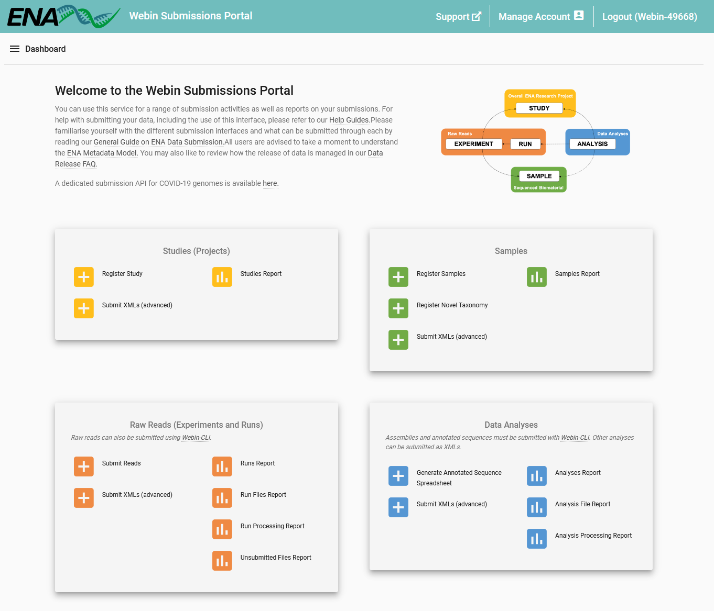

======================
Interactive Submission
======================

Introduction
============

This guide will introduce you to the Webin Portal service, which allows you to submit data to ENA
interactively through an ordinary web browser.

Production and Test Services
============================

There are two Webin Portal services: one for test submissions and another for production (real) submissions.
The test service allows you to trial the interface in a consequence-free manner.
The test service is recreated from the full content of the production service every day at 03.00 GMT/BST.
Therefore, any submissions made to the test service will be removed by the following day.

- Test service URL: https://wwwdev.ebi.ac.uk/ena/submit/webin/login
- Production service URL: https://www.ebi.ac.uk/ena/submit/webin/login

We advise and encourage that you trial your submissions using the Webin test service before using the production
service.

What Can Be Submitted Through Webin Portal?
==================================

Some submissions can be done entirely through Webin Portal, for example you could submit a study comprising only read data
without needing to use any of the other submission interfaces.
However, some types of submission cannot be completed via Webin Portal and must be done through our other submission routes.
Usually, this is because some submission types are limited to our Webin-CLI tool, which has extensive pre-submission
data validation capability built in and is able to flag up errors in your data before you submit it.
Because of this, Webin-CLI is recommended for all circumstances in which it is an option.

For a summary of what can be submitted through each interface, as well as what these interfaces are, please refer to the
table in the `General Guide on ENA Data Submission <../general-guide.html>`_.

Submission
==========

When you come to make a new submission, you will have the options described below.
Follow the links for specific guidance on each submission activity.

1 - Header Bar:
  Support: Links to the ENA support form, where you can request assistance from our helpdesk

  Manage Account: Update the information associated with your account, add contact information for people using
  the account, and change your centre name, a value which is immutably attached to all your submissions

2 - Studies (Projects):
  `Register Study`_: An interface to register new studies

  Submit XMLs: You can submit studies in XML format through this interface

  `Studies Report`_: Review and edit previously submitted studies, and change their release date

3 - Samples:
  `Register samples`_: Select and customise a sample checklist, download a template spreadsheet, then re-upload it
  to this interface to register your samples

  `Register taxonomy`_: If your submission uses taxa which are not known to the taxonomy database, you can request
  their addition through this interface

  Submit XMLs: You can submit samples in XML format through this interface

  `Samples Report`_: Review and edit previously submitted samples

4 - Raw Reads (Experiments and Runs):
  `Submit reads`_: Select a type of read data and download a template spreadsheet, then re-upload it to this
  interface to complete registration of your read data

  Submit XMLs: You can submit experiments and runs in XML format through this interface

  `Runs Report`_: Review and edit previously submitted runs and experiments

  `Run Files Report`_: Review status of files associated with previously submitted runs

  `Run Processing Report`_: Review processing status of files associated with previously submitted runs

  `Unsubmitted Files Report`_: Before you can submit a run file here you must `upload it to your account's FTP area`_;
  review the status of such unsubmitted files here

5 - Data Analyses:
  `Create annotated sequence spreadsheet`_: Short pieces of assembled and annotated sequence such as single genes
  and others can often be submitted using template spreadsheets; select and customise a template here and download a
  file to submit via Webin-CLI

  Submit XMLs: You can submit some analysis types in XML format through this interface

  `Analyses Report`_: Review and edit previously submitted analyses

  `Analysis File Report`_: Review status of files associated with previously submitted analyses

  `Analysis Processing Report`_: Review processing status of files associated with previously submitted analyses

.. _Register Study: ../study/interactive.html
.. _Register samples: ../samples/interactive.html
.. _Register taxonomy: ../../faq/taxonomy_requests.html

.. _Submit reads: ../reads/interactive.html
.. _Create annotated sequence spreadsheet: ../sequence/interactive.html

.. _upload it to your account's FTP area: ../fileprep/upload.html

.. _Studies Report: /reports-service.html
.. _Samples Report: /reports-service.html
.. _Runs Report: /reports-service.html
.. _Run Files Report: /reports-service.html
.. _Run Processing Report: /reports-service.html
.. _Unsubmitted Files Report: /reports-service.html
.. _Analyses Report: /reports-service.html
.. _Analysis File Report: /reports-service.html
.. _Analysis Processing Report: /reports-service.html

Each of these links will interfaces which provide further information on how to complete the described action.
Interactive submission is recommended for registration of your Study and Samples and for small scale Read submissions.
