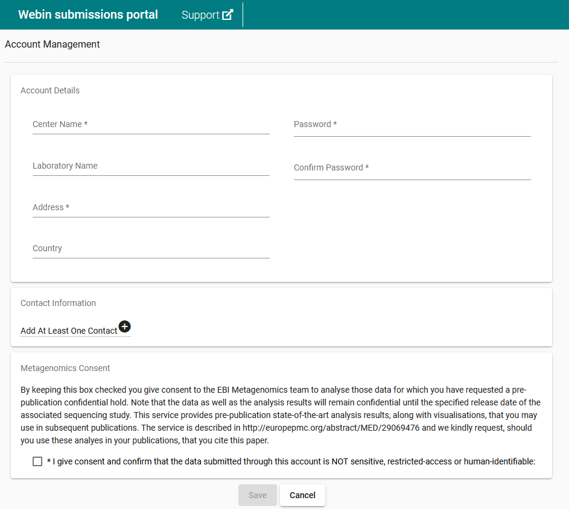

=============================
Register a Submission Account
=============================

Before you can submit data to ENA you must register a Webin submission account.

To do so, please navigate to the `Webin Portal <https://www.ebi.ac.uk/ena/submit/webin/login>`_ and
click the 'Register' button.
You will be presented with the below interface:

Fill out the boxes, giving details of the group and centre for which you are submitting.
The centre name for your account can be changed later: note that the value will be applied irrevocably to all
submissions you make from this account.
Always make sure your account's centre name is correct before you perform a submission.

You must add at least one contact to the account.
Names added here will be automatically included in certain types of submission, including those which are processed into
the EMBL Flat File format.
In addition, when contacting the helpdesk certain requests will only be considered from people named as account
contacts.
It is therefore advisable to add new members of your team to this account if they are likely to participate in
submission activities.

