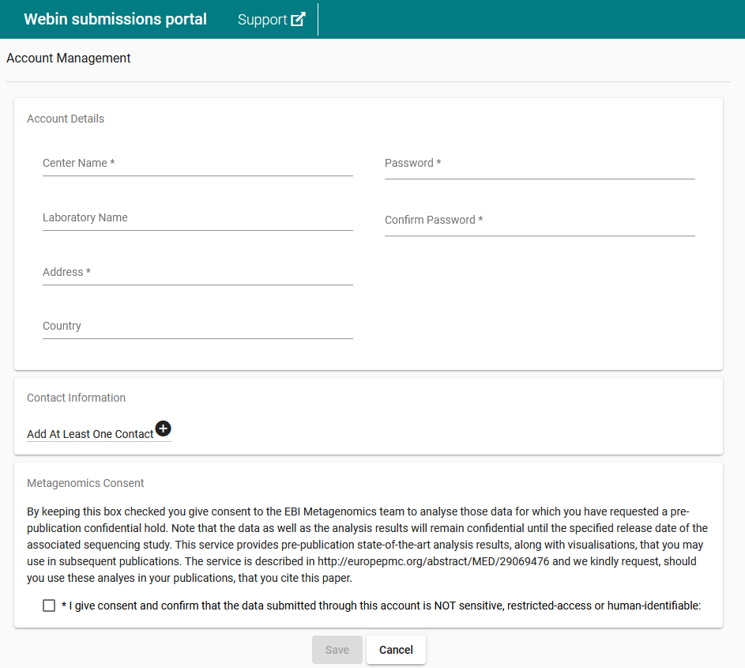

=============================
Register a Submission Account
=============================

Before you can submit data to ENA you must register a Webin submission account.

To do so, please navigate to the `Webin Portal <https://www.ebi.ac.uk/ena/submit/webin/login>`_ and
click the 'Register' button.
You will be presented with the below interface:

Fill out the boxes, giving details of the group and centre for which you are submitting.
The centre name for your account can be changed later: note that the value will be applied irrevocably to all
submissions you make from this account.
Always make sure your account's centre name is correct before you perform a submission.

You must add at least one contact to the account.
Names added here will be automatically included in certain types of submission, including those which are processed into
the EMBL Flat File format.
In addition, when contacting the helpdesk certain requests will only be considered from people named as account
contacts.
It is therefore advisable to add new members of your team to this account if they are likely to participate in
submission activities.

Collaborating On Submissions
============================

How you organise accounts depends on who needs to submit and who needs access.

**Within a single lab or research group**, use one Webin account and add the people involved as contacts, via
'Home' > 'Manage Account'.
The account owner and the added contacts are listed as contacts on public submissions.

Note that permissions cannot be divided within an account: everyone with access to a Webin account has access to all of
that account's submissions, and access cannot be restricted to particular studies.
ENA does not provide general-purpose group accounts.
Where different people must have access to different data, register separate Webin accounts and submit the relevant
data from each.

**Across independent labs**, each lab keeps its own Webin account and its own studies.
Related studies can then be grouped under an `umbrella study <../study/umbrella.html>`_ managed from one account.
Umbrella links are added from the parent downwards: the owner of the umbrella can add public child studies owned by
other Webin accounts, but the owner of a child study cannot link it upwards into someone else's umbrella.

**Broker accounts** are intended for institutions and organisations submitting data on behalf of multiple users, labs
or projects, rather than for a group submitting its own data.
See `Brokering Data to ENA <data-brokering.html>`_.
