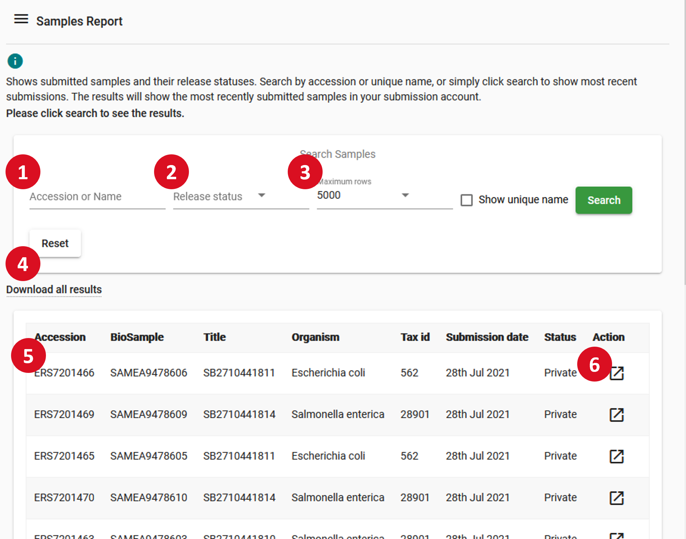
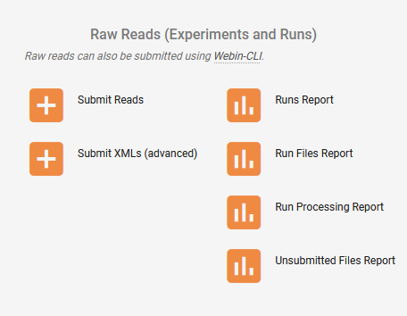
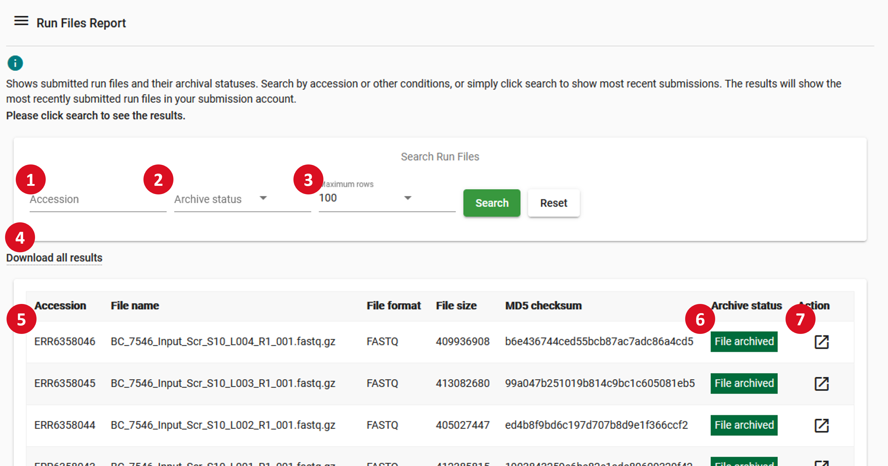

================================
Webin Portal Reports
================================

The `Webin Portal <https://www.ebi.ac.uk/ena/submit/webin/>`_ is ENA's convenient interface for
creating and reviewing submissions.
This guide discusses it from the perspective of a user who wishes to review the content and status of their
existing submissions.
For advice on how to create submissions, please visit the general guide to `Interactive Submission <interactive.html>`_.
This page does not deal with updating your submissions, please see
`Interactive Metadata Update <../../update/metadata/interactive.html>`_ for advice on this.

To access Webin Portal, visit the link and log in with your standard Webin credentials (or create an account if you don't
already have one): https://www.ebi.ac.uk/ena/submit/webin/

.. image:: ../images/wsp_reports_1_login.png

Webin Portal has a range of functionalities, listed below.
Those which are covered in this article are bolded:

- Submission of XML metadata objects
- Update of XML metadata objects
- Submission of studies
- Spreadsheet-based submission of samples, experiments, and runs
- **Reports on the content of submitted metadata objects**
- Acquisition of template spreadsheet for submission of short annotated sequences
- **Reports on the file content of run and analysis objects**
- **Reports on the processing status of submitted data files**
- Registration of new taxa
- **Reports on files which have been uploaded but not submitted**

All reports are enabled by the `Webin Reports Service <reports-service.html>`_, an API.

Metadata Reports
================

For each type of submission you may register with ENA, there is a report interface which will allow you to review its
details and in some cases update it.
Metadata reports are available for:

- Studies
- Samples
- Reads (Experiments and Runs)
- Analyses

From the `Webin Portal <https://www.ebi.ac.uk/ena/submit/webin/>`_ dashboard, find the section for the type of object you wish
to review.
The below image shows the reports view for samples.
The interface is similar in look and functionality for all data types, but will vary in what attributes are shown.

1. Enter the accession or name of a sample to search for it directly
2. Filter by release status (e.g. show only public samples)
3. Modify the maximum amount of rows to be shown: default 100
4. Download all the results of your query in a CSV file
5. Rows are sorted by accession number
6. Use the 'Action' button to access additional functions, such as editing and linking to related accessions

File Reports
============

Unsubmitted Files
-----------------

When submitting data to ENA, it is often necessary to upload the data files in advance of submission.
Your account comes with its own FTP area for this reason.
See `Preparing Files for Submission <../fileprep.html>`_ for information on this.

You can  review the content of your directory through `Webin Portal <https://www.ebi.ac.uk/ena/submit/webin/>`_ Unsubmitted
Files Report.
Access this from the dashboard, under the 'Raw Reads' section:

The form will be automatically populated with a list of files from your submission area.
The name, size in bytes, and expiration date of the file is shown.
If a file is shown in this area, it is ready for you to submit it.
The expiration date refers to the fact that unsubmitted files are removed after 4 months, to minimise ENA storage
overheads.

Submitted Runs and Analyses
---------------------------

For analyses and runs there are reports available on archival of their associated submitted files.
Access these in `Webin Portal <https://www.ebi.ac.uk/ena/submit/webin/>`_.
These are the only two object types which have data files associated with them rather than just metadata.
These can be accessed from the Webin Portal dashboard, look for the buttons named:

- Run Files Report
- Analysis Files Report

The below image shows the file report interface for runs; the interface for analyses is much the same.

1. Enter the accession or name of a run to search for it directly
2. Filter by submitted file archiving status: active, completed, or failed
3. Modify the maximum amount of rows to be shown: default 100
4. Download all the results of your query in a CSV file
5. Rows are sorted by accession number
6. The archival status of the submitted file
7. Use the 'Action' button to access additional functions, such as editing and linking to related accessions

Where archiving failure has occurred, you will also be informed of email, with information about the errors.
If your runs have failed archiving, you can often fix this yourself using information available in the
`Common Run Submission Errors FAQ <../../faq/runs.html>`_.

The information shown in this interface (for runs and analyses) deals with the archival of files, while the below
section deals with the processing of files.
For an explanation of the difference between these, please see `Appendix: Archival and Processing of Files`_.

Processing Reports
==================

Reports on the post-archival processing of files submitted with runs and analyses are available through
`Webin Portal <https://www.ebi.ac.uk/ena/submit/webin/>`_.
From the dashboard, look for the buttons named:

- Run Processing Report
- Analysis Processing Report

Both reports will give you information on the outcome (if any) of file processing.
Below is an example of the analysis processing report:

.. image:: ../images/wsp_reports_5_analysis_process_report.png

1. Enter the accession or name of an analysis to search for it directly
2. Filter by analysis type, or processing status: active, completed, or failed
3. Modify the maximum amount of rows to be shown: default 100
4. Download all the results of your query in a CSV file
5. Rows are sorted by accession number
6. Review the assigned sequence accessions of analysis submissions for which this is relevant
7. The file processing status of the submitted file: completed, failed, or active
8. Use the 'Action' button to access additional functions, such as editing and linking to related accessions

Note that while this interface allows you to check the processing status of your files, in cases where there are
failures you will most likely need to `contact the helpdesk <https://www.ebi.ac.uk/ena/browser/support>`_.

The information shown in this interface deals with the post-archival processing of files, while the above section
(`Submitted Runs and Analyses`_) deals with the archival of files.
For an explanation of the difference between these, please see `Appendix: Archival and Processing of Files`_.

Appendix: Archival and Processing of Files
==========================================

Two of sections in this page deal with the archiving and processing of files.
The archiving stage applies to all data files submitted to ENA, while the processing stage applies to only some files.
There are several different processing pipelines, the one used depends on the type and form of data submitted.

The archiving and processing procedures are described briefly here: this is not intended as an exhaustive look at them,
but may help provide some context to the status information given in the reports described above.

**File archival** applies to all data files submitted to ENA, whose formats are many and various, including FASTQ, BAM,
TSV, FASTA, EMBL flat file and others.
There are a few checks which must be passed in order to achieve archival.
These are either universal and apply to all files, or are so fundamental that they must be passed to confirm the file
is possibly valid.
Archiving includes:

- MD5 check - this uses the MD5 hashing algorithm to confirm that a file has been uploaded in full, by comparing a value
  before and after upload
- File integriy check - this uses a file-appropriate method to confirm that the content of the file is readable.
  Most commonly, this uses ``gzip``  test mode to confirm that a file compressed with gzip has readable content

If the 'Run Files Report' or 'Analysis Files Report' section indicates an error, it is this stage where an error
has occurred.

**File processing** applies to all runs in certain common formats (FASTQ, BAM, CRAM) and specific subtypes of analyses
(sequence assemblies, assembled/annotated short sequences, transcriptome sequence assemblies).

The content of these processing pipelines is beyond the scope of this article, but if either the 'Run Processing
Report' or 'Analysis Processing Report' reports an error, then it has occurred here.

**In either case** if an error is reported with your data, you may or may not have the ability to fix it as a user.
If in doubt, please `contact the helpdesk <https://www.ebi.ac.uk/ena/browser/support>`_ as attempting to fix submissions
will in some cases result in more errors.
